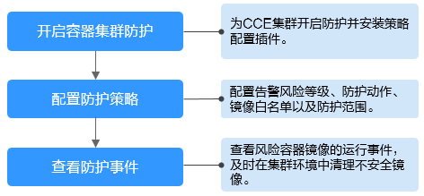

# 容器集群防护概述

容器集群防护功能支持在容器镜像启动时检测其中存在的不合规基线、漏洞和恶意文件，并可根据检测结果告警和阻断未授权或含高危安全风险的容器镜像运行。

用户可根据自身业务场景灵活配置容器集群防护策略，加固集群安全防线，防止含有漏洞、恶意文件和不合规基线等安全威胁的镜像部署到集群，降低容器生产环境的安全风险。

## 使用约束

使用容器集群防护功能须满足以下条件：

-   容器集群为云容器引擎（Cloud Container Engine，简称CCE）服务中购买的集群，且集群版本为1.20及以上版本。
-   容器节点服务器已开启HSS容器版防护，购买HSS的操作，请参见[购买主机安全防护配额](购买主机安全防护配额.md)。
-   服务器已安装Agent的版本为以下版本，升级Agent的操作，请参见[Agent升级](Agent升级.md)。
    -   Linux：3.2.7及以上版本。
    -   Windows：4.0.19及以上版本。

## 容器集群防护使用流程

**图 1**  使用流程图  

**表 1**  容器集群防护使用流程说明

<table><thead align="left"><tr id="row117954598015"><th class="cellrowborder" valign="top" width="21.91%" id="mcps1.2.3.1.1">
操作步骤

</th>
<th class="cellrowborder" valign="top" width="78.09%" id="mcps1.2.3.1.2">
描述

</th>
</tr>
</thead>
<tbody><tr id="row7795195910016"><td class="cellrowborder" valign="top" width="21.91%" headers="mcps1.2.3.1.1 ">
<a href="开启容器集群防护.md">开启容器集群防护</a>

</td>
<td class="cellrowborder" valign="top" width="78.09%" headers="mcps1.2.3.1.2 ">
为CCE集群开启防护，保护业务和关键数据安全；开启防护时，HSS会自动在集群上安装策略管理插件。

</td>
</tr>
<tr id="row37961359507"><td class="cellrowborder" valign="top" width="21.91%" headers="mcps1.2.3.1.1 ">
<a href="配置容器集群防护策略.md">配置防护策略</a>

</td>
<td class="cellrowborder" valign="top" width="78.09%" headers="mcps1.2.3.1.2 ">
根据自身业务情况，配置基线、漏洞和恶意文件触发告警的风险等级，容器集群防护范围，镜像白名单以及告警事件发生后HSS执行的防护动作。

</td>
</tr>
<tr id="row47967591802"><td class="cellrowborder" valign="top" width="21.91%" headers="mcps1.2.3.1.1 ">
<a href="查看容器集群防护事件.md">查看防护事件</a>

</td>
<td class="cellrowborder" valign="top" width="78.09%" headers="mcps1.2.3.1.2 ">
您可以在HSS控制台查看被告警或阻断的未授权或含高危安全风险的容器镜像运行事件，及时排查并清理不安全的容器镜像。

</td>
</tr>
</tbody>
</table>

