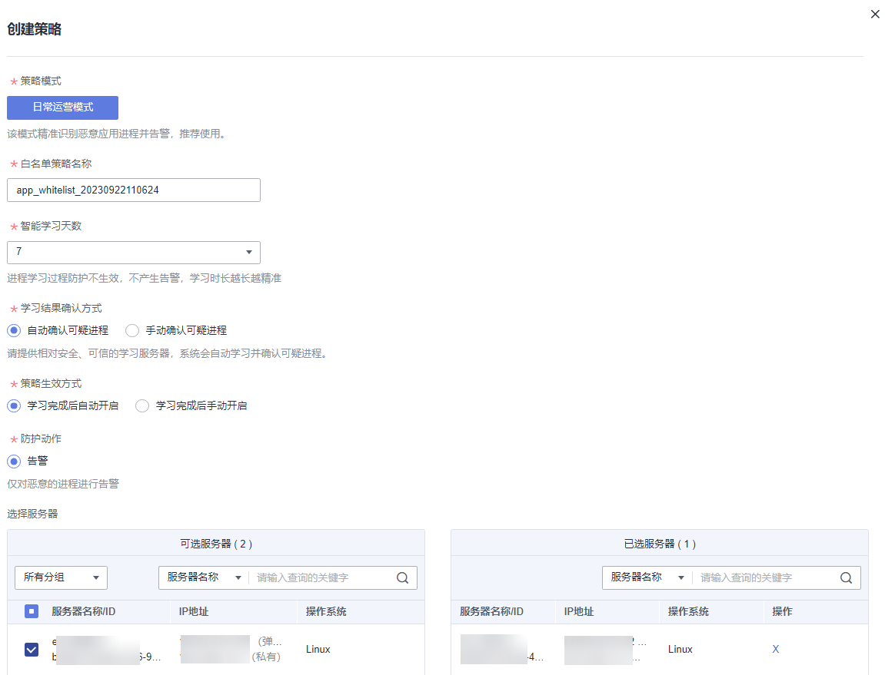
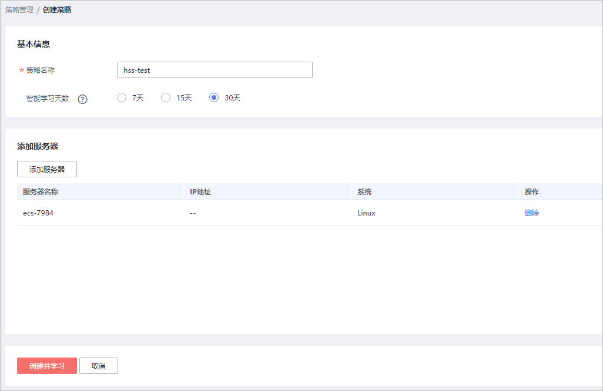
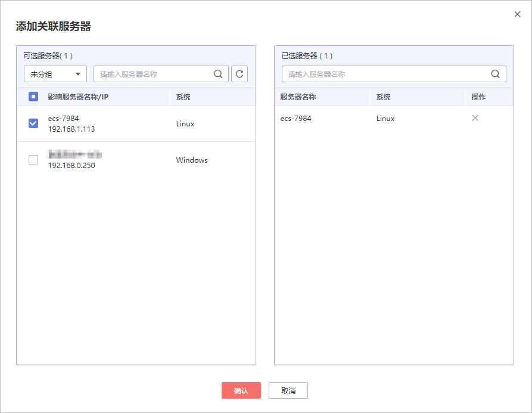
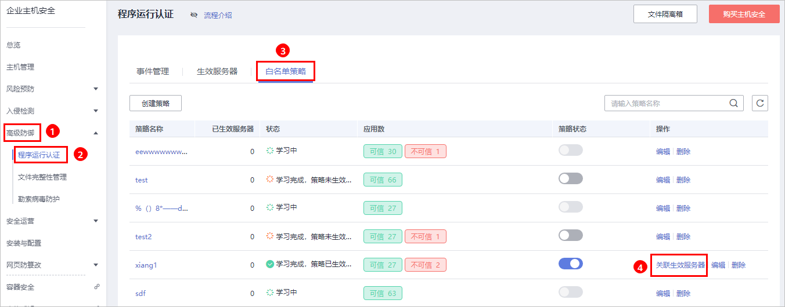
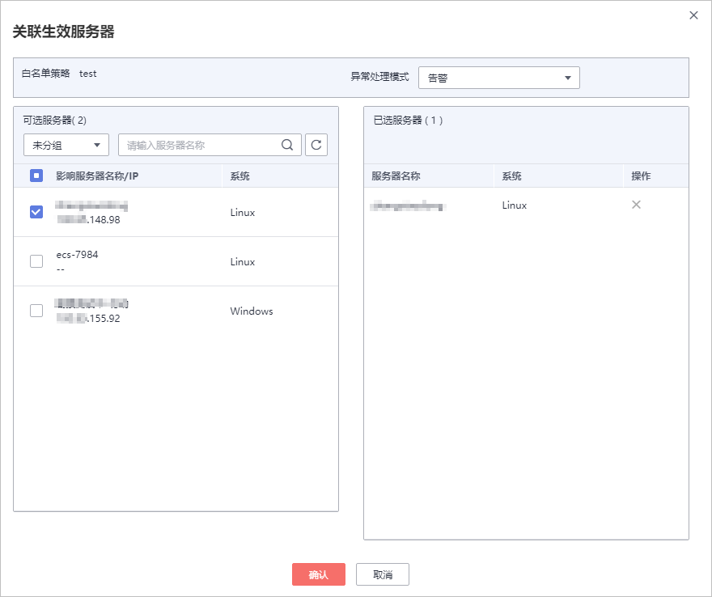

# 应用白名单策略

白名单策略通过机器学习引擎实现自动化和收集正常的进程行为数据，您可以将重点防御的主机中应用该白名单策略。HSS将检测该主机中是否存在可疑或恶意进程，并对不在白名单策略中的进程进行告警提示或者隔离。

## 前提条件

-   已开启旗舰版防护。
-   添加为智能学习的服务器处于“运行中“、Agent为“在线“状态，且已开启旗舰版防护。
-   一个服务器只能应用一个白名单策略。

## 创建白名单策略

1.  [登录管理控制台](https://console.huaweicloud.com)。
2.  在页面上方选择区域后，单击，选择“安全  \>  企业主机安全“。

    **图 1**  企业主机安全  
    

3.  进入“程序运行认证“页面，选择“白名单策略“，单击“创建策略“，如[图2](#fig15321230175718)所示。

    **图 2**  创建白名单策略  
    

4.  在创建策略页面中，配置策略“基本信息“，如[图3](#fig4161143291211)所示。
    -   策略名称：设置白名单策略的名称。
    -   智能学习天数：请根据您业务的场景选择智能学习的天数，您可以选择“7天“、“15天“或者“30天“。

        如果选择的智能学习天数小于实际业务场景操作的天数，会导致智能学习失败。

        **图 3**  配置策略信息  
        

5.  单击“添加服务器“，添加智能学习服务器，如[图4](#fig158581753125814)所示。

    > **须知：** 
    >-   添加为智能学习的服务器，服务器处于“运行中“、Agent为“在线“状态，且需要开启旗舰版防护。
    >-   添加学习服务器时，可以添加一个或者多个服务器，HSS将对一个或多个服务器进行自动化聚类和收集“可信“、“不可信“和“未知“的应用进程数据。

    **图 4**  添加白名单策略学习服务器  
    

6.  单击“确认“，完成白名单策略学习服务器的添加。
    -   在学习服务器列表中，您可以查看学习服务器的“服务名称“、“IP地址“和“系统“。
    -   您可以根据需要新增或者删除添加的学习服务器。

7.  单击“创建并学习“，完成白名单策略的创建。

    创建的白名单策略展示在白名单策略列表中，您可以查看策略的“策略名称“、“已生效服务器“、策略学习的“状态“、“应用数“和“策略状态“。

8.  白名单策略学习完成后，处于“学习完成，策略未生效“。单击，开启白名单策略。

    开启白名单策略后，白名单策略状态为“学习完成，策略已生效“，说明白名单策略创建成功。

## 添加生效服务器

白名单策略创建完成后，需要将重点防御的主机添加到白名单策略中，HSS将根据白名单策略检测该主机中是否存在可疑或恶意进程。

白名单策略状态处于“学习完成，策略已生效“，才能成功添加生效服务器。

1.  单击“关联生效服务器“，为白名单策略添加生效服务器，如[图5](#fig1926019452016)所示。

    **图 5**  添加关联生效服务器  
    

2.  在弹出的“关联生效服务器“窗口中，在“异常处理方式“下拉列表中选择“告警“，并在可选服务器列表中，选择生效服务器，如[图6](#fig16755625112414)所示。

    **图 6**  配置关联生效服务器  
    

3.  配置完成后，单击“确认“，完成关联生效服务器的添加。

    生效服务器添加完成后，在白名单策略列表中，可以查看该白名单策略已生效服务器的数量。

## 相关操作

**管理生效服务器**

-   您也可以选择“生效服务器“页签，单击“添加服务器“，为白名单策略添加生效服务器。

    您可以查看生效服务器的“服务器名称/IP地址“、“白名单策略“、“异常行为数“和“异常处理模式“。

-   若不需要检测添加的生效服务器，可以在该生效服务器所在行的“操作“列，单击“删除“，删除生效服务器。删除后，该服务器的进程将不再受该白名单策的保护。

**编辑白名单策略**

单击“编辑“，打开编辑策略白名单页面，对该策略进行修改。可修改该策略的“智能学习天数“和执行智能学习的服务器。

修改“智能学习天数“或者智能学习的服务器，学习完成前不再受策略保护，请谨慎操作。

**删除白名单策略**

单击“删除“，删除白名单策略，白名单策略删除后，对应的生效服务器的进程将不再受到该白名单策略的保护。

