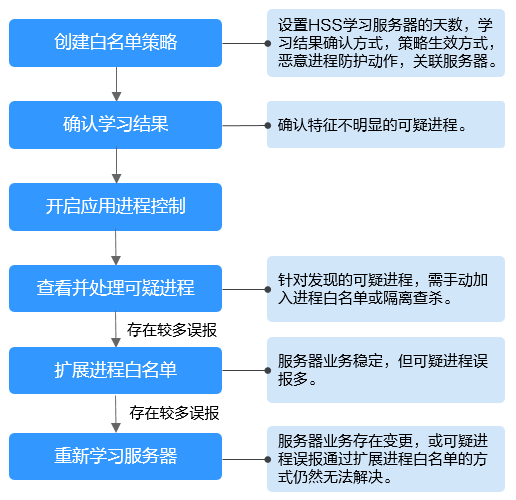

# 应用进程控制概述

应用进程控制功能支持管控应用进程运行，通过学习服务器中运行的应用进程特征，将应用进程划分为可信进程、恶意进程和可疑进程，允许可疑、可信进程正常运行，对恶意进程运行进行告警，帮助用户构建安全的应用进程运行环境，避免服务器遭受不受信或恶意应用进程的破坏。

## 使用约束

使用应用进程控制功能须满足以下条件：

-   服务器已开启HSS旗舰版及以上版本防护，购买和升级HSS的操作，请参见[购买主机安全防护配额](购买主机安全防护配额.md)和[配额版本升级](配额版本升级.md)。
-   服务器已安装Agent的版本为以下版本，升级Agent的操作，请参见[Agent升级](Agent升级.md)。
    -   Linux：3.2.7及以上版本。
    -   Windows：4.0.19及以上版本。

## 应用进程控制使用流程

**图 1**  使用流程图  

**表 1**  应用进程控制使用流程说明

<table><thead align="left"><tr id="row117954598015"><th class="cellrowborder" valign="top" width="21.91%" id="mcps1.2.3.1.1">
操作步骤

</th>
<th class="cellrowborder" valign="top" width="78.09%" id="mcps1.2.3.1.2">
描述

</th>
</tr>
</thead>
<tbody><tr id="row7795195910016"><td class="cellrowborder" valign="top" width="21.91%" headers="mcps1.2.3.1.1 ">
<a href="创建白名单策略.md">创建白名单策略</a>

</td>
<td class="cellrowborder" valign="top" width="78.09%" headers="mcps1.2.3.1.2 ">
白名单策略是管理HSS学习服务器行为和应用进程防护动作的规则，只有关联了白名单策略的服务器才能开启应用进程防护。

</td>
</tr>
<tr id="row37961359507"><td class="cellrowborder" valign="top" width="21.91%" headers="mcps1.2.3.1.1 ">
<a href="确认学习结果.md">确认学习结果</a>

</td>
<td class="cellrowborder" valign="top" width="78.09%" headers="mcps1.2.3.1.2 ">
HSS学习完服务器中的应用进程后，可能存在某些可疑应用进程的特征不明显，HSS无法完全定义为恶意进程或可信进程，因此这些不确定具体分类的可疑进程需要再次进行确认。

</td>
</tr>
<tr id="row47967591802"><td class="cellrowborder" valign="top" width="21.91%" headers="mcps1.2.3.1.1 ">
<a href="开启应用进程控制防护.md">开启应用进程控制</a>

</td>
<td class="cellrowborder" valign="top" width="78.09%" headers="mcps1.2.3.1.2 ">
开启策略关联服务器的应用进程控制。

</td>
</tr>
<tr id="row9796155917013"><td class="cellrowborder" valign="top" width="21.91%" headers="mcps1.2.3.1.1 ">
<a href="查看并处理可疑进程.md">查看并处理可疑进程</a>

</td>
<td class="cellrowborder" valign="top" width="78.09%" headers="mcps1.2.3.1.2 ">
对于可疑进程运行事件，由于HSS根据学习到的应用进程特征无法判断其是否可信，因此需要您根据这些进程的详细信息判断分析是否可信，然后将它们“加入进程白名单”或“隔离查杀”。

</td>
</tr>
<tr id="row111031156510"><td class="cellrowborder" valign="top" width="21.91%" headers="mcps1.2.3.1.1 ">
（可选）<a href="扩展进程白名单.md">扩展进程白名单</a>

</td>
<td class="cellrowborder" valign="top" width="78.09%" headers="mcps1.2.3.1.2 ">
如果HSS完成服务器学习后，发现的可疑进程事件中存在较多信任的应用进程运行事件，您可以设置HSS扩展进程白名单，通过比对HSS已学习到的应用进程和资产指纹功能扫描到的进程指纹，进一步扩展HSS应用进程情报库，补充可信进程白名单。

</td>
</tr>
<tr id="row97291026117"><td class="cellrowborder" valign="top" width="21.91%" headers="mcps1.2.3.1.1 ">
（可选）<a href="重新学习服务器.md">重新学习服务器</a>

</td>
<td class="cellrowborder" valign="top" width="78.09%" headers="mcps1.2.3.1.2 ">
已完成进程白名单扩展，但仍然存在较多可信进程运行误报或您的服务器业务存在变更，您可以设置HSS重新学习服务器，校准HSS的应用进程情报数据，避免误报。

</td>
</tr>
</tbody>
</table>

