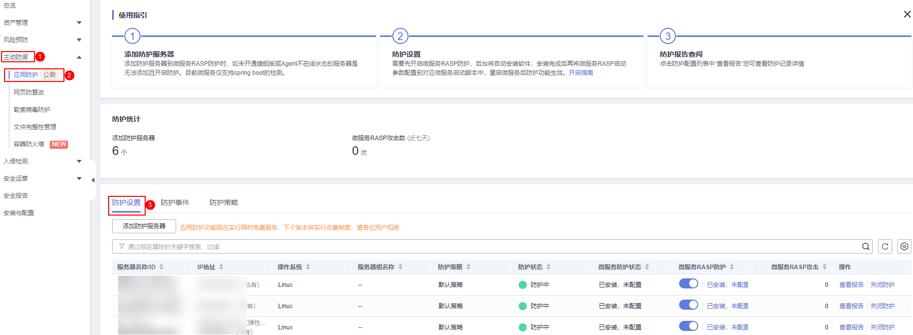

# 应用防护管理

## 前提条件

已开启主机安全服务版本为旗舰版、网页防篡改版或容器版。

## 约束限制

-   当前只支持操作系统为Linux的服务器。
-   目前仅支持Java应用接入。
-   旗舰版及以上支持应用防护相关操作。

## 查看检测报告

1.  [登录管理控制台](https://console.huaweicloud.com/?locale=zh-cn)。
2.  在页面左上角选择“区域“，单击，选择“安全与合规 \> 主机安全服务”，进入主机安全平台界面。

    **图 1**  进入主机安全  
    

3.  选择“主动防御  \>  应用防护  \>  防护设置“，进入“防护配置“页面。

    > **说明：** 
    >如果您的服务器已通过企业项目的模式进行管理，您可选择目标“企业项目“后查看或操作目标企业项目内的资产和检测信息。

    **图 2**  查看防护配置  
    

4.  单击目标服务器“操作“列的“查看报告“，查看目标服务器全量检测详情。

    **图 3**  查看报告  
    

5.  单击告警名称可查看目标告警的详细信息。

    告警详情页可查看目标告警的取证信息（请求信息、攻击源IP等）和扩展信息（检测规则、检测探针等），可根据取证信息和扩展信息来排查问题、添加防护措施。

    **图 4**  查看告警详情  
    

