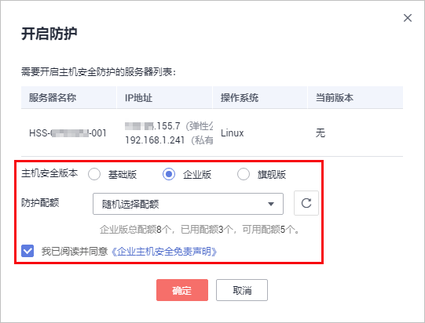
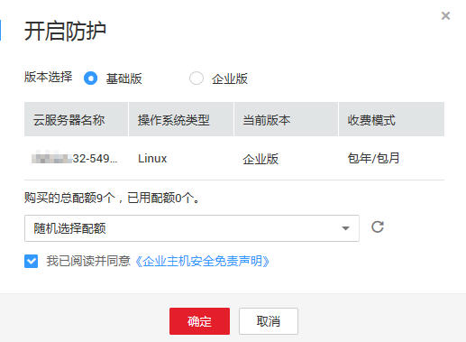

# 开启主机防护

该任务指导用户通过企业主机安全服务开启企业版防护。

## 前提条件

-   已获取管理控制台的登录账号与密码。
-   弹性云服务器的“Agent状态“为“在线“，且“防护状态“为“关闭“。
-   已完成告警通知设置。

## 操作步骤

1.  登录管理控制台。
2.  在页面上方，单击“服务列表“，选择“安全  \>  企业主机安全“。
3.  在左侧导航树中，选择“防护列表“，进入“防护列表“界面。
4.  在“防护列表“界面，选择“主机列表“页签，进入云服务列表页面。
5.  勾选所有需要开启防护的弹性云服务器，在列表上方，单击“开启防护“，批量开启防护，如[图1](#fig1683850155418)所示。

    **图 1**  开启主机防护  
    

    > **说明：**   
    >用户也可以在需要开启防护的弹性云服务器所在行的操作列，单击“开启防护“来开启单台防护。  

6.  在弹出的“开启防护“对话框中，您可以根据需要选择开启“基础版“或“企业版“防护。
7.  阅读《企业主机安全免责声明》后，勾选“我已阅读并同意《企业主机安全免责声明》“并单击“确定“，完成开启防护操作，如[图2](#fig1747930715116)所示。

    **图 2**  开启防护  
    

