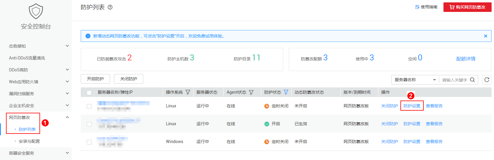
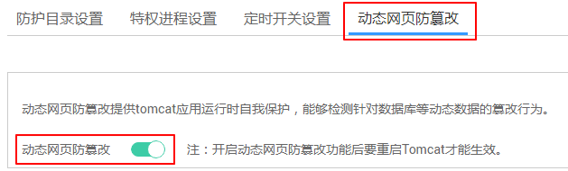

# 开启动态网页防篡改

动态网页防篡改提供tomcat应用运行时自我保护，能够检测针对数据库等动态数据的篡改行为，若您在开启防护时未开启动态网页防篡改，您可以在此处开启。

## 前提条件

主机为Linux操作系统。

## 操作步骤

1.  [登录管理控制台](https://console.huaweicloud.com)。
2.  在页面左上角选择“区域“，单击，选择“安全  \>  企业主机安全“，进入企业主机安全页面。

    **图 1**  企业主机安全  
    

3.  在“网页防篡改  \>  防护列表“页面，单击“防护设置“，进入“防护设置“页面。

    **图 2**  在“网页防篡改“界面  
    

4.  在“动态网页防篡改“页面，打开动态网页防篡改开关，即可开启动态网页防篡改功能。

    **图 3**  动态网页防篡改  
    

5.  动态网页防篡改开启后，还需重启Tomcat才能使其生效。

