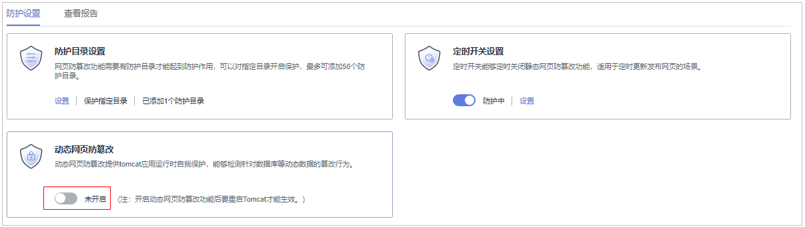

# 开启动态网页防篡改

动态网页防篡改提供tomcat应用运行时自我保护，能够检测针对数据库等动态数据的篡改行为，若您在开启防护时未开启动态网页防篡改，您可以在此处开启。

## 约束限制

仅开启网页防篡改版防护后才支持防篡改相关操作。

## 前提条件

主机为Linux操作系统。

## 操作步骤

1.  [登录管理控制台](https://console.huaweicloud.com/?locale=zh-cn)。
2.  在页面左上角选择“区域“，单击，选择“安全与合规 \> 主机安全服务”，进入主机安全平台界面。

    **图 1**  进入主机安全  
    

3.  在“主动防御  \>  网页防篡改  \>  防护配置“页面，单击目标服务器“操作“列的“防护设置“，进入“防护设置“页面。

    > **说明：** 
    >如果您的服务器已通过企业项目的模式进行管理，您可选择目标“企业项目“后查看或操作目标企业项目内的资产和检测信息。

    **图 2**  进入防护配置  
    

4.  进入“防护设置“页面，在“动态网页防篡改“栏，单击开启动态网页防篡改。

    **图 3**  开启动态网页防篡改  
    

5.  在弹出的开启动态网页防篡改页面中，设置“Tomcat bin目录“。

    开启动态网页防篡改需先设置Tomcat bin目录，系统会将setenv.sh脚本预置在bin目录中，用于设置防篡改程序的启动参数。开启动态网页防篡改之后需要重启Tomcat才能生效。

    **图 4**  设置Tomcat目录  
    

6.  单击“确认“，开启动态网页防篡改。

