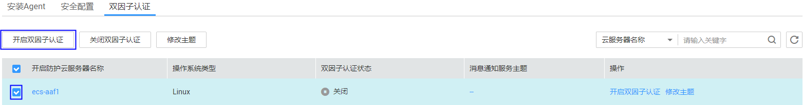
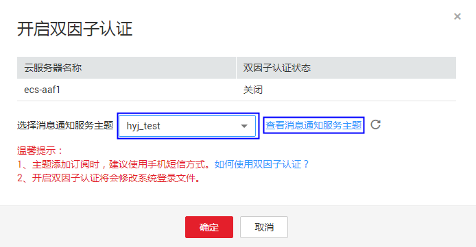

# 开启双因子认证

为了确保您的信息安全，建议您开启登录验证功能，开启该功能后，登录弹性云服务器时，需要输入短信/邮箱验证码进行验证。该任务指导用户开启双因子认证。

## 前提条件

-   已获取管理控制台的登录帐号与密码。
-   用户通过创建主题绑定了手机号/邮箱。

## 操作步骤

1.  登录管理控制台。
2.  在页面上方，单击“服务列表“，选择“安全  \>  企业主机安全“。
3.  在左侧导航树中，选择“安装与配置“，进入安装Agent界面。
4.  选择“双因子认证“页签。
5.  勾选所有需要开启双因子认证的弹性云服务器，单击“开启双因子认证“，如[图1](#fig293833116594)所示。

    **图 1**  单击开启双因子认证  
    

    > **说明：**   
    >用户也可以在需要开启双因子认证的弹性云服务器所在行的操作列，单击“开启双因子认证“来开启单台服务器的双因子认证。  

6.  在弹出的“开启双因子认证“的对话框中，选择消息通知服务主题。

    > **说明：**   
    >如果没有主题，请单击“查看消息通知服务主题“进行创建。具体操作请参见[创建主题](https://support.huaweicloud.com/usermanual-smn/zh-cn_topic_0043961401.html)。  
    >下拉框只展示状态已确认的消息通知服务主题。  

    **图 2**  开启双因子认证对话框  
    

7.  单击“确定“完成开启双因子认证操作。

