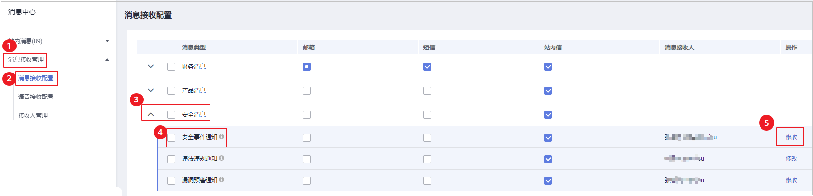

# 开启告警通知

开启告警通知功能后，您能接收到主机安全服务发送的告警通知，及时了解主机/容器/网页内的安全风险。否则，无论是否有风险，您都只能登录管理控制台自行查看，无法收到报警信息。

-   告警通知设置仅在当前区域生效，若需要接收其他区域的告警通知，请切换到对应区域后进行设置。
-   告警通知信息可能会被误拦截，若您未收到相关告警信息，请在信息拦截中查看。
-   消息通知服务为付费服务，价格详情请参见[SMN价格详情](https://www.huaweicloud.com/pricing.html?tab=detail#/smn)。

## 前提条件

在设置告警通知前：

-   “告警方式“如果选择“消息中心“，建议您在右上角“消息中心“单击“消息接收管理“进入消息接收配置页面，在“安全消息  \>  安全事件通知“上方添加或在“操作“列“修改“消息接收人，操作详情请参见[修改指定消息接收人](https://support.huaweicloud.com/usermanual-mc/zh-cn_topic_0065902568.html)。
-   “告警方式“如果选择“消息主题“，建议您先以管理员身份在“消息通知服务“中创建“消息主题“，详细操作请参见[如何发布主题消息](https://support.huaweicloud.com/qs-smn/smn_ug_0004.html)。

## 开启告警通知

1.  [登录管理控制台](https://console.huaweicloud.com/?locale=zh-cn)。
2.  在页面左上角选择“区域“，单击，选择“安全与合规 \> 主机安全服务”，进入主机安全平台界面。

    **图 1**  进入主机安全  
    

3.  在左侧导航树选择“安装与配置“，选择“告警配置“页签，进入“告警配置“页面，配置参数说明请参见[表1](#table139821351163419)。

    **图 2**  告警配置  
    

    **表 1**  告警配置参数

    
    <table><thead align="left"><tr id="row1198215511348"><th class="cellrowborder" valign="top" width="18.67186718671867%" id="mcps1.2.4.1.1">
通知项

    </th>
    <th class="cellrowborder" valign="top" width="38.73387338733873%" id="mcps1.2.4.1.2">
说明

    </th>
    <th class="cellrowborder" valign="top" width="42.594259425942596%" id="mcps1.2.4.1.3">
选择建议

    </th>
    </tr>
    </thead>
    <tbody><tr id="row119834518347"><td class="cellrowborder" valign="top" width="18.67186718671867%" headers="mcps1.2.4.1.1 ">
每日告警通知

    </td>
    <td class="cellrowborder" valign="top" width="38.73387338733873%" headers="mcps1.2.4.1.2 ">
每日凌晨，主机安全服务将主动检测主机系统中的账号、Web目录、漏洞、恶意程序及关键配置等，汇总各项检测结果后，将检测结果发送给您在“消息中心”中添加的消息接收人，或者在“消息通知服务主题”中添加的订阅终端。

    
单击“查看每日告警默认通知事件”可查看通知项。

    </td>
    <td class="cellrowborder" valign="top" width="42.594259425942596%" headers="mcps1.2.4.1.3 "><ul id="ul97171656143412"><li>接收并定期查看每日告警通知中所有的内容，能有效降低主机中未及时处理的风险成为主机安全隐患的概率。</li><li>由于每日告警中通知项的内容较多，如果您使用的“消息通知服务”，接收告警通知，建议您选择“订阅终端”配置为“邮箱”的“消息通知服务主题”。</li></ul>
    </td>
    </tr>
    <tr id="row1598317516341"><td class="cellrowborder" valign="top" width="18.67186718671867%" headers="mcps1.2.4.1.1 ">
实时告警通知

    </td>
    <td class="cellrowborder" valign="top" width="38.73387338733873%" headers="mcps1.2.4.1.2 ">
当攻击者入侵主机时，主机安全服务将按照选定的“消息中心”或者“消息通知服务主题”为您告警。

    
单击“查看实时告警默认通知事件”可查看通知项。

    </td>
    <td class="cellrowborder" valign="top" width="42.594259425942596%" headers="mcps1.2.4.1.3 "><ul id="ul197183564340"><li>建议您接收实时告警通知中所有的内容并及时查看。企业安全服务实时监测主机中的安全情况，能监测到攻击者入侵主机的行为，接收实时告警通知能快速处理攻击者入侵主机的行为。</li><li>由于实时告警中通知项的内容紧急度较高，如果您使用的“消息通知服务”，接收告警通知，建议您选择“订阅终端”配置为“短信”的“消息通知服务主题”。</li></ul>
    </td>
    </tr>
    <tr id="row1798315193413"><td class="cellrowborder" valign="top" width="18.67186718671867%" headers="mcps1.2.4.1.1 ">
告警等级

    </td>
    <td class="cellrowborder" valign="top" width="38.73387338733873%" headers="mcps1.2.4.1.2 ">
自定义勾选通知的告警等级。

    </td>
    <td class="cellrowborder" valign="top" width="42.594259425942596%" headers="mcps1.2.4.1.3 ">
选择全部。

    </td>
    </tr>
    <tr id="row898365112344"><td class="cellrowborder" valign="top" width="18.67186718671867%" headers="mcps1.2.4.1.1 ">
屏蔽事件

    </td>
    <td class="cellrowborder" valign="top" width="38.73387338733873%" headers="mcps1.2.4.1.2 ">
选择无需发送告警通知的事件。

    
展开选框可自定义选择不发送告警的事件类型。

    </td>
    <td class="cellrowborder" valign="top" width="42.594259425942596%" headers="mcps1.2.4.1.3 ">
根据<a href="#section8982419163410">告警通知项说明</a>的内容说明判断需要屏蔽的事件。

    </td>
    </tr>
    </tbody>
    </table>

4.  设置事件告警的通知方式。
    -   **消息中心**

        告警通知默认发送给账号联系人的消息中心，可登录系统在右上角查看。

        如需修改接收人，单击“消息接收管理“，跳转至消息中心，在“安全消息  \>  安全事件通知“单击“操作“列的“修改“，编辑消息接收人，如[图3](#fig1855116231229)所示，具体操作请参见[修改指定消息接收人](https://support.huaweicloud.com/usermanual-mc/zh-cn_topic_0065902568.html)。

        **图 3**  编辑消息接收人  
        

    -   **消息主题**

        单击下拉列表选择已创建的主题，或者单击“查看消息通知服务主题“创建新的主题。

        创建新的主题，即配置接收告警通知的手机号码或邮箱地址，具体操作如下：

        1.  参见[创建主题](https://support.huaweicloud.com/usermanual-smn/zh-cn_topic_0043961401.html)创建一个主题。
        2.  配置接收告警通知的手机号码或邮箱地址，即为创建的主题添加一个或多个订阅，具体操作请参见[添加订阅](https://support.huaweicloud.com/usermanual-smn/smn_ug_0008.html)。
        3.  确认订阅。添加订阅后，按接收到的短信或邮件提示，完成订阅确认。

            主题订阅确认的信息可能被当成垃圾短信拦截，如未收到，请查看是否设置了垃圾短信拦截。

        您可以根据运维计划和告警通知类型，创建多个“消息通知主题“，以接收不同类型的告警通知。更多关于主题和订阅的信息，请参见《消息通知服务用户指南》。

5.  单击“应用“，完成配置主机安全告警通知的操作。界面弹出“告警通知设置成功“提示信息，则说明告警通知设置成功。

## 告警通知项说明

<table><thead align="left"><tr id="row139514391503"><th class="cellrowborder" valign="top" width="16.71%" id="mcps1.1.4.1.1">
通知项

</th>
<th class="cellrowborder" valign="top" width="19.61%" id="mcps1.1.4.1.2">
通知内容

</th>
<th class="cellrowborder" valign="top" width="63.68000000000001%" id="mcps1.1.4.1.3">
通知内容说明

</th>
</tr>
</thead>
<tbody><tr id="row93081812121515"><td class="cellrowborder" colspan="3" valign="top" headers="mcps1.1.4.1.1 mcps1.1.4.1.2 mcps1.1.4.1.3 ">
<strong id="b18104192851510">每日告警通知</strong>

每日凌晨检测主机中的风险，汇总并统计检测结果后，将检测结果于每日上午10：00发送给您添加的手机号或者邮箱。

</td>
</tr>
<tr id="row839515391309"><td class="cellrowborder" rowspan="2" valign="top" width="16.71%" headers="mcps1.1.4.1.1 ">
资产管理

</td>
<td class="cellrowborder" valign="top" width="19.61%" headers="mcps1.1.4.1.2 ">
危险端口

</td>
<td class="cellrowborder" valign="top" width="63.68000000000001%" headers="mcps1.1.4.1.3 ">
检测开放了的危险端口或者不必要的端口，通知用户及时排查这些端口是否用于正常业务。

</td>
</tr>
<tr id="row171292634310"><td class="cellrowborder" valign="top" headers="mcps1.1.4.1.1 ">
未安装Agent

</td>
<td class="cellrowborder" valign="top" headers="mcps1.1.4.1.2 ">
检测当前账号未安装主机安全服务Agent的服务器数量，通知用户及时对这些服务器安装Agent进行防护。

</td>
</tr>
<tr id="row33961739001"><td class="cellrowborder" valign="top" width="16.71%" headers="mcps1.1.4.1.1 ">
漏洞管理

</td>
<td class="cellrowborder" valign="top" width="19.61%" headers="mcps1.1.4.1.2 ">
需紧急修复漏洞

</td>
<td class="cellrowborder" valign="top" width="63.68000000000001%" headers="mcps1.1.4.1.3 ">
检测系统中的紧急漏洞，通知用户尽快修复，防止攻击者利用该漏洞会对主机造成较大的破坏。

</td>
</tr>
<tr id="row7605742144315"><td class="cellrowborder" rowspan="2" valign="top" width="16.71%" headers="mcps1.1.4.1.1 ">
基线检查

</td>
<td class="cellrowborder" valign="top" width="19.61%" headers="mcps1.1.4.1.2 ">
配置检查

</td>
<td class="cellrowborder" valign="top" width="63.68000000000001%" headers="mcps1.1.4.1.3 ">
检测系统中的关键应用，如果采用不安全配置，有可能被黑客利用作为入侵主机系统的手段。

</td>
</tr>
<tr id="row111666383435"><td class="cellrowborder" valign="top" headers="mcps1.1.4.1.1 ">
经典弱口令

</td>
<td class="cellrowborder" valign="top" headers="mcps1.1.4.1.2 ">
检测MySQL、FTP及系统账号的弱口令。

</td>
</tr>
<tr id="row1981384012146"><td class="cellrowborder" rowspan="29" valign="top" width="16.71%" headers="mcps1.1.4.1.1 ">
入侵检测

</td>
<td class="cellrowborder" valign="top" width="19.61%" headers="mcps1.1.4.1.2 ">
恶意程序

</td>
<td class="cellrowborder" valign="top" width="63.68000000000001%" headers="mcps1.1.4.1.3 ">
对运行中的程序进行检测，识别出其中的后门、木马、挖矿软件、蠕虫和病毒等恶意程序。

</td>
</tr>
<tr id="row927816124820"><td class="cellrowborder" valign="top" headers="mcps1.1.4.1.1 ">
Rootkits

</td>
<td class="cellrowborder" valign="top" headers="mcps1.1.4.1.2 ">
检测服务器资产，对可疑的内核模块和可疑的文件或文件夹进行告警上报。

</td>
</tr>
<tr id="row54957974810"><td class="cellrowborder" valign="top" headers="mcps1.1.4.1.1 ">
勒索软件

</td>
<td class="cellrowborder" valign="top" headers="mcps1.1.4.1.2 ">
检测来自网页、软件、邮件、存储介质等介质捆绑、植入的勒索软件。

勒索软件用于锁定、控制您的文档、邮件、数据库、源代码、图片、压缩文件等多种数据资产，并以此作为向您勒索钱财的筹码。

</td>
</tr>
<tr id="row127381385220"><td class="cellrowborder" valign="top" headers="mcps1.1.4.1.1 ">
Webshell

</td>
<td class="cellrowborder" valign="top" headers="mcps1.1.4.1.2 ">
检测云服务器上Web目录中的文件，判断是否为Webshell木马文件，支持检测常见的PHP、JSP等后门文件类型。

<ul id="ul328115466486"><li>网站后门检测信息包括“木马文件路径”、“状态”、“首次发现时间”、“最后发现时间”。您可以根据网站后门信息忽略可信文件。</li><li>您可以使用手动检测功能检测主机中的网站后门。</li></ul>
</td>
</tr>
<tr id="row14624142216523"><td class="cellrowborder" valign="top" headers="mcps1.1.4.1.1 ">
反弹Shell

</td>
<td class="cellrowborder" valign="top" headers="mcps1.1.4.1.2 ">
实时监控用户的进程行为，及时发现进程的非法Shell连接操作产生的反弹Shell行为。

支持对TCP、UDP、ICMP等协议的检测。

</td>
</tr>
<tr id="row13466201115314"><td class="cellrowborder" valign="top" headers="mcps1.1.4.1.1 ">
Redis漏洞利用

</td>
<td class="cellrowborder" valign="top" headers="mcps1.1.4.1.2 ">
实时检测Redis进程对服务器关键目录的修改行为，并对发现的修改行为进行告警上报。

</td>
</tr>
<tr id="row1027512141835"><td class="cellrowborder" valign="top" headers="mcps1.1.4.1.1 ">
Hadoop漏洞利用

</td>
<td class="cellrowborder" valign="top" headers="mcps1.1.4.1.2 ">
实时检测Hadoop进程对服务器关键目录的修改行为，并对发现的修改行为进行告警上报。

</td>
</tr>
<tr id="row16347151713312"><td class="cellrowborder" valign="top" headers="mcps1.1.4.1.1 ">
MySQL漏洞利用

</td>
<td class="cellrowborder" valign="top" headers="mcps1.1.4.1.2 ">
实时检测MySQL进程对服务器关键目录的修改行为，并对发现的修改行为进行告警上报。

</td>
</tr>
<tr id="row028610610526"><td class="cellrowborder" valign="top" headers="mcps1.1.4.1.1 ">
文件提权

</td>
<td class="cellrowborder" valign="top" headers="mcps1.1.4.1.2 ">
检测当前系统对文件的提权。

</td>
</tr>
<tr id="row13992518135211"><td class="cellrowborder" valign="top" headers="mcps1.1.4.1.1 ">
进程提权

</td>
<td class="cellrowborder" valign="top" headers="mcps1.1.4.1.2 ">
检测以下进程提权操作：<ul id="ul6552151618142"><li>利用SUID程序漏洞进行root提权。</li><li>利用内核漏洞进行root提权。</li></ul>

</td>
</tr>
<tr id="row1799301875217"><td class="cellrowborder" valign="top" headers="mcps1.1.4.1.1 ">
关键文件变更

</td>
<td class="cellrowborder" valign="top" headers="mcps1.1.4.1.2 ">
对于系统关键文件进行监控，文件被修改时告警，提醒用户关键文件存在被篡改的可能。

</td>
</tr>
<tr id="row420232481811"><td class="cellrowborder" valign="top" headers="mcps1.1.4.1.1 ">
文件/目录变更

</td>
<td class="cellrowborder" valign="top" headers="mcps1.1.4.1.2 ">
对于系统文件/目录进行监控，文件/目录被修改时告警，提醒用户文件/目录存在被篡改的可能。

</td>
</tr>
<tr id="row617643471810"><td class="cellrowborder" valign="top" headers="mcps1.1.4.1.1 ">
进程异常行为

</td>
<td class="cellrowborder" valign="top" headers="mcps1.1.4.1.2 ">
检测各个主机的进程信息，包括进程ID、命令行、进程路径、行为等。

对于进程的非法行为、黑客入侵过程进行告警。

进程异常行为可以监控以下异常行为：

<ul id="ul86710715815"><li>监控进程CPU使用异常。</li><li>检测进程对恶意IP的访问。</li><li>检测进程并发连接数异常等。</li></ul>
</td>
</tr>
<tr id="row113691958151814"><td class="cellrowborder" valign="top" headers="mcps1.1.4.1.1 ">
高危命令执行

</td>
<td class="cellrowborder" valign="top" headers="mcps1.1.4.1.2 ">
实时检测当前系统中执行的高危命令，当发生高危命令执行时，及时触发告警。

</td>
</tr>
<tr id="row192525591912"><td class="cellrowborder" valign="top" headers="mcps1.1.4.1.1 ">
异常Shell

</td>
<td class="cellrowborder" valign="top" headers="mcps1.1.4.1.2 ">
检测系统中异常Shell的获取行为，包括对Shell文件的修改、删除、移动、复制、硬链接、访问权限变化。

</td>
</tr>
<tr id="row16577307483"><td class="cellrowborder" valign="top" headers="mcps1.1.4.1.1 ">
Crontab可疑任务

</td>
<td class="cellrowborder" valign="top" headers="mcps1.1.4.1.2 ">
检测并列出当前所有主机系统中自启动服务、定时任务、预加载动态库、Run注册表键或者开机启动文件夹的汇总信息。

帮助用户通过自启动变更情况，及时发现异常自启动项，快速定位木马程序的问题。

</td>
</tr>
<tr id="row175241213181917"><td class="cellrowborder" valign="top" headers="mcps1.1.4.1.1 ">
暴力破解

</td>
<td class="cellrowborder" valign="top" headers="mcps1.1.4.1.2 ">
检测“尝试暴力破解”和“暴力破解成功”等暴力破解。

<ul id="ul399916280557"><li>检测帐户遭受的口令破解攻击，封锁攻击源，防止云主机因帐户破解被入侵。</li><li>若帐户暴力破解成功，登录到云主机，则触发安全事件告警。</li></ul>
</td>
</tr>
<tr id="row14778122311194"><td class="cellrowborder" valign="top" headers="mcps1.1.4.1.1 ">
异常登录

</td>
<td class="cellrowborder" valign="top" headers="mcps1.1.4.1.2 ">
检测主机异地登录行为并进行告警，用户可根据实际情况采取相应措施（例如：忽略、修改密码等）。

若在非常用登录地登录，则触发安全事件告警。

</td>
</tr>
<tr id="row18691203418191"><td class="cellrowborder" valign="top" headers="mcps1.1.4.1.1 ">
非法系统账号

</td>
<td class="cellrowborder" valign="top" headers="mcps1.1.4.1.2 ">
检测主机系统中的账号，列出当前系统中的可疑账号信息，帮助用户及时发现非法账号。

</td>
</tr>
<tr id="row1780817549469"><td class="cellrowborder" valign="top" headers="mcps1.1.4.1.1 ">
漏洞逃逸攻击

</td>
<td class="cellrowborder" valign="top" headers="mcps1.1.4.1.2 ">
监控到容器内进程行为符合已知漏洞的行为特征时（例如：“脏牛”、“bruteforce”、“runc”、“shocker”等），触发逃逸漏洞攻击告警。

</td>
</tr>
<tr id="row88116124716"><td class="cellrowborder" valign="top" headers="mcps1.1.4.1.1 ">
文件逃逸攻击

</td>
<td class="cellrowborder" valign="top" headers="mcps1.1.4.1.2 ">
监控发现容器进程访问了宿主机系统的关键文件目录（例如：“/etc/shadow”、“/etc/crontab”），则认为容器内发生了逃逸文件访问，触发告警。即使该目录符合容器配置的目录映射规则，仍然会触发告警。

</td>
</tr>
<tr id="row56521159114610"><td class="cellrowborder" valign="top" headers="mcps1.1.4.1.1 ">
容器进程异常

</td>
<td class="cellrowborder" valign="top" headers="mcps1.1.4.1.2 ">
容器业务通常比较单一。如果用户能够确定容器内只会运行某些特定进程，可以在控制台配置安全策略设置进程白名单并将策略关联容器镜像。

对于已关联的容器镜像启动的容器，只允许白名单进程启动，如果容器内存在非白名单进程，触发容器异常程序告警。

</td>
</tr>
<tr id="row1972919611479"><td class="cellrowborder" valign="top" headers="mcps1.1.4.1.1 ">
容器异常启动

</td>
<td class="cellrowborder" valign="top" headers="mcps1.1.4.1.2 ">
对容器启动时使用不合规的参数进行检测告警。

容器启动时可以带有很多参数，对容器进行权限设置。如果没有正确设置，可能会导致权限过大，给攻击者留下可以利用的方式。

</td>
</tr>
<tr id="row561912934716"><td class="cellrowborder" valign="top" headers="mcps1.1.4.1.1 ">
高危系统调用

</td>
<td class="cellrowborder" valign="top" headers="mcps1.1.4.1.2 ">
Linux系统调用是用户进程进入内核执行任务的请求通道。监控容器进程，如果发现进程使用了危险系统调用（例如：“open_by_handle_at”、“ptrace”、“setns”、“reboot”等），触发高危系统调用告警。

</td>
</tr>
<tr id="row9916131184714"><td class="cellrowborder" valign="top" headers="mcps1.1.4.1.1 ">
敏感文件访问

</td>
<td class="cellrowborder" valign="top" headers="mcps1.1.4.1.2 ">
检测重要文件的提权或持久化等访问行为，对访问行为进行告警。

</td>
</tr>
<tr id="row14743855104819"><td class="cellrowborder" valign="top" headers="mcps1.1.4.1.1 ">
Windows网页防篡改

</td>
<td class="cellrowborder" valign="top" headers="mcps1.1.4.1.2 ">
防止网站Windows服务器中的静态网页文件被篡改。

</td>
</tr>
<tr id="row15521186104917"><td class="cellrowborder" valign="top" headers="mcps1.1.4.1.1 ">
Linux网页防篡改

</td>
<td class="cellrowborder" valign="top" headers="mcps1.1.4.1.2 ">
防止网站Linux服务器中的静态网页文件被篡改。

</td>
</tr>
<tr id="row78540819491"><td class="cellrowborder" valign="top" headers="mcps1.1.4.1.1 ">
动态网页防篡改

</td>
<td class="cellrowborder" valign="top" headers="mcps1.1.4.1.2 ">
防止网站Windows和Linux服务器中的动态网页文件被篡改。

</td>
</tr>
<tr id="row151701752164610"><td class="cellrowborder" valign="top" headers="mcps1.1.4.1.1 ">
应用防护

</td>
<td class="cellrowborder" valign="top" headers="mcps1.1.4.1.2 ">
为运行时的应用提供安全防御。您无需修改应用程序文件，只需将探针注入到应用程序，即可为应用提供强大的安全防护能力。

当前只支持操作系统为Linux的服务器，且仅支持Java应用接入。

</td>
</tr>
<tr id="row149888525158"><td class="cellrowborder" colspan="3" valign="top" headers="mcps1.1.4.1.1 mcps1.1.4.1.2 mcps1.1.4.1.3 ">
<strong id="b359456141615">实时告警通知</strong>

事件发生时，及时发送告警通知。

</td>
</tr>
<tr id="row5706455111519"><td class="cellrowborder" rowspan="28" valign="top" width="16.71%" headers="mcps1.1.4.1.1 ">
入侵检测

</td>
<td class="cellrowborder" valign="top" width="19.61%" headers="mcps1.1.4.1.2 ">
恶意程序

</td>
<td class="cellrowborder" valign="top" width="63.68000000000001%" headers="mcps1.1.4.1.3 ">
对运行中的程序进行检测，识别出其中的后门、木马、挖矿软件、蠕虫和病毒等恶意程序。

</td>
</tr>
<tr id="row39761773211"><td class="cellrowborder" valign="top" headers="mcps1.1.4.1.1 ">
Rootkits

</td>
<td class="cellrowborder" valign="top" headers="mcps1.1.4.1.2 ">
检测服务器资产，对可疑的内核模块和可疑的文件或文件夹进行告警上报。

</td>
</tr>
<tr id="row4777910123"><td class="cellrowborder" valign="top" headers="mcps1.1.4.1.1 ">
勒索软件

</td>
<td class="cellrowborder" valign="top" headers="mcps1.1.4.1.2 ">
检测来自网页、软件、邮件、存储介质等介质捆绑、植入的勒索软件。

勒索软件用于锁定、控制您的文档、邮件、数据库、源代码、图片、压缩文件等多种数据资产，并以此作为向您勒索钱财的筹码。

</td>
</tr>
<tr id="row1588064914521"><td class="cellrowborder" valign="top" headers="mcps1.1.4.1.1 ">
Webshell

</td>
<td class="cellrowborder" valign="top" headers="mcps1.1.4.1.2 ">
检测云服务器上Web目录中的文件，判断是否为Webshell木马文件，支持检测常见的PHP、JSP等后门文件类型。

<ul id="ul7907201620214"><li>网站后门检测信息包括“木马文件路径”、“状态”、“首次发现时间”、“最后发现时间”。您可以根据网站后门信息忽略可信文件。</li><li>您可以使用手动检测功能检测主机中的网站后门。</li></ul>
</td>
</tr>
<tr id="row2088094925210"><td class="cellrowborder" valign="top" headers="mcps1.1.4.1.1 ">
反弹Shell

</td>
<td class="cellrowborder" valign="top" headers="mcps1.1.4.1.2 ">
实时监控用户的进程行为，及时发现进程的非法Shell连接操作产生的反弹Shell行为。

支持对TCP、UDP、ICMP等协议的检测。

</td>
</tr>
<tr id="row11454123614213"><td class="cellrowborder" valign="top" headers="mcps1.1.4.1.1 ">
Redis漏洞利用

</td>
<td class="cellrowborder" valign="top" headers="mcps1.1.4.1.2 ">
实时检测Redis进程对服务器关键目录的修改行为，并对发现的修改行为进行告警上报。

</td>
</tr>
<tr id="row67301381425"><td class="cellrowborder" valign="top" headers="mcps1.1.4.1.1 ">
Hadoop漏洞利用

</td>
<td class="cellrowborder" valign="top" headers="mcps1.1.4.1.2 ">
实时检测Hadoop进程对服务器关键目录的修改行为，并对发现的修改行为进行告警上报。

</td>
</tr>
<tr id="row1422794113215"><td class="cellrowborder" valign="top" headers="mcps1.1.4.1.1 ">
MySQL漏洞利用

</td>
<td class="cellrowborder" valign="top" headers="mcps1.1.4.1.2 ">
实时检测MySQL进程对服务器关键目录的修改行为，并对发现的修改行为进行告警上报。

</td>
</tr>
<tr id="row7880249165216"><td class="cellrowborder" valign="top" headers="mcps1.1.4.1.1 ">
文件提权

</td>
<td class="cellrowborder" valign="top" headers="mcps1.1.4.1.2 ">
检测当前系统对文件的提权。

</td>
</tr>
<tr id="row1588074935217"><td class="cellrowborder" valign="top" headers="mcps1.1.4.1.1 ">
进程提权

</td>
<td class="cellrowborder" valign="top" headers="mcps1.1.4.1.2 ">
检测以下进程提权操作：<ul id="ul1862113511522"><li>利用SUID程序漏洞进行root提权。</li><li>利用内核漏洞进行root提权。</li></ul>

</td>
</tr>
<tr id="row9998479213"><td class="cellrowborder" valign="top" headers="mcps1.1.4.1.1 ">
关键文件变更

</td>
<td class="cellrowborder" valign="top" headers="mcps1.1.4.1.2 ">
对于系统关键文件进行监控，文件被修改时告警，提醒用户关键文件存在被篡改的可能。

</td>
</tr>
<tr id="row17736151214"><td class="cellrowborder" valign="top" headers="mcps1.1.4.1.1 ">
文件/目录变更

</td>
<td class="cellrowborder" valign="top" headers="mcps1.1.4.1.2 ">
对于系统文件/目录进行监控，文件/目录被修改时告警，提醒用户文件/目录存在被篡改的可能。

</td>
</tr>
<tr id="row14210112415213"><td class="cellrowborder" valign="top" headers="mcps1.1.4.1.1 ">
进程异常行为

</td>
<td class="cellrowborder" valign="top" headers="mcps1.1.4.1.2 ">
检测各个主机的进程信息，包括进程ID、命令行、进程路径、行为等。

对于进程的非法行为、黑客入侵过程进行告警。

进程异常行为可以监控以下异常行为：

<ul id="ul1662245117522"><li>监控进程CPU使用异常。</li><li>检测进程对恶意IP的访问。</li><li>检测进程并发连接数异常等。</li></ul>
</td>
</tr>
<tr id="row1156283042114"><td class="cellrowborder" valign="top" headers="mcps1.1.4.1.1 ">
高危命令执行

</td>
<td class="cellrowborder" valign="top" headers="mcps1.1.4.1.2 ">
实时检测当前系统中执行的高危命令，当发生高危命令执行时，及时触发告警。

</td>
</tr>
<tr id="row137071638132112"><td class="cellrowborder" valign="top" headers="mcps1.1.4.1.1 ">
异常Shell

</td>
<td class="cellrowborder" valign="top" headers="mcps1.1.4.1.2 ">
检测系统中异常Shell的获取行为，包括对Shell文件的修改、删除、移动、复制、硬链接、访问权限变化。

</td>
</tr>
<tr id="row9160533852"><td class="cellrowborder" valign="top" headers="mcps1.1.4.1.1 ">
Crontab可疑任务

</td>
<td class="cellrowborder" valign="top" headers="mcps1.1.4.1.2 ">
检测并列出当前所有主机系统中自启动服务、定时任务、预加载动态库、Run注册表键或者开机启动文件夹的汇总信息。

帮助用户通过自启动变更情况，及时发现异常自启动项，快速定位木马程序的问题。

</td>
</tr>
<tr id="row12251255122117"><td class="cellrowborder" valign="top" headers="mcps1.1.4.1.1 ">
异常登录

</td>
<td class="cellrowborder" valign="top" headers="mcps1.1.4.1.2 ">
检测主机异地登录行为并进行告警，用户可根据实际情况采取相应措施（例如：忽略、修改密码等）。

若在非常用登录地登录，则触发安全事件告警。

</td>
</tr>
<tr id="row19415184162211"><td class="cellrowborder" valign="top" headers="mcps1.1.4.1.1 ">
非法系统账号

</td>
<td class="cellrowborder" valign="top" headers="mcps1.1.4.1.2 ">
检测主机系统中的账号，列出当前系统中的可疑账号信息，帮助用户及时发现非法账号。

</td>
</tr>
<tr id="row95791044165018"><td class="cellrowborder" valign="top" headers="mcps1.1.4.1.1 ">
漏洞逃逸攻击

</td>
<td class="cellrowborder" valign="top" headers="mcps1.1.4.1.2 ">
监控到容器内进程行为符合已知漏洞的行为特征时（例如：“脏牛”、“bruteforce”、“runc”、“shocker”等），触发逃逸漏洞攻击告警。

</td>
</tr>
<tr id="row17606135911509"><td class="cellrowborder" valign="top" headers="mcps1.1.4.1.1 ">
文件逃逸攻击

</td>
<td class="cellrowborder" valign="top" headers="mcps1.1.4.1.2 ">
监控发现容器进程访问了宿主机系统的关键文件目录（例如：“/etc/shadow”、“/etc/crontab”），则认为容器内发生了逃逸文件访问，触发告警。即使该目录符合容器配置的目录映射规则，仍然会触发告警。

</td>
</tr>
<tr id="row88064317516"><td class="cellrowborder" valign="top" headers="mcps1.1.4.1.1 ">
容器进程异常

</td>
<td class="cellrowborder" valign="top" headers="mcps1.1.4.1.2 ">
容器业务通常比较单一。如果用户能够确定容器内只会运行某些特定进程，可以在控制台配置安全策略设置进程白名单并将策略关联容器镜像。

对于已关联的容器镜像启动的容器，只允许白名单进程启动，如果容器内存在非白名单进程，触发容器异常程序告警。

</td>
</tr>
<tr id="row1954891195110"><td class="cellrowborder" valign="top" headers="mcps1.1.4.1.1 ">
容器异常启动

</td>
<td class="cellrowborder" valign="top" headers="mcps1.1.4.1.2 ">
对容器启动时使用不合规的参数进行检测告警。

容器启动时可以带有很多参数，对容器进行权限设置。如果没有正确设置，可能会导致权限过大，给攻击者留下可以利用的方式。

</td>
</tr>
<tr id="row1311435512505"><td class="cellrowborder" valign="top" headers="mcps1.1.4.1.1 ">
高危系统调用

</td>
<td class="cellrowborder" valign="top" headers="mcps1.1.4.1.2 ">
Linux系统调用是用户进程进入内核执行任务的请求通道。监控容器进程，如果发现进程使用了危险系统调用（例如：“open_by_handle_at”、“ptrace”、“setns”、“reboot”等），触发高危系统调用告警。

</td>
</tr>
<tr id="row8596145735019"><td class="cellrowborder" valign="top" headers="mcps1.1.4.1.1 ">
敏感文件访问

</td>
<td class="cellrowborder" valign="top" headers="mcps1.1.4.1.2 ">
检测重要文件的提权或持久化等访问行为，对访问行为进行告警。

</td>
</tr>
<tr id="row111581902617"><td class="cellrowborder" valign="top" headers="mcps1.1.4.1.1 ">
Windows网页防篡改

</td>
<td class="cellrowborder" valign="top" headers="mcps1.1.4.1.2 ">
防止网站Windows服务器中的静态网页文件被篡改。

</td>
</tr>
<tr id="row17262531661"><td class="cellrowborder" valign="top" headers="mcps1.1.4.1.1 ">
Linux网页防篡改

</td>
<td class="cellrowborder" valign="top" headers="mcps1.1.4.1.2 ">
防止网站Linux服务器中的静态网页文件被篡改。

</td>
</tr>
<tr id="row1013211571956"><td class="cellrowborder" valign="top" headers="mcps1.1.4.1.1 ">
动态网页防篡改

</td>
<td class="cellrowborder" valign="top" headers="mcps1.1.4.1.2 ">
防止网站Windows和Linux服务器中的动态网页文件被篡改。

</td>
</tr>
<tr id="row1570110482507"><td class="cellrowborder" valign="top" headers="mcps1.1.4.1.1 ">
应用防护

</td>
<td class="cellrowborder" valign="top" headers="mcps1.1.4.1.2 ">
为运行时的应用提供安全防御。您无需修改应用程序文件，只需将探针注入到应用程序，即可为应用提供强大的安全防护能力。

当前只支持操作系统为Linux的服务器，且仅支持Java应用接入。

</td>
</tr>
</tbody>
</table>

