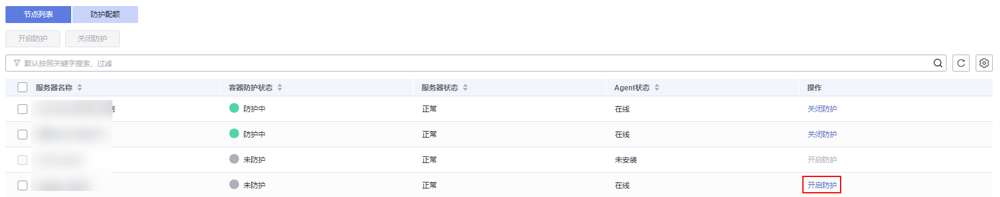

# 开启容器安全防护

您可以为已购买的服务器开启容器版安全防护，开启后按照容器版所提供的能力对服务器进行安全防护。

开启容器节点防护时，您需为指定的节点（主机）分配一个配额，关闭容器安全防护或删除节点（主机）后，该配额可分配给其他的节点（主机）使用。

## 检测周期

主机安全服务每日凌晨进行全量检测。

若您在检测周期前开启防护，您需要等到次日凌晨检测后才能看到检测结果。

## 前提条件

-   “资产管理  \>  容器管理“页面“容器节点管理“中目标服务器“Agent状态“为“在线“。
-   已在云容器引擎成功创建节点。
-   节点的“容器防护状态“为“未防护“。

## 操作步骤

1.  [登录管理控制台](https://console.huaweicloud.com/?locale=zh-cn)。
2.  在页面左上角选择“区域“，单击，选择“安全与合规 \> 主机安全服务”，进入主机安全平台界面。

    **图 1**  进入主机安全  
    

3.  在左侧导航树中，选择“资产管理  \>  容器管理“，进入“容器节点管理“页面。

    > **说明：** 
    >如果您的服务器已通过企业项目的模式进行管理，您可选择目标“企业项目“后查看或操作目标企业项目内的资产和检测信息。

    **图 2**  进入容器节点管理  
    

4.  根据需求可选择批量开启防护和单服务器开启防护。
    -   **单服务器开启防护**
        1.  在“节点列表“中目标服务器的“操作”列单击“开启防护“，为需要开启防护的节点开启防护。

            **图 3**  开启容器防护  
            

        2.  在弹窗中确认信息及选择计费模式。

            > **说明：** 
            >-   开启包年/包月模式若提示配额不足，您需[购买容器版安全防护](购买主机安全防护配额.md)后才可以开启包年/包月的容器版防护，按需可直接开启，无需购买。
            >-   一个容器安全配额防护一个集群节点。

            **图 4**  确认开启容器版信息  
            

        3.  确认选择信息无误，阅读《容器安全服务免责声明》并勾选“我已阅读《容器安全服务免责声明》“，单击确认，返回页面查看“容器防护状态“为“防护中“表示容器版安全防护已开启。

    -   **批量开启防护**
        1.  在“节点列表“中勾选多个目标服务器前的选框，单击上方“开启防护“。

            **图 5**  批量选择服务器  
            

        2.  在弹窗中确认信息及选择计费模式。

            > **说明：** 
            >-   开启包年/包月模式若提示配额不足，您需[购买容器版安全防护](购买主机安全防护配额.md)后才可以开启包年/包月的容器版防护，按需可直接开启，无需购买。
            >-   一个容器安全配额防护一个集群节点。

            **图 6**  确认批量开启容器版信息  
            

        3.  确认选择信息无误，阅读《容器安全服务免责声明》并勾选“我已阅读《容器安全服务免责声明》“，单击确认，返回页面查看“容器防护状态“为“防护中“表示容器版安全防护已开启。

            > **说明：** 
            >开启容器版防护会自动为您开启勒索病毒防护，勒索病毒防护开启后，您需要根据自身业务情况配置诱饵防护目录、开启动态诱饵防护，进一步提升勒索病毒防护能力；另外，建议您同时开启勒索备份，提升勒索防护的事后恢复能力，最小化降低业务受损程度。详细操作请参见[修改防护策略](管理勒索病毒防护策略.md#section1453183620529)、[开启勒索备份](开启勒索备份.md)。

## 后续操作

容器安全版支持勒索病毒防护，开启容器安全版防护后，如果您需要为服务器开启勒索病毒防护，请参考[开启勒索病毒防护](开启勒索病毒防护.md)。

