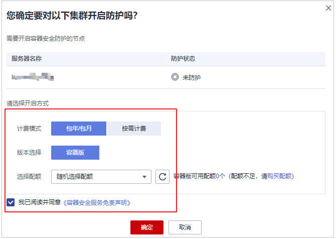

# 开启容器节点防护

开启容器节点防护时，您需为指定的节点（主机）分配一个配额，关闭容器安全防护或删除节点（主机）后，该配额可分配给其他的节点（主机）使用。

## 检测周期

主机安全服务每日凌晨进行全量检测。

若您在检测周期前开启防护，您需要等到次日凌晨检测后才能看到检测结果。

## 约束限制

HSS暂仅支持为Docker和Containerd容器提供安全防护。

## 前提条件

-   “主机安全服务 \> 资产管理 \> 容器管理”页面“容器节点管理“中“Agent状态“为“在线“。
-   已在云容器引擎成功创建节点。
-   节点的“防护状态“为“未防护“。

## 操作步骤

1.  [登录管理控制台](https://console.huaweicloud.com/?locale=zh-cn)。
2.  在页面左上角选择“区域“，单击，选择“安全与合规 \> 主机安全服务”，进入主机安全平台界面。

    **图 1**  进入主机安全  
    

3.  在左侧导航树中，选择“资产管理  \>  容器管理“，进入“容器节点管理“页面。

    **图 2**  进入容器节点管理  
    

4.  在“节点列表“中单击目标服务器“操作“列的“开启防护“，为需要开启防护的节点开启防护。

    **图 3**  开启容器防护  
    

5.  您可以根据自己的实际场景选择“包年/包月“或者“按需计费“，开启节点防护。
    -   **包年/包月**

        在“您确定要对以下集群开启防护吗？“对话框中，“计费模式“选择“包年/包月“，阅读并确认“《容器安全服务免责声明》“。

        **图 4**  开启包周期节点防护  
        

        “防护配额“分配方式：

        -   随机分配：下拉框选择“随机选择配额“，系统优先为主机分发服务剩余时间较长的配额。
        -   指定分配：下拉框选择具体配额ID，您可以为主机分配指定的配额。

    -   **按需计费**

        在“您确定要对以下集群开启防护吗？“对话框中，“计费模式“选择“按需计费“，阅读并确认“《容器安全服务免责声明》“。

        **图 5**  开启按需计费节点防护  
        

6.  在弹出的提示框中，阅读“《容器安全服务免责声明》“后，并勾选“我已阅读并同意《容器安全服务免责声明》“。
7.  单击“确定“，开启节点防护，目标服务器“容器防护状态“变更为“防护中“，说明该节点已开启防护。

    > **说明：** 
    >一个容器安全配额防护一个集群节点。
    >-   一个容器安全配额防护一个集群节点。
    >-   开启容器版防护会自动为您开启勒索病毒防护，勒索病毒防护开启后，您需要根据自身业务情况配置诱饵防护目录、开启动态诱饵防护，进一步提升勒索病毒防护能力；另外，建议您同时开启勒索备份，提升勒索防护的事后恢复能力，最小化降低业务受损程度。详细操作请参见[修改防护策略](管理勒索病毒防护策略.md#section1453183620529)、[开启勒索备份](开启勒索备份.md)。

## 相关操作

**关闭节点防护**

您可以在“资产管理  \>  容器管理  \>  容器节点管理  \>  节点列表“的“操作”列，单击“关闭防护“，关闭对指定容器集群节点的安全防护。

关闭节点防护后，HSS会自动释放防护配额。您可将空闲的配额分配给其他节点继续使用或退订无需使用的配额，避免造成配额资源的浪费。

> **须知：** 
>-   关闭节点防护前，请对容器执行全面的检测，处理已知风险并记录操作信息，避免运维失误，使您的容器遭受攻击。
>-   关闭节点防护后，请及时清理容器中的重要数据、关停容器中的重要业务并断开容器与外部网络的连接，避免因容器遭受攻击而承担不必要的损失。

