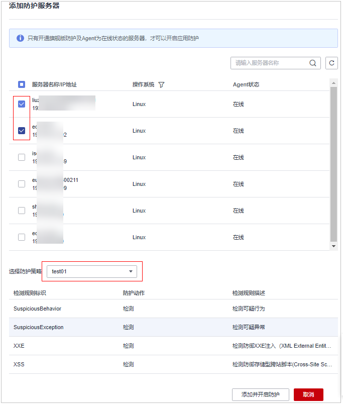
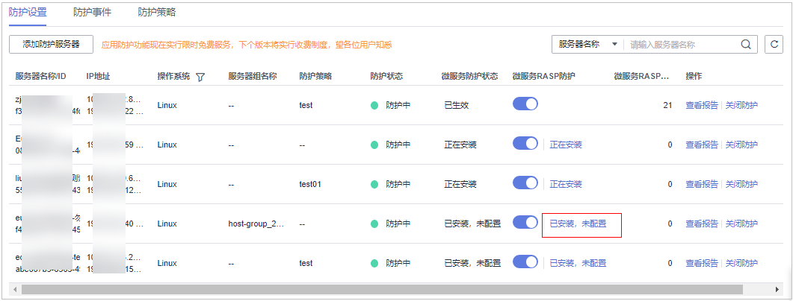
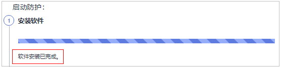
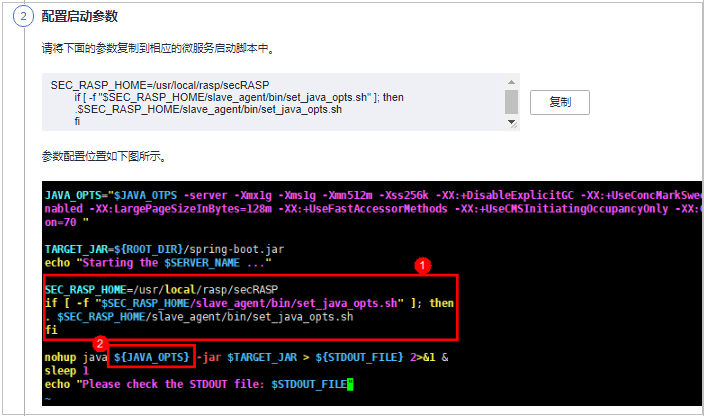

# 开启应用防护

## 前提条件

已开启主机安全服务版本为旗舰版、网页防篡改版或容器版。

## 约束限制

-   当前只支持操作系统为Linux的服务器。
-   目前仅支持Java应用接入。
-   旗舰版及以上支持应用防护相关操作。

## 操作步骤

1.  [登录管理控制台](https://console.huaweicloud.com/?locale=zh-cn)。
2.  在页面左上角选择“区域“，单击，选择“安全与合规 \> 主机安全服务”，进入主机安全平台界面。

    **图 1**  进入主机安全  
    

3.  选择“主动防御  \>  应用防护  \>  防护设置“，进入“防护配置“页面。

    > **说明：** 
    >如果您的服务器已通过企业项目的模式进行管理，您可选择目标“企业项目“后查看或操作目标企业项目内的资产和检测信息。

    **图 2**  查看防护配置  
    

4.  单击“添加防护服务器“，在弹窗中选择需要防护的服务器和策略。

    > **说明：** 
    >防护策略可自定义创建，未创建选择默认策略即可。

    **图 3**  选择目标服务器和策略  
    

5.  单击“添加并开启防护“，服务器防护流程创建成功。
6.  回到“防护设置“页面，单击“微服务RASP防护“的状态，查看防护流程进度。

    **图 4**  查看开启防护流程  
    

7.  在弹窗中查看防护的流程，等待安装软件流程自动执行安装过程，待进度条下方状态为“软件安装已完成“表示自动安装完成。

    **图 5**  软件安装完成  
    

8.  登录主机，进入spring boot的启动路径，复制“配置启动参数“流程中微服务启动脚本粘贴到命令框，配置启动参数。

    **图 6**  配置启动参数  
    

9.  启动参数配置完成后，执行流程第三步：重启微服务，重启微服务RASP后才能正常进行检测防护。
10. 重启后在“防护设置“页面查看目标服务器“微服务防护状态“为“已生效“表示目标服务器已正常开启微服务RASP防护。

