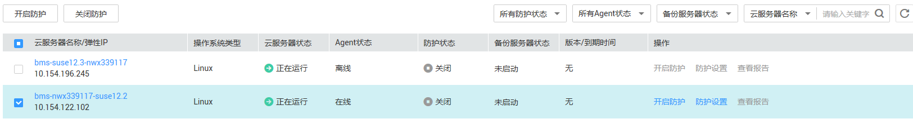
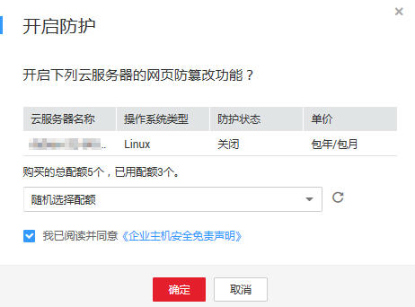

# 开启网页防篡改防护

该章节指导用户开启网页防篡改防护。在使用主机安全服务的网页防篡改功能前，需先开启网页防篡改功能，然后添加防护目录。

> **说明：**   
>购买网页防篡改赠送企业版，详细信息请参见《企业主机安全购买指南》。  

## 前提条件

-   已获取管理控制台的登录账号与密码。
-   弹性云服务器的“Agent状态“为“在线“且“防护状态“为“关闭“。

## 操作步骤

1.  登录管理控制台。
2.  在页面上方，单击“服务列表“，选择“安全  \>  企业主机安全“。
3.  在左侧导航树中，选择“网页防篡改“，进入网页防篡改界面。
4.  在“网页防篡改“界面，选择“主机列表“页签，进入云服务列表页面。
5.  选择需要开启网页防篡改功能的弹性云服务器，单击“开启防护“批量开启防护，如[图1](#fig1500172333412)所示。

    **图 1**  单击开启防护  
    

    > **说明：**   
    >可以在需要开启网页防篡改功能的弹性云服务器所在行的操作列，单击“开启防护“。  

6.  在弹出的“开启防护“对话框中，阅读《企业主机安全免责声明》后，勾选“我已阅读并同意《企业主机安全免责声明》“并单击“确定“，完成开启单台防护操作，如[图2](#fig10424195243220)所示。

    **图 2**  开启网页防篡改防护  
    

7.  开启功能后需要设置防护目录才能起到防护作用，在弹出的提示框中单击“确定“，并参照[添加防护目录](添加防护目录.md)完成防护目录的配置。

