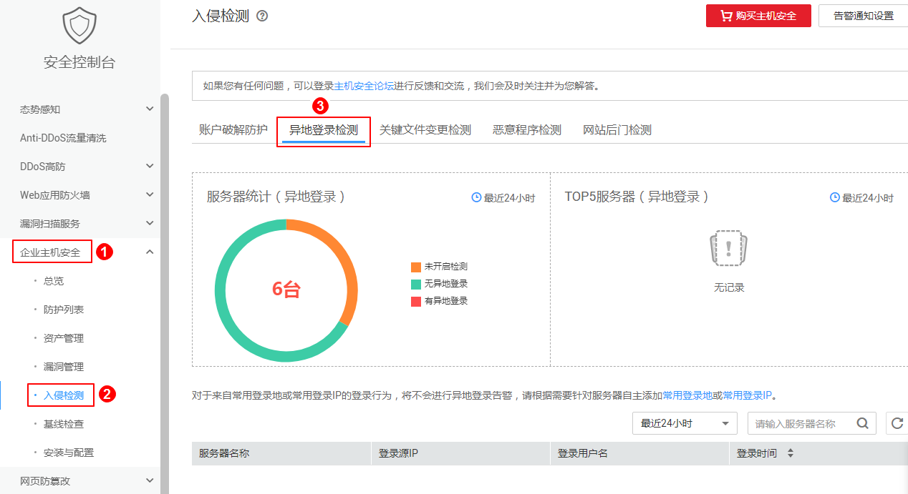

# 异地登录检测

## 告警策略

异地登录检测功能**实时检测**您服务器上的异地登录行为，您[设置常用登录地](安全配置.md#section1448034163012)后，对于在非常用登录地的登录行为HSS会立即进行告警。

## 在控制台查看异地登录记录

1.  [登录管理控制台](https://console.huaweicloud.com)。
2.  在页面上方选择“区域“后，单击“服务列表“，选择“安全  \>  企业主机安全“。
3.  选择“异地登录检测“页签，如[图1](#fig4864925517049)所示。

    **图 1**  异地登录  
    

## 本地查看登录记录

对于linux主机，您可以在“/var/log/secure“和“/var/log/message“路径下查看日志，或使用**last**命令查看登录记录中是否有异常登录。

