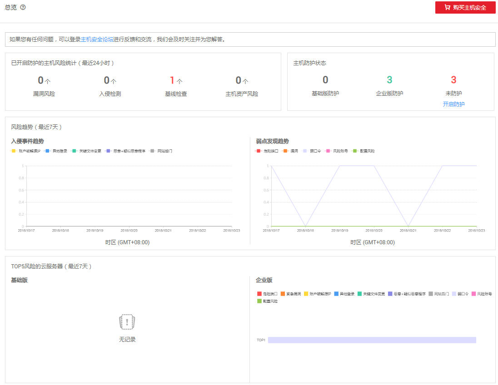

# 总览

“总览“主要展示云服务开启防护状态、当前开启防护的云服务器最近24小时的风险统计、最近一周风险趋势和最近一周TOP5风险的云服务器。

## 前提条件

已获取管理控制台的登录帐号与密码。

## 操作步骤

1.  登录管理控制台。
2.  在页面上方，单击“服务列表“，选择“安全  \>  企业主机安全“，进入总览界面，如[图1](#fig1219489143318)所示，各栏目说明如[表1](#t369a241bb4854931a36cd0b545088949)所示。

    **图 1**  总览  
    

    **表 1**  总览说明

    
    <table><thead align="left"><tr id="r32a3abe9a41e4a34bc17401ad081a8b7"><th class="cellrowborder" valign="top" id="mcps1.2.5.1.1">
栏目

    </th>
    <th class="cellrowborder" colspan="2" valign="top" id="mcps1.2.5.1.2">
说明

    </th>
    <th class="cellrowborder" valign="top" id="mcps1.2.5.1.3">
界面说明

    </th>
    </tr>
    </thead>
    <tbody><tr id="row202571690455"><td class="cellrowborder" valign="top" headers="mcps1.2.5.1.1 ">
已开启防护的主机风险统计（最近24小时）

    </td>
    <td class="cellrowborder" colspan="2" valign="top" headers="mcps1.2.5.1.2 ">
显示最近24小时，企业主机安全服务为开启防护的弹性云服务器发现的各类风险的个数。

    </td>
    <td class="cellrowborder" valign="top" headers="mcps1.2.5.1.3 ">
单击卡片，可查看各类风险详情，具体请参见<a href="资产管理.md#section124443445581">查看开放端口检测结果</a>~<a href="基线检查.md#section182541347165711">查看配置检测结果</a>。

    </td>
    </tr>
    <tr id="rfdfe51c6326a4724b1a2c867745da67a"><td class="cellrowborder" valign="top" headers="mcps1.2.5.1.1 ">
主机防护状态

    </td>
    <td class="cellrowborder" colspan="2" valign="top" headers="mcps1.2.5.1.2 ">
显示用户开启企业版防护、开启基础版防护和未开启防护的弹性云服务器的数量及占比。

    </td>
    <td class="cellrowborder" valign="top" headers="mcps1.2.5.1.3 ">
单击“开启防护”，可跳转到云服务器列表，对未开启防护的弹性云服务器进行开启防护。具体操作请参加<a href="开启主机防护.md">开启防护</a>。

    </td>
    </tr>
    <tr id="r996143cd0fba4f22a25bec115d55a31f"><td class="cellrowborder" rowspan="2" valign="top" width="19.18%" headers="mcps1.2.5.1.1 ">
风险趋势（最近7天）

    </td>
    <td class="cellrowborder" valign="top" width="15.790000000000001%" headers="mcps1.2.5.1.2 ">
入侵事件趋势

    </td>
    <td class="cellrowborder" valign="top" width="35.709999999999994%" headers="mcps1.2.5.1.2 ">
每天统计一次入侵事件类的风险，并用曲线呈现最近一周的风险趋势，包括：

    <ul id="u5d8131e6647e4504bdd7188e91894ba3"><li>账户破解源IP</li><li>异地登录</li><li>关键文件变更</li><li>恶意+疑似恶意程序</li><li>网站后门</li></ul>
    </td>
    <td class="cellrowborder" rowspan="2" valign="top" width="29.32%" headers="mcps1.2.5.1.3 ">
单击趋势图左上角的图例，可以隐藏对应风险类型的趋势曲线，再次单击显示。

    
例如：单击，可以隐藏危险端口的趋势曲线。

    </td>
    </tr>
    <tr id="r4b92c0bffff74abdb047914f60b89560"><td class="cellrowborder" valign="top" headers="mcps1.2.5.1.1 ">
弱点发现趋势

    </td>
    <td class="cellrowborder" valign="top" headers="mcps1.2.5.1.2 ">
每天统计一次弱点发现类的风险，并用曲线呈现最近一周的风险趋势，包括：

    <ul id="u0122151cad2e49ae9955e27c07c179c3"><li>危险端口</li><li>漏洞</li><li>弱口令</li><li>风险账号</li><li>配置风险</li></ul>
    </td>
    </tr>
    <tr id="row1878185017577"><td class="cellrowborder" valign="top" headers="mcps1.2.5.1.1 ">
TOP5风险的云服务器（最近7天）

    </td>
    <td class="cellrowborder" colspan="2" valign="top" headers="mcps1.2.5.1.2 ">
基于开启了基础版和企业版防护功能的弹性云服务器，最近一周企业主机安全服务对其检测出的风险项TOP5的弹性云服务器及各风险项的数量。

    

    </td>
    <td class="cellrowborder" valign="top" headers="mcps1.2.5.1.3 ">
单击柱状图上方的图例，可以隐藏对应风险类型的数据统计，再次单击显示。例如：单击，可以隐藏危险端口的数据统计。

    </td>
    </tr>
    </tbody>
    </table>

