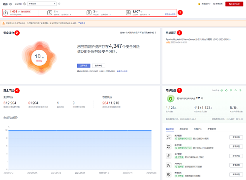

# 总览

主机安全服务在控制台提供总览页面，实时展示您所有资产的安全评分、安全风险、防护地图等，帮助您了解主机和容器的安全状态以及存在的安全风险。

## 查看总览

1.  [登录管理控制台](https://console.huaweicloud.com/?locale=zh-cn)。
2.  在页面左上角选择“区域“，单击，选择“安全与合规 \> 主机安全服务”，进入主机安全平台界面。

    **图 1**  进入主机安全  
    

3.  在左侧导航树选择“总览“，进入总览页查看资产安全信息，相关信息说明请参见[表 总览页信息说明](#table0596817172515)。

    > **说明：** 
    >如果您的服务器已通过企业项目的模式进行管理，您可选择目标“企业项目“后查看或操作目标企业项目内的资产和检测信息。

    **图 2**  总览  
    

    **表 1**  总览页信息说明

    
    <table><thead align="left"><tr id="row14597151772514"><th class="cellrowborder" valign="top" width="30.880000000000003%" id="mcps1.2.3.1.1">
区域

    </th>
    <th class="cellrowborder" valign="top" width="69.12%" id="mcps1.2.3.1.2">
说明

    </th>
    </tr>
    </thead>
    <tbody><tr id="row91481156123115"><td class="cellrowborder" valign="top" width="30.880000000000003%" headers="mcps1.2.3.1.1 ">
配额数量及待升级Agent数（<a href="#fig21989112812">图 总览</a>中所示区域①）

    </td>
    <td class="cellrowborder" valign="top" width="69.12%" headers="mcps1.2.3.1.2 ">
展示当前您已购买的各版本HSS防护配额总数和使用情况，以及待升级Agent数量。

    <ul id="ul126363715240"><li>单击对应防护配额的总数值，可跳转到防护配额界面查看防护配额列表。</li><li>单击待升级Agent数值，可跳转到Agent管理界面查看并升级Agent。</li></ul>
    
 说明： 

主机安全服务会持续优化提升服务能力，包括但不限于新增功能、优化缺陷，因此会定期迭代版本。请及时将主机上的Agent升级为最新版，以便您可以享受到更好的主机安全服务，具体操作请参见<a href="Agent升级.md">升级Agent</a>。

    

    </td>
    </tr>
    <tr id="row9597417152517"><td class="cellrowborder" valign="top" width="30.880000000000003%" headers="mcps1.2.3.1.1 ">
安全评分（<a href="#fig21989112812">图 总览</a>中所示区域②）

    </td>
    <td class="cellrowborder" valign="top" width="69.12%" headers="mcps1.2.3.1.2 ">
安全风险评分范围为0~100分，无风险资产默认为100分，HSS会根据资产中存在的基线风险、漏洞风险、入侵风险和资产风险等执行扣分，评分越低表示资产中存在的安全风险越多。扣分标准和减少扣分的方法请参见<a href="#section1843772114538">安全评分扣分标准</a>。

    </td>
    </tr>
    <tr id="row6597181716259"><td class="cellrowborder" valign="top" width="30.880000000000003%" headers="mcps1.2.3.1.1 ">
热点资讯（<a href="#fig21989112812">图 总览</a>中所示区域③）

    </td>
    <td class="cellrowborder" valign="top" width="69.12%" headers="mcps1.2.3.1.2 ">
展示最新的热点漏洞信息。

    </td>
    </tr>
    <tr id="row20597131716256"><td class="cellrowborder" valign="top" width="30.880000000000003%" headers="mcps1.2.3.1.1 ">
安全风险（<a href="#fig21989112812">图 总览</a>中所示区域④）

    </td>
    <td class="cellrowborder" valign="top" width="69.12%" headers="mcps1.2.3.1.2 ">
展示HSS检测到您资产中存在的安全风险。

    <ul id="ul1237671133016"><li>主机风险<ul id="ul7321399315"><li>需紧急处理告警/总数：处理优先级为紧急的告警数量和告警总数。
单击需紧急处理的告警数值，可跳转到“安全告警事件”界面查看和处理告警，详细操作请参见<a href="处理主机告警事件.md">处理主机告警事件</a>。

    </li><li>紧急优先级修复漏洞/总数：修复优先级为紧急的漏洞数量和漏洞总数。
单击需紧急修复的漏洞数值，可跳转到“漏洞管理”界面查看和处理漏洞，详细操作请参见<a href="处理漏洞.md">处理漏洞</a>。

    </li><li>基线风险：待处理的基线风险总数。
单击待处理基线风险数值，可跳转到基线检查界面查看和修复基线风险，详细操作请参见<a href="基线检查风险项修复及验证.md">基线检查风险项修复及验证</a>。

    </li><li>待处理可疑进程：待处理的可疑进程事件总数。
单击待处理可疑进程数值，可跳转到“应用进程控制”界面查看和处理可疑进程，详细操作请参见<a href="查看并处理可疑进程.md">查看并处理可疑进程</a>。

    </li></ul>
    </li><li>容器风险
高优先级修复漏洞/总数：修复紧急度为高危的漏洞数量和漏洞总数。

    
单击高优先级修复漏洞数值，可跳转到“镜像漏洞”界面查看漏洞修复建议，详细操作请参见<a href="镜像漏洞.md">镜像漏洞</a>。

    </li><li>安全风险趋势
展示资产最近七天的安全风险趋势图。

    </li></ul>
    </td>
    </tr>
    <tr id="row9597111792515"><td class="cellrowborder" valign="top" width="30.880000000000003%" headers="mcps1.2.3.1.1 ">
防护地图（<a href="#fig21989112812">图 总览</a>中所示区域⑤）

    </td>
    <td class="cellrowborder" valign="top" width="69.12%" headers="mcps1.2.3.1.2 ">
展示资产开启安全防护的情况。

    <ul id="ul1933205113522"><li>资产总数：当前区域下的资产总数。
单击资产总数值，可跳转到“资产概览”界面，查看资产分布详情及防护状态统计。

    </li><li>未防护/主机总数：未防护主机数量和主机总数。
单击未防护主机数值，可跳转到“主机管理”界面，查看主机并开启防护，详细操作请参见<a href="开启主机防护.md">开启主机防护</a>。

    </li><li>未防护/容器总数：未防护容器数量和容器总数。
单击未防护容器数值，可跳转到“容器管理”界面，查看容器并开启防护，详细操作请参见<a href="开启容器节点防护.md">开启容器节点防护</a>。

    </li><li>安全防护功能开启情况：对应防护功能的开启数量和防护功能累计扫描/检测项数量。
单击对应安全防护功能右侧的“查看详情”，可跳转到相应防护功能界面，查看防护情况。

    </li></ul>
    </td>
    </tr>
    <tr id="row1759861717256"><td class="cellrowborder" valign="top" width="30.880000000000003%" headers="mcps1.2.3.1.1 ">
最佳实践

    </td>
    <td class="cellrowborder" valign="top" width="69.12%" headers="mcps1.2.3.1.2 ">
展示HSS的最佳实践文档，单击文档标题可查看对应文档内容。

    </td>
    </tr>
    <tr id="row166313314273"><td class="cellrowborder" valign="top" width="30.880000000000003%" headers="mcps1.2.3.1.1 ">
常见问题

    </td>
    <td class="cellrowborder" valign="top" width="69.12%" headers="mcps1.2.3.1.2 ">
展示HSS的常见问题文档，单击文档标题可查看对应文档内容。

    </td>
    </tr>
    <tr id="row105365428276"><td class="cellrowborder" valign="top" width="30.880000000000003%" headers="mcps1.2.3.1.1 ">
相关安全服务

    </td>
    <td class="cellrowborder" valign="top" width="69.12%" headers="mcps1.2.3.1.2 ">
展示和HSS关联的安全服务，单击服务标识，可跳转到对应服务的控制台。

    </td>
    </tr>
    </tbody>
    </table>

## 安全评分扣分标准

HSS安全评分模块涉及主机开启防护后的防护项（漏洞、基线、入侵检测、资产、镜像）和未开启防护的资产，总分共计100分，默认无风险状态下，各模块满分分值如下：

-   无漏洞风险：满分20分
-   无基线风险：满分20分
-   无入侵风险：满分30分
-   无资产风险：满分10分
-   无镜像安全风险：满分10分
-   无未开启防护的资产：满分10分

各模块发现一项风险执行一次扣分，直至该模块分扣完为止，具体扣分规则请参见[表 安全评分扣分标准](#table1702444588)。

**表 2**  安全评分扣分标准

<table><thead align="left"><tr id="row178123455818"><th class="cellrowborder" colspan="2" valign="top" id="mcps1.2.8.1.1">
分类

</th>
<th class="cellrowborder" valign="top" id="mcps1.2.8.1.2">
安全扣分项

</th>
<th class="cellrowborder" valign="top" id="mcps1.2.8.1.3">
影响HSS版本

</th>
<th class="cellrowborder" valign="top" id="mcps1.2.8.1.4">
单项扣分值

</th>
<th class="cellrowborder" valign="top" id="mcps1.2.8.1.5">
是否按风险个数叠加计算扣分

</th>
<th class="cellrowborder" valign="top" id="mcps1.2.8.1.6">
减少扣分方法

</th>
</tr>
</thead>
<tbody><tr id="row881212419586"><td class="cellrowborder" rowspan="5" valign="top" width="9.26092609260926%" headers="mcps1.2.8.1.1 ">
漏洞风险

</td>
<td class="cellrowborder" rowspan="4" valign="top" width="12.171217121712171%" headers="mcps1.2.8.1.1 ">
未处理漏洞

</td>
<td class="cellrowborder" valign="top" width="17.52175217521752%" headers="mcps1.2.8.1.2 ">
存在未处理的紧急漏洞

</td>
<td class="cellrowborder" valign="top" width="10.281028102810282%" headers="mcps1.2.8.1.3 ">
所有版本

</td>
<td class="cellrowborder" valign="top" width="8.150815081508151%" headers="mcps1.2.8.1.4 ">
10

</td>
<td class="cellrowborder" valign="top" width="7.920792079207921%" headers="mcps1.2.8.1.5 ">
√

</td>
<td class="cellrowborder" rowspan="4" valign="top" width="34.69346934693469%" headers="mcps1.2.8.1.6 ">
按照漏洞修复建议进行漏洞修复，修复后重新扫描漏洞，更新评分。

<ul id="ul758174717258"><li>修复漏洞操作请参见<a href="处理漏洞.md">处理漏洞</a>。</li><li>扫描漏洞操作请参见<a href="扫描漏洞.md">扫描漏洞</a>。</li></ul>
</td>
</tr>
<tr id="row38126412584"><td class="cellrowborder" valign="top" headers="mcps1.2.8.1.1 ">
存在未处理的高危漏洞

</td>
<td class="cellrowborder" valign="top" headers="mcps1.2.8.1.1 ">
所有版本

</td>
<td class="cellrowborder" valign="top" headers="mcps1.2.8.1.2 ">
3

</td>
<td class="cellrowborder" valign="top" headers="mcps1.2.8.1.3 ">
√

</td>
</tr>
<tr id="row6812444589"><td class="cellrowborder" valign="top" headers="mcps1.2.8.1.1 ">
存在未处理的中危漏洞

</td>
<td class="cellrowborder" valign="top" headers="mcps1.2.8.1.1 ">
所有版本

</td>
<td class="cellrowborder" valign="top" headers="mcps1.2.8.1.2 ">
1

</td>
<td class="cellrowborder" valign="top" headers="mcps1.2.8.1.3 ">
√

</td>
</tr>
<tr id="row38131843583"><td class="cellrowborder" valign="top" headers="mcps1.2.8.1.1 ">
存在未处理的低危漏洞

</td>
<td class="cellrowborder" valign="top" headers="mcps1.2.8.1.1 ">
所有版本

</td>
<td class="cellrowborder" valign="top" headers="mcps1.2.8.1.2 ">
0.1

</td>
<td class="cellrowborder" valign="top" headers="mcps1.2.8.1.3 ">
√

</td>
</tr>
<tr id="row781344165814"><td class="cellrowborder" valign="top" headers="mcps1.2.8.1.1 ">
未进行漏洞扫描

</td>
<td class="cellrowborder" valign="top" headers="mcps1.2.8.1.1 ">
1个月内未进行漏洞扫描

</td>
<td class="cellrowborder" valign="top" headers="mcps1.2.8.1.2 ">
所有版本

</td>
<td class="cellrowborder" valign="top" headers="mcps1.2.8.1.3 ">
15

</td>
<td class="cellrowborder" valign="top" headers="mcps1.2.8.1.4 ">
×

</td>
<td class="cellrowborder" valign="top" headers="mcps1.2.8.1.5 "><ul id="ul117261517277"><li>对于HSS基础版无漏洞扫描功能，建议升级到企业版或旗舰版后对主机进行漏洞扫描，升级操作请参见<a href="配额版本升级.md">配额版本升级</a></li><li>对于HSS专业版/企业版/旗舰版/网页防篡改版，建议执行漏洞扫描，详细操作请参见<a href="扫描漏洞.md">扫描漏洞</a>。</li></ul>
</td>
</tr>
<tr id="row138131642587"><td class="cellrowborder" rowspan="6" valign="top" width="9.26092609260926%" headers="mcps1.2.8.1.1 ">
基线风险

</td>
<td class="cellrowborder" rowspan="3" valign="top" width="12.171217121712171%" headers="mcps1.2.8.1.1 ">
未处理不合规项

</td>
<td class="cellrowborder" valign="top" width="17.52175217521752%" headers="mcps1.2.8.1.2 ">
存在未处理的高危不合规项

</td>
<td class="cellrowborder" valign="top" width="10.281028102810282%" headers="mcps1.2.8.1.3 ">
所有版本

</td>
<td class="cellrowborder" valign="top" width="8.150815081508151%" headers="mcps1.2.8.1.4 ">
10

</td>
<td class="cellrowborder" valign="top" width="7.920792079207921%" headers="mcps1.2.8.1.5 ">
√

</td>
<td class="cellrowborder" rowspan="3" valign="top" width="34.69346934693469%" headers="mcps1.2.8.1.6 ">
按照基线修复建议修复基线检查不合规项，修复完成后，重新之执行基线检查，更新评分。

<ul id="ul24312449318"><li>修复基线风险操作请参见<a href="基线检查风险项修复及验证.md">基线检查风险项修复及验证</a></li><li>执行基线检查的操作请参见<a href="查看基线检查详情.md">查看基线检查详情</a>。</li></ul>
</td>
</tr>
<tr id="row1681316445817"><td class="cellrowborder" valign="top" headers="mcps1.2.8.1.1 ">
存在未处理的中危不合规项

</td>
<td class="cellrowborder" valign="top" headers="mcps1.2.8.1.1 ">
所有版本

</td>
<td class="cellrowborder" valign="top" headers="mcps1.2.8.1.2 ">
3

</td>
<td class="cellrowborder" valign="top" headers="mcps1.2.8.1.3 ">
√

</td>
</tr>
<tr id="row1181324195811"><td class="cellrowborder" valign="top" headers="mcps1.2.8.1.1 ">
存在未处理的低危不合规项

</td>
<td class="cellrowborder" valign="top" headers="mcps1.2.8.1.1 ">
所有版本

</td>
<td class="cellrowborder" valign="top" headers="mcps1.2.8.1.2 ">
1

</td>
<td class="cellrowborder" valign="top" headers="mcps1.2.8.1.3 ">
√

</td>
</tr>
<tr id="row781417420585"><td class="cellrowborder" valign="top" headers="mcps1.2.8.1.1 ">
存在弱口令

</td>
<td class="cellrowborder" valign="top" headers="mcps1.2.8.1.1 ">
存在弱口令

</td>
<td class="cellrowborder" valign="top" headers="mcps1.2.8.1.2 ">
所有版本

</td>
<td class="cellrowborder" valign="top" headers="mcps1.2.8.1.3 ">
10

</td>
<td class="cellrowborder" valign="top" headers="mcps1.2.8.1.4 ">
√

</td>
<td class="cellrowborder" valign="top" headers="mcps1.2.8.1.5 ">
修改检测到的弱口令。安全的口令设置方法请参见<a href="https://support.huaweicloud.com/hss2.0_faq/hss_01_0166.html" target="_blank" rel="noopener noreferrer">如何设置安全的口令</a>。

</td>
</tr>
<tr id="row0814247588"><td class="cellrowborder" valign="top" headers="mcps1.2.8.1.1 ">
未开启弱口令检查

</td>
<td class="cellrowborder" valign="top" headers="mcps1.2.8.1.1 ">
未开启弱口令检查策略

</td>
<td class="cellrowborder" valign="top" headers="mcps1.2.8.1.2 ">
所有版本

</td>
<td class="cellrowborder" valign="top" headers="mcps1.2.8.1.3 ">
10

</td>
<td class="cellrowborder" valign="top" headers="mcps1.2.8.1.4 ">
×

</td>
<td class="cellrowborder" valign="top" headers="mcps1.2.8.1.5 ">
开启“弱口令检测”策略对主机进行弱口令检查，详细操作请参见<a href="查看策略组.md">查看和编辑策略</a>。

</td>
</tr>
<tr id="row1781419412585"><td class="cellrowborder" valign="top" headers="mcps1.2.8.1.1 ">
未进行基线配置检查

</td>
<td class="cellrowborder" valign="top" headers="mcps1.2.8.1.1 ">
1个月内未进行基线配置检查

</td>
<td class="cellrowborder" valign="top" headers="mcps1.2.8.1.2 ">
所有版本

</td>
<td class="cellrowborder" valign="top" headers="mcps1.2.8.1.3 ">
10

</td>
<td class="cellrowborder" valign="top" headers="mcps1.2.8.1.4 ">
×

</td>
<td class="cellrowborder" valign="top" headers="mcps1.2.8.1.5 "><ul id="ul1935017113131"><li>对于HSS基础版/专业版无基线检查的风险配置检查功能，建议升级到企业版或旗舰版对主机进行基线检查，升级操作请参见<a href="配额版本升级.md">配额版本升级</a>。</li><li>对于HSS企业版/旗舰版/网页防篡改版，建议开启“配置检测”策略并执行风险配置检查，详细操作请参见<a href="查看策略组.md">查看和编辑策略</a>。</li></ul>
</td>
</tr>
<tr id="row8816104125814"><td class="cellrowborder" rowspan="9" valign="top" width="9.26092609260926%" headers="mcps1.2.8.1.1 ">
入侵风险

</td>
<td class="cellrowborder" rowspan="4" valign="top" width="12.171217121712171%" headers="mcps1.2.8.1.1 ">
未处理告警事件

</td>
<td class="cellrowborder" valign="top" width="17.52175217521752%" headers="mcps1.2.8.1.2 ">
存在未处理的严重告警事件

</td>
<td class="cellrowborder" valign="top" width="10.281028102810282%" headers="mcps1.2.8.1.3 ">
所有版本

</td>
<td class="cellrowborder" valign="top" width="8.150815081508151%" headers="mcps1.2.8.1.4 ">
10

</td>
<td class="cellrowborder" valign="top" width="7.920792079207921%" headers="mcps1.2.8.1.5 ">
√

</td>
<td class="cellrowborder" rowspan="4" valign="top" width="34.69346934693469%" headers="mcps1.2.8.1.6 ">
按告警事件处置建议处置告警事件，处置完成后，HSS会自动更新评分，详细操作请参见<a href="处理主机告警事件.md">处理主机告警事件</a>和<a href="处理容器告警事件.md">处理容器告警事件</a>。

</td>
</tr>
<tr id="row781611419580"><td class="cellrowborder" valign="top" headers="mcps1.2.8.1.1 ">
存在未处理的高危告警事件

</td>
<td class="cellrowborder" valign="top" headers="mcps1.2.8.1.1 ">
所有版本

</td>
<td class="cellrowborder" valign="top" headers="mcps1.2.8.1.2 ">
3

</td>
<td class="cellrowborder" valign="top" headers="mcps1.2.8.1.3 ">
√

</td>
</tr>
<tr id="row10816174145819"><td class="cellrowborder" valign="top" headers="mcps1.2.8.1.1 ">
存在未处理的中危告警事件

</td>
<td class="cellrowborder" valign="top" headers="mcps1.2.8.1.1 ">
所有版本

</td>
<td class="cellrowborder" valign="top" headers="mcps1.2.8.1.2 ">
1

</td>
<td class="cellrowborder" valign="top" headers="mcps1.2.8.1.3 ">
√

</td>
</tr>
<tr id="row88166415584"><td class="cellrowborder" valign="top" headers="mcps1.2.8.1.1 ">
存在未处理的低危告警事件

</td>
<td class="cellrowborder" valign="top" headers="mcps1.2.8.1.1 ">
所有版本

</td>
<td class="cellrowborder" valign="top" headers="mcps1.2.8.1.2 ">
0.1

</td>
<td class="cellrowborder" valign="top" headers="mcps1.2.8.1.3 ">
√

</td>
</tr>
<tr id="row48169435813"><td class="cellrowborder" rowspan="5" valign="top" headers="mcps1.2.8.1.1 ">
未开启安全防护

</td>
<td class="cellrowborder" valign="top" headers="mcps1.2.8.1.1 ">
未开启任何安全策略

</td>
<td class="cellrowborder" valign="top" headers="mcps1.2.8.1.2 ">
所有版本

</td>
<td class="cellrowborder" valign="top" headers="mcps1.2.8.1.3 ">
30

</td>
<td class="cellrowborder" valign="top" headers="mcps1.2.8.1.4 ">
×

</td>
<td class="cellrowborder" valign="top" headers="mcps1.2.8.1.5 ">
对于HSS专业版/企业版/旗舰版/网页防篡改版/容器版，需开启相关防护策略，详细操作请参见<a href="查看策略组.md">查看和编辑策略</a>。

相应版本需开启的入侵检测策略如下：

<ul id="ul1695816163238"><li>专业版/企业版<ul id="ul517523993413"><li>Linux：webshell检测、文件保护、HIPS检测、登录安全检测、恶意文件检测、进程异常行为、root提权、实时进程、rootkit检测。</li><li>Windows：AV检测、webshell检测、HIPS检测、登录安全检测、实时进程。</li></ul>
</li><li>旗舰版/网页防篡改版<ul id="ul166501934163413"><li>Linux：集群入侵检测、webshell检测、文件保护、HIPS检测、登录安全检测、恶意文件检测、端口扫描检测、进程异常行为、root提权、实时进程、rootkit检测。</li><li>Windows：AV检测、webshell检测、HIPS检测、登录安全检测、实时进程。</li></ul>
</li><li>容器版
集群入侵检测、容器逃逸、webshell检测、容器文件监控、容器进程白名单、镜像异常行为。

</li></ul>
</td>
</tr>
<tr id="row138171449589"><td class="cellrowborder" valign="top" headers="mcps1.2.8.1.1 ">
未开启登录安全策略

</td>
<td class="cellrowborder" valign="top" headers="mcps1.2.8.1.1 ">
所有版本

</td>
<td class="cellrowborder" valign="top" headers="mcps1.2.8.1.2 ">
10

</td>
<td class="cellrowborder" valign="top" headers="mcps1.2.8.1.3 ">
×

</td>
<td class="cellrowborder" valign="top" headers="mcps1.2.8.1.4 ">
对于HSS专业版/企业版/旗舰版/网页防篡改版/容器版，需开启“登录安全检测”策略应用到主机，详细操作请参见<a href="查看策略组.md">查看和编辑策略</a>。

</td>
</tr>
<tr id="row4817114175811"><td class="cellrowborder" valign="top" headers="mcps1.2.8.1.1 ">
未开启勒索防护策略

</td>
<td class="cellrowborder" valign="top" headers="mcps1.2.8.1.1 ">
旗舰版

</td>
<td class="cellrowborder" valign="top" headers="mcps1.2.8.1.2 ">
15

</td>
<td class="cellrowborder" valign="top" headers="mcps1.2.8.1.3 ">
×

</td>
<td class="cellrowborder" valign="top" headers="mcps1.2.8.1.4 ">
对于HSS旗舰版/网页防篡改版/容器版支持勒索病毒防护功能，您需开启勒索防护策略、勒索备份策略（未配置扣10分）并应用到主机，提升主机勒索病毒防御能力，详细操作请参见<a href="开启勒索病毒防护.md">开启勒索病毒防护</a>。

</td>
</tr>
<tr id="row198174465811"><td class="cellrowborder" valign="top" headers="mcps1.2.8.1.1 ">
未开启网页防篡改策略

</td>
<td class="cellrowborder" valign="top" headers="mcps1.2.8.1.1 ">
网页防篡改版

</td>
<td class="cellrowborder" valign="top" headers="mcps1.2.8.1.2 ">
20

</td>
<td class="cellrowborder" valign="top" headers="mcps1.2.8.1.3 ">
×

</td>
<td class="cellrowborder" valign="top" headers="mcps1.2.8.1.4 ">
对于HSS网页防篡改版，需开启网页防篡改并应用到主机，详细操作请参见<a href="网页防篡改版.md">网页防篡改版</a>。

</td>
</tr>
<tr id="row118172435819"><td class="cellrowborder" valign="top" headers="mcps1.2.8.1.1 ">
未开启容器运行时检测策略

</td>
<td class="cellrowborder" valign="top" headers="mcps1.2.8.1.1 ">
容器安全版

</td>
<td class="cellrowborder" valign="top" headers="mcps1.2.8.1.2 ">
20

</td>
<td class="cellrowborder" valign="top" headers="mcps1.2.8.1.3 ">
×

</td>
<td class="cellrowborder" valign="top" headers="mcps1.2.8.1.4 ">
对于HSS容器版，需开启“容器逃逸”检测策略并应用到主机，详细操作请参见<a href="查看策略组.md">查看和编辑策略</a>。

</td>
</tr>
<tr id="row9778115841819"><td class="cellrowborder" rowspan="2" valign="top" width="9.26092609260926%" headers="mcps1.2.8.1.1 ">
资产风险

</td>
<td class="cellrowborder" valign="top" width="12.171217121712171%" headers="mcps1.2.8.1.1 ">
开放端口

</td>
<td class="cellrowborder" valign="top" width="17.52175217521752%" headers="mcps1.2.8.1.2 ">
开放的TCP/UDP高危端口

</td>
<td class="cellrowborder" valign="top" width="10.281028102810282%" headers="mcps1.2.8.1.3 ">
所有版本

</td>
<td class="cellrowborder" valign="top" width="8.150815081508151%" headers="mcps1.2.8.1.4 ">
1

</td>
<td class="cellrowborder" valign="top" width="7.920792079207921%" headers="mcps1.2.8.1.5 ">
√

</td>
<td class="cellrowborder" valign="top" width="34.69346934693469%" headers="mcps1.2.8.1.6 ">
建议您关闭不需要的端口，如果需要开放该端口，请前往“资产管理 &gt; 主机指纹 &gt;  开放端口”页面，对该端口执行忽略操作。

</td>
</tr>
<tr id="row681813475811"><td class="cellrowborder" valign="top" headers="mcps1.2.8.1.1 ">
未开启资产发现

</td>
<td class="cellrowborder" valign="top" headers="mcps1.2.8.1.1 ">
未开启资产发现策略

</td>
<td class="cellrowborder" valign="top" headers="mcps1.2.8.1.2 ">
所有版本

</td>
<td class="cellrowborder" valign="top" headers="mcps1.2.8.1.3 ">
5

</td>
<td class="cellrowborder" valign="top" headers="mcps1.2.8.1.4 ">
×

</td>
<td class="cellrowborder" valign="top" headers="mcps1.2.8.1.5 "><ul id="ul169011734101711"><li>对于HSS基础版/专业版/企业版无资产发现功能，建议升级到旗舰版为主机开启资产发现策略，详细操作请参见<a href="配额版本升级.md">配额版本升级</a>。</li><li>对于HSS旗舰版/网页防篡改版建议开启“资产发现”策略，详细操作请参见<a href="查看策略组.md">查看和编辑策略</a>。</li></ul>
</td>
</tr>
<tr id="row2081814465819"><td class="cellrowborder" rowspan="4" valign="top" width="9.26092609260926%" headers="mcps1.2.8.1.1 ">
镜像风险

</td>
<td class="cellrowborder" rowspan="3" valign="top" width="12.171217121712171%" headers="mcps1.2.8.1.1 ">
存在风险镜像

</td>
<td class="cellrowborder" valign="top" width="17.52175217521752%" headers="mcps1.2.8.1.2 ">
存在高风险的镜像

</td>
<td class="cellrowborder" valign="top" width="10.281028102810282%" headers="mcps1.2.8.1.3 ">
容器版

</td>
<td class="cellrowborder" valign="top" width="8.150815081508151%" headers="mcps1.2.8.1.4 ">
3

</td>
<td class="cellrowborder" valign="top" width="7.920792079207921%" headers="mcps1.2.8.1.5 ">
√

</td>
<td class="cellrowborder" rowspan="3" valign="top" width="34.69346934693469%" headers="mcps1.2.8.1.6 ">
重新制作镜像后扫描镜像，更新评分。

</td>
</tr>
<tr id="row381811415583"><td class="cellrowborder" valign="top" headers="mcps1.2.8.1.1 ">
存在中风险的镜像

</td>
<td class="cellrowborder" valign="top" headers="mcps1.2.8.1.1 ">
容器版

</td>
<td class="cellrowborder" valign="top" headers="mcps1.2.8.1.2 ">
1

</td>
<td class="cellrowborder" valign="top" headers="mcps1.2.8.1.3 ">
√

</td>
</tr>
<tr id="row281814485818"><td class="cellrowborder" valign="top" headers="mcps1.2.8.1.1 ">
存在中风险的镜像

</td>
<td class="cellrowborder" valign="top" headers="mcps1.2.8.1.1 ">
容器版

</td>
<td class="cellrowborder" valign="top" headers="mcps1.2.8.1.2 ">
0.1

</td>
<td class="cellrowborder" valign="top" headers="mcps1.2.8.1.3 ">
√

</td>
</tr>
<tr id="row481854155816"><td class="cellrowborder" valign="top" headers="mcps1.2.8.1.1 ">
未进行镜像安全扫描

</td>
<td class="cellrowborder" valign="top" headers="mcps1.2.8.1.1 ">
1个月未进行镜像安全扫描

</td>
<td class="cellrowborder" valign="top" headers="mcps1.2.8.1.2 ">
容器版

</td>
<td class="cellrowborder" valign="top" headers="mcps1.2.8.1.3 ">
5

</td>
<td class="cellrowborder" valign="top" headers="mcps1.2.8.1.4 ">
×

</td>
<td class="cellrowborder" valign="top" headers="mcps1.2.8.1.5 ">
对于HSS容器版建议执行镜像安全扫描。详细操作请参见<a href="容器镜像.md">容器镜像</a>。

</td>
</tr>
<tr id="row148191242583"><td class="cellrowborder" valign="top" width="9.26092609260926%" headers="mcps1.2.8.1.1 ">
未开启主机安全防护风险

</td>
<td class="cellrowborder" valign="top" width="12.171217121712171%" headers="mcps1.2.8.1.1 ">
未开启主机安全防护

</td>
<td class="cellrowborder" valign="top" width="17.52175217521752%" headers="mcps1.2.8.1.2 ">
未开启主机安全防护的主机

</td>
<td class="cellrowborder" valign="top" width="10.281028102810282%" headers="mcps1.2.8.1.3 ">
所有版本

</td>
<td class="cellrowborder" valign="top" width="8.150815081508151%" headers="mcps1.2.8.1.4 ">
0.1~1

</td>
<td class="cellrowborder" valign="top" width="7.920792079207921%" headers="mcps1.2.8.1.5 ">
√

</td>
<td class="cellrowborder" valign="top" width="34.69346934693469%" headers="mcps1.2.8.1.6 ">
对于未开启防护的主机，扣分标准为：

<ul id="ul252513982110"><li>1个重要资产扣1分。</li><li>1个一般资产扣0.5分。</li><li>1个测试资产扣0.1分。</li></ul>

建议您尽快为主机开启安全防护，详细操作请参见<a href="开启主机防护.md">开启主机防护</a>。

</td>
</tr>
</tbody>
</table>

