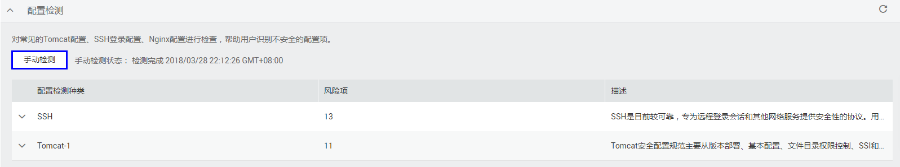

# 手动执行配置检测

如需获取最新的配置信息，建议立即执行一次检测。该任务指导用户立即执行一次配置检测。

> **注意：**   
>手动检测完成后需间隔三分钟才能再次执行手动检测。  

> **说明：**   
>进入“防护列表“界面后，在界面右上角单击“手动检测“，在弹出的对话框中，可批量选择需执行手动检测的云服务器，单击“确定“后，所有手动检测的项目将自动对云服务器执行检测；检测完成后，可在企业主机安全服务控制台查看各项风险统计或云服务器上查询检测结果。  

## 前提条件

-   已获取管理控制台的登录账号与密码。

-   弹性云服务器的“防护状态“为“开启“。

## 操作步骤

1.  登录管理控制台。
2.  单击页面上方的“服务列表“，选择“安全  \>  企业主机安全“。
3.  在左侧导航树中，选择“防护列表“，进入防护列表界面。
4.  在需要手动执行配置检测的弹性云服务器所在行的“检测结果“列，单击检测结果。
5.  选择“基线检查“页签，展开“配置检测“栏，单击“手动检测“，系统将立即执行一次配置检测。

    “手动检测状态“为“检测中“。

    **图 1**  配置检测  
    

6.  当“手动检测状态“为“检测完成“时，单击刷新“配置检测“结果，查看最新的配置信息。

