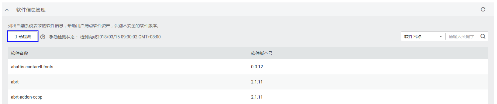

# 手动收集软件信息

如需获取最新的软件信息，建议立即执行一次检测。该任务指导用户立即收集一次软件信息。

> **注意：**   
>手动检测完成后需间隔三分钟才能再次执行手动检测。  

## 前提条件

-   已获取管理控制台的登录账号与密码。
-   弹性云服务器的“防护状态“为“开启“。

## 操作步骤

1.  登录管理控制台。
2.  在页面上方，单击“服务列表“，选择“安全  \>  企业主机安全“。
3.  在左侧导航树中，选择“防护列表“，进入防护列表界面。
4.  在需要手动收集软件信息的弹性云服务器所在行的“检测结果“列，单击检测结果。
5.  选择“资产管理“页签，展开“软件信息管理“栏，单击“手动检测“，系统将立即执行一次软件信息管理。

    “手动检测状态“为“检测中“。

    **图 1**  软件信息管理检测  
    

6.  当“手动检测状态“为“检测完成“时，单击刷新“软件信息“结果，查看最新软件信息。

    > **说明：**   
    >-   用户可以通过在列表右上角的“软件名称“后方搜索框中输入“软件名称“的关键字，单击，查询指定软件信息。  
    >-   软件漏洞检测和软件信息管理任意一个手动检测都会触发收集服务器上的软件信息。  

