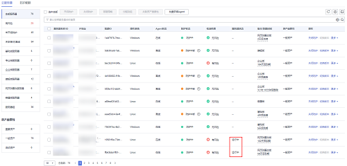

# 批量服务器一键安装Agent（服务器账号、密码相同）<a name="hss_01_0386"></a>

指导您完成服务器Agent的批量安装操作，创建批量安装后系统将自动执行Agent安装操作，安装后才可以对目标服务器开启防护。

## 前提条件<a name="section279416111447"></a>

-   待安装Agent的服务器所属VPC内已有一台Agent在线的服务器。
-   待安装Agent的服务器需要支持ssh登录。
-   已获取待安装Agent的服务器正确的登录账号、端口、密码。
-   待安装Agent的服务器“状态“为“运行中“。

## 约束限制<a name="section1650715812715"></a>

-   目前仅支持Linux系统的服务器进行批量安装Agent。
-   单次最多可为50台服务器批量安装Agent。
-   Agent支持的操作系统请参见[支持的操作系统](https://support.huaweicloud.com/productdesc-hss2.0/hss_01_0137.html#section2)。

## 操作步骤<a name="section4497610815"></a>

1.  [登录管理控制台](https://console.huaweicloud.com/?locale=zh-cn)。
2.  在页面左上角选择“区域“，单击，选择“安全与合规 \> 主机安全服务”，进入主机安全平台界面。

    **图 1**  进入主机安全<a name="hss_01_0234_fig1855613765114"></a>  
    

1.  在左侧导航栏，选择“资产管理  \>  主机管理“，进入“主机管理“界面，选择“云服务器“页签，进入云服务器页面。

    > **说明：** 
    >如果您的服务器已通过企业项目的模式进行管理，您可选择目标“企业项目“后查看或操作目标企业项目内的资产和检测信息。

    **图 2**  进入云服务器<a name="fig8558122914125"></a>  
    

2.  单机上方“批量安装Agent“，在弹窗中勾选需要批量安装的服务器。

    > **须知：** 
    >-   批量安装的主机“服务器状态“必须为“运行中“。
    >-   批量安装Agent的服务器所属VPC内至少有一台服务器已安装Agent，若均未安装需先在VPC内至少安装一台，否则将安装失败。
    >-   单次勾选的所有服务器的root密码和端口都必须保持一致，若存在密码或端口其中任意一项不一致，需将按照密码和端口一致的服务器进行分批次安装，否则将安装失败。
    >-   批量安装单次最多50台服务器。

    **图 3**  勾选目标服务器<a name="fig193321143124813"></a>  
    

3.  确认无误，单击“下一步“，输入“服务器root密码“和“服务器登录端口“。

    **图 4**  输入服务器信息<a name="fig19289144171210"></a>  
    

    > **说明：** 
    >系统默认系统端口为22，若需查询Linux SSH端口，远程登录目标服务器后，在Linux服务器中执行以下命令即可查询。
    >```
    >cat /etc/ssh/sshd_config | grep Port
    >```

4.  单击“确认“，服务器将自动执行Agent安装。

    > **说明：** 
    >自动安装程序为依次安装，您可在“资产管理  \>  主机管理  \>  云服务器“查看安装情况，若目标服务器“Agent状态“变更为“在线“，表示您已经可以对该服务器开启防护。

