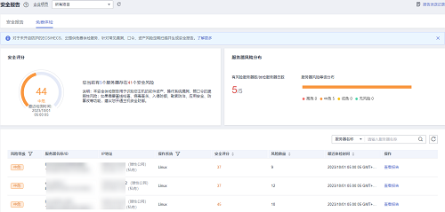

# 未开启防护资产的免费体检

对未开启防护的主机提供免费扫描体检，针对频繁出现的漏洞、口令、资产风险生成安全报告供查看。

若有基线检查、应用防护、网页防篡改、勒索防护、入侵检测、策略管理、文件完整性检测、隔离查杀等检测或防护需求，您可[开启主机安全防护](开启主机防护.md)。

## 免费体检说明

-   针对未开启防护的服务器每周提供一次全量的免费安全体检，自动执行扫描检测时间为每周一凌晨。
-   免费体检的报告每月1日生成，生成后仅支持线上查看，不支持下载。
-   在报告中单一体检项仅支持展示总结果数的一半，且最多仅展示5条体检结果。
-   若有实时防护、报告下载、漏洞在线修复、等保认证等需求，您可通过购买主机安全服务的不同版本来满足，版本详情请参见[版本功能详情](https://support.huaweicloud.com/productdesc-hss2.0/hss_01_0136.html)。

## 操作步骤

1.  [登录管理控制台](https://console.huaweicloud.com/?locale=zh-cn)。
2.  在页面左上角选择“区域“，单击，选择“安全与合规 \> 主机安全服务”，进入主机安全平台界面。

    **图 1**  进入主机安全  
    

3.  选择“安全报告  \>  免费体检“查看未开启防护资产的体检情况。

    > **说明：** 
    >该页面免费体检的服务器均为未开启防护的服务器。

    **图 2**  免费体检  
    

4.  单击目标服务器“操作“列“查看报告“，可在线查看目标服务器的体检详情。

