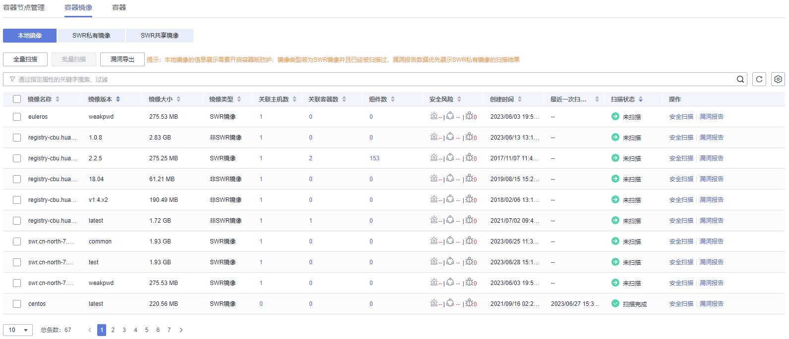

# 本地镜像

主机安全服务支持对本地镜像手动执行漏洞和软件信息的扫描并提供扫描报告。本章节介绍如何对本地镜像执行安全扫描和如何查看扫描报告。

## 约束限制

-   仅HSS容器版支持该功能，购买和升级HSS的操作，请参见[购买主机安全防护配额](购买主机安全防护配额.md)和[配额版本升级](配额版本升级.md)。

-   仅支持Docker引擎的本地镜像上报到主机安全服务控制台。
-   仅支持对Linux镜像执行安全扫描。

## 查看本地镜像

1.  [登录管理控制台](https://console.huaweicloud.com/?locale=zh-cn)。
2.  在页面左上角选择“区域“，单击，选择“安全与合规 \> 主机安全服务”，进入主机安全平台界面。

    **图 1**  进入主机安全  
    

3.  在左侧导航栏中，选择“资产管理 \> 容器管理”，进入容器管理界面。
4.  选择“容器镜像 \> 本地镜像“，查看本地镜像信息。

    您可以查看镜像的名称、版本、类型、安全风险等信息。

    -   查看镜像关联主机信息

        在目标镜像所在行的关联主机数列，单击关联数字，进入关联主机列表页面，可以查看镜像关联主机的详细信息。

    -   查看镜像关联容器信息

        在目标镜像所在行的关联容器数列，单击关联数字，进入关联容器列表页面，可以查看镜像关联容器的详细信息。

    -   查看镜像组件信息

        在目标镜像所在行的组件数列，单击数字，进入组件列表页面，可以查看镜像组件的详细信息。

## 本地镜像安全扫描

支持的安全扫描项如下：

<table><thead align="left"><tr id="row1345162119020"><th class="cellrowborder" valign="top" width="21.55%" id="mcps1.1.3.1.1">
扫描项

</th>
<th class="cellrowborder" valign="top" width="78.45%" id="mcps1.1.3.1.2">
说明

</th>
</tr>
</thead>
<tbody><tr id="row143451721100"><td class="cellrowborder" valign="top" width="21.55%" headers="mcps1.1.3.1.1 ">
漏洞

</td>
<td class="cellrowborder" valign="top" width="78.45%" headers="mcps1.1.3.1.2 ">
检测镜像中存在的漏洞。

</td>
</tr>
<tr id="row1345152118014"><td class="cellrowborder" valign="top" width="21.55%" headers="mcps1.1.3.1.1 ">
软件信息

</td>
<td class="cellrowborder" valign="top" width="78.45%" headers="mcps1.1.3.1.2 ">
统计镜像中的软件信息。

</td>
</tr>
</tbody>
</table>

1.  登录管理控制台，进入主机安全服务页面。
2.  在左侧导航栏中，选择“资产管理 \> 容器管理”，进入容器管理界面。
3.  选择“容器镜像 \> 本地镜像“。
4.  为单个镜像或多个镜像执行安全扫描。
    -   单个镜像安全扫描

        在目标镜像所在行的“操作”列，单击“安全扫描“，为单个目标镜像执行安全扫描。

    -   批量镜像安全扫描

        勾选所有目标镜像并单击镜像列表上方的“批量扫描“，为多个目标镜像执行安全扫描。

    -   全量镜像安全扫描

        单击镜像列表上方的全量扫描，为所有镜像执行安全扫描。

5.  当镜像“扫描状态“更新为“扫描完成“，且“最近一次扫描完成时间“更新为最近任务执行时间，表示镜像安全扫描完成。

## 查看本地镜像漏洞报告和软件信息

1.  登录管理控制台，进入主机安全服务页面。
2.  在左侧导航栏中，选择“资产管理 \> 容器管理”，单击“容器镜像”，选择“本地镜像“，查看镜像扫描结果。

    **图 2**  查看本地镜像扫描结果  
    

## 导出本地镜像漏洞报告

1.  登录管理控制台，进入主机安全服务页面。

1.  在左侧导航栏选择“资产管理  \>  容器管理“，进入容器管理界面。
2.  选择“容器镜像  \>  本地镜像“。
3.  单击镜像列表上方“漏洞导出“，导出漏洞报告。

    如果您想要导出指定镜像的漏洞报告，您可以在漏洞列表上方的搜索框中选择指定类型的镜像后，再单击“漏洞导出“。

