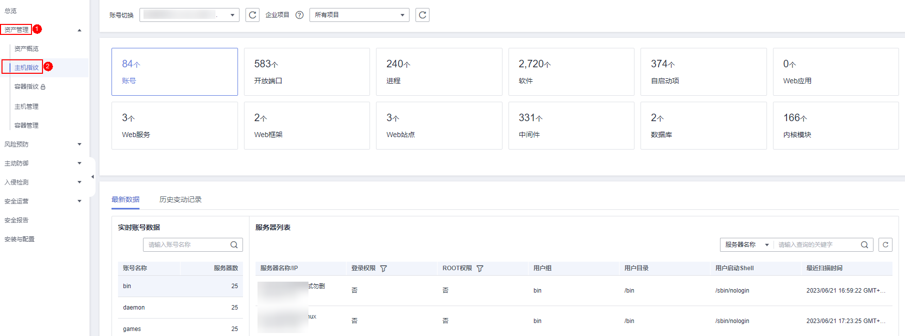

# 查看主机资产指纹

HSS提供主机资产指纹采集功能，支持采集主机中的端口、进程、Web应用、Web服务、Web框架和自启动项等资产信息。通过主机资产指纹功能，您能集中清点主机中的各项资产信息，及时发现主机中含有风险的各项资产。资产管理仅提供风险检测功能，若发现有可疑资产信息，请手动处理。

## 约束限制

需开启企业版、旗舰版、网页防篡改版或容器版中任一版本。

## 查看所有主机资产信息

1.  [登录管理控制台](https://console.huaweicloud.com/?locale=zh-cn)。
2.  在页面左上角选择“区域“，单击，选择“安全与合规 \> 主机安全服务”，进入主机安全平台界面。

    **图 1**  进入主机安全  
    

3.  选择“资产管理  \>  主机指纹“，进入“主机指纹“页面，查看所有主机资产。

    > **说明：** 
    >如果您的服务器已通过企业项目的模式进行管理，您可选择目标“企业项目“后查看或操作目标企业项目内的资产和检测信息。

    **图 2**  查看主机资产信息  
    

    **表 1**  主机资产指纹特性

    
    <table><thead align="left"><tr id="row1413312147458"><th class="cellrowborder" valign="top" width="13.18%" id="mcps1.2.5.1.1">
功能项

    </th>
    <th class="cellrowborder" valign="top" width="58.3%" id="mcps1.2.5.1.2">
功能描述

    </th>
    <th class="cellrowborder" valign="top" width="15.5%" id="mcps1.2.5.1.3">
支持的操作系统

    </th>
    <th class="cellrowborder" valign="top" width="13.020000000000001%" id="mcps1.2.5.1.4">
检测周期

    </th>
    </tr>
    </thead>
    <tbody><tr id="row1813318144450"><td class="cellrowborder" valign="top" width="13.18%" headers="mcps1.2.5.1.1 ">
账号

    </td>
    <td class="cellrowborder" valign="top" width="58.3%" headers="mcps1.2.5.1.2 ">
检测主机系统中的账号，列出当前系统的账号信息，帮助用户进行帐户安全性管理。

    
根据账号的实时信息和历史变动，您可以快速排查主机中的可疑账号。

    <ul id="ul4396333172113"><li>账号的实时信息包括账号的“账号名称”、“服务器数”以及具体账号对应的“服务器名称/IP”、“登录权限”、“ROOT权限”、“用户组”、“用户目录”、“用户启动Shell”和“最近扫描时间”。</li><li>账号的历史变动记录包括“服务器名称/IP”、“变动状态”、“登录权限”、“ROOT权限”、“用户组”、“用户目录”、“用户启动Shell”和“最近扫描时间”。</li></ul>
    </td>
    <td class="cellrowborder" valign="top" width="15.5%" headers="mcps1.2.5.1.3 ">
Linux、Windows

    </td>
    <td class="cellrowborder" valign="top" width="13.020000000000001%" headers="mcps1.2.5.1.4 ">
实时检测

    </td>
    </tr>
    <tr id="row20133101454517"><td class="cellrowborder" valign="top" width="13.18%" headers="mcps1.2.5.1.1 ">
开放端口

    </td>
    <td class="cellrowborder" valign="top" width="58.3%" headers="mcps1.2.5.1.2 ">
检测主机系统中的端口，列出当前系统开放的端口列表，帮助用户识别出其中的危险端口和未知端口。

    
根据“本地端口”、“协议类型”以及具体端口对应的“服务器名称/IP”、“状态”、“进程PID”、“程序文件”，您能够快速排查主机中含有风险的端口。

    <ul id="ul9550151815325"><li>手动关闭风险端口
如果检测到开放了危险端口或者开放了不必要的端口，需要排查这些端口是否是正常业务使用，如果不是正常业务端口，建议关闭端口。对于危险端口建议进一步检查程序文件，如果存在风险建议删除或者隔离源文件。

    
建议您及时优先处理危险程度为“危险”的端口，根据业务实际情况处理危险程度为“未知”的端口。

    </li><li>忽略风险：如果检测出的危险端口是业务正在使用的正常端口，您可以忽略该条告警。忽略之后将不再作为危险项进行记录，也不再发送告警。</li></ul>
    </td>
    <td class="cellrowborder" valign="top" width="15.5%" headers="mcps1.2.5.1.3 ">
Linux、Windows

    </td>
    <td class="cellrowborder" valign="top" width="13.020000000000001%" headers="mcps1.2.5.1.4 ">
实时检测

    </td>
    </tr>
    <tr id="row15133161416457"><td class="cellrowborder" valign="top" width="13.18%" headers="mcps1.2.5.1.1 ">
进程

    </td>
    <td class="cellrowborder" valign="top" width="58.3%" headers="mcps1.2.5.1.2 ">
检测主机系统中运行的进程，对运行中的进程进行收集及呈现，便于自主清点合法进程发现异常进程。

    
根据主机中“进程路径”以及具体进程对应的“服务器名称/IP”、“启动参数”、“启动时间”、“运行用户”、“文件权限”、“进程PID”以及“文件HASH”，您能够快速排查主机中的异常进程。

    
进程信息管理检测的机制是30天检测不到进程后，自动清除进程信息管理列表中的进程信息。

    </td>
    <td class="cellrowborder" valign="top" width="15.5%" headers="mcps1.2.5.1.3 ">
Linux、Windows

    </td>
    <td class="cellrowborder" valign="top" width="13.020000000000001%" headers="mcps1.2.5.1.4 ">
实时检测

    </td>
    </tr>
    <tr id="row1913316148456"><td class="cellrowborder" valign="top" width="13.18%" headers="mcps1.2.5.1.1 ">
软件

    </td>
    <td class="cellrowborder" valign="top" width="58.3%" headers="mcps1.2.5.1.2 ">
检测并列出当前系统安装的软件信息，帮助用户清点软件资产，识别不安全的软件版本。

    
根据软件的实时信息和历史变动，您能够快速排查主机中含有风险的软件。

    <ul id="ul79732312491"><li>软件的实时信息包括“软件名称”、“服务器数”以及具体软件对应的安装该软件的“服务器名称/IP”和“版本”、“软件更新时间”和“最近扫描时间”。</li><li>软件的历史变动记录包括软件的“服务器名称/IP”、“变动状态”、“版本”、“软件更新时间”和“最近扫描时间”。</li></ul>
    </td>
    <td class="cellrowborder" valign="top" width="15.5%" headers="mcps1.2.5.1.3 ">
Linux、Windows

    </td>
    <td class="cellrowborder" valign="top" width="13.020000000000001%" headers="mcps1.2.5.1.4 ">
每日自动检测

    </td>
    </tr>
    <tr id="row6408131345612"><td class="cellrowborder" valign="top" width="13.18%" headers="mcps1.2.5.1.1 ">
自启动项

    </td>
    <td class="cellrowborder" valign="top" width="58.3%" headers="mcps1.2.5.1.2 ">
检测并列出当前所有主机系统中的自启动项，帮助用户及时发现异常自启动项，快速定位木马程序的问题。

    <ul id="ul1913173662319"><li>自启动项的实时信息包括“名称”、“类型”（自启动服务、开机启动文件夹、预加载动态库、Run注册表键或者定时任务）、“服务器数”以及类型对应的“服务器名称/IP”、“路径”、“文件HASH”、“运行用户”、以及“最近扫描时间”。</li><li>自启动项的历史变动记录包括“服务器名称/IP”、“变动状态”、“路径”、“文件HASH”、“运行用户”和“最近扫描时间”。</li></ul>
    </td>
    <td class="cellrowborder" valign="top" width="15.5%" headers="mcps1.2.5.1.3 ">
Linux、Windows

    </td>
    <td class="cellrowborder" valign="top" width="13.020000000000001%" headers="mcps1.2.5.1.4 ">
实时检测

    </td>
    </tr>
    <tr id="row9626133513430"><td class="cellrowborder" valign="top" width="13.18%" headers="mcps1.2.5.1.1 ">
Web站点

    </td>
    <td class="cellrowborder" valign="top" width="58.3%" headers="mcps1.2.5.1.2 ">
统计、展示存放Web内容的目录及对外提供访问的站点信息，您可以查看所有目录及权限、以及和站点所关联访问路径、对外端口、证书信息（后续提供）、关键进程等信息。

    </td>
    <td class="cellrowborder" valign="top" width="15.5%" headers="mcps1.2.5.1.3 ">
Linux

    </td>
    <td class="cellrowborder" valign="top" width="13.020000000000001%" headers="mcps1.2.5.1.4 ">
1次/周（每周一凌晨06：00）

    </td>
    </tr>
    <tr id="row5692448144313"><td class="cellrowborder" valign="top" width="13.18%" headers="mcps1.2.5.1.1 ">
Web框架

    </td>
    <td class="cellrowborder" valign="top" width="58.3%" headers="mcps1.2.5.1.2 ">
统计、展示Web内容对外呈现时所使用框架的详细信息，您可查看所有框架的版本、路径、关联进程等信息。

    </td>
    <td class="cellrowborder" valign="top" width="15.5%" headers="mcps1.2.5.1.3 ">
Linux

    </td>
    <td class="cellrowborder" valign="top" width="13.020000000000001%" headers="mcps1.2.5.1.4 ">
1次/周（每周一凌晨06：00）

    </td>
    </tr>
    <tr id="row1183544384312"><td class="cellrowborder" valign="top" width="13.18%" headers="mcps1.2.5.1.1 ">
中间件

    </td>
    <td class="cellrowborder" valign="top" width="58.3%" headers="mcps1.2.5.1.2 ">
统计、展示所使用到的所有软件信息，您可查看所有中间件所关联的服务器、版本号、路径、关联进程等信息。

    </td>
    <td class="cellrowborder" valign="top" width="15.5%" headers="mcps1.2.5.1.3 ">
Linux、Windows

    </td>
    <td class="cellrowborder" valign="top" width="13.020000000000001%" headers="mcps1.2.5.1.4 ">
1次/周（每周一凌晨06：00）

    </td>
    </tr>
    <tr id="row77154064317"><td class="cellrowborder" valign="top" width="13.18%" headers="mcps1.2.5.1.1 ">
内核模块

    </td>
    <td class="cellrowborder" valign="top" width="58.3%" headers="mcps1.2.5.1.2 ">
统计、展示运行在内核层的全量程序模块文件，您可查看所有模块所关联的服务器、版本号、模块描述、驱动文件路径、文件权限、文件哈希等信息。

    </td>
    <td class="cellrowborder" valign="top" width="15.5%" headers="mcps1.2.5.1.3 ">
Linux

    </td>
    <td class="cellrowborder" valign="top" width="13.020000000000001%" headers="mcps1.2.5.1.4 ">
1次/周（每周一凌晨06：00）

    </td>
    </tr>
    <tr id="row8863174243412"><td class="cellrowborder" valign="top" width="13.18%" headers="mcps1.2.5.1.1 ">
Web服务

    </td>
    <td class="cellrowborder" valign="top" width="58.3%" headers="mcps1.2.5.1.2 ">
统计、展示对外提供web内容访问的软件详细信息，您可查看所有软件的版本、路径、配置文件、关联进程等信息。

    </td>
    <td class="cellrowborder" valign="top" width="15.5%" headers="mcps1.2.5.1.3 ">
Linux

    </td>
    <td class="cellrowborder" valign="top" width="13.020000000000001%" headers="mcps1.2.5.1.4 ">
1次/周（每周一凌晨06：00）

    </td>
    </tr>
    <tr id="row1076748113414"><td class="cellrowborder" valign="top" width="13.18%" headers="mcps1.2.5.1.1 ">
Web应用

    </td>
    <td class="cellrowborder" valign="top" width="58.3%" headers="mcps1.2.5.1.2 ">
Web应用主要统计、展示推送发布web内容的软件详细信息，您可以查看所有软件的版本、路径、配置文件、关键进程等信息。

    </td>
    <td class="cellrowborder" valign="top" width="15.5%" headers="mcps1.2.5.1.3 ">
Linux、Windows（仅支持Tomcat）

    </td>
    <td class="cellrowborder" valign="top" width="13.020000000000001%" headers="mcps1.2.5.1.4 ">
1次/周（每周一凌晨06：00）

    </td>
    </tr>
    <tr id="row27861456143514"><td class="cellrowborder" valign="top" width="13.18%" headers="mcps1.2.5.1.1 ">
数据库

    </td>
    <td class="cellrowborder" valign="top" width="58.3%" headers="mcps1.2.5.1.2 ">
统计、展示提供数据存储的软件详细信息，您可以查看所有软件的版本、路径、配置文件、关键进程等信息；

    </td>
    <td class="cellrowborder" valign="top" width="15.5%" headers="mcps1.2.5.1.3 ">
Linux、Windows（仅支持mysql）

    </td>
    <td class="cellrowborder" valign="top" width="13.020000000000001%" headers="mcps1.2.5.1.4 ">
1次/周（每周一凌晨06：00）

    </td>
    </tr>
    </tbody>
    </table>

## 查看单服务器的主机资产信息

1.  [登录管理控制台](https://console.huaweicloud.com/?locale=zh-cn)。
2.  在页面左上角选择“区域“，单击，选择“安全与合规 \> 主机安全服务”，进入主机安全平台界面。

    **图 3**  进入主机安全  
    

3.  在左侧导航栏，选择“资产管理  \>  主机管理“，进入“主机管理“界面，选择“云服务器“页签，进入云服务器页面。

    > **说明：** 
    >如果您的服务器已通过企业项目的模式进行管理，您可选择目标“企业项目“后查看或操作目标企业项目内的资产和检测信息。

4.  单击目标服务器名称 ，进入目标服务器的详情页面，选择“资产指纹  \>  主机资产“页签。
5.  单击指纹列表的目标指纹类型，查看对应资产信息，资产指纹类型特性如[表 主机资产指纹特性](#table7132214184518)所示。

