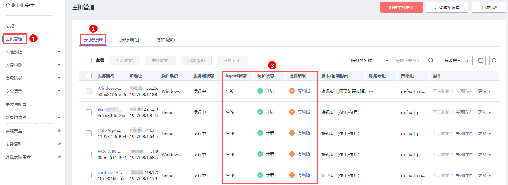
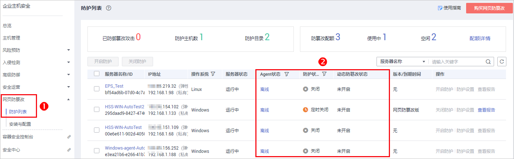

# 查看主机防护列表

主机管理的云服务器列表中仅显示以下主机的防护状态：

-   在所选区域购买的华为云主机
-   已接入所选区域的非华为云主机

> **说明：** 
>-   若未找到您的主机，请切换到正确的区域后再进行查找。
>-   如果您已开通企业项目，您可以在“企业项目“下拉列表中，选择您所在的企业项目，查看您所在企业项目的主机。

## 查看基础版/企业版/旗舰版防护列表

1.  [登录管理控制台](https://console.huaweicloud.com)。
2.  在页面左上角选择“区域“，单击，选择“安全与合规  \>  企业主机安全“，进入企业主机安全页面。

    **图 1**  企业主机安全  
    

3.  在“云服务器“界面，查看服务器的防护状态。

    **图 2**  云服务器列表  
    

    > **说明：** 
    >-   可以通过输入“服务器名称“、“公网IP地址“或者“私有IP地址“的方式，搜索符合条件的主机。
    >-   可以单击“高级搜索“，输入“服务器名称“、“服务器ID“、“IP地址“，选择“操作系统“、“Agent状态“、“防护状态“、“检查结果“、“策略组“、“服务器组“、“版本选择“、“服务器状态“、“防护计费模式“或者“服务器计费模式“搜索符合条件的主机。
    >-   可以单击，导出主机列表。

    **表 1**  状态说明

    
    <table><thead align="left"><tr id="row189411151111512"><th class="cellrowborder" valign="top" width="15.18%" id="mcps1.2.3.1.1">
参数

    </th>
    <th class="cellrowborder" valign="top" width="84.82%" id="mcps1.2.3.1.2">
说明

    </th>
    </tr>
    </thead>
    <tbody><tr id="row39429519157"><td class="cellrowborder" valign="top" width="15.18%" headers="mcps1.2.3.1.1 ">
Agent状态

    </td>
    <td class="cellrowborder" valign="top" width="84.82%" headers="mcps1.2.3.1.2 "><ul id="ul17942125131510"><li>未安装：未安装Agent，或Agent已安装但未成功启动。
单击“安装Agent”，您可以根据弹出框给出的安装提示，进行Agent的安装，详细操作请参见<a href="https://support.huaweicloud.com/usermanual-hss/hss_01_0234.html" target="_blank" rel="noopener noreferrer">安装Agent</a>。

    </li><li>在线：Agent运行正常。</li><li>离线：Agent与HSS服务器通信异常，HSS无法提供安全防护功能。
单击“离线”，您可以查看Agent不在线的华为云主机列表，并查看“离线原因”。

    </li></ul>
    </td>
    </tr>
    <tr id="row994320516156"><td class="cellrowborder" valign="top" width="15.18%" headers="mcps1.2.3.1.1 ">
防护状态

    </td>
    <td class="cellrowborder" valign="top" width="84.82%" headers="mcps1.2.3.1.2 "><ul id="ul1394310517157"><li>开启：HSS为该服务器提供全面的主机安全防护。</li><li>关闭：单击“关闭防护”可以暂停HSS对服务器的防护，降低该服务器的资源消耗。</li></ul>
    </td>
    </tr>
    <tr id="row1394315519156"><td class="cellrowborder" valign="top" width="15.18%" headers="mcps1.2.3.1.1 ">
检测结果

    </td>
    <td class="cellrowborder" valign="top" width="84.82%" headers="mcps1.2.3.1.2 "><ul id="ul1594375131513"><li>有风险：主机存在风险。</li><li>无风险：主机暂未发现风险。</li><li>未检测：主机未开启防护。</li></ul>
    </td>
    </tr>
    </tbody>
    </table>

## 查看网页防篡改防护列表

1.  [登录管理控制台](https://console.huaweicloud.com)。
2.  在页面左上角选择“区域“，单击，选择“安全与合规  \>  企业主机安全“，进入企业主机安全页面。

    **图 3**  企业主机安全  
    

3.  在“网页防篡改 \> 防护列表“界面，查看服务器的防护状态。

    **图 4**  服务器列表  
    

    **表 2**  状态说明

    
    <table><thead align="left"><tr id="row043442613375"><th class="cellrowborder" valign="top" width="24.68%" id="mcps1.2.3.1.1">
参数名称

    </th>
    <th class="cellrowborder" valign="top" width="75.32%" id="mcps1.2.3.1.2">
说明

    </th>
    </tr>
    </thead>
    <tbody><tr id="row5435162612379"><td class="cellrowborder" valign="top" width="24.68%" headers="mcps1.2.3.1.1 ">
Agent状态

    </td>
    <td class="cellrowborder" valign="top" width="75.32%" headers="mcps1.2.3.1.2 "><ul id="ul10435202619377"><li>未安装：未安装Agent，或Agent已安装但未成功启动。
单击“未安装”，您可以根据弹出框给出的安装提示，进行Agent的安装，详细操作请参见<a href="https://support.huaweicloud.com/usermanual-hss/hss_01_0234.html" target="_blank" rel="noopener noreferrer">安装Agent</a>。

    </li><li>在线：Agent运行正常。</li><li>离线：Agent与HSS服务器通信异常，HSS无法提供安全防护功能。
单击“离线”，您可以查看Agent不在线的华为云主机列表，并在该页面查看“离线原因”。

    </li></ul>
    </td>
    </tr>
    <tr id="row2044014265377"><td class="cellrowborder" valign="top" width="24.68%" headers="mcps1.2.3.1.1 ">
防护状态

    </td>
    <td class="cellrowborder" valign="top" width="75.32%" headers="mcps1.2.3.1.2 ">
静态网页防篡改的状态。<ul id="ul344019264371"><li>开启：HSS为该服务器提供静态网页防篡改防护。</li><li>定时关闭：在“防护设置 &gt; 定时开关设置”可自定义防护时间段，详细操作请参见<a href="定时开启网页防篡改.md">定时开关设置</a>。</li><li>关闭：单击“关闭防护”可以暂停静态网页防篡改防护，降低该服务器的资源消耗。</li></ul>
    

    </td>
    </tr>
    <tr id="row17441126103717"><td class="cellrowborder" valign="top" width="24.68%" headers="mcps1.2.3.1.1 ">
动态防篡改状态

    </td>
    <td class="cellrowborder" valign="top" width="75.32%" headers="mcps1.2.3.1.2 ">
动态网页防篡改的状态。<ul id="ul12441172619373"><li>已开启：在“防护设置 &gt; 动态网页防篡改”可开启动态网页防篡改，详细操作请参见<a href="开启动态网页防篡改.md">开启动态网页防篡改</a>。</li><li>已开启未生效：动态网页防篡改开启后，请重启Tomcat使其生效。</li><li>未开启：未开启动态网页防篡改。</li></ul>
    

    </td>
    </tr>
    </tbody>
    </table>

## 相关链接

-   [开启基础版/企业版/旗舰版防护](基础版-企业版-旗舰版-0.md)
-   [开启网页防篡改版防护](网页防篡改版-1.md)

