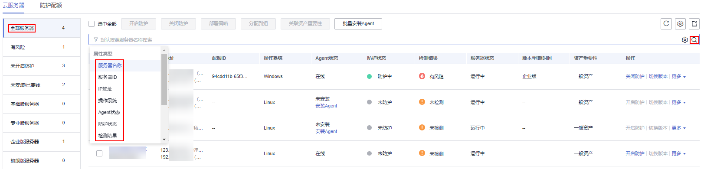

# 查看主机防护状态

主机管理的云服务器列表中仅显示以下主机的防护状态：

-   在所选区域购买的华为云主机
-   已接入所选区域的非华为云主机

> **说明：** 
>-   若未找到您的主机，请切换到正确的区域后再进行查找。
>-   如果您已开通企业项目，您可以在“企业项目“下拉列表中，选择您所在的企业项目，查看您所在企业项目的主机。

## 查看主机防护状态

1.  [登录管理控制台](https://console.huaweicloud.com/?locale=zh-cn)。
2.  在页面左上角选择“区域“，单击，选择“安全与合规 \> 主机安全服务”，进入主机安全平台界面。

    **图 1**  进入主机安全  
    

3.  在左侧导航树，选择“资产管理  \>  主机管理“，在“云服务器“界面，查看服务器的防护状态，状态说明如[表 防护状态说明](#table10943651111514)所示。

    > **说明：** 
    >如果您的服务器已通过企业项目的模式进行管理，您可选择目标“企业项目“后查看或操作目标企业项目内的资产和检测信息。

    您也可以在“云服务器“界面，查看服务器名称、ID、IP地址、操作系统、运行状态以及所属企业项目等信息。服务器防护列表展示项，可通过单击列表右上角设置。

    -   在服务器防护列表上方，输入服务器名称、服务器ID或IP地址等，并单击搜索，可搜索查看目标服务器防护状态。

        **图 2**  搜索防护服务器  
        

    -   在服务器防护列表左侧通过选择服务器防护版本、资产重要性分类，可查看各类别服务器防护状态。

    **表 1**  防护状态说明

    
    <table><thead align="left"><tr id="row189411151111512"><th class="cellrowborder" valign="top" width="15.18%" id="mcps1.2.3.1.1">
参数

    </th>
    <th class="cellrowborder" valign="top" width="84.82%" id="mcps1.2.3.1.2">
说明

    </th>
    </tr>
    </thead>
    <tbody><tr id="row39429519157"><td class="cellrowborder" valign="top" width="15.18%" headers="mcps1.2.3.1.1 ">
Agent状态

    </td>
    <td class="cellrowborder" valign="top" width="84.82%" headers="mcps1.2.3.1.2 "><ul id="ul17942125131510"><li>未安装：未安装Agent，或Agent已安装但未成功启动。
单击“安装Agent”，您可以根据弹出框给出的安装提示，进行Agent的安装，详细操作请参见<a href="https://support.huaweicloud.com/usermanual-hss2.0/hss_01_0234.html" target="_blank" rel="noopener noreferrer">安装Agent</a>。

    </li><li>在线：Agent运行正常。</li><li>离线：Agent与HSS服务器通信异常，HSS无法提供安全防护功能。</li></ul>
    </td>
    </tr>
    <tr id="row994320516156"><td class="cellrowborder" valign="top" width="15.18%" headers="mcps1.2.3.1.1 ">
防护状态

    </td>
    <td class="cellrowborder" valign="top" width="84.82%" headers="mcps1.2.3.1.2 "><ul id="ul1394310517157"><li>防护中：HSS为该服务器提供全面的主机安全防护。</li><li>未防护：目标完全未开启主机安全防护。单击“操作”列“开启防护”可以开启HSS对服务器的防护，提升服务器的安全性。</li><li>防护中断：主机关机、Agent通信异常或Agent被卸载导致主机防护中断。</li></ul>
    </td>
    </tr>
    <tr id="row1394315519156"><td class="cellrowborder" valign="top" width="15.18%" headers="mcps1.2.3.1.1 ">
检测结果

    </td>
    <td class="cellrowborder" valign="top" width="84.82%" headers="mcps1.2.3.1.2 "><ul id="ul1594375131513"><li>有风险：主机存在风险。</li><li>无风险：主机暂未发现风险。</li><li>未检测：主机未开启防护。</li></ul>
    </td>
    </tr>
    </tbody>
    </table>

## 查看网页防篡改防护状态

1.  登录管理控制台，进入主机安全服务页面。
2.  在“主动防御  \>  网页防篡改  \>  防护配置“界面，查看服务器的防护状态。

    > **说明：** 
    >如果您的服务器已通过企业项目的模式进行管理，您可选择目标“企业项目“后查看或操作目标企业项目内的资产和检测信息。

    防护列表上方，输入服务器名称、服务器ID或IP地址等，并单击搜索，可搜索查看目标服务器防护状态。

    **图 3**  防篡改服务器列表  
    

    **表 2**  状态说明

    
    <table><thead align="left"><tr id="row043442613375"><th class="cellrowborder" valign="top" width="22.91%" id="mcps1.2.3.1.1">
参数名称

    </th>
    <th class="cellrowborder" valign="top" width="77.09%" id="mcps1.2.3.1.2">
说明

    </th>
    </tr>
    </thead>
    <tbody><tr id="row5435162612379"><td class="cellrowborder" valign="top" width="22.91%" headers="mcps1.2.3.1.1 ">
防护状态

    </td>
    <td class="cellrowborder" valign="top" width="77.09%" headers="mcps1.2.3.1.2 ">
防护中：HSS为该服务器提供静态网页防篡改防护。

    </td>
    </tr>
    <tr id="row17441126103717"><td class="cellrowborder" valign="top" width="22.91%" headers="mcps1.2.3.1.1 ">
动态防篡改状态

    </td>
    <td class="cellrowborder" valign="top" width="77.09%" headers="mcps1.2.3.1.2 ">
动态网页防篡改的状态。<ul id="ul12441172619373"><li>：已开启动态网页防篡改。</li><li>：未开启动态网页防篡改。开启动态网页防篡改功能，要重启Tomcat才能生效。</li></ul>
    

    </td>
    </tr>
    <tr id="row1934365013146"><td class="cellrowborder" valign="top" width="22.91%" headers="mcps1.2.3.1.1 ">
静态防篡改攻击

    </td>
    <td class="cellrowborder" valign="top" width="77.09%" headers="mcps1.2.3.1.2 ">
检测静态网页文件被攻击、被篡改的行为次数。

    </td>
    </tr>
    <tr id="row7504154771419"><td class="cellrowborder" valign="top" width="22.91%" headers="mcps1.2.3.1.1 ">
动态防篡改攻击

    </td>
    <td class="cellrowborder" valign="top" width="77.09%" headers="mcps1.2.3.1.2 ">
检测web应用的漏洞利用、注入攻击等行为次数。

    </td>
    </tr>
    </tbody>
    </table>

## 主机列表导出

1.  登录管理控制台，进入主机安全服务页面。
2.  选择“资产管理  \>  主机管理“，选择“云服务器“界面。

    > **说明：** 
    >如果您的服务器已通过企业项目的模式进行管理，您可选择目标“企业项目“后查看或操作目标企业项目内的资产和检测信息。

3.  在云服务器列表右上角单击，导出云服务器列表详情。

    > **说明：** 
    >当前云服务器详情导出单次最大支持1000台服务器。

