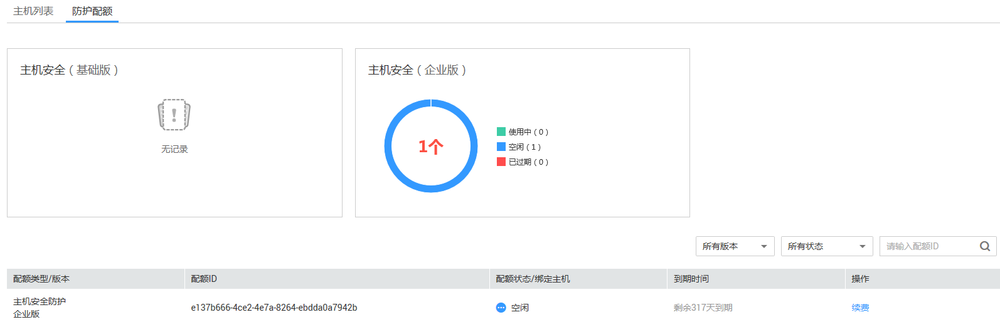

# 查看主机防护配额

该任务指导用户查看主机防护配额信息。

## 前提条件

已获取管理控制台的登录账号与密码。

## 操作步骤

1.  登录管理控制台。
2.  在页面上方，单击“服务列表“，选择“安全  \>  企业主机安全“。
3.  在左侧导航树中，选择“防护列表“，进入“防护列表“界面。
4.  在“防护列表“界面，选择“防护配额“页签，进入防护配额列表页面。
5.  查看主机的防护配额信息，如[图1](#fig918125915391)所示。

    **图 1**  查看主机防护配额  
    

    > **说明：**   
    >用户可以在需要续费的版本所在行的操作列，单击“续费“，为购买的企业主机安全续费。  

