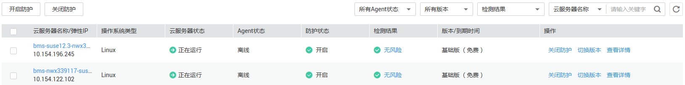

# 查看云服务器列表

该任务指导用户查看防护列表。

## 前提条件

已获取管理控制台的登录账号与密码。

## 查看使用指引

1.  登录管理控制台。
2.  在页面上方，单击“服务列表“，选择“安全  \>  企业主机安全“。
3.  在左侧导航树中，选择“防护列表“，进入“防护列表“界面。
4.  查看使用指引，如[图1](#fig209619176411)所示。

    **图 1**  使用指引  
    

    1.  购买主机安全，完成支付操作。

        单击“购买主机安全“，购买企业主机安全。具体操作请参见《企业主机安全购买指南》。

    2.  告警通知设置，风险及时通知指定的用户。安装Agent，开启防护。

        单击“告警通知设置“，设置告警通知，具体请参见[设置告警通知](设置告警通知.md)。

        单击“安装Agent“，进入“安装Agent“界面安装Agent。安装Agent后，需要进入“防护列表“界面开启防护，具体请参见[开启主机防护](开启主机防护.md)。

    3.  安全配置，设置常用登录地、白名单IP、自定义弱口令（可选）及网站后门设置。

        单击“安全配置“，进入“安全配置“界面，具体请参见[（可选）安全配置](（可选）安全配置.md)。

    4.  完成配置，请关注短信或邮件告警通知，通过控制台查看告警详情。

        通过控制台左侧菜单栏的“资产管理“、“漏洞管理“、“入侵检测“和“基线检查“查看检测结果，具体请参见[查看开放端口检测结果](资产管理.md#section124443445581)\~[查看配置检测结果](基线检查.md#section182541347165711)。

        也可以通过防护列表的检测结果查看详情，具体请参见[查看单台弹性云服务器的检测结果](查看单台弹性云服务器的检测结果.md)。

## 查看防护列表

1.  登录管理控制台。
2.  在页面上方，单击“服务列表“，选择“安全  \>  企业主机安全“。
3.  在左侧导航树中，选择“防护列表“，进入“防护列表“界面。
4.  在“防护列表“界面，选择“主机列表“页签，进入云服务列表页面。
5.  查看防护列表，如[图2](#fig2092035017396)所示，各参数说明如[表1](#table13936165011391)所示。

    > **说明：**   
    >-   用户可在列表右上角单击，手动刷新当前列表。  
    >-   用户可以通过筛选“所有Agent状态“、“所有版本“和“所有检测结果“下拉列表，或者在列表右上角的搜索框中输入“云服务器名称“或“弹性IP“的关键字，单击，查询指定弹性云服务器。  

    **图 2**  防护列表  
    

    **表 1**  参数说明

    
    <table><thead align="left"><tr id="row3920205053911"><th class="cellrowborder" valign="top" width="24.46%" id="mcps1.2.3.1.1">
参数名称

    </th>
    <th class="cellrowborder" valign="top" width="75.53999999999999%" id="mcps1.2.3.1.2">
说明

    </th>
    </tr>
    </thead>
    <tbody><tr id="row1628444717181"><td class="cellrowborder" valign="top" width="24.46%" headers="mcps1.2.3.1.1 ">
云服务器名称/弹性IP

    </td>
    <td class="cellrowborder" valign="top" width="75.53999999999999%" headers="mcps1.2.3.1.2 ">
弹性云服务器的名称和绑定的弹性IP。

    
 说明： 

单击名称可跳转至弹性云服务器管理控制台。

    

    </td>
    </tr>
    <tr id="row129205507392"><td class="cellrowborder" valign="top" width="24.46%" headers="mcps1.2.3.1.1 ">
操作系统类型

    </td>
    <td class="cellrowborder" valign="top" width="75.53999999999999%" headers="mcps1.2.3.1.2 "><ul id="ul1600171981219"><li>Linux系统</li><li>Windows系统</li></ul>
    </td>
    </tr>
    <tr id="row3936150193919"><td class="cellrowborder" valign="top" width="24.46%" headers="mcps1.2.3.1.1 ">
云服务器状态

    </td>
    <td class="cellrowborder" valign="top" width="75.53999999999999%" headers="mcps1.2.3.1.2 ">
弹性云服务器当前的运行状态。<ul id="ul1936175015397"><li>正在运行</li><li>创建中</li><li>故障</li><li>关机</li></ul>
    

    </td>
    </tr>
    <tr id="row5936155033920"><td class="cellrowborder" valign="top" width="24.46%" headers="mcps1.2.3.1.1 ">
Agent状态

    </td>
    <td class="cellrowborder" valign="top" width="75.53999999999999%" headers="mcps1.2.3.1.2 ">
Agent运行状态。

    <ul id="ul893665020391"><li>未注册：未安装客户端，或客户端已安装但未成功启动。
 说明： 

单击“去安装”后，可以跳转到“安装Agent”页面，参照操作说明安装客户端。

    

    </li><li>在线：客户端运行正常。</li><li>离线：客户端与服务器通信异常。
 说明： 

单击“如何处理”后，可以跳转到“客户端状态异常应该怎么处理”页面，参照操作说明进行处理。

    

    </li></ul>
    </td>
    </tr>
    <tr id="row15936205014392"><td class="cellrowborder" valign="top" width="24.46%" headers="mcps1.2.3.1.1 ">
防护状态

    </td>
    <td class="cellrowborder" valign="top" width="75.53999999999999%" headers="mcps1.2.3.1.2 ">
主机防护的状态。<ul id="ul18936750183916"><li>开启</li><li>关闭</li></ul>
    

    </td>
    </tr>
    <tr id="row0936195019393"><td class="cellrowborder" valign="top" width="24.46%" headers="mcps1.2.3.1.1 ">
检测结果

    </td>
    <td class="cellrowborder" valign="top" width="75.53999999999999%" headers="mcps1.2.3.1.2 ">
检测结果。

    <ul id="ul69361650193917"><li>有风险：单击其链接可以查看检测结果详情。</li></ul>
    <ul id="ul1293695093910"><li>无风险</li><li>未检测</li></ul>
    </td>
    </tr>
    <tr id="row135371269303"><td class="cellrowborder" valign="top" width="24.46%" headers="mcps1.2.3.1.1 ">
版本/到期时间

    </td>
    <td class="cellrowborder" valign="top" width="75.53999999999999%" headers="mcps1.2.3.1.2 ">
弹性云服务器和服务到期时间。

    <ul id="ul36781937173118"><li>弹性云服务器开启的主机防护的版本。<ul id="ul8683193723117"><li>企业版：账号信息管理、开放端口检测、进程信息管理、Web目录管理、软件信息管理、软件漏洞管理、账户破解防护、异地登录检测、关键文件变更检测、恶意程序检测、网站后门检测、口令复杂度策略与经典弱口令检测、配置检测、双因子认证。</li><li>基础版（免费）：支持的功能有账户破解防护、异地登录检测、 口令复杂度策略检测、 经典弱口令检测和双因子认证。</li></ul>
    </li><li>无：未开启主机防护功能。</li></ul>
    </td>
    </tr>
    <tr id="row13541112331518"><td class="cellrowborder" valign="top" width="24.46%" headers="mcps1.2.3.1.1 ">
操作

    </td>
    <td class="cellrowborder" valign="top" width="75.53999999999999%" headers="mcps1.2.3.1.2 "><ul id="ul5454125342411"><li>开启防护：单击“开启防护”开启单台服务器的防护，也可以单击列表左上角的“开启防护”来批量开启防护。</li><li>关闭防护：单击“关闭防护”可关闭单台服务器的防护，也可以单击列表左上角的“关闭防护”来批量关闭防护。</li><li>切换版本：单击“切换版本”进行企业版和基础版的切换。</li><li>查看详情：单击“查看详情”，可以查看详细的检测结果。</li></ul>
    </td>
    </tr>
    </tbody>
    </table>

