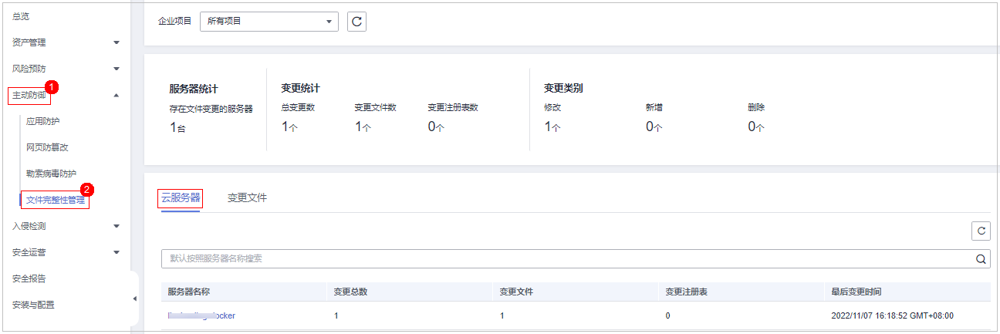

# 查看云服务器变更详情

## 约束限制

旗舰版及以上版本支持文件完整性相关操作。

## 操作步骤

1.  [登录管理控制台](https://console.huaweicloud.com/?locale=zh-cn)。
2.  在页面左上角选择“区域“，单击，选择“安全与合规 \> 主机安全服务”，进入主机安全平台界面。

    **图 1**  进入主机安全  
    

3.  左侧选择“主动防御  \>  文件完整性管理  \>  云服务器“，进入服务器页面。

    **图 2**  进入云服务器  
    

4.  单击服务器名称进入服务器变更详情页。

    **表 1**  变更参数说明

    
    <table><thead align="left"><tr id="row17800185182410"><th class="cellrowborder" valign="top" width="16.811681168116813%" id="mcps1.2.4.1.1">
参数名称

    </th>
    <th class="cellrowborder" valign="top" width="49.85498549854985%" id="mcps1.2.4.1.2">
参数说明

    </th>
    <th class="cellrowborder" valign="top" width="33.33333333333333%" id="mcps1.2.4.1.3">
取值样例

    </th>
    </tr>
    </thead>
    <tbody><tr id="row1980020517240"><td class="cellrowborder" valign="top" width="16.811681168116813%" headers="mcps1.2.4.1.1 ">
文件

    </td>
    <td class="cellrowborder" valign="top" width="49.85498549854985%" headers="mcps1.2.4.1.2 ">
发现变更的文件名称。

    </td>
    <td class="cellrowborder" valign="top" width="33.33333333333333%" headers="mcps1.2.4.1.3 ">
du

    </td>
    </tr>
    <tr id="row780018592411"><td class="cellrowborder" valign="top" width="16.811681168116813%" headers="mcps1.2.4.1.1 ">
路径

    </td>
    <td class="cellrowborder" valign="top" width="49.85498549854985%" headers="mcps1.2.4.1.2 ">
发现变更文件所在的路径。

    </td>
    <td class="cellrowborder" valign="top" width="33.33333333333333%" headers="mcps1.2.4.1.3 ">
-

    </td>
    </tr>
    <tr id="row128001518243"><td class="cellrowborder" valign="top" width="16.811681168116813%" headers="mcps1.2.4.1.1 ">
变更内容

    </td>
    <td class="cellrowborder" valign="top" width="49.85498549854985%" headers="mcps1.2.4.1.2 ">
变更的情况描述。

    
鼠标放置变更内容可查看详情。

    </td>
    <td class="cellrowborder" valign="top" width="33.33333333333333%" headers="mcps1.2.4.1.3 ">
将SHA2560ba0c4b5e48e55a6改为4f6079f5b37d1513

    </td>
    </tr>
    <tr id="row27981910142015"><td class="cellrowborder" valign="top" width="16.811681168116813%" headers="mcps1.2.4.1.1 ">
服务器名称

    </td>
    <td class="cellrowborder" valign="top" width="49.85498549854985%" headers="mcps1.2.4.1.2 ">
发现变更的服务器名称。

    </td>
    <td class="cellrowborder" valign="top" width="33.33333333333333%" headers="mcps1.2.4.1.3 ">
-

    </td>
    </tr>
    <tr id="row28007516245"><td class="cellrowborder" valign="top" width="16.811681168116813%" headers="mcps1.2.4.1.1 ">
变更类型

    </td>
    <td class="cellrowborder" valign="top" width="49.85498549854985%" headers="mcps1.2.4.1.2 ">
变更的文件类型。

    <ul id="ul1930717579576"><li>文件</li></ul>
    </td>
    <td class="cellrowborder" valign="top" width="33.33333333333333%" headers="mcps1.2.4.1.3 ">
文件

    </td>
    </tr>
    <tr id="row3800105172417"><td class="cellrowborder" valign="top" width="16.811681168116813%" headers="mcps1.2.4.1.1 ">
变更类别

    </td>
    <td class="cellrowborder" valign="top" width="49.85498549854985%" headers="mcps1.2.4.1.2 ">
变更文件的类别。

    <ul id="ul59241153298"><li>新增</li><li>修改</li><li>删除</li></ul>
    </td>
    <td class="cellrowborder" valign="top" width="33.33333333333333%" headers="mcps1.2.4.1.3 ">
修改

    </td>
    </tr>
    <tr id="row1780175192414"><td class="cellrowborder" valign="top" width="16.811681168116813%" headers="mcps1.2.4.1.1 ">
变更时间

    </td>
    <td class="cellrowborder" valign="top" width="49.85498549854985%" headers="mcps1.2.4.1.2 ">
目标文件发生变更的时间。

    </td>
    <td class="cellrowborder" valign="top" width="33.33333333333333%" headers="mcps1.2.4.1.3 ">
-

    </td>
    </tr>
    </tbody>
    </table>

