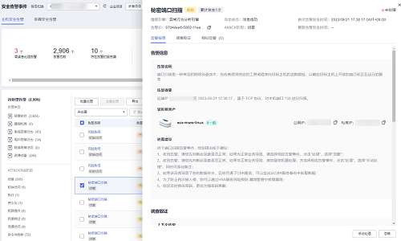

# 查看入侵告警事件

主机安全服务可对您已开启的告警防御能力提供总览数据，帮助您快速了解安全告警概况包括需紧急处理告警、告警总数、存在告警的服务器、已拦截IP和已隔离文件等。

您可自定义查询30天内发生的告警事件，您可以根据自己的业务需求，自行判断并处理告警，快速清除资产中的安全威胁。

告警事件处理完成后，告警事件将从“未处理“状态转化为“已处理“。

> **说明：** 
>AV检测和HIPS检测的告警分类会按照具体的告警情况在不同的告警类型中呈现。
>-   AV检测告警结果只在恶意软件下的不同类别呈现。
>-   HIPS检测的告警结果会根据实际种类在所有类型的子类别中呈现。

## 约束与限制

-   若不需要检测高危命令执行、提权操作、反弹Shell、异常Shell或者Webshell，您可以通过“策略管理“页面手动关闭指定策略的检测。关闭检测后，HSS不对策略组关联的服务器进行检测，详细信息请参见[查看和创建策略组](查看策略组.md)。
-   其他检测项不允许手动关闭检测。
-   未开启防护的服务器不支持告警事件相关操作。

## 操作步骤

1.  [登录管理控制台](https://console.huaweicloud.com/?locale=zh-cn)。
2.  在页面左上角选择“区域“，单击，选择“安全与合规 \> 主机安全服务”，进入主机安全平台界面。

    **图 1**  进入主机安全  
    

3.  在左侧导航栏中，单击“入侵检测  \>  安全告警事件  \>  主机安全告警“，进入“主机安全告警“页面。

    > **说明：** 
    >如果您的服务器已通过企业项目的模式进行管理，您可选择目标“企业项目“后查看或操作目标企业项目内的资产和检测信息。

    **表 1**  安全告警统计说明

    
    <table><thead align="left"><tr id="row75072811434"><th class="cellrowborder" valign="top" width="17.150000000000002%" id="mcps1.2.3.1.1">
参数名称

    </th>
    <th class="cellrowborder" valign="top" width="82.85%" id="mcps1.2.3.1.2">
告警事件状态说明

    </th>
    </tr>
    </thead>
    <tbody><tr id="row2050528194316"><td class="cellrowborder" valign="top" width="17.150000000000002%" headers="mcps1.2.3.1.1 ">
企业项目

    </td>
    <td class="cellrowborder" valign="top" width="82.85%" headers="mcps1.2.3.1.2 ">
自定义选择企业项目，按照企业项目的维度查看告警详情。

    </td>
    </tr>
    <tr id="row1650152810431"><td class="cellrowborder" valign="top" width="17.150000000000002%" headers="mcps1.2.3.1.1 ">
时间范围

    </td>
    <td class="cellrowborder" valign="top" width="82.85%" headers="mcps1.2.3.1.2 ">
支持选择固定周期，支持自定义查询告警的时间范围，自定义只能选择30天范围内的查询。

    
固定周期可选择如下：

    <ul id="ul950328154311"><li>最近24小时</li><li>最近3天</li><li>最近7天</li><li>最近30天</li></ul>
    </td>
    </tr>
    <tr id="row1394317172210"><td class="cellrowborder" valign="top" width="17.150000000000002%" headers="mcps1.2.3.1.1 ">
需紧急处理告警

    </td>
    <td class="cellrowborder" valign="top" width="82.85%" headers="mcps1.2.3.1.2 ">
展示需紧急处理告警的数量。

    </td>
    </tr>
    <tr id="row820367202319"><td class="cellrowborder" valign="top" width="17.150000000000002%" headers="mcps1.2.3.1.1 ">
告警总数

    </td>
    <td class="cellrowborder" valign="top" width="82.85%" headers="mcps1.2.3.1.2 ">
展示资产中存在的所有告警数量。

    </td>
    </tr>
    <tr id="row1051112810434"><td class="cellrowborder" valign="top" width="17.150000000000002%" headers="mcps1.2.3.1.1 ">
存在告警的服务器

    </td>
    <td class="cellrowborder" valign="top" width="82.85%" headers="mcps1.2.3.1.2 ">
展示存在告警的服务器数量。

    
当查看“最近24小时”存在告警情况时，您可以单击存在告警的服务器数值，跳转到“主机管理”界面查看相应的服务器列表。

    </td>
    </tr>
    <tr id="row0518283434"><td class="cellrowborder" valign="top" width="17.150000000000002%" headers="mcps1.2.3.1.1 ">
已处理告警事件

    </td>
    <td class="cellrowborder" valign="top" width="82.85%" headers="mcps1.2.3.1.2 ">
展示您资产中所有已处理的告警事件数量。

    </td>
    </tr>
    <tr id="row251628114310"><td class="cellrowborder" valign="top" width="17.150000000000002%" headers="mcps1.2.3.1.1 ">
已拦截IP

    </td>
    <td class="cellrowborder" valign="top" width="82.85%" headers="mcps1.2.3.1.2 ">
展示已拦截的IP。单击“已拦截IP”，可查看已拦截的IP地址列表。

    
已拦截IP列表展示“服务器名称”、“攻击源IP”、“登录类型”、“拦截状态”、“拦截次数”、“开始拦截时间”、“最近拦截时间”。

    
如果您发现有合法IP被误封禁（比如运维人员因为记错密码，多次输错密码导致被封禁），可以手工解除拦截。如果发现某个主机被频繁攻击，需要引起重视，建议及时修补漏洞，处理风险项。

    
 须知： 
<ul id="ul1052152816435"><li>解除被拦截的IP后，主机将不会再拦截该IP地址对主机执行的操作。</li><li>每种软件最多拦截10000个ip。
如果您的linux主机不支持ipset，mysql和vsftp最多拦截50个ip。

    
如果您的linux主机既不支持ipset不支持hosts.deny，ssh最多拦截50个ip。

    </li></ul>
    

    </td>
    </tr>
    <tr id="row75272894316"><td class="cellrowborder" valign="top" width="17.150000000000002%" headers="mcps1.2.3.1.1 ">
已隔离文件

    </td>
    <td class="cellrowborder" valign="top" width="82.85%" headers="mcps1.2.3.1.2 ">
主机安全可对检测到的威胁文件进行隔离处理，被成功隔离的文件会添加到“主机安全告警”的“文件隔离箱”中。

    
被成功隔离的文件一直保留在文件隔离箱中，您可以根据自己的需要进行一键恢复处理，关于文件隔离箱的详细信息，请参见<a href="管理文件隔离箱.md">管理文件隔离箱</a>。

    </td>
    </tr>
    </tbody>
    </table>

4.  查看资产中存在的告警。

    您可以在待处理告警栏，通过选择告警类型和ATT&CK攻击阶段，查看对应类型的告警事件列表。

    告警名称处也会展示ATT&CK攻击阶段标签，关于ATT&CK攻击阶段的含义请参见[表 ATT&CK攻击阶段说明](#table6516818161215)。

    > **说明：** 
    >ATT&CK的全称为Adversarial Tactics, Techniques, and Common Knowledge，它是一个站在攻击者的视角来描述攻击中各阶段用到的技术的模型。

    **表 2**  ATT&CK攻击阶段说明

    
    <table><thead align="left"><tr id="row1351661810122"><th class="cellrowborder" valign="top" width="25.019999999999996%" id="mcps1.2.3.1.1">
ATT&amp;CK攻击阶段

    </th>
    <th class="cellrowborder" valign="top" width="74.98%" id="mcps1.2.3.1.2">
说明

    </th>
    </tr>
    </thead>
    <tbody><tr id="row151621861216"><td class="cellrowborder" valign="top" width="25.019999999999996%" headers="mcps1.2.3.1.1 ">
侦查

    </td>
    <td class="cellrowborder" valign="top" width="74.98%" headers="mcps1.2.3.1.2 ">
攻击者尝试发现您的系统或网络中的漏洞。

    </td>
    </tr>
    <tr id="row3516161821213"><td class="cellrowborder" valign="top" width="25.019999999999996%" headers="mcps1.2.3.1.1 ">
初始访问

    </td>
    <td class="cellrowborder" valign="top" width="74.98%" headers="mcps1.2.3.1.2 ">
攻击者尝试进入您的系统或网络。

    </td>
    </tr>
    <tr id="row2516131891214"><td class="cellrowborder" valign="top" width="25.019999999999996%" headers="mcps1.2.3.1.1 ">
执行

    </td>
    <td class="cellrowborder" valign="top" width="74.98%" headers="mcps1.2.3.1.2 ">
攻击者尝试运行恶意代码。

    </td>
    </tr>
    <tr id="row1451641815122"><td class="cellrowborder" valign="top" width="25.019999999999996%" headers="mcps1.2.3.1.1 ">
持久化

    </td>
    <td class="cellrowborder" valign="top" width="74.98%" headers="mcps1.2.3.1.2 ">
攻击者尝试保持住他们入侵的进攻点。

    </td>
    </tr>
    <tr id="row444613417144"><td class="cellrowborder" valign="top" width="25.019999999999996%" headers="mcps1.2.3.1.1 ">
权限提升

    </td>
    <td class="cellrowborder" valign="top" width="74.98%" headers="mcps1.2.3.1.2 ">
攻击者尝试获取更高等级的权限。

    </td>
    </tr>
    <tr id="row178754161413"><td class="cellrowborder" valign="top" width="25.019999999999996%" headers="mcps1.2.3.1.1 ">
防御绕过

    </td>
    <td class="cellrowborder" valign="top" width="74.98%" headers="mcps1.2.3.1.2 ">
攻击者尝试避免被检测到。

    </td>
    </tr>
    <tr id="row1792910485149"><td class="cellrowborder" valign="top" width="25.019999999999996%" headers="mcps1.2.3.1.1 ">
凭据访问

    </td>
    <td class="cellrowborder" valign="top" width="74.98%" headers="mcps1.2.3.1.2 ">
攻击者尝试盗取账号名称和密码。

    </td>
    </tr>
    <tr id="row1158485517147"><td class="cellrowborder" valign="top" width="25.019999999999996%" headers="mcps1.2.3.1.1 ">
命令与控制

    </td>
    <td class="cellrowborder" valign="top" width="74.98%" headers="mcps1.2.3.1.2 ">
攻击者尝试与被攻击的机器通信并对其进行控制。

    </td>
    </tr>
    <tr id="row1917041161514"><td class="cellrowborder" valign="top" width="25.019999999999996%" headers="mcps1.2.3.1.1 ">
影响破坏

    </td>
    <td class="cellrowborder" valign="top" width="74.98%" headers="mcps1.2.3.1.2 ">
攻击者尝试操控，中断或者破坏您的系统或者数据。

    </td>
    </tr>
    </tbody>
    </table>

5.  单击事件类型的告警名称，可查看告警的详细信息。

    可查看告警说明及处置建议、HSS调查取证发现的告警路径/地址、相似告警处置记录等。

    > **说明：** 
    >对于部分恶意软件，HSS支持告警源文件下载，您可以将告警源文件下载到本地进行分析查看，告警源文件压缩包解压密码为“unlock“。

    **图 2**  告警详细信息  
    

