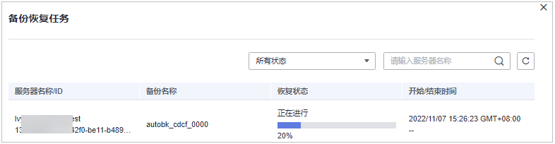
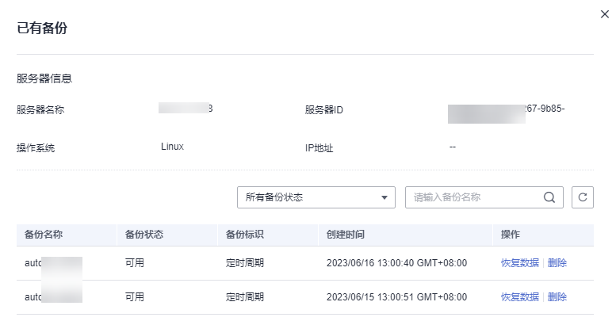
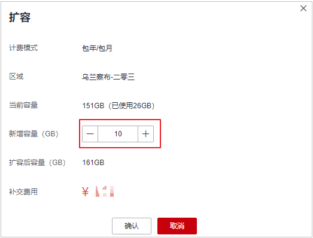
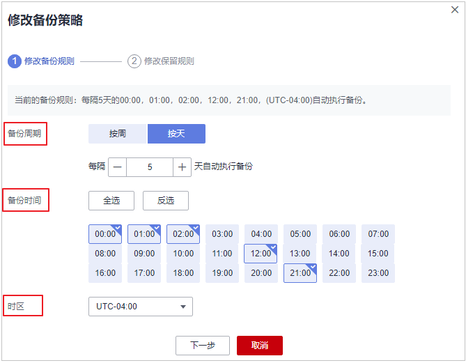
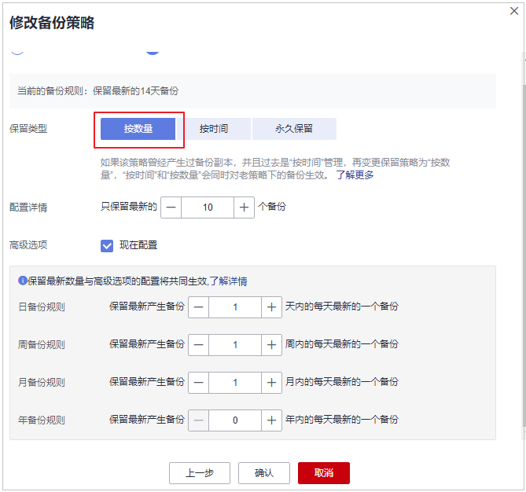

# 查看勒索病毒防护

## 前提条件

已开启主机安全服务版本为旗舰版、网页防篡改版或容器安全版。

## 约束限制

-   勒索备份功能仅支持华为云主机。
-   开启勒索病毒防护后需要及时处置勒索病毒告警、修复系统及中间件漏洞。

## 查看防护事件

1.  [登录管理控制台](https://console.huaweicloud.com/?locale=zh-cn)。
2.  在页面左上角选择“区域“，单击，选择“安全与合规 \> 主机安全服务”，进入主机安全平台界面。

    **图 1**  进入主机安全  
    

3.  选择“主动防御  \>  勒索病毒防护 “，进入“勒索病毒防护“界面。

    > **说明：** 
    >如果您的服务器已通过企业项目的模式进行管理，您可选择目标“企业项目“后查看或操作目标企业项目内的资产和检测信息。

4.  选择“防护事件“页签，查看防护事件。

    确认防护事件的危害程度后，您可以在目标事件的操作列单击“处理“，处理该事件；或者勾选所有目标事件，并单击列表上方的“批量处理“，批量处理事件。

## 查看备份恢复任务

> **须知：** 
>主机安全服务勒索防护的备份依附于云备份服务，执行备份相关操作须已购买云备份服务。

1.  登录管理控制台，进入主机安全服务界面。
2.  在导航树选择“主动防御  \>  勒索病毒防护“，单击“备份恢复任务“的数量值。
3.  弹出备份恢复任务弹窗，查看所有备份恢复详情，可通过服务器名称和恢复状态来筛选或检索目标服务器，参数说明如[表1](#table88217551915)所示。

    **图 2**  备份恢复任务详情  
    

    **表 1**  备份恢复任务参数说明

    
    <table><thead align="left"><tr id="row482125514110"><th class="cellrowborder" valign="top" width="24.632463246324633%" id="mcps1.2.4.1.1">
参数名称

    </th>
    <th class="cellrowborder" valign="top" width="42.03420342034204%" id="mcps1.2.4.1.2">
参数说明

    </th>
    <th class="cellrowborder" valign="top" width="33.33333333333333%" id="mcps1.2.4.1.3">
取值样例

    </th>
    </tr>
    </thead>
    <tbody><tr id="row982185520110"><td class="cellrowborder" valign="top" width="24.632463246324633%" headers="mcps1.2.4.1.1 ">
服务器名称/ID

    </td>
    <td class="cellrowborder" valign="top" width="42.03420342034204%" headers="mcps1.2.4.1.2 ">
执行备份恢复任务的服务器名称/ID。

    </td>
    <td class="cellrowborder" valign="top" width="33.33333333333333%" headers="mcps1.2.4.1.3 ">
-

    </td>
    </tr>
    <tr id="row18221955016"><td class="cellrowborder" valign="top" width="24.632463246324633%" headers="mcps1.2.4.1.1 ">
备份名称

    </td>
    <td class="cellrowborder" valign="top" width="42.03420342034204%" headers="mcps1.2.4.1.2 ">
备份的数据源文件名称。

    </td>
    <td class="cellrowborder" valign="top" width="33.33333333333333%" headers="mcps1.2.4.1.3 ">
-

    </td>
    </tr>
    <tr id="row482212553118"><td class="cellrowborder" valign="top" width="24.632463246324633%" headers="mcps1.2.4.1.1 ">
恢复状态

    </td>
    <td class="cellrowborder" valign="top" width="42.03420342034204%" headers="mcps1.2.4.1.2 ">
目标服务器备份恢复的状态。

    <ul id="ul1673185214416"><li>成功</li><li>跳过</li><li>失败</li><li>正在进行</li><li>超时</li><li>等待</li></ul>
    
若出现跳过、失败、超时状态，重新恢复目标备份数据源即可。

    </td>
    <td class="cellrowborder" valign="top" width="33.33333333333333%" headers="mcps1.2.4.1.3 ">
成功

    </td>
    </tr>
    <tr id="row168226559116"><td class="cellrowborder" valign="top" width="24.632463246324633%" headers="mcps1.2.4.1.1 ">
开始/结束时间

    </td>
    <td class="cellrowborder" valign="top" width="42.03420342034204%" headers="mcps1.2.4.1.2 ">
备份恢复的时间段（包含开始时间和结束时间）。

    </td>
    <td class="cellrowborder" valign="top" width="33.33333333333333%" headers="mcps1.2.4.1.3 ">
-

    </td>
    </tr>
    </tbody>
    </table>

## 恢复服务器数据

> **须知：** 
>主机安全服务勒索防护的备份依附于云备份服务，执行备份相关操作须已购买云备份服务。

1.  登录管理控制台，进入主机安全服务界面。
2.  在导航树选择“主动防御  \>  勒索病毒防护“，选择“防护服务器“，在目标服务器的“操作”列选择“更多“单击“恢复数据“。
3.  在弹窗中查看目标服务器的信息，通过筛选备份状态和搜索备份名称检索需要恢复的备份数据源，参数说明如[表2](#table17472183015292)所示。

    **图 3**  筛选备份数据源  
    

    **表 2**  备份数据源参数说明

    
    <table><thead align="left"><tr id="row2473163052920"><th class="cellrowborder" valign="top" width="16.39163916391639%" id="mcps1.2.4.1.1">
参数名称

    </th>
    <th class="cellrowborder" valign="top" width="50.27502750275028%" id="mcps1.2.4.1.2">
参数说明

    </th>
    <th class="cellrowborder" valign="top" width="33.33333333333333%" id="mcps1.2.4.1.3">
取值样例l

    </th>
    </tr>
    </thead>
    <tbody><tr id="row547343062915"><td class="cellrowborder" valign="top" width="16.39163916391639%" headers="mcps1.2.4.1.1 ">
备份名称

    </td>
    <td class="cellrowborder" valign="top" width="50.27502750275028%" headers="mcps1.2.4.1.2 ">
备份的数据存储文件名称。

    </td>
    <td class="cellrowborder" valign="top" width="33.33333333333333%" headers="mcps1.2.4.1.3 ">
-

    </td>
    </tr>
    <tr id="row1947383015293"><td class="cellrowborder" valign="top" width="16.39163916391639%" headers="mcps1.2.4.1.1 ">
备份状态

    </td>
    <td class="cellrowborder" valign="top" width="50.27502750275028%" headers="mcps1.2.4.1.2 ">
服务器数据备份的状态。

    <ul id="ul1018518118450"><li>可用</li><li>正在创建</li><li>正在删除</li><li>正在恢复</li><li>错误</li></ul>
    
当为“可用”状态时，备份数据源可进行恢复。

    </td>
    <td class="cellrowborder" valign="top" width="33.33333333333333%" headers="mcps1.2.4.1.3 ">
可用

    </td>
    </tr>
    <tr id="row32749062819"><td class="cellrowborder" valign="top" width="16.39163916391639%" headers="mcps1.2.4.1.1 ">
备份标识

    </td>
    <td class="cellrowborder" valign="top" width="50.27502750275028%" headers="mcps1.2.4.1.2 ">
服务器数据备份的原因。

    <ul id="ul3839174318297"><li>定时周期：根据备份策略配置的备份周期执行的数据备份。</li><li>勒索加密：服务器遭到勒索攻击时立即执行的数据备份。</li></ul>
    </td>
    <td class="cellrowborder" valign="top" width="33.33333333333333%" headers="mcps1.2.4.1.3 ">
定时周期

    </td>
    </tr>
    <tr id="row447373016295"><td class="cellrowborder" valign="top" width="16.39163916391639%" headers="mcps1.2.4.1.1 ">
创建时间

    </td>
    <td class="cellrowborder" valign="top" width="50.27502750275028%" headers="mcps1.2.4.1.2 ">
目标备份数据源的备份时间。

    </td>
    <td class="cellrowborder" valign="top" width="33.33333333333333%" headers="mcps1.2.4.1.3 ">
-

    </td>
    </tr>
    </tbody>
    </table>

4.  在目标备份数据源的“操作”列单击“恢复数据“。

    > **说明：** 
    >仅可对“备份状态“为“可用“的备份数据进行恢复。

5.  在弹出的对话框中确认服务器、是否重启等信息，确认无误，单击“确认“，执行自动恢复。

    **图 4**  恢复服务器  
    

## 扩充备份容量

> **须知：** 
>主机安全服务勒索防护的备份依附于云备份服务，执行备份相关操作须已购买云备份服务。

1.  登录管理控制台，进入主机安全服务界面。
2.  在导航树选择“主动防御  \>  勒索病毒防护“，进入防护服务器列表，单击目标服务器“操作“列的“扩容“。
3.  在弹出窗口中输入“新增容量（GB）“。

    **图 5**  输入新增容量值  
    

4.  确认无误，单击“确认“，页面跳转至支付页面，支付完成后可返回“防护服务器“页面查看目标服务器存储容量。
    -   若未完成支付，目标服务器的“存储状态“会显示“被锁定“，支付后，状态恢复正常。

## 修改备份策略

> **须知：** 
>主机安全服务勒索防护的备份依附于云备份服务，执行备份相关操作须已购买云备份服务。

1.  登录管理控制台，进入主机安全服务界面。
2.  在导航树选择“主动防御  \>  勒索病毒防护“，进入防护服务器列表，单击目标服务器“备份策略状态“列的策略名称。
3.  在弹出对话框中配置策略，参数详情如[表3](#table1463142913399)所示。

    **图 6**  配置策略  
    

    **表 3**  策略参数说明

    
    <table><thead align="left"><tr id="row144631291395"><th class="cellrowborder" valign="top" width="13.961396139613964%" id="mcps1.2.4.1.1">
参数名称

    </th>
    <th class="cellrowborder" valign="top" width="57.48574857485749%" id="mcps1.2.4.1.2">
参数说明

    </th>
    <th class="cellrowborder" valign="top" width="28.552855285528555%" id="mcps1.2.4.1.3">
取值样例

    </th>
    </tr>
    </thead>
    <tbody><tr id="row24631029123911"><td class="cellrowborder" valign="top" width="13.961396139613964%" headers="mcps1.2.4.1.1 ">
备份周期

    </td>
    <td class="cellrowborder" valign="top" width="57.48574857485749%" headers="mcps1.2.4.1.2 ">
选择按周或按天自动执行备份。

    <ul id="ul2491315124211"><li>按周：至少选择一周中的某一天。</li><li>按天：最少每隔1天、最大每隔30天执行自动备份。</li></ul>
    </td>
    <td class="cellrowborder" valign="top" width="28.552855285528555%" headers="mcps1.2.4.1.3 ">
按周

    </td>
    </tr>
    <tr id="row10463202983918"><td class="cellrowborder" valign="top" width="13.961396139613964%" headers="mcps1.2.4.1.1 ">
备份时间

    </td>
    <td class="cellrowborder" valign="top" width="57.48574857485749%" headers="mcps1.2.4.1.2 ">
选择固定的时间点进行自动备份。

    
 说明： 

配置策略案例说明

    
策略1：备份周期选择按周（周三、周六），备份时间选择00：00、13：00。释义：在每周三和每周六的00：00、13：00两个时间点实行自动备份。

    
策略2：备份周期选择按天（每隔2天），备份时间选择02：00、14：00。释义：即日起，每隔两天之后的02：00、14：00执行自动备份。

    

    </td>
    <td class="cellrowborder" valign="top" width="28.552855285528555%" headers="mcps1.2.4.1.3 ">
00：00、07：00

    </td>
    </tr>
    <tr id="row74631529153915"><td class="cellrowborder" valign="top" width="13.961396139613964%" headers="mcps1.2.4.1.1 ">
时区

    </td>
    <td class="cellrowborder" valign="top" width="57.48574857485749%" headers="mcps1.2.4.1.2 ">
选择备份时间所属的时区。

    </td>
    <td class="cellrowborder" valign="top" width="28.552855285528555%" headers="mcps1.2.4.1.3 ">
UTC+08：00

    </td>
    </tr>
    </tbody>
    </table>

4.  确认无误，单击“下一步“，配置备份数据保留规则，选择不同的保留类型会配置不同的参数。
    -   “保留类型“：“按数量“

        配置备份规则参数说明如[表4](#table238419613134)所示。

        **图 7**  按数量配置保留规则  
        

        **表 4**  按数量配置保留规则参数说明

        
        <table><thead align="left"><tr id="row193845614133"><th class="cellrowborder" valign="top" width="16.021602160216023%" id="mcps1.2.4.1.1">
参数名称

        </th>
        <th class="cellrowborder" valign="top" width="50.645064506450645%" id="mcps1.2.4.1.2">
参数说明

        </th>
        <th class="cellrowborder" valign="top" width="33.33333333333333%" id="mcps1.2.4.1.3">
取值样例

        </th>
        </tr>
        </thead>
        <tbody><tr id="row93853615132"><td class="cellrowborder" valign="top" width="16.021602160216023%" headers="mcps1.2.4.1.1 ">
配置详情

        </td>
        <td class="cellrowborder" valign="top" width="50.645064506450645%" headers="mcps1.2.4.1.2 ">
配置保留最新备份的数量。

        
 须知： 

此处配置的备份保留数量为系统最终保留的份数，不受高级选项的规则影响。

        
例：“配置详情”填写保留备份数量为“30”，“高级选项”填写“月备份规则”值为“3”（即3个月，约90天），最终系统保留的备份数量为最新的30份 。

        

        </td>
        <td class="cellrowborder" valign="top" width="33.33333333333333%" headers="mcps1.2.4.1.3 ">
30

        </td>
        </tr>
        <tr id="row133857617138"><td class="cellrowborder" valign="top" width="16.021602160216023%" headers="mcps1.2.4.1.1 ">
高级选项（可选）

        </td>
        <td class="cellrowborder" valign="top" width="50.645064506450645%" headers="mcps1.2.4.1.2 ">
以日、周、月、年为单位周期，配置保留周期内每天最新的一个备份。

        <ul id="ul158375151611"><li>日备份规则：以天为单位，保留自定义天以内每天最新的一个备份。</li><li>周备份规则：以周为单位，保留自定义周以内每天最新的一个备份。</li><li>月备份规则：以月为单位，保留自定义月以内每天最新的一个备份。</li><li>年备份规则：以年为单位，保留自定义年以内每天最新的一个备份。</li></ul>
        
 说明： 

若同时填写多个规则，保留备份按照时间最长的规则执行。

        

        </td>
        <td class="cellrowborder" valign="top" width="33.33333333333333%" headers="mcps1.2.4.1.3 ">
月备份规则：3

        </td>
        </tr>
        </tbody>
        </table>

    -   “保留类型“：“按时间“

        配置备份规则参数说明如[表5](#table057910431715)所示。

        **图 8**  按时间配置保留规则  
        

        **表 5**  按时间配置保留规则参数说明

        
        <table><thead align="left"><tr id="row85802042178"><th class="cellrowborder" valign="top" width="18.21182118211821%" id="mcps1.2.4.1.1">
参数名称

        </th>
        <th class="cellrowborder" valign="top" width="48.45484548454845%" id="mcps1.2.4.1.2">
参数说明

        </th>
        <th class="cellrowborder" valign="top" width="33.33333333333333%" id="mcps1.2.4.1.3">
取值样例

        </th>
        </tr>
        </thead>
        <tbody><tr id="row18580245171"><td class="cellrowborder" valign="top" width="18.21182118211821%" headers="mcps1.2.4.1.1 ">
配置详情

        </td>
        <td class="cellrowborder" valign="top" width="48.45484548454845%" headers="mcps1.2.4.1.2 ">
选择自定义或固定保留备份数据的周期，选择后自动开启备份保留，满足周期备份数据后系统将自动删除更早的数据。

        <ul id="ul19651024228"><li>自定义：输入以天为单位的数值，备份数据满足自定义天数的保存周期后，系统自动删除最早产生的备份数据。</li><li>1个月：备份数据满足1个月的保存周期后，系统自动删除最早产生的备份数据。</li><li>3个月：备份数据满足3个月的保存周期后，系统自动删除最早产生的备份数据。</li><li>6个月：备份数据满足6个月的保存周期后，系统自动删除最早产生的备份数据。</li><li>1年：备份数据满足1年的保存周期后，系统自动删除最早产生的备份数据。</li></ul>
        </td>
        <td class="cellrowborder" valign="top" width="33.33333333333333%" headers="mcps1.2.4.1.3 ">
3个月

        </td>
        </tr>
        </tbody>
        </table>

    -   “保留类型“：“永久保留“

        备份数据永久保留。

        > **说明：** 
        >如果该策略曾经产生过备份副本，并且过去是“按时间”管理，历史备份仍然按照保留时间规则进行删除，保留策略详情请参见[保留策略场景说明](https://support.huaweicloud.com/cbr_faq/cbr_06_0044.html)。

5.  配置完成，单击“确认“，完成备份策略修改。

