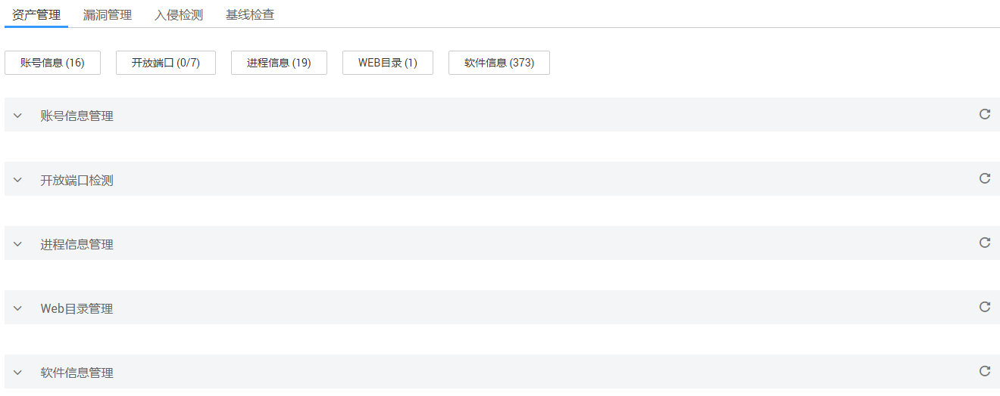
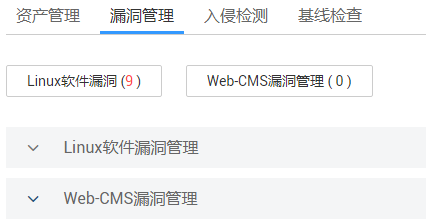
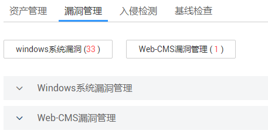
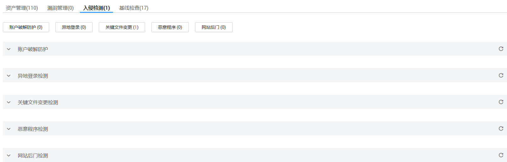

# 查看单台弹性云服务器的检测结果

本章节指导用户查看弹性云服务器的检测结果。

## 前提条件

-   已获取管理控制台的登录帐号与密码。
-   弹性云服务器的“防护状态“为“开启“。

## 操作步骤

1.  登录管理控制台。
2.  在页面上方，单击“服务列表“，选择“安全  \>  企业主机安全“。
3.  在左侧导航树中，选择“云服务器列表“，进入“云服务器列表“界面。
4.  在需要查看检测结果详情的弹性云服务器所在行的“检测结果“列，单击“有风险“，如[图1](#fig993372033610)所示。

    **图 1**  查看检测结果  
    

    > **说明：**   
    >-   如果云服务器的“操作系统类型“显示“Windows“，单击“有风险“，查看的是Windows检测结果。如果是“Linux“，单击“有风险“查看的是Linux的检测结果。  
    >-   如果“当前版本“显示“基础版“，单击“有风险“查看的是基础版检测结果。如果是“企业版“，单击“有风险“查看的是企业版的检测结果。  

5.  查看该弹性云服务器的资产信息，如[图2](#fig1242201616483)所示，各参数说明如[表1](#table1342121674817)所示。

    > **说明：**   
    >基础版只支持查看账户破解源IP、异地登录、弱口令的报告。  

    **图 2**  资产信息  
    

    **表 1**  资产信息参数说明

    
    <table><thead align="left"><tr id="row1942516124818"><th class="cellrowborder" valign="top" width="22.74%" id="mcps1.2.3.1.1">
参数名称

    </th>
    <th class="cellrowborder" valign="top" width="77.25999999999999%" id="mcps1.2.3.1.2">
说明

    </th>
    </tr>
    </thead>
    <tbody><tr id="row8425169485"><td class="cellrowborder" valign="top" width="22.74%" headers="mcps1.2.3.1.1 ">
账号信息管理

    </td>
    <td class="cellrowborder" valign="top" width="77.25999999999999%" headers="mcps1.2.3.1.2 ">
每天定期收集弹性云服务器的账号信息，便于用户管理账号。

    </td>
    </tr>
    <tr id="row34219165487"><td class="cellrowborder" valign="top" width="22.74%" headers="mcps1.2.3.1.1 ">
开放端口检测

    </td>
    <td class="cellrowborder" valign="top" width="77.25999999999999%" headers="mcps1.2.3.1.2 ">
默认显示“未处理”状态的，如果需要查看其他状态的端口请单击“开放端口检测”列表右上角

    
的下拉框进行查看，帮助用户识别出其中的风险端口和未知端口。

    
建议尽快关闭风险端口和未知端口。

    </td>
    </tr>
    <tr id="row54271604813"><td class="cellrowborder" valign="top" width="22.74%" headers="mcps1.2.3.1.1 ">
进程信息管理

    </td>
    <td class="cellrowborder" valign="top" width="77.25999999999999%" headers="mcps1.2.3.1.2 ">
对运行中的进程进行收集，帮助用户清点合法进程，发现异常进程。

    </td>
    </tr>
    <tr id="row542916154813"><td class="cellrowborder" valign="top" width="22.74%" headers="mcps1.2.3.1.1 ">
Web目录管理

    </td>
    <td class="cellrowborder" valign="top" width="77.25999999999999%" headers="mcps1.2.3.1.2 ">
每天凌晨定期收集弹性云服务器的Web目录信息。

    </td>
    </tr>
    <tr id="row1642101616482"><td class="cellrowborder" valign="top" width="22.74%" headers="mcps1.2.3.1.1 ">
软件信息管理

    </td>
    <td class="cellrowborder" valign="top" width="77.25999999999999%" headers="mcps1.2.3.1.2 ">
每天凌晨定期检测弹性云服务器的软件版本信息，便于用户管理软件资产。

    
用户可查看软件名称和软件版本号。

    
用户修改软件信息后，建议参照<a href="手动收集软件信息.md">手动收集软件信息</a>章节立即执行一次检测，核实修改效果。

    </td>
    </tr>
    </tbody>
    </table>

6.  查看该弹性云服务器的漏洞检测结果。
    1.  Linux操作系统的漏洞检测结果，如[图3](#fig1139917496620)所示，各参数说明如[表2](#table385475510257)所示。漏洞修复后，建议参照[手动执行软件漏洞检测](手动执行软件漏洞检测.md)章节立即执行一次检测，核实修复效果。

        **图 3**  Linux系统漏洞检测结果  
        

        **表 2**  Linux系统漏洞管理参数说明

        
        <table><thead align="left"><tr id="row13854105552517"><th class="cellrowborder" valign="top" width="23%" id="mcps1.2.3.1.1">
参数名称

        </th>
        <th class="cellrowborder" valign="top" width="77%" id="mcps1.2.3.1.2">
说明

        </th>
        </tr>
        </thead>
        <tbody><tr id="row5870185510255"><td class="cellrowborder" valign="top" width="23%" headers="mcps1.2.3.1.1 ">
Linux软件漏洞管理

        </td>
        <td class="cellrowborder" valign="top" width="77%" headers="mcps1.2.3.1.2 ">
通过与漏洞库进行比对，检测出系统和软件（例如：SSH、OpenSSL、Apache、Mysql等）存在的漏洞，帮助用户识别出存在的风险。

        <ul id="ul1263851222710"><li>默认显示“未处理”状态的漏洞，如果想查看其他状态的漏洞，请单击列表右上角的状态下拉框进行查看。</li><li>用户可以选中想要忽略的漏洞，单击“Linux软件漏洞管理”列表操作列的“忽略”或者左上角的“忽略”来忽略该漏洞，也可批量处理。</li></ul>
        </td>
        </tr>
        <tr id="row178701055142517"><td class="cellrowborder" valign="top" width="23%" headers="mcps1.2.3.1.1 ">
Web-CMS漏洞管理

        </td>
        <td class="cellrowborder" valign="top" width="77%" headers="mcps1.2.3.1.2 ">
通过目录及文件的检测方案，检出Web-CMS漏洞。

        <ul id="ul413084542916"><li>默认显示“未处理”状态的，如果需要查看其他状态的端口请单击“开放端口检测”列表右上角下拉框进行查看。</li><li>用户可以选中想要忽略的漏洞，单击“Web-CMS漏洞管理”列表操作列的“忽略”或者左上角的“忽略”来忽略该漏洞，也可批量处理。</li></ul>
        </td>
        </tr>
        </tbody>
        </table>

    2.  Windows操作系统的漏洞检测结果，如[图4](#fig11892498537)所示，各参数说明如[表3](#table1653314579202)所示。漏洞修复后，建议参照[手动执行软件漏洞检测](手动执行软件漏洞检测.md)章节立即执行一次检测，核实修复效果。

        **图 4**  Windows系统漏洞检测结果  
        

        **表 3**  Windows系统漏洞管理参数说明

        
        <table><thead align="left"><tr id="row1853312579208"><th class="cellrowborder" valign="top" width="23%" id="mcps1.2.3.1.1">
参数名称

        </th>
        <th class="cellrowborder" valign="top" width="77%" id="mcps1.2.3.1.2">
说明

        </th>
        </tr>
        </thead>
        <tbody><tr id="row1753375752020"><td class="cellrowborder" valign="top" width="23%" headers="mcps1.2.3.1.1 ">
Windows系统漏洞管理

        </td>
        <td class="cellrowborder" valign="top" width="77%" headers="mcps1.2.3.1.2 ">
通过与漏洞库进行比对，检测出系统（例如：SSH、OpenSSL、Apache、Mysql等）存在的漏洞，帮助用户识别出存在的风险。

        <ul id="ul10549157172011"><li>默认显示“未处理”状态的漏洞，如果想查看其他状态的漏洞，请单击列表右上角的状态下拉框进行查看。</li><li>用户可以选中想要忽略的漏洞，单击“Windows系统漏洞管理”列表操作列的“忽略”或者左上角的“忽略”来忽略该漏洞，也可批量处理。</li></ul>
        </td>
        </tr>
        <tr id="row17549557122018"><td class="cellrowborder" valign="top" width="23%" headers="mcps1.2.3.1.1 ">
Web-CMS漏洞管理

        </td>
        <td class="cellrowborder" valign="top" width="77%" headers="mcps1.2.3.1.2 ">
通过目录及文件的检测方案，检出Web-CMS漏洞。

        <ul id="ul20564155792013"><li>默认显示“未处理”状态的，如果需要查看其他状态的端口请单击“开放端口检测”列表右上角下拉框进行查看。</li><li>用户可以选中想要忽略的漏洞，单击“Web-CMS漏洞管理”列表操作列的“忽略”或者左上角的“忽略”来忽略该漏洞，也可批量处理。</li></ul>
        </td>
        </tr>
        </tbody>
        </table>

7.  查看该弹性云服务器的入侵检测结果，如[图5](#fig14730246105511)所示，各参数说明如[表4](#table19107165311565)所示。

    **图 5**  入侵检测结果  
    

    **表 4**  入侵检测结果参数说明

    
    <table><thead align="left"><tr id="row814619538566"><th class="cellrowborder" valign="top" width="22.74%" id="mcps1.2.3.1.1">
参数名称

    </th>
    <th class="cellrowborder" valign="top" width="77.25999999999999%" id="mcps1.2.3.1.2">
说明

    </th>
    </tr>
    </thead>
    <tbody><tr id="row84022538565"><td class="cellrowborder" valign="top" width="22.74%" headers="mcps1.2.3.1.1 ">
账户破解防护

    </td>
    <td class="cellrowborder" valign="top" width="77.25999999999999%" headers="mcps1.2.3.1.2 ">
检测账户遭受的口令破解攻击，对识别出的攻击源IP封锁24小时，禁止其再次登录，防止主机因账户破解被入侵。

    
如果确定被封禁的IP可信，用户可参照<a href="解除拦截受信任的IP.md">解除拦截受信任的IP</a>章节解封受信任的IP。

    </td>
    </tr>
    <tr id="row74481453195612"><td class="cellrowborder" valign="top" width="22.74%" headers="mcps1.2.3.1.1 ">
异地登录检测

    </td>
    <td class="cellrowborder" valign="top" width="77.25999999999999%" headers="mcps1.2.3.1.2 ">
检测主机异地登录行为。

    
用户可根据实际情况采取相应措施（例如：忽略、修改密码等）。

    </td>
    </tr>
    <tr id="row848455315561"><td class="cellrowborder" valign="top" width="22.74%" headers="mcps1.2.3.1.1 ">
关键文件变更检测

    </td>
    <td class="cellrowborder" valign="top" width="77.25999999999999%" headers="mcps1.2.3.1.2 ">
对于系统关键文件（例如：ls、ps、login、top等）进行监控，一旦文件被修改就提醒用户。

    
用户可查看被更改文件的“关键文件路径”和“文件最后修改时间”。

    </td>
    </tr>
    <tr id="row2539453175612"><td class="cellrowborder" valign="top" width="22.74%" headers="mcps1.2.3.1.1 ">
恶意程序检测

    </td>
    <td class="cellrowborder" valign="top" width="77.25999999999999%" headers="mcps1.2.3.1.2 "><ul id="ul937718267205"><li>对运行中的程序进行检测，识别出其中的后门、木马、蠕虫和病毒等恶意程序，以及一些疑似恶意程序，帮助用户识别出系统存在的安全风险。</li><li>针对恶意程序和疑似恶意程序，建议尽快结束其进程，阻止它们的运行。</li></ul>
    </td>
    </tr>
    <tr id="row75831553125617"><td class="cellrowborder" valign="top" width="22.74%" headers="mcps1.2.3.1.1 ">
网站后门检测

    </td>
    <td class="cellrowborder" valign="top" width="77.25999999999999%" headers="mcps1.2.3.1.2 ">
检测用户的弹性云服务器上Web目录中的文件，是否为WebShell木马文件，支持检测常见的PHP、JSP等后门文件类型。

    </td>
    </tr>
    </tbody>
    </table>

8.  查看该弹性云服务器的基线检查结果，如[图6](#fig147443301971)所示，各参数说明如[表5](#table529911491533)所示。

    **图 6**  基线检查结果  
    

    **表 5**  基线检查结果参数说明

    
    <table><thead align="left"><tr id="row1728494918537"><th class="cellrowborder" valign="top" width="22.74%" id="mcps1.2.3.1.1">
参数名称

    </th>
    <th class="cellrowborder" valign="top" width="77.25999999999999%" id="mcps1.2.3.1.2">
说明

    </th>
    </tr>
    </thead>
    <tbody><tr id="row029814492532"><td class="cellrowborder" valign="top" width="22.74%" headers="mcps1.2.3.1.1 ">
口令复杂度策略和经典弱口令检测

    </td>
    <td class="cellrowborder" valign="top" width="77.25999999999999%" headers="mcps1.2.3.1.2 "><ul id="ul14298134955313"><li>检测系统中的口令复杂度策略，给出修改建议，帮助用户提升口令安全性。单击“如何安装PAM并设置安全的口令复杂度策略”可以查看策略设置说明。</li><li>检测系统账户口令是否属于常用的弱口令，针对弱口令提示用户修改，防止账户口令被轻易猜解。</li></ul>
    
用户修改弱口令后，建议参照<a href="手动执行经典弱口令检测.md">手动执行经典弱口令检测</a>章节立即执行一次检测，核实修改效果。

    </td>
    </tr>
    <tr id="row1529984945316"><td class="cellrowborder" valign="top" width="22.74%" headers="mcps1.2.3.1.1 ">
配置检测

    </td>
    <td class="cellrowborder" valign="top" width="77.25999999999999%" headers="mcps1.2.3.1.2 "><ul id="ul14918359105115"><li>对常见的Tomcat配置、SSH登录配置、Nginx配置进行检查，帮助用户识别不安全的配置项。</li><li>单击配置检测的详细信息。</li><li>选中单个“存在风险的检测规则”，单击操作列的“忽略”或者列表左上角的“忽略”进行单个忽略。也可以选中多个检测规则单击界面左上角的“忽略”批量进行忽略。</li><li>对于已经忽略的检测规则，可以单击操作列的“忽略”单个进行忽略，也可以批量选中想要取消忽略的规则撤销忽略。</li></ul>
    
用户修改配置后，建议参照<a href="手动执行配置检测.md">手动执行配置检测</a>章节立即执行一次检测，核实修改效果。

    </td>
    </tr>
    </tbody>
    </table>

