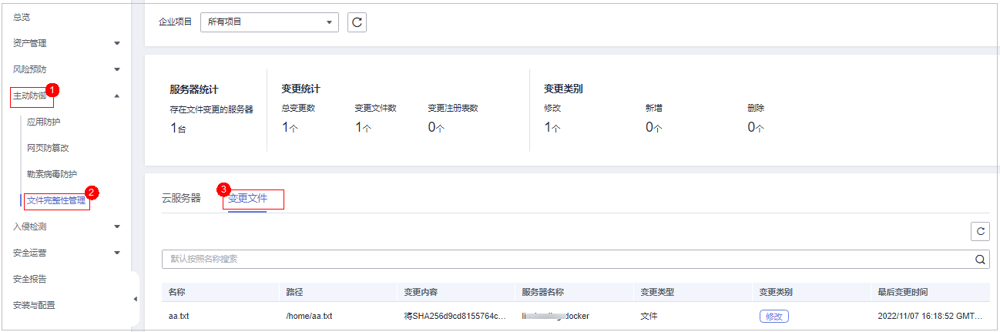

# 查看历史变更文件

## 约束限制

旗舰版及以上版本支持文件完整性相关操作。

## 操作步骤

1.  [登录管理控制台](https://console.huaweicloud.com/?locale=zh-cn)。
2.  在页面左上角选择“区域“，单击，选择“安全与合规 \> 主机安全服务”，进入主机安全平台界面。

    **图 1**  进入主机安全  
    

3.  左侧选择“主动防御  \>  文件完整性管理  \>  变更文件“，进入变更文件页面，查看所有文件变更记录，企业项目可默认，参数可参见[查看云服务器变更详情](查看云服务器变更详情.md)章节中的[表1](查看云服务器变更详情.md#table979905102414)。

    **图 2**  查看变更文件  
    

