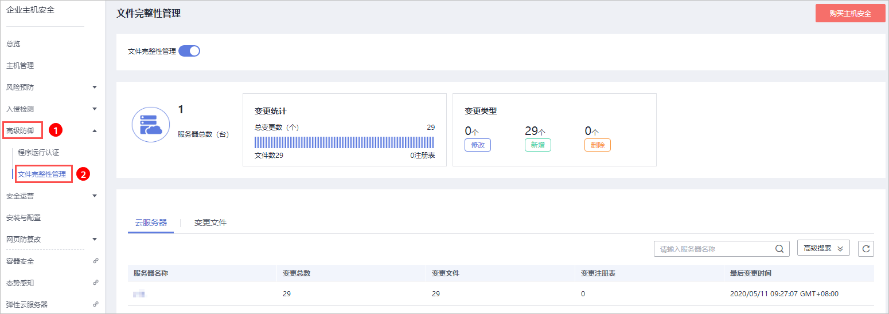
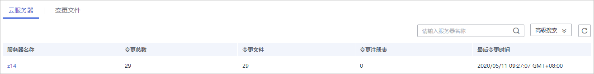
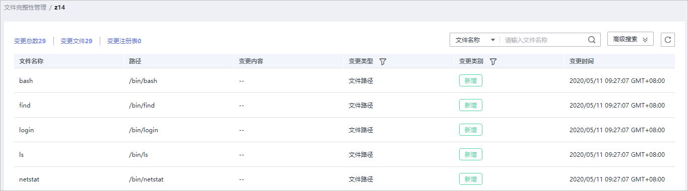
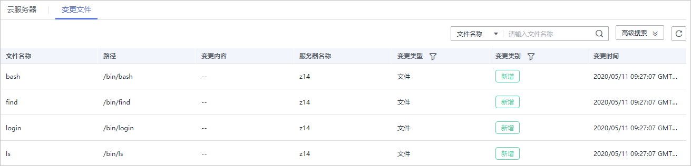

# 查看变更统计

文件完整性管理为您提供变更统计、变更类别、单个服务器文件和注册表的变更数量、以及文件和注册表的变更详情。让您实时了解监控文件的变更情况，及时发现恶意变更。

## 查看变更概况

1.  [登录管理控制台](https://console.huaweicloud.com)。
2.  在页面左上角选择“区域“，单击，选择“安全  \>  企业主机安全“，进入企业主机安全页面。

    **图 1**  企业主机安全  
    

3.  进入“文件完整性管理“页面，查看变更概况，如[图2](#fig961410572311)所示。

    **图 2**  查看变更概况  
    

    **表 1**  变更概况

    
    <table><thead align="left"><tr id="row1594301611268"><th class="cellrowborder" valign="top" width="21.85%" id="mcps1.2.3.1.1">
类别

    </th>
    <th class="cellrowborder" valign="top" width="78.14999999999999%" id="mcps1.2.3.1.2">
说明

    </th>
    </tr>
    </thead>
    <tbody><tr id="row794321652616"><td class="cellrowborder" valign="top" width="21.85%" headers="mcps1.2.3.1.1 ">
服务器总数（台）

    </td>
    <td class="cellrowborder" valign="top" width="78.14999999999999%" headers="mcps1.2.3.1.2 ">
所有管理的服务器的总台数。

    </td>
    </tr>
    <tr id="row0943201682610"><td class="cellrowborder" valign="top" width="21.85%" headers="mcps1.2.3.1.1 ">
变更统计

    </td>
    <td class="cellrowborder" valign="top" width="78.14999999999999%" headers="mcps1.2.3.1.2 "><ul id="ul1735913573211"><li>变更总数（个）：所有管理的变更的总的数量。</li><li>文件数：所有管理的文件变更的数量。</li><li>注册表：所有管理的注册表变更的数量。</li></ul>
    </td>
    </tr>
    <tr id="row1994316168267"><td class="cellrowborder" valign="top" width="21.85%" headers="mcps1.2.3.1.1 ">
变更类别

    </td>
    <td class="cellrowborder" valign="top" width="78.14999999999999%" headers="mcps1.2.3.1.2 "><ul id="ul1669615384323"><li>修改：所有管理的文件和注册表修改的数量</li><li>新增：所有管理的文件和注册表新增的数量。</li><li>删除：所有管理的文件和注册表删除的数量。</li></ul>
    </td>
    </tr>
    </tbody>
    </table>

## 查看单个云服务器变更文件

1.  在云服务器列表中，查看服务器对应的文件和注册表变更总数、变更文件、变更注册表和最后变更时间，如[图3](#fig7512193224419)所示。

    **图 3**  云服务器列表页面  
    

2.  单击服务器名称，你可以在列表上方查看该服务器的变更统计总数，包括变更总数、变更文件数量、变更注册表数量，如[图4](#fig18321250177)所示。

    > **说明：** 
    >可以通过单击“高级搜索“，输入“服务器名称“，选择“变更时间“搜索符合条件的服务器。

    **图 4**  服务器变更详情  
    

3.  在该服务器的文件列表中，您可以查看该服务器文件和注册表的变更详情。

    包含“文件名称“、“路径“、“变更内容“、“变更类型“、“变更类别“和“变更时间“。

    > **说明：** 
    >-   可以通过在列表上方输入文件名称或者文件路径，搜索符合条件的文件。
    >-   可以通过单击“高级搜索“，输入“文件名称“、“文件路径“，选择“变更时间“、“变更类型“、“变更类别“或者“信任状态“搜索符合条件的文件。

## 查看全量变更文件

在变更文件列表中，查看所有主机的变更文件，包含文件变更的文件名称、路径、变更内容、服务器名称、变更类型、变更类别和变更时间，如[图5](#fig11381134122)所示。

**图 5**  变更文件列表  

> **说明：** 
>-   可以通过在列表上方输入文件名称或者文件路径，搜索符合条件的文件。
>-   可以通过单击“高级搜索“，输入“文件名称“、“文件路径“，选择“变更时间“、“变更类型“、“变更类别“或者“信任状态“搜索符合条件的文件。

