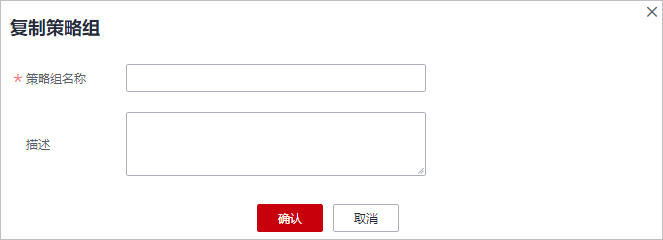
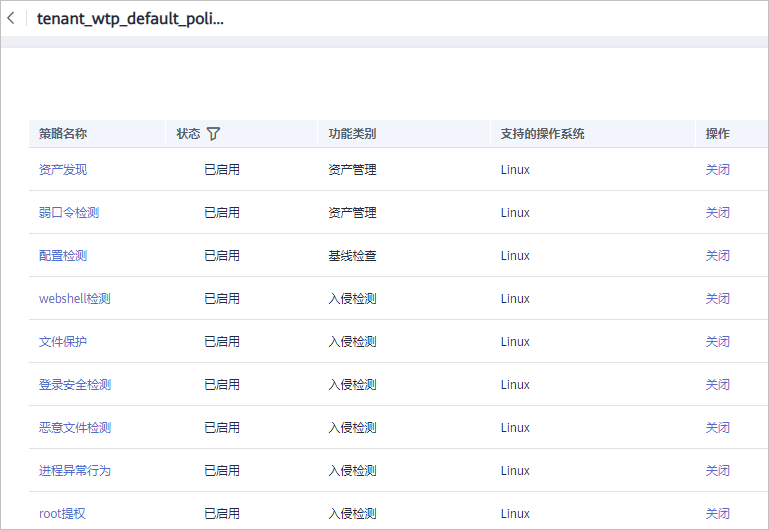

# 查看和创建策略组

企业主机安全旗舰版提供灵活的策略管理能力，用户可以根据需要自定义安全检测规则，并可以为不同的主机组或主机应用不同的策略，以满足不同应用场景的主机安全需求。

## 操作须知

-   开启企业版防护时，默认绑定“默认企业版策略组“（包含“弱口令检测“和“网站后门检测“策略），应用于全部的云服务器，不需要单独部署策略。
-   购买“旗舰版“或者“网页防篡改赠送旗舰版“后，开启旗舰版/网页防篡改版防护时，默认绑定了“默认旗舰版策略组“。

    用户也可以通过复制“默认旗舰版策略组“的方式，创建自定义策略组，将“默认旗舰版策略组“替换为用户的自定义策略组，更加灵活的应用于不同的云服务器或者云服务器组。

## 策略列表

<table><thead align="left"><tr id="row1795648155320"><th class="cellrowborder" valign="top" width="11.62116211621162%" id="mcps1.1.7.1.1">
策略名称

</th>
<th class="cellrowborder" valign="top" width="37.913791379137905%" id="mcps1.1.7.1.2">
策略说明

</th>
<th class="cellrowborder" valign="top" width="17.61176117611761%" id="mcps1.1.7.1.3">
支持的操作系统

</th>
<th class="cellrowborder" valign="top" width="11.171117111711169%" id="mcps1.1.7.1.4">
企业版

</th>
<th class="cellrowborder" valign="top" width="10.33103310331033%" id="mcps1.1.7.1.5">
旗舰版

</th>
<th class="cellrowborder" valign="top" width="11.35113511351135%" id="mcps1.1.7.1.6">
网页防篡改版

</th>
</tr>
</thead>
<tbody><tr id="row6762461945"><td class="cellrowborder" valign="top" width="11.62116211621162%" headers="mcps1.1.7.1.1 ">
弱口令检测

</td>
<td class="cellrowborder" valign="top" width="37.913791379137905%" headers="mcps1.1.7.1.2 ">
检测系统账户口令是否属于常用的弱口令，针对弱口令提示用户修改。

</td>
<td class="cellrowborder" valign="top" width="17.61176117611761%" headers="mcps1.1.7.1.3 ">
Linux，Windows

</td>
<td class="cellrowborder" valign="top" width="11.171117111711169%" headers="mcps1.1.7.1.4 ">
√

（只支持自定义弱口令）

</td>
<td class="cellrowborder" valign="top" width="10.33103310331033%" headers="mcps1.1.7.1.5 ">
√

</td>
<td class="cellrowborder" valign="top" width="11.35113511351135%" headers="mcps1.1.7.1.6 ">
√

</td>
</tr>
<tr id="row22644919411"><td class="cellrowborder" valign="top" width="11.62116211621162%" headers="mcps1.1.7.1.1 ">
网站后门检测

</td>
<td class="cellrowborder" valign="top" width="37.913791379137905%" headers="mcps1.1.7.1.2 ">
检测云服务器上Web目录中的文件，判断是否为WebShell木马文件。

</td>
<td class="cellrowborder" valign="top" width="17.61176117611761%" headers="mcps1.1.7.1.3 ">
Linux，Windows

</td>
<td class="cellrowborder" valign="top" width="11.171117111711169%" headers="mcps1.1.7.1.4 ">
√

（只支持配置检测路径）

</td>
<td class="cellrowborder" valign="top" width="10.33103310331033%" headers="mcps1.1.7.1.5 ">
√

</td>
<td class="cellrowborder" valign="top" width="11.35113511351135%" headers="mcps1.1.7.1.6 ">
√

</td>
</tr>
<tr id="row579594875310"><td class="cellrowborder" valign="top" width="11.62116211621162%" headers="mcps1.1.7.1.1 ">
资产管理

</td>
<td class="cellrowborder" valign="top" width="37.913791379137905%" headers="mcps1.1.7.1.2 ">
检测系统中的软件信息，包含软件名称、软件路径、主要应用等，帮助用户识别异常资产。

</td>
<td class="cellrowborder" valign="top" width="17.61176117611761%" headers="mcps1.1.7.1.3 ">
Linux，Windows

</td>
<td class="cellrowborder" valign="top" width="11.171117111711169%" headers="mcps1.1.7.1.4 ">
×

</td>
<td class="cellrowborder" valign="top" width="10.33103310331033%" headers="mcps1.1.7.1.5 ">
√

</td>
<td class="cellrowborder" valign="top" width="11.35113511351135%" headers="mcps1.1.7.1.6 ">
√

</td>
</tr>
<tr id="row177951148105315"><td class="cellrowborder" valign="top" width="11.62116211621162%" headers="mcps1.1.7.1.1 ">
系统配置检测

</td>
<td class="cellrowborder" valign="top" width="37.913791379137905%" headers="mcps1.1.7.1.2 ">
对常见的Tomcat配置、Nginx配置、SSH登录配置进行检查，帮助用户识别不安全的配置项。

</td>
<td class="cellrowborder" valign="top" width="17.61176117611761%" headers="mcps1.1.7.1.3 ">
Linux，Windows

</td>
<td class="cellrowborder" valign="top" width="11.171117111711169%" headers="mcps1.1.7.1.4 ">
×

</td>
<td class="cellrowborder" valign="top" width="10.33103310331033%" headers="mcps1.1.7.1.5 ">
√

</td>
<td class="cellrowborder" valign="top" width="11.35113511351135%" headers="mcps1.1.7.1.6 ">
√

</td>
</tr>
<tr id="row147961748115311"><td class="cellrowborder" valign="top" width="11.62116211621162%" headers="mcps1.1.7.1.1 ">
高危命令检测

</td>
<td class="cellrowborder" valign="top" width="37.913791379137905%" headers="mcps1.1.7.1.2 ">
实时检测当前系统中执行的高危命令，当发生高危命令执行时，及时触发告警。

</td>
<td class="cellrowborder" valign="top" width="17.61176117611761%" headers="mcps1.1.7.1.3 ">
Linux

</td>
<td class="cellrowborder" valign="top" width="11.171117111711169%" headers="mcps1.1.7.1.4 ">
×

</td>
<td class="cellrowborder" valign="top" width="10.33103310331033%" headers="mcps1.1.7.1.5 ">
√

</td>
<td class="cellrowborder" valign="top" width="11.35113511351135%" headers="mcps1.1.7.1.6 ">
√

</td>
</tr>
<tr id="row11163113216313"><td class="cellrowborder" valign="top" width="11.62116211621162%" headers="mcps1.1.7.1.1 ">
提权检测

</td>
<td class="cellrowborder" valign="top" width="37.913791379137905%" headers="mcps1.1.7.1.2 ">
检测当前系统的“进程提权”和“文件提权”操作。

检测以下异常提权操作：<ul id="ul145116408491"><li>利用SUID程序漏洞进行root提权。</li><li>利用内核漏洞进行root提权。</li><li>对文件的提权。</li></ul>

</td>
<td class="cellrowborder" valign="top" width="17.61176117611761%" headers="mcps1.1.7.1.3 ">
Linux

</td>
<td class="cellrowborder" valign="top" width="11.171117111711169%" headers="mcps1.1.7.1.4 ">
×

</td>
<td class="cellrowborder" valign="top" width="10.33103310331033%" headers="mcps1.1.7.1.5 ">
√

</td>
<td class="cellrowborder" valign="top" width="11.35113511351135%" headers="mcps1.1.7.1.6 ">
√

</td>
</tr>
<tr id="row9262204513311"><td class="cellrowborder" valign="top" width="11.62116211621162%" headers="mcps1.1.7.1.1 ">
异常/反弹Shell检测

</td>
<td class="cellrowborder" valign="top" width="37.913791379137905%" headers="mcps1.1.7.1.2 ">
检测系统中异常/反弹Shell的获取行为，包括对shell文件的修改、删除、移动、拷贝、硬链接、访问权限变化。

</td>
<td class="cellrowborder" valign="top" width="17.61176117611761%" headers="mcps1.1.7.1.3 ">
Linux

</td>
<td class="cellrowborder" valign="top" width="11.171117111711169%" headers="mcps1.1.7.1.4 ">
×

</td>
<td class="cellrowborder" valign="top" width="10.33103310331033%" headers="mcps1.1.7.1.5 ">
√

</td>
<td class="cellrowborder" valign="top" width="11.35113511351135%" headers="mcps1.1.7.1.6 ">
√

</td>
</tr>
<tr id="row19582785326"><td class="cellrowborder" valign="top" width="11.62116211621162%" headers="mcps1.1.7.1.1 ">
文件完整性管理

</td>
<td class="cellrowborder" valign="top" width="37.913791379137905%" headers="mcps1.1.7.1.2 ">
检测操作系统、应用程序软件和其他组件的文件，确定文件是否发生了可能遭受攻击的更改。

</td>
<td class="cellrowborder" valign="top" width="17.61176117611761%" headers="mcps1.1.7.1.3 ">
Linux

</td>
<td class="cellrowborder" valign="top" width="11.171117111711169%" headers="mcps1.1.7.1.4 ">
×

</td>
<td class="cellrowborder" valign="top" width="10.33103310331033%" headers="mcps1.1.7.1.5 ">
√

</td>
<td class="cellrowborder" valign="top" width="11.35113511351135%" headers="mcps1.1.7.1.6 ">
√

</td>
</tr>
</tbody>
</table>

## 进入策略管理

1.  [登录管理控制台](https://console.huaweicloud.com)。

1.  在页面左上角选择“区域“，单击，选择“安全  \>  企业主机安全“，进入企业主机安全页面。

    **图 1**  企业主机安全  
    

2.  在左侧导航栏，选择“安全运营“，单击“策略管理“，进入“策略管理“界面。

## 查看策略组列表

1.  在“策略管理“界面，查看显示的策略组。如[图2](#fa1b5ba597e134311ada6715db2f4b42b)所示，字段说明如[表1](#t801bc5e996a743dd8e2bfeb480ff1ca8)所示。

    > **说明：** 
    >-   default\_enterprise\_policy\_group（默认企业版策略组）：企业版系统预置策略，仅可被查看，不可被复制和删除。
    >-   default\_premium\_policy\_group （默认旗舰版策略组）：旗舰版系统预置策略，可通过复制该策略组来创建新的策略组。
    >-   可在列表右上角单击，手动刷新当前列表。
    >-   可单击关联服务器数的数量，查看策略组关联的服务器。

    **图 2**  策略组列表  
    

    **表 1**  策略组列表字段说明

    
    <table><thead align="left"><tr id="r31c93826ed3e4bd59b563dbc8df14166"><th class="cellrowborder" valign="top" width="25.55%" id="mcps1.2.3.1.1">
字段

    </th>
    <th class="cellrowborder" valign="top" width="74.45%" id="mcps1.2.3.1.2">
说明

    </th>
    </tr>
    </thead>
    <tbody><tr id="r488e363dd1d646998c450b4980a148a8"><td class="cellrowborder" valign="top" width="25.55%" headers="mcps1.2.3.1.1 ">
策略组名称

    </td>
    <td class="cellrowborder" valign="top" width="74.45%" headers="mcps1.2.3.1.2 ">
策略组的名称。

    </td>
    </tr>
    <tr id="row190113370416"><td class="cellrowborder" valign="top" width="25.55%" headers="mcps1.2.3.1.1 ">
ID

    </td>
    <td class="cellrowborder" valign="top" width="74.45%" headers="mcps1.2.3.1.2 ">
策略组的ID号，对策略组的唯一标识。

    </td>
    </tr>
    <tr id="r43f1c22e0b5a4a22b201b6ab5806378b"><td class="cellrowborder" valign="top" width="25.55%" headers="mcps1.2.3.1.1 ">
描述

    </td>
    <td class="cellrowborder" valign="top" width="74.45%" headers="mcps1.2.3.1.2 ">
对策略组的描述。

    </td>
    </tr>
    <tr id="row55761411057"><td class="cellrowborder" valign="top" width="25.55%" headers="mcps1.2.3.1.1 ">
支持的版本

    </td>
    <td class="cellrowborder" valign="top" width="74.45%" headers="mcps1.2.3.1.2 ">
策略组支持的企业主机安全的版本。

    </td>
    </tr>
    </tbody>
    </table>

2.  单击策略组名称，进入查看策略组详情界面，可以查看该策略组的策略列表，包括策略名称、状态、功能类别和支持的操作系统，如[图3](#fig1141931811719)所示。

    > **说明：** 
    >-   “默认企业版策略组“和“默认旗舰版策略组“中的所有策略默认为“已启用“状态。
    >-   若您不需要执行其中一项策略的检测，您可以在策略所在行的“操作“列，单击“关闭“，关闭该策略项的检测。请根据您的需要“开启“或者“关闭“策略的检测。

    **图 3**  策略组详情  
    

3.  单击策略名称，可以查看策略的详情，以弱口令为例，如[图4](#fig151218201592)所示。

    > **说明：** 
    >若需要修改策略，请参见[修改策略内容](修改策略内容.md)。

    **图 4**  策略详情  
    

## 创建策略组

1.  选择“default\_premium\_policy\_group （默认旗舰版策略组）”策略组，在该策略组所在行的操作列中，单击“复制“，如[图5](#hss_01_0024_fig15964857392)所示。

    **图 5**  复制策略组  
    

2.  在弹出的对话框中，输入“策略组名称“和“描述“，如[图6](#hss_01_0024_fig2889958811472)所示。

    > **说明：** 
    >-   策略组的名称不能重复，如果尝试通过复制来创建一个同名的策略组，将会失败。
    >-   “策略组名称“和“描述“只能包含中文、字母、数字、下划线、中划线、空格，并且首尾不能为空格。

    **图 6**  创建策略组  
    

3.  单击“确定“，将会创建一个新的策略组。
4.  单击已创建的策略组名称，进入策略组的策略页面，如[图7](#hss_01_0024_fig1861202845918)所示。

    **图 7**  策略组策略  
    

5.  单击策略名称，修改具体的策略内容，详细信息请参见[修改策略内容](修改策略内容.md)。
6.  策略内容修改完成后，单击策略所在行的“开启“或者“关闭“，开启或者关闭对应的策略。

## 相关操作

**删除策略组**

若被删除的策略组已经部署给了主机，在策略组被删除后，这些主机的策略组信息将被设置为“无“。

1.  选中需要删除的一个或多个策略组，单击“删除“，如[图8](#fbf35d1bbac3d49998b574686aaeaeafd)所示。

    **图 8**  删除策略组列表  
    

    > **说明：** 
    >用户也可以在需要删除的策略组所在行的“操作“列中，单击“删除“，删除单个策略组。

2.  在弹出对话框中，单击“确定“，完成策略组的删除。

