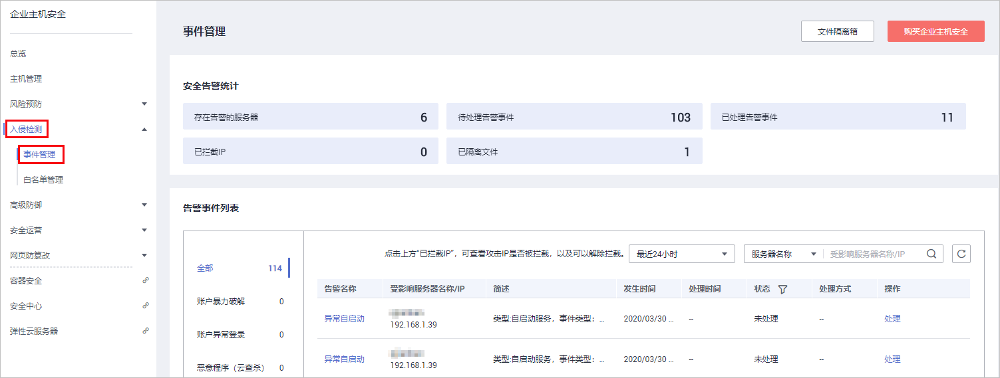
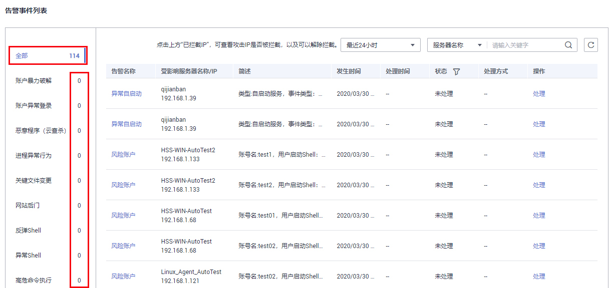
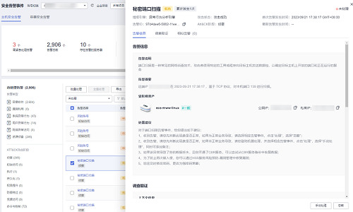

# 查看和处理入侵告警事件

企业主机安全可对您已开启的告警防御能力提供总览数据，帮助您快速了解安全告警概况包括存在告警的服务器、待处理告警事件、未处理告警事件、已拦截IP和已隔离文件。

事件管理列表仅保留近30天内发生的告警事件，您可以根据自己的业务需求，自行判断并处理告警，快速清除资产中的安全威胁。

告警事件处理完成后，告警事件将从“未处理“状态转化为“已处理“。

## 约束与限制

-   若不需要检测高危命令执行、提权操作、反弹Shell、异常Shell或者网站后门，您可以通过“策略管理“页面手动关闭指定策略的检测。关闭检测后，HSS不对策略组关联的服务器进行检测，详细信息请参见[查看和创建策略组](https://support.huaweicloud.com/usermanual-hss/hss_01_0045.html)。
-   其他检测项不允许手动关闭检测。

## 查看告警事件

1.  [登录管理控制台](https://console.huaweicloud.com)。
2.  在页面左上角选择“区域“，单击，选择“安全  \>  企业主机安全“，进入企业主机安全页面。

    **图 1**  企业主机安全  
    

3.  在左侧导航栏中，单击“入侵检测  \>  事件管理“，进入“事件管理“页面，如[图2](#fig185501215162916)所示。

    **图 2**  事件管理  
    

    **表 1**  安全告警事件列表说明

    
    <table><thead align="left"><tr id="row1258817180217"><th class="cellrowborder" valign="top" width="19.08%" id="mcps1.2.3.1.1">
告警事件状态

    </th>
    <th class="cellrowborder" valign="top" width="80.92%" id="mcps1.2.3.1.2">
告警事件状态说明

    </th>
    </tr>
    </thead>
    <tbody><tr id="row158819182218"><td class="cellrowborder" valign="top" width="19.08%" headers="mcps1.2.3.1.1 ">
存在告警的服务器

    </td>
    <td class="cellrowborder" valign="top" width="80.92%" headers="mcps1.2.3.1.2 ">
展示存在告警的服务器数量。

    </td>
    </tr>
    <tr id="row195881118921"><td class="cellrowborder" valign="top" width="19.08%" headers="mcps1.2.3.1.1 ">
待处理告警事件

    </td>
    <td class="cellrowborder" valign="top" width="80.92%" headers="mcps1.2.3.1.2 ">
展示您资产中所有待处理告警的数量。

    
安全告警处理页面默认展示所有待处理告警信息，更多详细内容请参见<a href="#section159075873211">处理告警事件</a>。

    </td>
    </tr>
    <tr id="row125883181627"><td class="cellrowborder" valign="top" width="19.08%" headers="mcps1.2.3.1.1 ">
已处理告警事件

    </td>
    <td class="cellrowborder" valign="top" width="80.92%" headers="mcps1.2.3.1.2 ">
展示您资产中所有已处理的告警事件数量。

    </td>
    </tr>
    <tr id="row42871218311"><td class="cellrowborder" valign="top" width="19.08%" headers="mcps1.2.3.1.1 ">
已拦截IP

    </td>
    <td class="cellrowborder" valign="top" width="80.92%" headers="mcps1.2.3.1.2 ">
展示已拦截的IP。单击已拦截IP的数量，可查看已拦截的IP地址列表。

    
如果您发现有合法IP被误封禁（比如运维人员因为记错密码，多次输错密码导致被封禁），可以手工解除拦截。如果发现某个主机被频繁攻击，需要引起重视，建议及时修补漏洞，处理风险项。

    
 须知： 

解除被拦截的IP后，主机将不会再拦截该IP地址对主机执行的操作。

    

    </td>
    </tr>
    <tr id="row36761916637"><td class="cellrowborder" valign="top" width="19.08%" headers="mcps1.2.3.1.1 ">
已隔离文件

    </td>
    <td class="cellrowborder" valign="top" width="80.92%" headers="mcps1.2.3.1.2 ">
企业主机安全可对检测到的威胁文件进行隔离处理，被成功隔离的文件会添加到“事件管理”的“文件隔离箱”中。

    
被成功隔离的文件一直保留在文件隔离箱中，您可以根据自己的需要进行一键恢复处理，关于文件隔离箱的详细信息，请参见<a href="管理文件隔离箱.md">管理文件隔离箱</a>。

    </td>
    </tr>
    </tbody>
    </table>

4.  单击告警事件列表中的告警事件，可查看告警事件对应的受影响的服务器、发生时间等信息，如[图3](#fig137821712458)所示。

    -   全部：展示发生的总的告警数。
    -   告警事件：展示各告警事件发生的告警数。

    **图 3**  安全告警事件  
    

5.  单击告警列表中的告警名称，可查看告警的详细信息，如[图4](#fig192869424504)所示。

    **图 4**  告警详细信息  
    

## 处理告警事件

当发生安全告警事件后，为了保障您的云服务器安全，可以根据以下方式处理安全告警事件。

> **说明：** 
>由于网络攻击手段、病毒样本在不断演变，实际的业务环境也有不同差异，因此，无法保证能实时检测防御所有的未知威胁，建议您基于安全告警处理、漏洞、基线检查等安全能力，提升整体安全防线，预防黑客入侵、盗取或破坏业务数据。

1.  [登录管理控制台](https://console.huaweicloud.com)。
2.  在页面左上角选择“区域“，单击，选择“安全  \>  企业主机安全“，进入企业主机安全页面。

    **图 5**  企业主机安全  
    

3.  在左侧导航栏，单击“入侵检测  \>  事件管理“，进入事件管理页面。

    **图 6**  事件管理  
    

4.  单击告警列表中的告警事件，勾选待处理的告警事件，单击“批量处理“，处理告警事件，如[图7](#fig2567205514581)所示，处理方式如[表2](#table12568105515583)所示。

    > **说明：** 
    >您也可以单击告警名称所在行的“处理“，处理告警。

    **图 7**  处理告警事件  
    

    告警事件展示在“事件管理“页面中，事件管理列表仅展示最近30天的告警事件。

    您需要根据自己的业务需求，自行判断并处理告警。告警事件处理完成后，告警事件将从“未处理“状态变更为“已处理“。HSS将不再对已处理的事件进行统计，并且不在“总览“页展示。

    **表 2**  处理告警事件

    
    <table><thead align="left"><tr id="row2567755115818"><th class="cellrowborder" valign="top" width="14.46%" id="mcps1.2.3.1.1">
处理方式

    </th>
    <th class="cellrowborder" valign="top" width="85.54%" id="mcps1.2.3.1.2">
处理方式说明

    </th>
    </tr>
    </thead>
    <tbody><tr id="row6567195515812"><td class="cellrowborder" valign="top" width="14.46%" headers="mcps1.2.3.1.1 ">
忽略

    </td>
    <td class="cellrowborder" valign="top" width="85.54%" headers="mcps1.2.3.1.2 ">
仅忽略本次告警。若再次出现相同的告警信息，HSS会再次告警。

    </td>
    </tr>
    <tr id="row1956735565814"><td class="cellrowborder" valign="top" width="14.46%" headers="mcps1.2.3.1.1 ">
隔离查杀

    </td>
    <td class="cellrowborder" valign="top" width="85.54%" headers="mcps1.2.3.1.2 ">
选择隔离查杀后，该程序无法执行“读/写”操作，同时该程序的进程将被立即终止。HSS将程序或者进程的源文件加入文件隔离箱，被隔离的文件不会对主机造成威胁。

    
您可以单击“文件隔离箱”，查看已隔离的文件，详细信息请参见<a href="管理文件隔离箱.md">管理文件隔离箱</a>。

    
有以下两类告警事件支持线上隔离查杀。

    <ul id="ul12966426119"><li>恶意程序（云查杀）</li><li>进程异常行为</li></ul>
    
 说明： 

程序被隔离查杀时，该程序的进程将被立即终止，为避免影响业务，请及时确认检测结果，若隔离查杀有误报，您可以执行取消隔离/忽略操作。

    

    </td>
    </tr>
    <tr id="row956885515586"><td class="cellrowborder" valign="top" width="14.46%" headers="mcps1.2.3.1.1 ">
手动处理

    </td>
    <td class="cellrowborder" valign="top" width="85.54%" headers="mcps1.2.3.1.2 ">
选择手动处理。您可以根据自己的需要为该事件添加“备注”信息，方便您记录手动处理该告警事件的详细信息。

    </td>
    </tr>
    <tr id="row20568125545812"><td class="cellrowborder" valign="top" width="14.46%" headers="mcps1.2.3.1.1 ">
加入登录白名单

    </td>
    <td class="cellrowborder" valign="top" width="85.54%" headers="mcps1.2.3.1.2 ">
如果确认“账号暴力破解”和“账户异常登录”类型的告警事件是误报，且不希望HSS再上报该告警，您可以将本次登录告警事件加入登录白名单。

    
HSS不会对登录白名单内的登录事件上报告警。加入登录白名单后，若再次出现该登录事件，则HSS不会告警。

    </td>
    </tr>
    <tr id="row9298194618413"><td class="cellrowborder" valign="top" width="14.46%" headers="mcps1.2.3.1.1 ">
加入告警白名单

    </td>
    <td class="cellrowborder" valign="top" width="85.54%" headers="mcps1.2.3.1.2 ">
如果确认以下类型的告警事件是误报，且不希望HSS再上报该告警，您可以将本次告警事件加入告警白名单。

    
HSS不会对告警白名单内的告警事件上报告警。加入告警白名单后，若再次出现该告警事件，则HSS不会告警。

    <ul id="ul19884122922617"><li>反弹Shell</li><li>Webshell检测</li><li>进程异常行为检测</li><li>进程提权</li><li>文件提权</li><li>高危命令</li><li>恶意程序</li></ul>
    </td>
    </tr>
    </tbody>
    </table>

## 告警处理建议

<table><thead align="left"><tr id="row1795648155320"><th class="cellrowborder" valign="top" width="17.42894056847545%" id="mcps1.1.3.1.1">
告警名称

</th>
<th class="cellrowborder" valign="top" width="82.57105943152455%" id="mcps1.1.3.1.2">
处理建议

</th>
</tr>
</thead>
<tbody><tr id="row579594875310"><td class="cellrowborder" valign="top" width="17.42894056847545%" headers="mcps1.1.3.1.1 ">
账户暴力破解

</td>
<td class="cellrowborder" valign="top" width="82.57105943152455%" headers="mcps1.1.3.1.2 ">
<strong id="b16091622142713">该告警事件需要您高度重视。</strong>

若接收到账户暴力破解告警通知，说明您的主机可能存在被暴力破解风险，包括但不限于以下这些情况：

<ul id="ul133009388310"><li>系统存在弱口令，同时正在遭受暴力破解攻击。</li><li>数次口令输错（但未达到封禁源IP条件）后成功登录。</li></ul>

建议您立即确认源IP是否是已知的合法IP。

<ul id="ul1613810563271"><li>若源IP合法。
您可以“忽略”该次告警并手工解除IP封禁。或者“加入告警白名单”，该告警将不会再次触发。

</li><li>若源IP不合法，是未知IP，那么您的主机系统可能已经被黑客入侵成功。<ol id="ol1166431023112"><li>建议您将该事件标记为“手动处理”。</li><li>立即登录系统并修改并设置安全的账户密码。</li><li>通过账号信息管理和风险账户排查所有系统账户，对可疑账户进行处理，防止攻击者创建新的账户或者更改账户权限。</li><li>通过恶意程序（云查杀）排查系统是否被植入了恶意程序。针对恶意程序，请登录云主机，尽快结束其进程，阻止恶意程序运行。</li></ol>
</li></ul>
</td>
</tr>
<tr id="row177951148105315"><td class="cellrowborder" valign="top" width="17.42894056847545%" headers="mcps1.1.3.1.1 ">
账户异常登录

</td>
<td class="cellrowborder" valign="top" width="82.57105943152455%" headers="mcps1.1.3.1.2 ">
若检测出账户异常登录，建议您立即确认该源IP是否是已知的合法IP。

<ul id="ul1536631012185"><li>若源IP合法，您可以“忽略”该事件。
如果该登录地是合法的常用登录地，您可以将该地区加入“常用登录地”列表。

</li><li>若该源IP不合法，是未知IP，那么您的主机系统已经被入侵成功，需要您高度重视。
建议您将该事件标记为“手动处理”，并立即登录系统并修改账户密码，同时全面排查系统风险，避免系统遭受进一步破坏。

</li></ul>
</td>
</tr>
<tr id="row11795184885312"><td class="cellrowborder" valign="top" width="17.42894056847545%" headers="mcps1.1.3.1.1 ">
恶意程序（云查杀）

</td>
<td class="cellrowborder" valign="top" width="82.57105943152455%" headers="mcps1.1.3.1.2 ">
若检测出存在恶意程序，建议您立即对该程序进行确认：

<ul id="ul04511518142519"><li>若该程序属于正常业务，您可以“忽略”该事件；或者“加入告警白名单”，该告警将不会再次触发。</li><li>若是未知程序或者经确认是恶意程序，建议立即执行进程查杀并隔离程序源文件。<ul id="ul1860411587"><li>您可以对已检测出的恶意程序或疑似恶意程序，执行一键“隔离查杀”。或者将该事件标记为“手动处理”，立即登录系统终止该进程并全面排查系统风险，避免系统遭受进一步破坏。</li><li>HSS提供恶意程序自动隔离查杀功能，可对目前部分主流勒索病毒、DDOS木马等进行主动防护和主动隔离。
建议您启用该功能，加固主机安全防线。详细操作请参见<a href="https://support.huaweicloud.com/usermanual-hss/hss_01_0051.html#section3" target="_blank" rel="noopener noreferrer">开启恶意程序自动隔离查杀</a>。

</li></ul>
</li><li>若事后确认该程序是无害程序或者查杀该程序影响了业务，可以“取消隔离查杀”，或者从“文件隔离箱”中还原程序源文件。</li></ul>
</td>
</tr>
<tr id="row147961748115311"><td class="cellrowborder" valign="top" width="17.42894056847545%" headers="mcps1.1.3.1.1 ">
进程异常行为

</td>
<td class="cellrowborder" valign="top" width="82.57105943152455%" headers="mcps1.1.3.1.2 ">
若检测出进程异常行为，建议您立即对该进程进行确认：

<ul id="ul1061017436147"><li>若该进程属于正常业务，您可以“忽略”该事件；或者“加入告警白名单”，该告警将不会再次触发。</li><li>若是未知进程或者经确认是恶意程序，建议立即执行进程查杀并隔离程序源文件。<ul id="ul1169347162016"><li>您可以对已检测出的恶意程序或疑似恶意程序，执行一键“隔离查杀”。或者将该事件标记为“手动处理”，立即登录系统终止该进程并全面排查系统风险，避免系统遭受进一步破坏。</li><li>HSS提供恶意程序自动隔离查杀功能，可对目前部分主流勒索病毒、DDOS木马等进行主动防护和主动隔离。
建议您启用该功能，加固主机安全防线。详细操作请参见<a href="https://support.huaweicloud.com/usermanual-hss/hss_01_0051.html#section3" target="_blank" rel="noopener noreferrer">开启恶意程序自动隔离查杀</a>。

</li></ul>
</li><li>若事后确认该程序是无害程序或者查杀该程序影响了业务，可以“取消隔离查杀”，或者从“文件隔离箱”中还原程序源文件。</li></ul>
</td>
</tr>
<tr id="row97965488536"><td class="cellrowborder" valign="top" width="17.42894056847545%" headers="mcps1.1.3.1.1 ">
关键文件变更

</td>
<td class="cellrowborder" valign="top" width="82.57105943152455%" headers="mcps1.1.3.1.2 ">
若检测出关键文件变更，建议您立即对该变更进行确认：

<ul id="ul438014312564"><li>若合法，您可以“忽略”该告警。</li><li>若不合法，关键文件被异常的读取、写入、删除等，确认非用户主动行为。
建议您将该事件标记为“手动处理”，立即将该文件替换为操作系统的标准版本。并修改账户密码，同时全面排查系统风险，避免系统遭受进一步破坏。

</li></ul>
</td>
</tr>
<tr id="row544319218171"><td class="cellrowborder" valign="top" width="17.42894056847545%" headers="mcps1.1.3.1.1 ">
网站后门

</td>
<td class="cellrowborder" valign="top" width="82.57105943152455%" headers="mcps1.1.3.1.2 ">
若检测出网站后门，建议您立即确认该文件是否合法。

<ul id="ul1532416128229"><li>若合法，您可以“忽略”该告警；或者“加入告警白名单”，该告警将不会再次触发。</li><li>若不合法，建议您将该事件标记为“手动处理”，并对该文件立即执行隔离。</li></ul>
</td>
</tr>
<tr id="row16107103912578"><td class="cellrowborder" valign="top" width="17.42894056847545%" headers="mcps1.1.3.1.1 ">
反弹/异常Shell

</td>
<td class="cellrowborder" valign="top" width="82.57105943152455%" headers="mcps1.1.3.1.2 ">
若检测出反弹/异常Shell，建议您立即确认该反弹/异常Shell是否合法。

<ul id="ul767163942815"><li>若合法，您可以“忽略”该事件。</li><li>若不合法，请将该事件标记为“手动处理”，建议您立即登录系统阻断非法连接或者命令执行，并全面排查系统风险，避免系统遭受进一步破坏。</li></ul>
</td>
</tr>
<tr id="row924341095713"><td class="cellrowborder" valign="top" width="17.42894056847545%" headers="mcps1.1.3.1.1 ">
高危命令执行

</td>
<td class="cellrowborder" valign="top" width="82.57105943152455%" headers="mcps1.1.3.1.2 ">
若检测出高危命令执行，建议您立即确认该高危命令执行是否合法。

<ul id="ul311223612818"><li>若合法，您可以“忽略”该事件；或者“加入告警白名单”，该告警将不会再次触发。</li><li>若不合法，请将该事件标记为“手动处理”，建议您立即登录系统排查该命令所执行的操作，并全面排查系统风险，避免系统遭受进一步破坏。</li></ul>
</td>
</tr>
<tr id="row139661418105710"><td class="cellrowborder" valign="top" width="17.42894056847545%" headers="mcps1.1.3.1.1 ">
自启动检测

</td>
<td class="cellrowborder" valign="top" width="82.57105943152455%" headers="mcps1.1.3.1.2 ">
若检测出新增自启动项，需要用户自行判断该自启动是否合法。

<ul id="ul138868126252"><li>若合法，您可以“忽略”该事件；或者“加入告警白名单”，该告警将不会再次触发。</li><li>若不合法，请将该事件标记为“手动处理”，建议您立即登录系统删除非法自启动项目，并全面排查系统风险，避免系统遭受进一步破坏。</li></ul>
</td>
</tr>
<tr id="row1267332817579"><td class="cellrowborder" valign="top" width="17.42894056847545%" headers="mcps1.1.3.1.1 ">
风险账户

</td>
<td class="cellrowborder" valign="top" width="82.57105943152455%" headers="mcps1.1.3.1.2 ">
若检测出风险账号，建议您立即确认该账号是否合法。

<ul id="ul37855553257"><li>若合法，您可以“忽略”该事件。</li><li>若不合法，请将该事件标记为“手动处理”，建议执行以下操作：<ul id="ul4832193225718"><li>删除可疑账号
删除主机中无用的系统登录账号，如SSH账号。

删除主机中MySQL、FTP使用的无用的账号。

</li><li>限制账号权限
通过限制关键配置项，限制非管理员的文件访问权限和文件修改权限，防止未授权的访问权限和使用操作。

</li></ul>
</li></ul>
</td>
</tr>
<tr id="row12562113717578"><td class="cellrowborder" valign="top" width="17.42894056847545%" headers="mcps1.1.3.1.1 ">
提权操作

</td>
<td class="cellrowborder" valign="top" width="82.57105943152455%" headers="mcps1.1.3.1.2 ">
若检测出提权操作，建议您立即确认该提权操作是否合法。

<ul id="ul11707613943"><li>若合法，您可以“忽略”该事件。</li><li>若不合法，请将该事件标记为“手动处理”，建议您立即登录系统阻止非法创建和修改系统账号或者篡改文件的行为，并全面排查系统风险，避免系统遭受进一步破坏。</li></ul>
</td>
</tr>
<tr id="row10179125215713"><td class="cellrowborder" valign="top" width="17.42894056847545%" headers="mcps1.1.3.1.1 ">
Rootkit程序

</td>
<td class="cellrowborder" valign="top" width="82.57105943152455%" headers="mcps1.1.3.1.2 ">
若检测出Rootkit程序安装，建议您立即确认该Rootkit安装是否合法。

<ul id="ul656313247419"><li>若合法，您可以“忽略”该事件。</li><li>若不合法，请将该事件标记为“手动处理”，建议您立即登录系统终止该Rootkit安装行为，并全面排查系统风险，避免系统遭受进一步破坏。</li></ul>
</td>
</tr>
</tbody>
</table>

