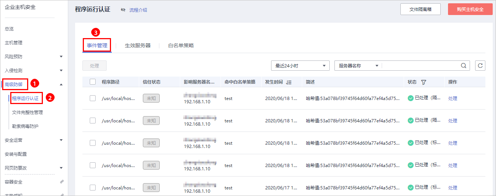
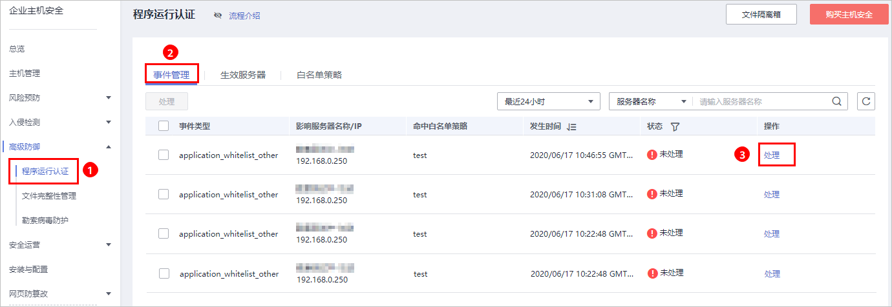
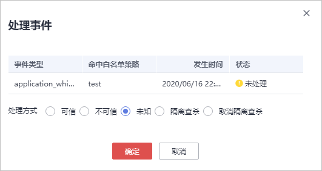

# 查看和处理程序运行事件

服务器应用白名单策略后，HSS将检测该服务器中进程的风险类型，包括“可信“、“不可信“和“未知“，帮助您有效识别服务器中的风险，并对不在白名单策略中的进程进行告警提示或者隔离。

你可以对进程告警事件进行“可信“、“不可信“和“未知“标记。

若您判断进程为恶意程序，可以手动执行“隔离查杀“。程序被隔离查杀时，该程序的进程将被立即终止，为避免影响业务，请及时确认检测结果，若对恶意进程执行误杀，您可以执行取消隔离查杀操作。

事件管理列表展示生效服务器命中白名单策略的“不可信“、“未知“和不在白名单策略中的进程。

> **说明：** 
>建议您对“不可信“、“未知“和不在白名单策略中的进程进行重点排查和处理。

## 查看程序运行事件

1.  [登录管理控制台](https://console.huaweicloud.com)。
2.  在页面左上角选择“区域“，单击，选择“安全与合规  \>  企业主机安全“，进入企业主机安全页面。

    **图 1**  企业主机安全  
    

3.  进入“程序运行认证“页面，选择“事件管理“，如[图2](#fig105477442559)所示。

    **图 2**  程序运行事件管理页面  
    

    **表 1**  程序运行事件管理

    
    <table><thead align="left"><tr id="row124313131566"><th class="cellrowborder" valign="top" width="16.919999999999998%" id="mcps1.2.3.1.1">
参数

    </th>
    <th class="cellrowborder" valign="top" width="83.08%" id="mcps1.2.3.1.2">
参数说明

    </th>
    </tr>
    </thead>
    <tbody><tr id="row524331355617"><td class="cellrowborder" valign="top" width="16.919999999999998%" headers="mcps1.2.3.1.1 ">
程序路径

    </td>
    <td class="cellrowborder" valign="top" width="83.08%" headers="mcps1.2.3.1.2 ">
运行程序的路径。

    </td>
    </tr>
    <tr id="row917312531616"><td class="cellrowborder" valign="top" width="16.919999999999998%" headers="mcps1.2.3.1.1 ">
信任状态

    </td>
    <td class="cellrowborder" valign="top" width="83.08%" headers="mcps1.2.3.1.2 ">
运行程序的可信状态，包括：可信、不可信和未知。

    </td>
    </tr>
    <tr id="row13244141319566"><td class="cellrowborder" valign="top" width="16.919999999999998%" headers="mcps1.2.3.1.1 ">
影响服务器名称/IP

    </td>
    <td class="cellrowborder" valign="top" width="83.08%" headers="mcps1.2.3.1.2 ">
影响的服务器的名称和IP地址。

    </td>
    </tr>
    <tr id="row12441313175615"><td class="cellrowborder" valign="top" width="16.919999999999998%" headers="mcps1.2.3.1.1 ">
命中白名单策略

    </td>
    <td class="cellrowborder" valign="top" width="83.08%" headers="mcps1.2.3.1.2 ">
告警命中的白名单策略。

    </td>
    </tr>
    <tr id="row156021245718"><td class="cellrowborder" valign="top" width="16.919999999999998%" headers="mcps1.2.3.1.1 ">
发生时间

    </td>
    <td class="cellrowborder" valign="top" width="83.08%" headers="mcps1.2.3.1.2 ">
触发告警的时间。

    </td>
    </tr>
    <tr id="row20587172171713"><td class="cellrowborder" valign="top" width="16.919999999999998%" headers="mcps1.2.3.1.1 ">
简述

    </td>
    <td class="cellrowborder" valign="top" width="83.08%" headers="mcps1.2.3.1.2 ">
告警事件的简要描述信息。

    </td>
    </tr>
    <tr id="row144161328185719"><td class="cellrowborder" valign="top" width="16.919999999999998%" headers="mcps1.2.3.1.1 ">
状态

    </td>
    <td class="cellrowborder" valign="top" width="83.08%" headers="mcps1.2.3.1.2 ">
程序运行事件的处理状态，包括“已处理”和“未处理”。

    </td>
    </tr>
    </tbody>
    </table>

## 处理程序运行事件

1.  在事件管理列表的操作列中，单击“处理“，处理进程告警事件，如[图3](#fig166134391595)所示。

    **图 3**  处理应用进程告警事件  
    

2.  在弹出的处理事件窗口中，选择处理方式，处理进程告警事件，如[图4](#fig1076611917129)所示。

    **图 4**  处理进程告警事件  
    

    **表 2**  处理告警事件

    
    <table><thead align="left"><tr id="row13941676119"><th class="cellrowborder" valign="top" width="11.600000000000001%" id="mcps1.2.3.1.1">
处理方式

    </th>
    <th class="cellrowborder" valign="top" width="88.4%" id="mcps1.2.3.1.2">
处理方式说明

    </th>
    </tr>
    </thead>
    <tbody><tr id="row09414718116"><td class="cellrowborder" valign="top" width="11.600000000000001%" headers="mcps1.2.3.1.1 ">
可信

    </td>
    <td class="cellrowborder" valign="top" width="88.4%" headers="mcps1.2.3.1.2 ">
标记进程为“可信”状态，标记为“可信”的进程，该进程启动后将不会触发告警。

    </td>
    </tr>
    <tr id="row4942711115"><td class="cellrowborder" valign="top" width="11.600000000000001%" headers="mcps1.2.3.1.1 ">
不可信

    </td>
    <td class="cellrowborder" valign="top" width="88.4%" headers="mcps1.2.3.1.2 ">
标记进程为“不可信”状态，标记为“不可信”的进程，该进程启动后将触发告警。

    </td>
    </tr>
    <tr id="row79420719113"><td class="cellrowborder" valign="top" width="11.600000000000001%" headers="mcps1.2.3.1.1 ">
未知

    </td>
    <td class="cellrowborder" valign="top" width="88.4%" headers="mcps1.2.3.1.2 ">
标记进程为“未知”状态，标记为“未知”的进程，该进程启动后将触发告警。

    </td>
    </tr>
    <tr id="row6954761119"><td class="cellrowborder" valign="top" width="11.600000000000001%" headers="mcps1.2.3.1.1 ">
隔离查杀

    </td>
    <td class="cellrowborder" valign="top" width="88.4%" headers="mcps1.2.3.1.2 ">
选择隔离查杀后，该程序无法执行“读/写”操作，同时该程序的进程将被立即终止。HSS将程序或者进程的源文件加入文件隔离箱，被隔离的文件不会对主机造成威胁。

    
您可以单击“文件隔离箱”，查看已隔离的文件，详细信息请参见<a href="管理文件隔离箱.md">管理文件隔离箱</a>。

    
 说明： 

程序被隔离查杀时，该程序的进程将被立即终止，为避免影响业务，请及时确认检测结果，若对进程进行误杀，您可以对隔离查杀文件执行恢复操作。

    

    </td>
    </tr>
    <tr id="row595177101118"><td class="cellrowborder" valign="top" width="11.600000000000001%" headers="mcps1.2.3.1.1 ">
取消隔离查杀

    </td>
    <td class="cellrowborder" valign="top" width="88.4%" headers="mcps1.2.3.1.2 ">
若对进程进行误杀，您可以该进程进行取消隔离查杀。

    
 说明： 

请确认取消隔离查杀的进程不是恶意程序，执行取消隔离查杀后，将对隔离查杀的文件进行恢复，请谨慎操作。

    

    </td>
    </tr>
    </tbody>
    </table>

3.  单击“确定“，完成进程告警事件处理。

