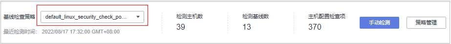
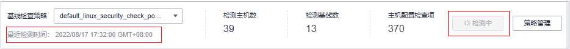
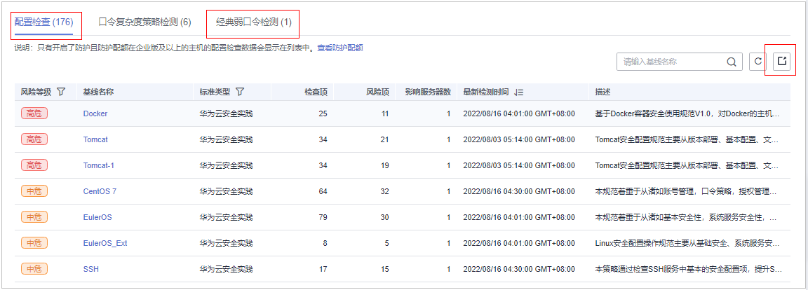

# 查看基线检查概览

HSS提供基线检查功能，包括检测复杂策略、弱口令及配置详情，包括对主机配置基线通过率、主机配置风险TOP5、主机弱口令检测、主机弱口令风险TOP5的统计。主动检测主机中的口令复杂度策略，关键软件中含有风险的配置信息，并针对所发现的风险为您提供[修复建议](查看基线检查详情.md)，帮助您正确地处理服务器内的各种风险配置信息。

## 约束限制

未开启防护的服务器不支持基线相关操作。

## 前提条件

配置检查只有开启了防护且防护配额在企业版及以上的主机数据才会显示在列表中。

## 检查方式

-   自动检查

    主机安全服务默认**每日凌晨04：00**左右将自动进行一次全面的检查。若您需自定义基线自动检测周期及时间，您可开启旗舰版、网页防篡改版、容器版满足需求，自定义基线自动检测周期操作详情请参见[配置检测](编辑策略内容.md#section6401323142512)。

-   手动检查

    如果您需要查看指定服务器的基线风险，您可以为这些服务器[创建基线检查策略](基线检查策略管理.md#section18386192910297)，然后在“基线检查“页面右上角，选择目标基线检查策略，单击“手动检测“。在手动基线检测完成后，查看指定服务器的基线风险。

## 检查详情

<table><tbody><tr id="row4911030319"><td class="cellrowborder" valign="top" width="18.44%">
检查项名称

</td>
<td class="cellrowborder" valign="top" width="81.56%">
检查详情说明

</td>
</tr>
<tr id="row65936834418"><td class="cellrowborder" valign="top" width="18.44%">
口令复杂度策略检测

</td>
<td class="cellrowborder" valign="top" width="81.56%">
检测系统中的口令复杂度策略，给出修改建议，帮助用户提升口令安全性。

</td>
</tr>
<tr id="row4593148114414"><td class="cellrowborder" valign="top" width="18.44%">
经典弱口令检测

</td>
<td class="cellrowborder" valign="top" width="81.56%">
检测系统帐户口令是否属于常用的弱口令，针对弱口令提示用户修改。

</td>
</tr>
<tr id="row7593208164416"><td class="cellrowborder" valign="top" width="18.44%">
配置检查

</td>
<td class="cellrowborder" valign="top" width="81.56%">
对常见的Tomcat配置、Nginx配置、SSH登录配置进行检查，帮助用户识别不安全的配置项。

</td>
</tr>
</tbody>
</table>

## 操作步骤

1.  [登录管理控制台](https://console.huaweicloud.com/?locale=zh-cn)。
2.  在页面左上角选择“区域“，单击，选择“安全与合规 \> 主机安全服务”，进入主机安全平台界面。

    **图 1**  进入主机安全  
    

3.  在左侧导航树中，选择“风险预防  \>  基线检查“，进入基线检查页面。

    > **说明：** 
    >如果您的服务器已通过企业项目的模式进行管理，您可选择目标“企业项目“后查看或操作目标企业项目内的资产和检测信息。

4.  在“基线检查“页面，查看检测数据的统计，选择不同页签，查看HSS检测到的您服务器上存在的配置风险，参数说明如[表1](#table415319491112)所示。

    如果您想查看不同基线检查策略下服务器的检查数据统计，您可以通过切换“基线检查策略“进行查看。

    **图 2**  基线检查概览  
    

    **表 1**  基线检查概览

    
    <table><thead align="left"><tr id="row815344111112"><th class="cellrowborder" valign="top" width="29.45%" id="mcps1.2.3.1.1">
参数名称

    </th>
    <th class="cellrowborder" valign="top" width="70.55%" id="mcps1.2.3.1.2">
参数说明

    </th>
    </tr>
    </thead>
    <tbody><tr id="row21548451112"><td class="cellrowborder" valign="top" width="29.45%" headers="mcps1.2.3.1.1 ">
基线检查策略

    </td>
    <td class="cellrowborder" valign="top" width="70.55%" headers="mcps1.2.3.1.2 ">
选择要查看的基线策略检测的结果，所有可选择的基线检查策略均为已添加的基线检查策略，可进行自定义创建、编辑、删除。

    </td>
    </tr>
    <tr id="row915416413114"><td class="cellrowborder" valign="top" width="29.45%" headers="mcps1.2.3.1.1 ">
检测主机数

    </td>
    <td class="cellrowborder" valign="top" width="70.55%" headers="mcps1.2.3.1.2 ">
已检测的主机总数。

    </td>
    </tr>
    <tr id="row18154134141120"><td class="cellrowborder" valign="top" width="29.45%" headers="mcps1.2.3.1.1 ">
检测基线数

    </td>
    <td class="cellrowborder" valign="top" width="70.55%" headers="mcps1.2.3.1.2 ">
检测主机时执行的基线数。

    </td>
    </tr>
    <tr id="row915410411116"><td class="cellrowborder" valign="top" width="29.45%" headers="mcps1.2.3.1.1 ">
主机配置检查项

    </td>
    <td class="cellrowborder" valign="top" width="70.55%" headers="mcps1.2.3.1.2 ">
已检查主机配置项的总数。

    </td>
    </tr>
    <tr id="row18155204111116"><td class="cellrowborder" valign="top" width="29.45%" headers="mcps1.2.3.1.1 ">
主机配置基线通过率

    </td>
    <td class="cellrowborder" valign="top" width="70.55%" headers="mcps1.2.3.1.2 ">
按照基线检测主机配置通过的配置项占总检测项的占比，同时按照不同风险等级分别统计未通过的配置项总数。

    </td>
    </tr>
    <tr id="row31551145113"><td class="cellrowborder" valign="top" width="29.45%" headers="mcps1.2.3.1.1 ">
主机配置风险TOP5

    </td>
    <td class="cellrowborder" valign="top" width="70.55%" headers="mcps1.2.3.1.2 ">
按照主机的维度统计存在配置风险的主机。

    
优先按照高危且风险总数最多的前5台主机进行排序，若不存在高危，则依次为中危、低危。

    </td>
    </tr>
    <tr id="row315510420113"><td class="cellrowborder" valign="top" width="29.45%" headers="mcps1.2.3.1.1 ">
主机弱口令检测统计

    </td>
    <td class="cellrowborder" valign="top" width="70.55%" headers="mcps1.2.3.1.2 ">
统计检测弱口令的主机总数，以及有弱口令、未开启检测、无弱口令检测的主机数。

    </td>
    </tr>
    <tr id="row1015574111118"><td class="cellrowborder" valign="top" width="29.45%" headers="mcps1.2.3.1.1 ">
主机弱口令风险TOP5

    </td>
    <td class="cellrowborder" valign="top" width="70.55%" headers="mcps1.2.3.1.2 ">
按照主机的维度统计存在弱口令风险最多的前5台主机。

    </td>
    </tr>
    <tr id="row915544191116"><td class="cellrowborder" valign="top" width="29.45%" headers="mcps1.2.3.1.1 ">
配置检查

    </td>
    <td class="cellrowborder" valign="top" width="70.55%" headers="mcps1.2.3.1.2 ">
对所有存在配置风险的主机进行等级告警及风险信息统计。

    </td>
    </tr>
    <tr id="row9156154151117"><td class="cellrowborder" valign="top" width="29.45%" headers="mcps1.2.3.1.1 ">
口令复杂度策略检测

    </td>
    <td class="cellrowborder" valign="top" width="70.55%" headers="mcps1.2.3.1.2 ">
对所有主机存在弱口令复杂度不满足基线标准的进行统计。

    </td>
    </tr>
    <tr id="row915612412116"><td class="cellrowborder" valign="top" width="29.45%" headers="mcps1.2.3.1.1 ">
经典弱口令检测

    </td>
    <td class="cellrowborder" valign="top" width="70.55%" headers="mcps1.2.3.1.2 ">
按照主机的维度对存在弱口令的主机及涉及的账号进行统计。

    </td>
    </tr>
    </tbody>
    </table>

## 手动执行基线检查

> **须知：** 
>-   手动检测只针对目标基线策略所关联的服务器。若使用默认策略，请先[关联服务器](基线检查策略管理.md#li20936195803613)后再执行手动检测。
>-   执行手动检测前，请先确认在“基线检查策略“选框是否可以选择到目标策略，若需新建策略，详情请参见[新建基线检查策略](基线检查策略管理.md#section18386192910297)。

1.  在“风险预防  \>  基线检查“概览页选择目标“基线检查策略“。

    **图 3**  选择目标基线策略  
    

2.  单击页面右上角“手动检测“，执行检测。
3.  查看“基线检查策略“下方“最近检测时间“为当前检测时间时，表示检测完成。

    > **说明：** 
    >-   执行手动检测后，按钮状态变为检测中，若检测时间超过30分钟，按钮会自动释放为可单击状态，此时仍需等待“最近检测时间“显示为当前检测时间才表示检测完成。
    >-   检测结束后可参照[查看基线检查详情](查看基线检查详情.md)查看对应检查项结果及修改建议。

    **图 4**  查看检测状态  
    

## 导出基线检查报告

根据需要可通过筛选导出基线检测报告。

1.  [登录管理控制台](https://console.huaweicloud.com/?locale=zh-cn)。
2.  在页面左上角选择“区域“，单击，选择“安全与合规 \> 主机安全服务”，进入主机安全平台界面。

    **图 5**  进入主机安全  
    

3.  在左侧导航树中，选择“风险预防  \>  基线检查“，进入基线检查页面。
4.  在“基线检查“页面，查看检测数据的统计，选择不同页签，可查看HSS检测到的风险告警。

    > **说明：** 
    >当前仅支持“配置检查“和“经典弱口令检测“的报告导出。

    **图 6**  查看风险列表  
    

5.  选择“配置检查“或“经典弱口令检测“页签，在列表右上角单击，对筛选的风险告警进行下载。

    > **说明：** 
    >-   在“配置检查“页签可单击“风险等级“和“标准类型“对告警信息进行筛选。
    >-   在“经典弱口令检测“页签可通过筛选服务器名称、IP地址、账号名称进行筛选下载。
    >-   “配置检查“和“经典弱口令检测“的风险检测报告单次下载最大数量为5000条。

