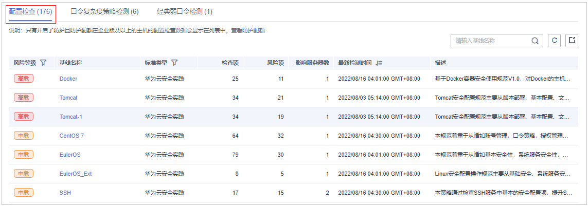
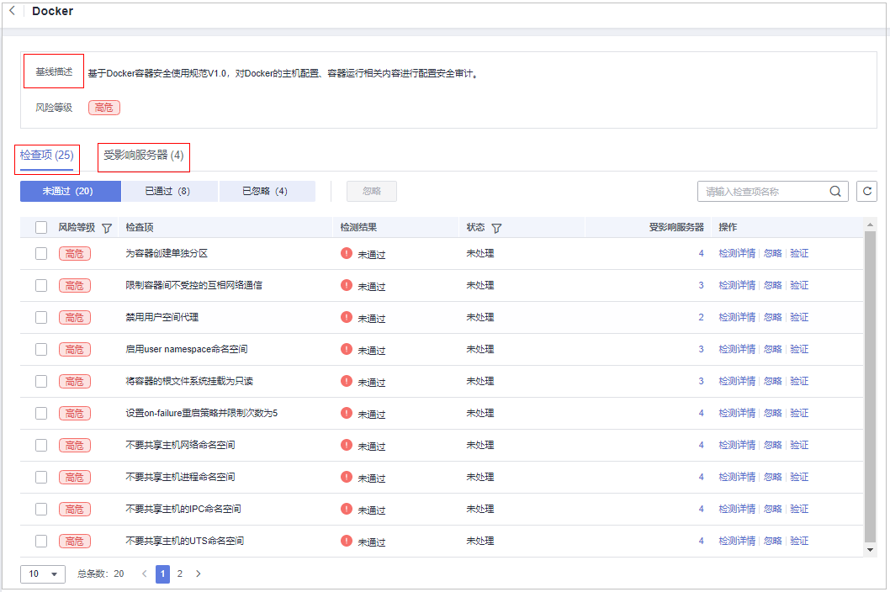
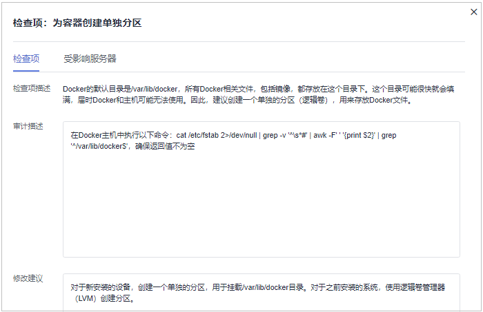
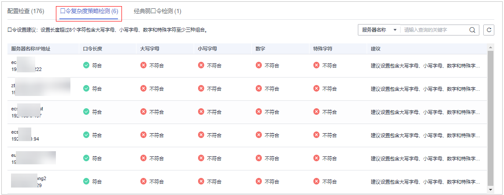
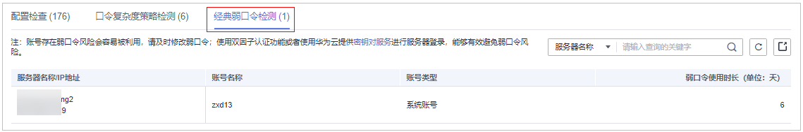
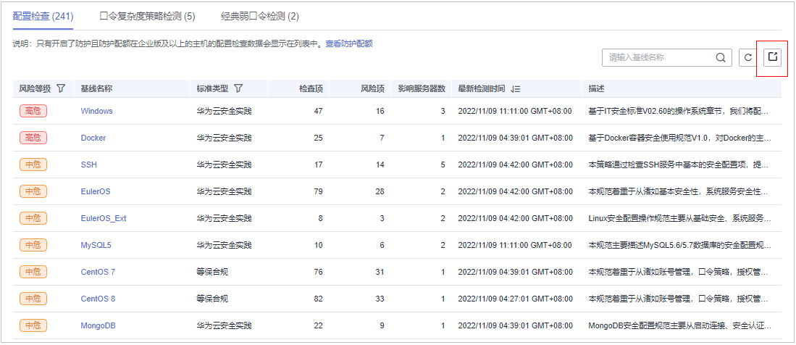

# 查看基线检查详情

HSS提供基线检查功能，主动检测主机中的口令复杂度策略，关键软件中含有风险的配置信息，并针对所发现的风险为您提供修复建议，帮助您正确地处理服务器内的各种风险配置信息。关于基线检查的详细说明请参见[基线检查功能介绍](https://support.huaweicloud.com/productdesc-hss2.0/hss_01_0136.html#section0)。

## 约束限制

未开启防护的服务器不支持基线相关操作。

## 前提条件

配置检查只有开启了防护且防护配额在企业版及以上的主机数据才会显示在列表中。

## 检测说明

Linux系统的MySQL基线检测基于MySQL5安全配置规范指导，若您主机上装有版本号为8的MySQL软件，以下检查项因已废弃不会出现在检测结果中，只在MySQL版本为5的服务器中呈现检测结果。

-   规则：old\_passwords不能设置为 1
-   规则：secure\_auth设置为1或ON
-   规则：禁止设置skip\_secure\_auth
-   规则：设置log\_warnings为2
-   规则：配置MySQL binlog日志清理策略
-   规则：sql\_mode参数包含NO\_AUTO\_CREATE\_USER
-   规则：使用MySQL审计插件

## 检查项列表

**表 1**  检查项列表

<table><thead align="left"><tr id="row172016143817"><th class="cellrowborder" valign="top" width="18.68%" id="mcps1.2.3.1.1">
检查项

</th>
<th class="cellrowborder" valign="top" width="81.32000000000001%" id="mcps1.2.3.1.2">
说明

</th>
</tr>
</thead>
<tbody><tr id="row873493194615"><td class="cellrowborder" valign="top" width="18.68%" headers="mcps1.2.3.1.1 ">
配置检查

</td>
<td class="cellrowborder" valign="top" width="81.32000000000001%" headers="mcps1.2.3.1.2 ">
目前支持的检测标准及类型如下：

<ul id="ul20138439132310"><li>Linux系统：<ul id="ul2019810211077"><li>云安全实践：Apache2、Docker、MongoDB、Redis、MySQL5、Nginx、Tomcat、SSH、vsftp、CentOS7、EulerOS、EulerOS_ext、Kubernetes-Node、Kubernetes-Master。</li><li>等保合规：Apache2、MongoDB、MySQL5、Nginx、Tomcat、CentOS6、CentOS7、CentOS8、Debian9、Debian10、Debian11、Redhat6、Redhat7、Redhat8、Ubuntu12、Ubuntu14、Ubuntu16、Ubuntu18、Alma。</li></ul>
</li><li>Windows系统：<ul id="ul10325481376"><li>云安全实践：MongoDB、Apache2、MySQL、Nginx、Redis、Tomcat、Windows_2008、Windows_2012、Windows_2016、Windows_2019。</li></ul>
</li></ul>
</td>
</tr>
<tr id="row22020110381"><td class="cellrowborder" valign="top" width="18.68%" headers="mcps1.2.3.1.1 ">
口令复杂度策略检测

</td>
<td class="cellrowborder" valign="top" width="81.32000000000001%" headers="mcps1.2.3.1.2 ">
检测系统账号的口令复杂度策略。

</td>
</tr>
<tr id="row55791310384"><td class="cellrowborder" valign="top" width="18.68%" headers="mcps1.2.3.1.1 ">
经典弱口令检测

</td>
<td class="cellrowborder" valign="top" width="81.32000000000001%" headers="mcps1.2.3.1.2 ">
通过与弱口令库对比，检测账号口令是否属于常用的弱口令。

支持MySQL、FTP及系统账号的弱口令检测。

</td>
</tr>
</tbody>
</table>

## 查看配置检查

查看配置检查的风险统计及对应的处理建议。

1.  [登录管理控制台](https://console.huaweicloud.com/?locale=zh-cn)。
2.  在页面左上角选择“区域“，单击，选择“安全与合规 \> 主机安全服务”，进入主机安全平台界面。

    **图 1**  进入主机安全  
    

3.  在左侧导航树中，选择“风险预防  \>  基线检查“，进入基线检查页面。

    > **说明：** 
    >如果您的服务器已通过企业项目的模式进行管理，您可选择目标“企业项目“后查看或操作目标企业项目内的资产和检测信息。

4.  选择“配置检查“页签，查看所有服务器的配置检查风险项，参数说明如[表2](#table134691656201019)所示。

    如果您需要查看指定基线检查策略下服务器的配置检查结果统计，您可以在基线检查策略栏选择目标基线检查策略后查看。

    **图 2**  查看配置检查统计  
    

    **表 2**  配置检查参数说明

    
    <table><thead align="left"><tr id="row11469556171012"><th class="cellrowborder" valign="top" width="15.43%" id="mcps1.2.3.1.1">
参数名称

    </th>
    <th class="cellrowborder" valign="top" width="84.57000000000001%" id="mcps1.2.3.1.2">
参数说明

    </th>
    </tr>
    </thead>
    <tbody><tr id="row24691456171015"><td class="cellrowborder" valign="top" width="15.43%" headers="mcps1.2.3.1.1 ">
风险等级

    </td>
    <td class="cellrowborder" valign="top" width="84.57000000000001%" headers="mcps1.2.3.1.2 ">
按照基线标准匹配检测结果划分的等级。

    <ul id="ul1234183411410"><li>高危</li><li>低危</li><li>中危</li><li>无风险</li></ul>
    </td>
    </tr>
    <tr id="row947085611100"><td class="cellrowborder" valign="top" width="15.43%" headers="mcps1.2.3.1.1 ">
基线名称

    </td>
    <td class="cellrowborder" valign="top" width="84.57000000000001%" headers="mcps1.2.3.1.2 ">
检测执行的基线的名称。

    </td>
    </tr>
    <tr id="row14701056131012"><td class="cellrowborder" valign="top" width="15.43%" headers="mcps1.2.3.1.1 ">
标准类型

    </td>
    <td class="cellrowborder" valign="top" width="84.57000000000001%" headers="mcps1.2.3.1.2 ">
检测执行的基线所属策略的标准类型。

    <ul id="ul1980215891513"><li>云安全实践</li><li>等保合规</li></ul>
    </td>
    </tr>
    <tr id="row14470156191016"><td class="cellrowborder" valign="top" width="15.43%" headers="mcps1.2.3.1.1 ">
检查项

    </td>
    <td class="cellrowborder" valign="top" width="84.57000000000001%" headers="mcps1.2.3.1.2 ">
累计检查的配置项总数。

    </td>
    </tr>
    <tr id="row94709567102"><td class="cellrowborder" valign="top" width="15.43%" headers="mcps1.2.3.1.1 ">
风险项

    </td>
    <td class="cellrowborder" valign="top" width="84.57000000000001%" headers="mcps1.2.3.1.2 ">
检查项中存在风险的配置项总数。

    </td>
    </tr>
    <tr id="row847117569107"><td class="cellrowborder" valign="top" width="15.43%" headers="mcps1.2.3.1.1 ">
影响服务器数

    </td>
    <td class="cellrowborder" valign="top" width="84.57000000000001%" headers="mcps1.2.3.1.2 ">
目标风险基线所影响的服务器总数。

    </td>
    </tr>
    <tr id="row114919295115"><td class="cellrowborder" valign="top" width="15.43%" headers="mcps1.2.3.1.1 ">
最新检测时间

    </td>
    <td class="cellrowborder" valign="top" width="84.57000000000001%" headers="mcps1.2.3.1.2 ">
最近一次检测的时间。

    </td>
    </tr>
    <tr id="row104711956101020"><td class="cellrowborder" valign="top" width="15.43%" headers="mcps1.2.3.1.1 ">
描述

    </td>
    <td class="cellrowborder" valign="top" width="84.57000000000001%" headers="mcps1.2.3.1.2 ">
目标风险基线的描述说明。

    </td>
    </tr>
    </tbody>
    </table>

5.  单击列表中目标基线名称，查看目标基线描述、受影响服务器以及所有检查项详情。

    **图 3**  查看基线检查详情  
    

6.  单击目标检查项“操作“列的“检测详情“，查看检查项描述、审计描述和修改建议。

    您需要确认检查的风险项是否是致命或需要修改的风险。

    如果是，可根据修改建议对目标检查项进行修改。如果不是，可在配置检查项列表页面单击目标检查项“操作“列的“忽略“操作进行忽略。

    **图 4**  查看检查项详情  
    

## 查看口令复杂度策略检测

查看口令复杂度策略检测的风险统计及对应的处理建议。

1.  登录管理控制台，进入主机安全服务页面。
2.  在左侧导航树中，选择“风险预防  \>  基线检查“，进入基线检查页面。

    > **说明：** 
    >如果您的服务器已通过企业项目的模式进行管理，您可选择目标“企业项目“后查看或操作目标企业项目内的资产和检测信息。

3.  选择“口令复杂度策略检测“页签，查看口令复杂度策略检测的风险统计项及修改建议，参数说明如[表3](#table14462543144512)所示。

    **图 5**  查看口令复杂度策略检测统计  
    

    **表 3**  口令复杂度策略检测参数说明

    
    <table><thead align="left"><tr id="row10463174318451"><th class="cellrowborder" valign="top" width="15.440000000000001%" id="mcps1.2.3.1.1">
参数名称

    </th>
    <th class="cellrowborder" valign="top" width="84.56%" id="mcps1.2.3.1.2">
参数说明

    </th>
    </tr>
    </thead>
    <tbody><tr id="row1146314364514"><td class="cellrowborder" valign="top" width="15.440000000000001%" headers="mcps1.2.3.1.1 ">
服务器名称/IP地址

    </td>
    <td class="cellrowborder" valign="top" width="84.56%" headers="mcps1.2.3.1.2 ">
被检测的服务器名称及IP地址。

    </td>
    </tr>
    <tr id="row5464124319458"><td class="cellrowborder" valign="top" width="15.440000000000001%" headers="mcps1.2.3.1.1 ">
口令长度

    </td>
    <td class="cellrowborder" valign="top" width="84.56%" headers="mcps1.2.3.1.2 ">
目标服务器的口令长度是否符合标准。

    <ul id="ul186749371537"><li>符合</li><li>不符合</li></ul>
    </td>
    </tr>
    <tr id="row24641343124510"><td class="cellrowborder" valign="top" width="15.440000000000001%" headers="mcps1.2.3.1.1 ">
大写字母

    </td>
    <td class="cellrowborder" valign="top" width="84.56%" headers="mcps1.2.3.1.2 ">
目标服务器的口令大写字母是否符合标准。

    <ul id="ul03111338115416"><li>符合</li><li>不符合</li></ul>
    </td>
    </tr>
    <tr id="row4464194312459"><td class="cellrowborder" valign="top" width="15.440000000000001%" headers="mcps1.2.3.1.1 ">
小写字母

    </td>
    <td class="cellrowborder" valign="top" width="84.56%" headers="mcps1.2.3.1.2 ">
目标服务器的口令小写字母是否符合标准。

    <ul id="ul168754412540"><li>符合</li><li>不符合</li></ul>
    </td>
    </tr>
    <tr id="row346434313453"><td class="cellrowborder" valign="top" width="15.440000000000001%" headers="mcps1.2.3.1.1 ">
数字

    </td>
    <td class="cellrowborder" valign="top" width="84.56%" headers="mcps1.2.3.1.2 ">
目标服务器的口令数字是否符合标准。

    <ul id="ul14453544105411"><li>符合</li><li>不符合</li></ul>
    </td>
    </tr>
    <tr id="row1446517437459"><td class="cellrowborder" valign="top" width="15.440000000000001%" headers="mcps1.2.3.1.1 ">
特殊字符

    </td>
    <td class="cellrowborder" valign="top" width="84.56%" headers="mcps1.2.3.1.2 ">
目标服务器的口令特殊字符是否符合标准。

    <ul id="ul1221135765419"><li>符合</li><li>不符合</li></ul>
    </td>
    </tr>
    <tr id="row1046594374518"><td class="cellrowborder" valign="top" width="15.440000000000001%" headers="mcps1.2.3.1.1 ">
建议

    </td>
    <td class="cellrowborder" valign="top" width="84.56%" headers="mcps1.2.3.1.2 ">
对目标服务器发现的口令风险的修改建议。

    </td>
    </tr>
    </tbody>
    </table>

## 查看经典弱口令检测

查看经典弱口令检测的风险统计及对应的处理建议。

1.  登录管理控制台，进入主机安全服务页面。
2.  在左侧导航树中，选择“风险预防  \>  基线检查“，进入基线检查页面。

    > **说明：** 
    >如果您的服务器已通过企业项目的模式进行管理，您可选择目标“企业项目“后查看或操作目标企业项目内的资产和检测信息。

3.  选择“经典弱口令检测“页签，查看服务器中存在风险的弱口令账号的统计，参数说明如[表4](#table34521611135818)所示。

    **图 6**  查看经典弱口令检测  
    

    **表 4**  经典弱口令检测参数说明

    
    <table><thead align="left"><tr id="row17453811145811"><th class="cellrowborder" valign="top" width="19.55%" id="mcps1.2.3.1.1">
参数名称

    </th>
    <th class="cellrowborder" valign="top" width="80.45%" id="mcps1.2.3.1.2">
参数说明

    </th>
    </tr>
    </thead>
    <tbody><tr id="row154531511165811"><td class="cellrowborder" valign="top" width="19.55%" headers="mcps1.2.3.1.1 ">
服务器名称/IP地址

    </td>
    <td class="cellrowborder" valign="top" width="80.45%" headers="mcps1.2.3.1.2 ">
被检测的服务器名称及IP地址。

    </td>
    </tr>
    <tr id="row145401175814"><td class="cellrowborder" valign="top" width="19.55%" headers="mcps1.2.3.1.1 ">
账号名称

    </td>
    <td class="cellrowborder" valign="top" width="80.45%" headers="mcps1.2.3.1.2 ">
目标服务器中被检测出是弱口令的账号。

    </td>
    </tr>
    <tr id="row1845491135817"><td class="cellrowborder" valign="top" width="19.55%" headers="mcps1.2.3.1.1 ">
账号类型

    </td>
    <td class="cellrowborder" valign="top" width="80.45%" headers="mcps1.2.3.1.2 ">
账号的类型。

    </td>
    </tr>
    <tr id="row1145401119581"><td class="cellrowborder" valign="top" width="19.55%" headers="mcps1.2.3.1.1 ">
弱口令使用时长（单位：天）

    </td>
    <td class="cellrowborder" valign="top" width="80.45%" headers="mcps1.2.3.1.2 ">
目标弱口令使用的时间周期。

    </td>
    </tr>
    </tbody>
    </table>

    > **说明：** 
    >-   为保障您的主机安全，请您及时修改登录主机系统时使用弱口令的账号，如SSH账号。
    >-   为保障您主机内部数据信息的安全，请您及时修改使用弱口令的软件账号，如MySQL账号和FTP账号等。
    >**验证**：完成弱口令修复后，建议您立即执行手动检测，查看弱口令修复结果。如果您未进行手动验证，HSS会在次日凌晨执行自动验证。
    >-   口令设置建议：设置长度超过8个字符且均包含大写字母、小写字母、数字和特殊字符。

## 导出基线检查报告

在基线检查页面，可对配置检查和经典弱口令检查详情进行导出，列表右上角单击，可将所有云服务器的配置检测风险列表下载到本地。

> **说明：** 
>-   不支持对单个云服务器执行导出。
>-   单次最大导出告警数为5000条。

**图 7**  导出基线报告  

