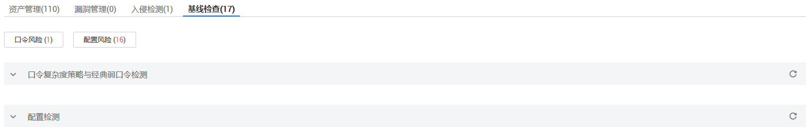

# 查看基线检查详情

基线检查功能将主动检测主机中的口令复杂度策略，含有风险的账号及主机系统和关键软件中含有风险的配置信息，并针对所发现的风险为您提供[修复建议](基线检查风险项修复建议.md)，帮助您正确地处理服务器内的各种风险配置信息。关于基线检查的详细说明请参见[基线检查功能介绍](https://support.huaweicloud.com/productdesc-hss/hss_01_0010.html#section3)。

## 检测周期

企业主机安全服务**每日凌晨**将自动进行一次全面的检查。

## 告警策略

通过检测您服务器上的口令、账号、软件配置信息，如果发现您的服务器存在弱口令、风险账号、配置风险，HSS将会触发告警信息。

> **说明：**   
>您可在“企业主机安全  \>  安装与配置“页面开启相应告警通知。详细操作请参见[步骤三：设置告警通知](步骤三-设置告警通知.md)。  

## 检查项列表

**表 1**  检查项列表

<table><thead align="left"><tr id="row172016143817"><th class="cellrowborder" valign="top" width="29.25%" id="mcps1.2.3.1.1">
检查项

</th>
<th class="cellrowborder" valign="top" width="70.75%" id="mcps1.2.3.1.2">
说明

</th>
</tr>
</thead>
<tbody><tr id="row22020110381"><td class="cellrowborder" valign="top" width="29.25%" headers="mcps1.2.3.1.1 ">
口令复杂度策略检测

</td>
<td class="cellrowborder" valign="top" width="70.75%" headers="mcps1.2.3.1.2 ">
检测系统账号的口令复杂度策略。

</td>
</tr>
<tr id="row55791310384"><td class="cellrowborder" valign="top" width="29.25%" headers="mcps1.2.3.1.1 ">
经典弱口令检测

</td>
<td class="cellrowborder" valign="top" width="70.75%" headers="mcps1.2.3.1.2 ">
支持MySQL、FTP及系统账号的弱口令检测。

</td>
</tr>
<tr id="row192318118382"><td class="cellrowborder" valign="top" width="29.25%" headers="mcps1.2.3.1.1 ">
风险账号检测

</td>
<td class="cellrowborder" valign="top" width="70.75%" headers="mcps1.2.3.1.2 ">
检查出服务器系统中可疑的隐藏账号、克隆账号。

</td>
</tr>
<tr id="row324161113814"><td class="cellrowborder" valign="top" width="29.25%" headers="mcps1.2.3.1.1 ">
配置检测

</td>
<td class="cellrowborder" valign="top" width="70.75%" headers="mcps1.2.3.1.2 ">
目前支持的配置检测类型有：Tomcat、SSH、Nginx、Redis、Apache2、MySQL5。

</td>
</tr>
</tbody>
</table>

## 操作步骤

1.  [登录管理控制台](https://console.huaweicloud.com)。
2.  在页面上方选择“区域“后，单击“服务列表“，选择“安全  \>  企业主机安全“。
3.  进入“基线检查“页面，选择不同页签，查看HSS检测到的您服务器上存在的配置风险。

    **图 1**  基线检查结果  
    

## 导出配置检测报告

在配置检测页面，列表右上角单击，可将所有云服务器的配置检测风险列表下载到本地。

> **说明：**   
>不支持对单个云服务器执行导出。  

