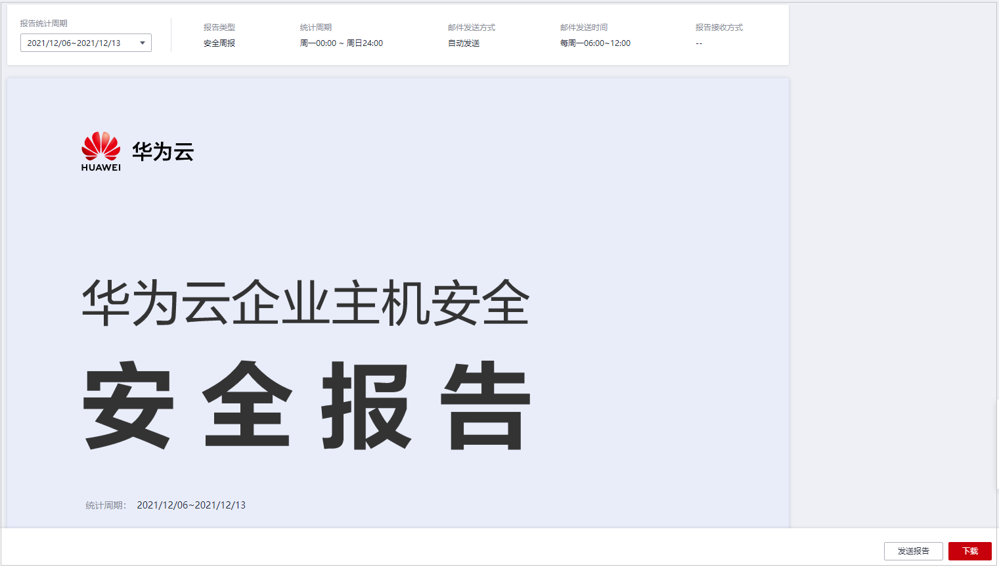
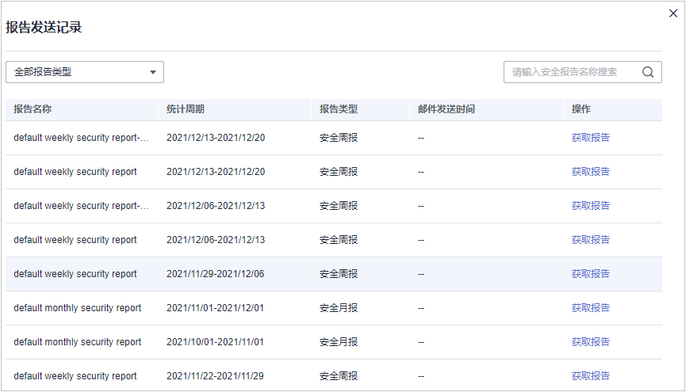

# 查看安全报告

主机安全服务支持订阅[日报](创建安全报告.md#hss_01_0556_li77667419127)、周报、月报和[自定义](创建安全报告.md#hss_01_0556_li77667419127)，展现不同周期主机安全趋势以及关键安全事件与风险，订阅报告将为您保存6个月，以满足等保测评以及审计的需要。

> **说明：** 
>-   如果您已开通企业项目，您可以在“企业项目“下拉列表中，选择您所在的企业项目，订阅您所在企业项目的主机安全报告；或者选择“所有项目“，订阅当前区域下所有项目的主机安全报告。
>-   勾选订阅报告后，第二天即可查看、下载。

## 约束限制

企业版及以上版本支持安全报告相关操作。

## 安全报告概览

1.  [登录管理控制台](https://console.huaweicloud.com/?locale=zh-cn)。
2.  在页面左上角选择“区域“，单击，选择“安全与合规 \> 主机安全服务”，进入主机安全平台界面。

    **图 1**  进入主机安全  
    

3.  左侧选择“安全报告“进入安全报告概览页面。

    服务预设了按月（default monthly security report）和按周（default weekly security report）统计的两个安全报告模板，可直接使用。

    > **说明：** 
    >如果您的服务器已通过企业项目的模式进行管理，您可选择目标“企业项目“后查看或操作目标企业项目内的资产和检测信息。

    **图 2**  查看安全报告  
    

4.  单击目标报告的“获取报告“，跳转至报告预览页，可查看报告信息、下载、发送报告。

    **图 3**  预览报告  
    

## 查看报告发送记录

发送记录存储了邮件发送报告的发送详情。

1.  单击安全报告概览页右上角的“报告发送记录“查看报告发送记录。
2.  在弹窗中查看报告发送记录，参数说明如[表1](#hss_01_0554_table610843618296)所示。

    **图 4**  报告发送详情  
    

    **表 1**  报告发送记录参数

    
    <table><thead align="left"><tr id="hss_01_0554_row131081836142910"><th class="cellrowborder" valign="top" width="16.939999999999998%" id="mcps1.2.3.1.1">
参数名称

    </th>
    <th class="cellrowborder" valign="top" width="83.06%" id="mcps1.2.3.1.2">
参数说明

    </th>
    </tr>
    </thead>
    <tbody><tr id="hss_01_0554_row1108536202912"><td class="cellrowborder" valign="top" width="16.939999999999998%" headers="mcps1.2.3.1.1 ">
报告名称

    </td>
    <td class="cellrowborder" valign="top" width="83.06%" headers="mcps1.2.3.1.2 ">
已发送报告的名称。

    </td>
    </tr>
    <tr id="hss_01_0554_row610823610294"><td class="cellrowborder" valign="top" width="16.939999999999998%" headers="mcps1.2.3.1.1 ">
统计周期

    </td>
    <td class="cellrowborder" valign="top" width="83.06%" headers="mcps1.2.3.1.2 ">
目标发送报告内容的统计周期。

    </td>
    </tr>
    <tr id="hss_01_0554_row12108103614291"><td class="cellrowborder" valign="top" width="16.939999999999998%" headers="mcps1.2.3.1.1 ">
报告类型

    </td>
    <td class="cellrowborder" valign="top" width="83.06%" headers="mcps1.2.3.1.2 ">
目标发送报告的统计周期类型。

    <ul id="hss_01_0554_ul9108183615290"><li>安全周报</li><li>安全月报</li><li>安全日报</li><li>自定义报告</li></ul>
    </td>
    </tr>
    <tr id="hss_01_0554_row110863614290"><td class="cellrowborder" valign="top" width="16.939999999999998%" headers="mcps1.2.3.1.1 ">
邮件发送时间

    </td>
    <td class="cellrowborder" valign="top" width="83.06%" headers="mcps1.2.3.1.2 ">
目标报告发送的时间。

    </td>
    </tr>
    </tbody>
    </table>

3.  单击“操作“列的“获取报告“可查看历史发送的报告信息，同时可预览和下载报告。

