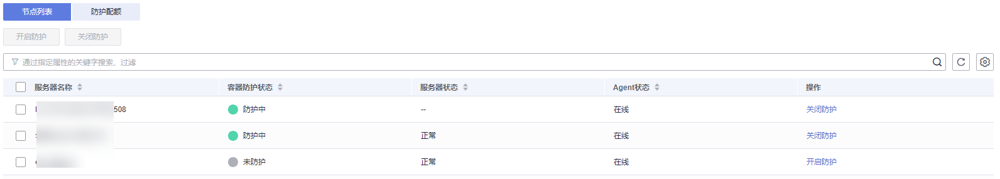
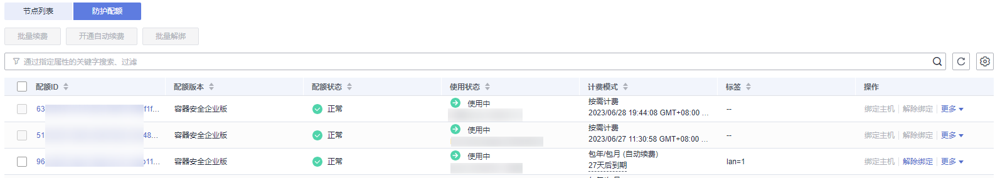

# 查看容器节点防护列表

节点列表展示了云容器引擎服务（CCE）中集群节点的防护状态、节点状态和Agent状态，帮助您实时了解节点的安全状态。

## 约束限制

-   仅支持Linux系统。
-   未开启企业版、旗舰版、网页防篡改版、容器版防护不支持容器相关操作。

## 查看节点列表

1.  [登录管理控制台](https://console.huaweicloud.com/?locale=zh-cn)。
2.  在页面左上角选择“区域“，单击，选择“安全与合规 \> 主机安全服务”，进入主机安全平台界面。

    **图 1**  进入主机安全  
    

3.  在左侧导航栏中，选择“资产管理  \>  容器管理“，单击“容器节点管理“。

    > **说明：** 
    >如果您的服务器已通过企业项目的模式进行管理，您可选择目标“企业项目“后查看或操作目标企业项目内的资产和检测信息。

4.  选择“节点列表“页签，查看节点防护状态。节点列表参数说明如[表1](#table13936165011391)所示。

    **图 2**  节点列表  
    

    **表 1**  节点防护状态参数说明

    
    <table><thead align="left"><tr id="row3920205053911"><th class="cellrowborder" valign="top" width="34%" id="mcps1.2.3.1.1">
参数名称

    </th>
    <th class="cellrowborder" valign="top" width="66%" id="mcps1.2.3.1.2">
说明

    </th>
    </tr>
    </thead>
    <tbody><tr id="row92695418218"><td class="cellrowborder" valign="top" width="34%" headers="mcps1.2.3.1.1 ">
服务器名称

    </td>
    <td class="cellrowborder" valign="top" width="66%" headers="mcps1.2.3.1.2 ">
目标服务器名称。

    </td>
    </tr>
    <tr id="row492010507398"><td class="cellrowborder" valign="top" width="34%" headers="mcps1.2.3.1.1 ">
容器防护状态

    </td>
    <td class="cellrowborder" valign="top" width="66%" headers="mcps1.2.3.1.2 ">
节点的防护状态，包括：

    <ul id="ul72181449101418"><li>未防护</li><li>防护中</li><li>防护中断</li></ul>
    </td>
    </tr>
    <tr id="row1654294813412"><td class="cellrowborder" valign="top" width="34%" headers="mcps1.2.3.1.1 ">
服务器状态

    </td>
    <td class="cellrowborder" valign="top" width="66%" headers="mcps1.2.3.1.2 "><ul id="ul1637324111718"><li>运行中</li><li>不可用</li><li>正常</li></ul>
    </td>
    </tr>
    <tr id="row177681562595"><td class="cellrowborder" valign="top" width="34%" headers="mcps1.2.3.1.1 ">
Agent状态

    </td>
    <td class="cellrowborder" valign="top" width="66%" headers="mcps1.2.3.1.2 "><ul id="ul196768151907"><li>在线</li><li>离线</li><li>未安装</li></ul>
    </td>
    </tr>
    </tbody>
    </table>

## 查看防护配额

在“容器节点管理“界面，选择“防护配额“页签，查看防护配额详细信息。

**图 3**  查看防护配额  

**表 2**  容器配额参数说明

<table><thead align="left"><tr id="hss_01_0108_row94181712319"><th class="cellrowborder" valign="top" width="16.61%" id="mcps1.2.3.1.1">
参数名称

</th>
<th class="cellrowborder" valign="top" width="83.39%" id="mcps1.2.3.1.2">
参数说明

</th>
</tr>
</thead>
<tbody><tr id="hss_01_0108_row64188112318"><td class="cellrowborder" valign="top" width="16.61%" headers="mcps1.2.3.1.1 ">
配额ID

</td>
<td class="cellrowborder" valign="top" width="83.39%" headers="mcps1.2.3.1.2 ">
配额的ID。

</td>
</tr>
<tr id="hss_01_0108_row194897364591"><td class="cellrowborder" valign="top" width="16.61%" headers="mcps1.2.3.1.1 ">
配额版本

</td>
<td class="cellrowborder" valign="top" width="83.39%" headers="mcps1.2.3.1.2 ">
容器安全企业版。

</td>
</tr>
<tr id="hss_01_0108_row2418121203119"><td class="cellrowborder" valign="top" width="16.61%" headers="mcps1.2.3.1.1 ">
配额状态

</td>
<td class="cellrowborder" valign="top" width="83.39%" headers="mcps1.2.3.1.2 "><ul id="hss_01_0108_ul12936152312318"><li>正常：配额状态。</li><li>已过期：配额已到期，在此期间您仍然可以正常使用配额。</li><li>已冻结：冻结期间，HSS将不再防护您的容器；冻结期满，该配额将被彻底删除。</li></ul>
</td>
</tr>
<tr id="hss_01_0108_row184194123113"><td class="cellrowborder" valign="top" width="16.61%" headers="mcps1.2.3.1.1 ">
使用状态

</td>
<td class="cellrowborder" valign="top" width="83.39%" headers="mcps1.2.3.1.2 "><ul id="hss_01_0108_ul1412161203111"><li>使用中：该配额已被使用，下方显示“使用该配额的服务器名称”。</li><li>空闲：该配额未被使用。</li></ul>
</td>
</tr>
<tr id="hss_01_0108_row2188944155910"><td class="cellrowborder" valign="top" width="16.61%" headers="mcps1.2.3.1.1 ">
计费模式

</td>
<td class="cellrowborder" valign="top" width="83.39%" headers="mcps1.2.3.1.2 "><ul id="hss_01_0108_ul1587594081518"><li>包年/包月</li><li>按需计费</li></ul>
</td>
</tr>
<tr id="hss_01_0108_row16577632165912"><td class="cellrowborder" valign="top" width="16.61%" headers="mcps1.2.3.1.1 ">
标签

</td>
<td class="cellrowborder" valign="top" width="83.39%" headers="mcps1.2.3.1.2 ">
资源分类标签。

</td>
</tr>
</tbody>
</table>

-   单击操作列的续费、开启自动续费可进行续费，操作详情请参见[如何为容器安全配额续费](https://support.huaweicloud.com/cgs_faq/cgs_01_0044.html)。
-   单击退订可退订容器安全配额，操作详情请参见[如何退订容器安全配额](https://support.huaweicloud.com/cgs_faq/cgs_01_0045.html)。

