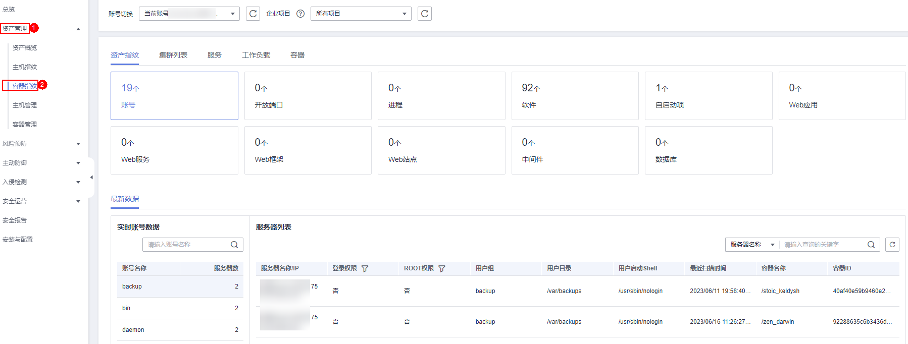

# 查看容器资产指纹

HSS提供容器资产指纹采集功能，支持采集容器的账号、端口、进程、集群、服务和工作负载等资产信息。通过容器资产指纹功能，您能集中清点容器中的各项资产信息，及时发现容器中含有风险的各项资产。本章节介绍如何查看采集到容器资产信息。

## 约束限制

-   仅HSS容器版支持容器指纹功能
-   仅支持Linux系统。

## 查看所有容器的资产指纹数据

1.  [登录管理控制台](https://console.huaweicloud.com/?locale=zh-cn)。
2.  在页面左上角选择“区域“，单击，选择“安全与合规 \> 主机安全服务”，进入主机安全平台界面。

    **图 1**  进入主机安全  
    

3.  选择“资产管理  \>  容器指纹  \>   资产指纹“，进入“资产指纹“页面，查看所有容器指纹数据。

    > **说明：** 
    >如果您的服务器已通过企业项目的模式进行管理，您可选择目标“企业项目“后查看或操作目标企业项目内的资产和检测信息。

    **图 2**  查看容器资产信息  
    

    **表 1**  容器资产指纹特性

    
    <table><thead align="left"><tr id="row1413312147458"><th class="cellrowborder" valign="top" width="14.250000000000002%" id="mcps1.2.4.1.1">
功能项

    </th>
    <th class="cellrowborder" valign="top" width="63.040000000000006%" id="mcps1.2.4.1.2">
功能描述

    </th>
    <th class="cellrowborder" valign="top" width="22.71%" id="mcps1.2.4.1.3">
检测周期

    </th>
    </tr>
    </thead>
    <tbody><tr id="row17567102311510"><td class="cellrowborder" valign="top" width="14.250000000000002%" headers="mcps1.2.4.1.1 ">
账号

    </td>
    <td class="cellrowborder" valign="top" width="63.040000000000006%" headers="mcps1.2.4.1.2 ">
检测容器系统中的账号，列出当前系统的账号信息，帮助用户进行帐户安全性管理。

    
账号的实时信息包括账号的“账号名称”、“服务器数”以及具体账号对应的“服务器名称/IP”、“登录权限”、“ROOT权限”、“用户组”、“用户目录”、“用户启动Shell”、“容器名称”、“容器ID”和“最近扫描时间”。

    </td>
    <td class="cellrowborder" valign="top" width="22.71%" headers="mcps1.2.4.1.3 ">
实时检测

    </td>
    </tr>
    <tr id="row20133101454517"><td class="cellrowborder" valign="top" width="14.250000000000002%" headers="mcps1.2.4.1.1 ">
开放端口

    </td>
    <td class="cellrowborder" valign="top" width="63.040000000000006%" headers="mcps1.2.4.1.2 ">
检测容器系统中的端口，列出当前系统开放的端口列表，帮助用户识别出其中的危险端口和未知端口。

    
根据“本地端口”、“协议类型”以及具体端口对应的“服务器名称/IP”、“状态”、“进程PID”、“程序文件”，您能够快速排查容器中含有风险的端口。

    <ul id="ul9550151815325"><li>手动关闭风险端口
如果检测到开放了危险端口或者开放了不必要的端口，需要排查这些端口是否是正常业务使用，如果不是正常业务端口，建议关闭端口。对于危险端口建议进一步检查程序文件，如果存在风险建议删除或者隔离源文件。

    
建议您及时优先处理危险程度为“危险”的端口，根据业务实际情况处理危险程度为“未知”的端口。

    </li><li>忽略风险：如果检测出的危险端口是业务正在使用的正常端口，您可以忽略该条告警。忽略之后将不再作为危险项进行记录，也不再发送告警。</li></ul>
    </td>
    <td class="cellrowborder" valign="top" width="22.71%" headers="mcps1.2.4.1.3 ">
实时检测

    </td>
    </tr>
    <tr id="row15133161416457"><td class="cellrowborder" valign="top" width="14.250000000000002%" headers="mcps1.2.4.1.1 ">
进程

    </td>
    <td class="cellrowborder" valign="top" width="63.040000000000006%" headers="mcps1.2.4.1.2 ">
检测容器系统中运行的进程，对运行中的进程进行收集及呈现，便于自主清点合法进程发现异常进程。

    
根据容器中“进程路径”以及具体进程对应的“服务器名称/IP”、“启动参数”、“启动时间”、“运行用户”、“文件权限”、“进程PID”以及“文件HASH”，您能够快速排查容器中的异常进程。

    
进程信息管理检测的机制是30天检测不到进程后，自动清除进程信息管理列表中的进程信息。

    </td>
    <td class="cellrowborder" valign="top" width="22.71%" headers="mcps1.2.4.1.3 ">
实时检测

    </td>
    </tr>
    <tr id="row1913316148456"><td class="cellrowborder" valign="top" width="14.250000000000002%" headers="mcps1.2.4.1.1 ">
软件

    </td>
    <td class="cellrowborder" valign="top" width="63.040000000000006%" headers="mcps1.2.4.1.2 ">
检测并列出当前系统安装的软件信息，帮助用户清点软件资产，识别不安全的软件版本。

    
根据软件的实时信息和历史变动，您能够快速排查容器中含有风险的软件。

    <ul id="ul79732312491"><li>软件的实时信息包括“软件名称”、“服务器数”以及具体软件对应的安装该软件的“服务器名称/IP”和“版本”、“软件更新时间”和“最近扫描时间”。</li><li>软件的历史变动记录包括软件的“服务器名称/IP”、“变动状态”、“版本”、“软件更新时间”和“最近扫描时间”。</li></ul>
    </td>
    <td class="cellrowborder" valign="top" width="22.71%" headers="mcps1.2.4.1.3 ">
每日自动检测

    </td>
    </tr>
    <tr id="row1862919475519"><td class="cellrowborder" valign="top" width="14.250000000000002%" headers="mcps1.2.4.1.1 ">
自启动项

    </td>
    <td class="cellrowborder" valign="top" width="63.040000000000006%" headers="mcps1.2.4.1.2 ">
检测并列出当前所有容器中的自启动项，帮助用户及时发现异常自启动项，快速定位木马程序的问题。

    
自启动项的实时信息包括“名称”、“类型”（自启动服务、开机启动文件夹、预加载动态库、Run注册表键或者定时任务）、“服务器数”以及类型对应的“服务器名称/IP”、“路径”、“文件HASH”、“运行用户”、“容器名称”、“容器ID”以及“最近扫描时间”。

    </td>
    <td class="cellrowborder" valign="top" width="22.71%" headers="mcps1.2.4.1.3 ">
实时检测

    </td>
    </tr>
    <tr id="row9626133513430"><td class="cellrowborder" valign="top" width="14.250000000000002%" headers="mcps1.2.4.1.1 ">
Web站点

    </td>
    <td class="cellrowborder" valign="top" width="63.040000000000006%" headers="mcps1.2.4.1.2 ">
统计、展示存放Web内容的目录及对外提供访问的站点信息，您可以查看所有目录及权限、以及和站点所关联访问路径、对外端口、证书信息（后续提供）、关键进程等信息。

    </td>
    <td class="cellrowborder" valign="top" width="22.71%" headers="mcps1.2.4.1.3 ">
1次/周（每周一凌晨06：00）

    </td>
    </tr>
    <tr id="row5692448144313"><td class="cellrowborder" valign="top" width="14.250000000000002%" headers="mcps1.2.4.1.1 ">
Web框架

    </td>
    <td class="cellrowborder" valign="top" width="63.040000000000006%" headers="mcps1.2.4.1.2 ">
统计、展示Web内容对外呈现时所使用框架的详细信息，您可查看所有框架的版本、路径、关联进程等信息。

    </td>
    <td class="cellrowborder" valign="top" width="22.71%" headers="mcps1.2.4.1.3 ">
1次/周（每周一凌晨06：00）

    </td>
    </tr>
    <tr id="row1183544384312"><td class="cellrowborder" valign="top" width="14.250000000000002%" headers="mcps1.2.4.1.1 ">
中间件

    </td>
    <td class="cellrowborder" valign="top" width="63.040000000000006%" headers="mcps1.2.4.1.2 ">
统计、展示所使用到的所有软件信息，您可查看所有中间件所关联的服务器、版本号、路径、关联进程等信息。

    </td>
    <td class="cellrowborder" valign="top" width="22.71%" headers="mcps1.2.4.1.3 ">
1次/周（每周一凌晨06：00）

    </td>
    </tr>
    <tr id="row8863174243412"><td class="cellrowborder" valign="top" width="14.250000000000002%" headers="mcps1.2.4.1.1 ">
Web服务

    </td>
    <td class="cellrowborder" valign="top" width="63.040000000000006%" headers="mcps1.2.4.1.2 ">
统计、展示对外提供web内容访问的软件详细信息，您可查看所有软件的版本、路径、配置文件、关联进程等信息。

    </td>
    <td class="cellrowborder" valign="top" width="22.71%" headers="mcps1.2.4.1.3 ">
1次/周（每周一凌晨06：00）

    </td>
    </tr>
    <tr id="row1076748113414"><td class="cellrowborder" valign="top" width="14.250000000000002%" headers="mcps1.2.4.1.1 ">
Web应用

    </td>
    <td class="cellrowborder" valign="top" width="63.040000000000006%" headers="mcps1.2.4.1.2 ">
统计、展示推送发布web内容的软件详细信息，您可以查看所有软件的版本、路径、配置文件、关键进程等信息。

    </td>
    <td class="cellrowborder" valign="top" width="22.71%" headers="mcps1.2.4.1.3 ">
1次/周（每周一凌晨06：00）

    </td>
    </tr>
    <tr id="row27861456143514"><td class="cellrowborder" valign="top" width="14.250000000000002%" headers="mcps1.2.4.1.1 ">
数据库

    </td>
    <td class="cellrowborder" valign="top" width="63.040000000000006%" headers="mcps1.2.4.1.2 ">
统计、展示提供数据存储的软件详细信息，您可以查看所有软件的版本、路径、配置文件、关键进程等信息；

    </td>
    <td class="cellrowborder" valign="top" width="22.71%" headers="mcps1.2.4.1.3 ">
1次/周（每周一凌晨06：00）

    </td>
    </tr>
    </tbody>
    </table>

## 查看单容器的资产指纹数据

1.  [登录管理控制台](https://console.huaweicloud.com/?locale=zh-cn)。
2.  在页面左上角选择“区域“，单击，选择“安全与合规 \> 主机安全服务”，进入主机安全平台界面。

    **图 3**  进入主机安全  
    

3.  在左侧导航栏，选择“资产管理  \>  主机管理“，进入“主机管理“界面，选择“云服务器“页签，进入云服务器页面。

    > **说明：** 
    >如果您的服务器已通过企业项目的模式进行管理，您可选择目标“企业项目“后查看或操作目标企业项目内的资产和检测信息。

4.  单击目标服务器名称 ，进入目标服务器的详情页面，选择“资产指纹  \>  容器资产“页签。
5.  单击“指纹列表“的目标指纹类型，查看对应资产信息，资产指纹类型特性如[表 容器资产指纹特性](#table7132214184518)所示。

## 查看集群

1.  [登录管理控制台](https://console.huaweicloud.com/?locale=zh-cn)。
2.  在页面左上角选择“区域“，单击，选择“安全与合规 \> 主机安全服务”，进入主机安全平台界面。

    **图 4**  进入主机安全  
    

3.  在左侧导航树选择“资产管理  \>  容器指纹“，进入“容器指纹“页面。
4.  选择“集群列表“，单击集群列表左上角“手动同步“，创建同步任务。
5.  “最近同步时间“更新为最新同步任务完成时间，表示手动同步集群、服务、工作负载和容器实时数据成功。
6.  在“集群列表“页面，查看集群相关信息。

    集群列表页面展示了集群的名称、类型、可用节点、版本、创建时间和状态信息。

    -   搜索目标集群

        您可以在集群列表上方的搜索框中输入集群名称、状态等信息，单击，查找目标集群。

    -   查看目标集群详细信息
        1.  单击目标集群名称，跳转到CCE控制台。
        2.  在CCE控制台，单击目标集群名称，进入集群详细信息页面，查看集群基本信息、网络信息和链接信息。

## 查看服务

1.  [登录管理控制台](https://console.huaweicloud.com/?locale=zh-cn)。
2.  在页面左上角选择“区域“，单击，选择“安全与合规 \> 主机安全服务”，进入主机安全平台界面。

    **图 5**  进入主机安全  
    

3.  在左侧导航树选择“资产管理  \>  容器指纹“，进入“容器指纹“页面。
4.  选择“集群列表“，单击集群列表左上角“手动同步“，创建同步任务。
5.  “最近同步时间“更新为最新同步任务完成时间，表示手动同步集群、服务、工作负载和容器实时数据成功。
6.  选择“服务 \> 服务“，进入服务页面，查看服务相关信息。

    服务页面展示了服务的名称、端点名称、访问方式、服务IP、命名空间、所属集群和创建时间信息。

    -   搜索目标服务

        您可以在端点列表上方的搜索框中输入服务名称、访问方式等信息，单击，查找目标服务。

    -   查看目标服务详细信息

        单击目标服务名称，进入服务的详情页面，可以查看目标服务的选择器、标签和端口等信息。

## 查看端点

1.  [登录管理控制台](https://console.huaweicloud.com/?locale=zh-cn)。
2.  在页面左上角选择“区域“，单击，选择“安全与合规 \> 主机安全服务”，进入主机安全平台界面。

    **图 6**  进入主机安全  
    

3.  在左侧导航树选择“资产管理  \>  容器指纹“，进入“容器指纹“页面。
4.  选择“集群列表“，单击集群列表左上角“手动同步“，创建同步任务。
5.  “最近同步时间“更新为最新同步任务完成时间，表示手动同步集群、服务、工作负载和容器实时数据成功。
6.  选择“服务 \> 端点“，进入端点页面，查看端点相关信息。

    端点页面展示了端点的名称、命名空间、所属集群、是否关联服务、服务名称和创建时间信息。

    -   搜索目标端点

        您可以在端点列表上方的搜索框中输入端点名称、命名空间等信息，单击，查找目标端点。

    -   查看目标端点详细信息

        单击目标端点名称，进入端点的详情页面，可以查看目标端点的Pod映射、端口等信息。

## 查看工作负载

1.  [登录管理控制台](https://console.huaweicloud.com/?locale=zh-cn)。
2.  在页面左上角选择“区域“，单击，选择“安全与合规 \> 主机安全服务”，进入主机安全平台界面。

    **图 7**  进入主机安全  
    

3.  在左侧导航树选择“资产管理  \>  容器指纹“，进入“容器指纹“页面。
4.  选择“集群列表“，单击集群列表左上角“手动同步“，创建同步任务。
5.  “最近同步时间“更新为最新同步任务完成时间，表示手动同步集群、服务、工作负载和容器实时数据成功。
6.  选择“工作负载“，进入工作负载页面。
7.  选择不同的工作负载，查看相关工作负载的信息。

    可查看无状态负载、有状态负载、守护进程集、普通任务、定时任务和容器组信息。各类工作负载列表展示的信息项请参见[表 工作负载信息项](#table1923713515214)。

    您可以在各类工作负载列表上方的搜索框中输入工作负载名称、所属集群等信息，单击，查找目标工作负载。

    **表 2**  工作负载信息项

    
    <table><thead align="left"><tr id="row1523715728"><th class="cellrowborder" valign="top" width="25.55%" id="mcps1.2.3.1.1">
工作负载类型

    </th>
    <th class="cellrowborder" valign="top" width="74.45%" id="mcps1.2.3.1.2">
信息项

    </th>
    </tr>
    </thead>
    <tbody><tr id="row62371851216"><td class="cellrowborder" valign="top" width="25.55%" headers="mcps1.2.3.1.1 ">
无状态负载

    </td>
    <td class="cellrowborder" valign="top" width="74.45%" headers="mcps1.2.3.1.2 "><ul id="ul182811241871"><li>工作负载名称</li><li>状态</li><li>实例个数</li><li>命名空间</li><li>创建时间</li><li>镜像名称</li><li>所属集群</li></ul>
    </td>
    </tr>
    <tr id="row4237555213"><td class="cellrowborder" valign="top" width="25.55%" headers="mcps1.2.3.1.1 ">
有状态负载

    </td>
    <td class="cellrowborder" valign="top" width="74.45%" headers="mcps1.2.3.1.2 "><ul id="ul11508121771"><li>工作负载名称</li><li>状态</li><li>实例个数</li><li>命名空间</li><li>创建时间</li><li>镜像名称</li><li>所属集群</li></ul>
    </td>
    </tr>
    <tr id="row1223720518214"><td class="cellrowborder" valign="top" width="25.55%" headers="mcps1.2.3.1.1 ">
守护进程集

    </td>
    <td class="cellrowborder" valign="top" width="74.45%" headers="mcps1.2.3.1.2 "><ul id="ul722910161971"><li>工作负载名称</li><li>状态</li><li>实例个数</li><li>命名空间</li><li>创建时间</li><li>镜像名称</li><li>所属集群</li></ul>
    </td>
    </tr>
    <tr id="row1823711520214"><td class="cellrowborder" valign="top" width="25.55%" headers="mcps1.2.3.1.1 ">
普通任务

    </td>
    <td class="cellrowborder" valign="top" width="74.45%" headers="mcps1.2.3.1.2 "><ul id="ul07130196711"><li>工作负载名称</li><li>状态</li><li>实例个数</li><li>命名空间</li><li>执行时间</li><li>镜像名称</li><li>所属集群</li></ul>
    </td>
    </tr>
    <tr id="row102381756212"><td class="cellrowborder" valign="top" width="25.55%" headers="mcps1.2.3.1.1 ">
定时任务

    </td>
    <td class="cellrowborder" valign="top" width="74.45%" headers="mcps1.2.3.1.2 "><ul id="ul126917244714"><li>工作负载名称</li><li>状态</li><li>任务触发</li><li>正在运行任务数</li><li>命名空间</li><li>最近调度时间</li><li>创建时间</li><li>镜像名称</li><li>所属集群</li></ul>
    </td>
    </tr>
    <tr id="row1960512521023"><td class="cellrowborder" valign="top" width="25.55%" headers="mcps1.2.3.1.1 ">
容器组

    </td>
    <td class="cellrowborder" valign="top" width="74.45%" headers="mcps1.2.3.1.2 "><ul id="ul467502719717"><li>名称</li><li>命名空间</li><li>所属集群</li><li>节点</li><li>节点IP</li><li>POD IP</li><li>状态</li><li>创建时间</li></ul>
    </td>
    </tr>
    </tbody>
    </table>

## 查看容器实例

1.  [登录管理控制台](https://console.huaweicloud.com/?locale=zh-cn)。
2.  在页面左上角选择“区域“，单击，选择“安全与合规 \> 主机安全服务”，进入主机安全平台界面。

    **图 8**  进入主机安全  
    

3.  在左侧导航树选择“资产管理  \>  容器指纹“，进入“容器指纹“页面。
4.  选择“集群列表“，单击集群列表左上角“手动同步“，创建同步任务。
5.  “最近同步时间“更新为最新同步任务完成时间，表示手动同步集群、服务、工作负载和容器实时数据成功。
6.  选择“容器实例“，进入容器实例页面，查看容器实例相关信息。

    容器实例页面展示了容器的名称、状态、所属POD、所属集群、创建时间、镜像名称。

    -   搜索目标容器

        您可以在容器列表上方的搜索框中输入容器名称、状态等信息，单击，查找目标容器。

    -   查看目标容器详细信息

        单击目标容器名称，进入容器的详情页面，可以查看目标容器的进程、端口和数据挂载等信息。

