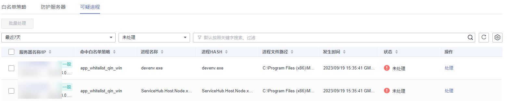

# 查看并处理可疑进程

在服务器防护过程中，如果HSS发现服务器中存在可疑进程运行事件，会将其展示在可疑进程运行事件列表中，但不会告警；对于可疑进程运行事件，由于HSS根据学习到的应用进程特征无法判断其是否可信，因此需要您根据实际情况判断并将可疑进程手动加入进程白名单或隔离查杀，避免可信进程运行被持续告警或恶意进程持续运行危害服务器。

## 操作步骤

1.  [登录管理控制台](https://console.huaweicloud.com/?locale=zh-cn)。
2.  在页面左上角选择“区域“，单击，选择“安全与合规 \> 主机安全服务”，进入主机安全平台界面。

    **图 1**  进入主机安全  
    

1.  在左侧导航栏，选择“主动防御  \>  应用进程控制“，进入“应用进程控制“界面。

1.  选择“可疑进程“页签，查看存在的可疑进程。

    **图 2**  查看可疑进程  
    

2.  根据可疑进程HASH和文件路径等信息，判断可疑进程是否为恶意进程。
3.  在可疑进程所在行的操作列，单击“处理“。

    您也可以批量勾选可疑进程，在列表左上方单击“批量处理“，批量处理可疑进程。

4.  在处理弹窗中，选择“处理方式“。

    可选择“加入进程白名单“或“隔离查杀“。

5.  单击“确认“，完成处理。

