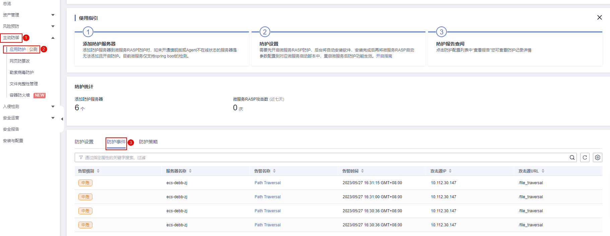
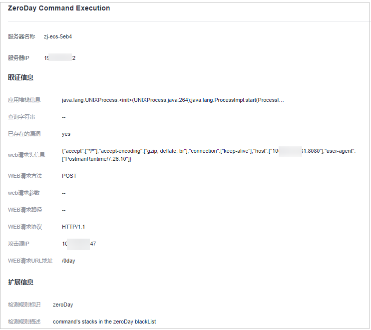

# 查看应用防护

应用防护功能旨在为运行时的应用提供安全防御。您无需修改应用程序文件，只需将探针注入到应用程序，即可为应用提供强大的安全防护能力。

## 技术原理

通过动态代码注入技术在运行时将监控&保护代码（即探针）注入到应用程序的关键监控&保护点（即关键函数），探针根据预定义规则，结合通过保护点的数据、以及上下文环境（应用逻辑、配置、数据和事件流等），识别出攻击行为。

## 前提条件

已开启主机安全服务版本为旗舰版、网页防篡改版或容器版。

## 约束限制

-   当前只支持操作系统为Linux的服务器。
-   目前仅支持Java应用接入。
-   旗舰版及以上支持应用防护相关操作。

## 查看防护设置

1.  [登录管理控制台](https://console.huaweicloud.com/?locale=zh-cn)。
2.  在页面左上角选择“区域“，单击，选择“安全与合规 \> 主机安全服务”，进入主机安全平台界面。

    **图 1**  进入主机安全  
    

3.  选择“主动防御  \>  应用防护  \>  防护设置“，进入“防护配置“页面。

    > **说明：** 
    >如果您的服务器已通过企业项目的模式进行管理，您可选择目标“企业项目“后查看或操作目标企业项目内的资产和检测信息。

    **图 2**  查看防护配置  
    

4.  选择“防护设置“页签，查看服务防护情况，参数说明如[表1](#table1748482221818)所示。

    **表 1**  防护设置参数说明

    
    <table><thead align="left"><tr id="row448413226180"><th class="cellrowborder" valign="top" width="34.02%" id="mcps1.2.3.1.1">
参数名称

    </th>
    <th class="cellrowborder" valign="top" width="65.98%" id="mcps1.2.3.1.2">
参数描述

    </th>
    </tr>
    </thead>
    <tbody><tr id="row10484172261820"><td class="cellrowborder" valign="top" width="34.02%" headers="mcps1.2.3.1.1 ">
服务器名称/ID

    </td>
    <td class="cellrowborder" valign="top" width="65.98%" headers="mcps1.2.3.1.2 ">
服务器的名称和ID。

    </td>
    </tr>
    <tr id="row19484122231817"><td class="cellrowborder" valign="top" width="34.02%" headers="mcps1.2.3.1.1 ">
IP地址

    </td>
    <td class="cellrowborder" valign="top" width="65.98%" headers="mcps1.2.3.1.2 ">
目标服务器的私有地址和公网IP地址。

    </td>
    </tr>
    <tr id="row34859222182"><td class="cellrowborder" valign="top" width="34.02%" headers="mcps1.2.3.1.1 ">
操作系统

    </td>
    <td class="cellrowborder" valign="top" width="65.98%" headers="mcps1.2.3.1.2 ">
目标服务器的操作系统。

    </td>
    </tr>
    <tr id="row64851922121814"><td class="cellrowborder" valign="top" width="34.02%" headers="mcps1.2.3.1.1 ">
服务器组名称

    </td>
    <td class="cellrowborder" valign="top" width="65.98%" headers="mcps1.2.3.1.2 ">
目标服务器所在的服务器组的名称。

    </td>
    </tr>
    <tr id="row2600710784"><td class="cellrowborder" valign="top" width="34.02%" headers="mcps1.2.3.1.1 ">
防护策略

    </td>
    <td class="cellrowborder" valign="top" width="65.98%" headers="mcps1.2.3.1.2 ">
目标服务器绑定的检测策略。

    </td>
    </tr>
    <tr id="row12485152211188"><td class="cellrowborder" valign="top" width="34.02%" headers="mcps1.2.3.1.1 ">
防护状态

    </td>
    <td class="cellrowborder" valign="top" width="65.98%" headers="mcps1.2.3.1.2 ">
目标服务器当前防护状态。

    <ul id="ul562591814152"><li>防护中</li><li>未防护</li></ul>
    </td>
    </tr>
    <tr id="row3485922191813"><td class="cellrowborder" valign="top" width="34.02%" headers="mcps1.2.3.1.1 ">
微服务防护状态

    </td>
    <td class="cellrowborder" valign="top" width="65.98%" headers="mcps1.2.3.1.2 ">
微服务的防护状态。

    <ul id="ul1516683391512"><li>已生效</li><li>正在安装</li><li>已安装，未配置</li><li>安装失败</li></ul>
    </td>
    </tr>
    <tr id="row11485922161816"><td class="cellrowborder" valign="top" width="34.02%" headers="mcps1.2.3.1.1 ">
微服务RASP防护

    </td>
    <td class="cellrowborder" valign="top" width="65.98%" headers="mcps1.2.3.1.2 ">
微服务RASP的防护开启状态。

    <ul id="ul727263191914"><li>正在安装</li><li>已安装，未配置</li><li>安装失败</li></ul>
    </td>
    </tr>
    <tr id="row61216108203"><td class="cellrowborder" valign="top" width="34.02%" headers="mcps1.2.3.1.1 ">
微服务RASP攻击

    </td>
    <td class="cellrowborder" valign="top" width="65.98%" headers="mcps1.2.3.1.2 ">
RASP检测到的攻击事件数量。

    </td>
    </tr>
    </tbody>
    </table>

## 查看防护事件

1.  登录管理控制台，进入主机安全服务页面。
2.  选择“主动防御  \>  应用防护  \>  防护事件“，进入“防护事件“页面，参数说明如[表2](#table1953772412357)所示。

    > **说明：** 
    >如果您的服务器已通过企业项目的模式进行管理，您可选择目标“企业项目“后查看或操作目标企业项目内的资产和检测信息。

    **图 3**  进入防护事件  
    

    **表 2**  防护事件参数说明

    
    <table><thead align="left"><tr id="row135371924193517"><th class="cellrowborder" valign="top" width="32.06%" id="mcps1.2.3.1.1">
参数名称

    </th>
    <th class="cellrowborder" valign="top" width="67.94%" id="mcps1.2.3.1.2">
参数描述

    </th>
    </tr>
    </thead>
    <tbody><tr id="row1537724183520"><td class="cellrowborder" valign="top" width="32.06%" headers="mcps1.2.3.1.1 ">
告警级别

    </td>
    <td class="cellrowborder" valign="top" width="67.94%" headers="mcps1.2.3.1.2 ">
发现的告警事件的等级。

    </td>
    </tr>
    <tr id="row1753752483516"><td class="cellrowborder" valign="top" width="32.06%" headers="mcps1.2.3.1.1 ">
服务器名称

    </td>
    <td class="cellrowborder" valign="top" width="67.94%" headers="mcps1.2.3.1.2 ">
目标告警对应的服务器。

    </td>
    </tr>
    <tr id="row135388248356"><td class="cellrowborder" valign="top" width="32.06%" headers="mcps1.2.3.1.1 ">
告警名称

    </td>
    <td class="cellrowborder" valign="top" width="67.94%" headers="mcps1.2.3.1.2 ">
目标告警的名称。

    </td>
    </tr>
    <tr id="row9538102417355"><td class="cellrowborder" valign="top" width="32.06%" headers="mcps1.2.3.1.1 ">
告警时间

    </td>
    <td class="cellrowborder" valign="top" width="67.94%" headers="mcps1.2.3.1.2 ">
发现告警的时间。

    </td>
    </tr>
    <tr id="row1253842403517"><td class="cellrowborder" valign="top" width="32.06%" headers="mcps1.2.3.1.1 ">
攻击源IP

    </td>
    <td class="cellrowborder" valign="top" width="67.94%" headers="mcps1.2.3.1.2 ">
目标告警的IP地址。

    </td>
    </tr>
    <tr id="row253892414352"><td class="cellrowborder" valign="top" width="32.06%" headers="mcps1.2.3.1.1 ">
攻击源URL

    </td>
    <td class="cellrowborder" valign="top" width="67.94%" headers="mcps1.2.3.1.2 ">
目标告警的URL地址。

    </td>
    </tr>
    </tbody>
    </table>

3.  单击目标告警名称，可查看目标告警的取证信息（请求信息、攻击源IP等）和扩展信息（检测规则标识、探针规则描述），可根据取证信息和扩展信息排查问题、添加防护措施。

    **图 4**  查看防护事件  
    

