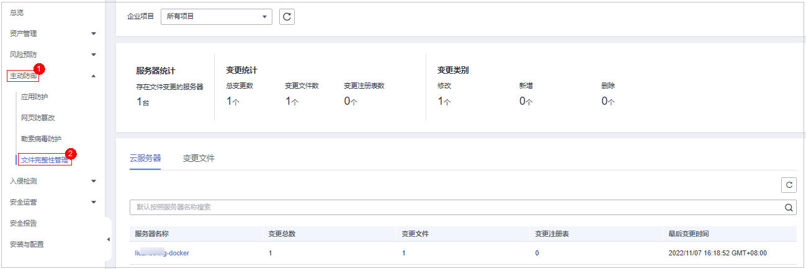

# 查看文件完整性管理

## 约束限制

旗舰版及以上版本支持文件完整性相关操作。

## 操作步骤

1.  [登录管理控制台](https://console.huaweicloud.com/?locale=zh-cn)。
2.  在页面左上角选择“区域“，单击，选择“安全与合规 \> 主机安全服务”，进入主机安全平台界面。

    **图 1**  进入主机安全  
    

3.  选择“主动防御  \>  文件完整性管理“，进入文件管理界面，可选择目标企业项目进行筛选，选择“云服务器“和“变更文件“页签可查看对应的变更详情。

    **图 2**  进入文件管理  
    

