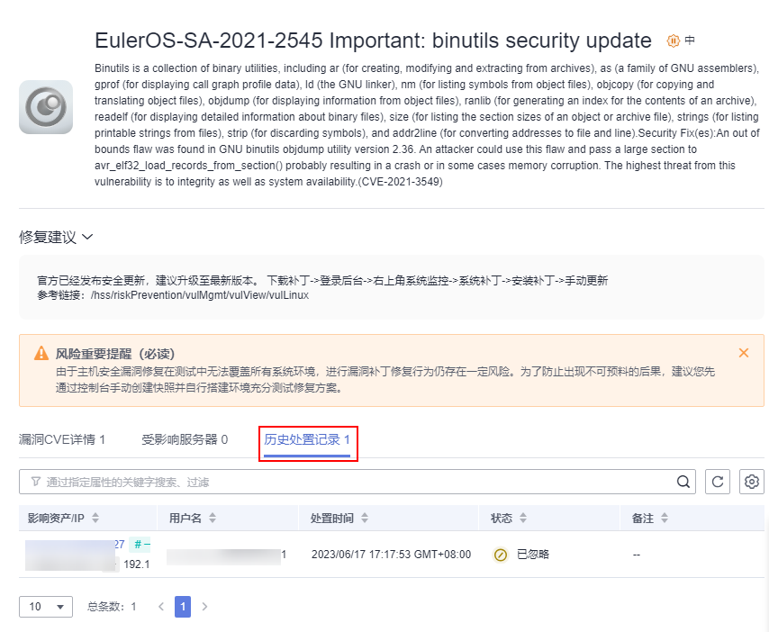

# 查看漏洞历史处置记录

对于已经处理过的漏洞，您可以参考本章节查看漏洞历史处置记录（处理人、处理时间）。

## 约束限制

HSS基础版不支持该功能，购买和升级HSS的操作请参见[购买主机安全防护配额](购买主机安全防护配额.md)和[配额版本升级](配额版本升级.md)。

## 查看单个漏洞的历史处置记录

1.  [登录管理控制台](https://console.huaweicloud.com/?locale=zh-cn)。
2.  在页面左上角选择“区域“，单击，选择“安全与合规 \> 主机安全服务”，进入主机安全平台界面。

    **图 1**  进入主机安全  
    

3.  在左侧导航树中，选择“风险预防  \>  漏洞管理“，进入“漏洞管理“页面。
4.  在已处理漏洞列表中，单击漏洞名称，进入漏洞详情页面。

    **图 2**  选择已处理漏洞  
    

5.  选择“历史处置记录“页签，查看单个漏洞的历史处置记录。

    **图 3**  历史处置记录  
    

## 查看所有漏洞的历史处置记录

1.  [登录管理控制台](https://console.huaweicloud.com/?locale=zh-cn)。
2.  在页面左上角选择“区域“，单击，选择“安全与合规 \> 主机安全服务”，进入主机安全平台界面。

    **图 4**  进入主机安全  
    

3.  在左侧导航树中，选择“安全运营  \>  历史处置记录“，进入“历史处置记录“页面。
4.  选择“漏洞管理“页签，查看所有漏洞的历史处置记录。
    -   查看指定企业项目的漏洞处置记录

        在历史处置记录页面左上角，选择指定的企业项目，可查看该企业项目下服务器漏洞的处置记录。

    -   查看指定属性的漏洞处置记录

        在漏洞处置记录列表上方搜索框中，输入漏洞类型、漏洞名称、服务器IP等并单击，可查看指定属性的漏洞处置记录。

