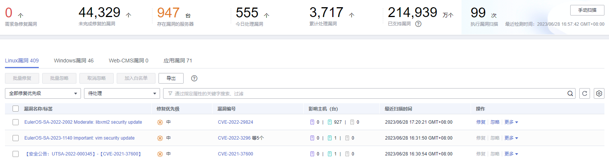
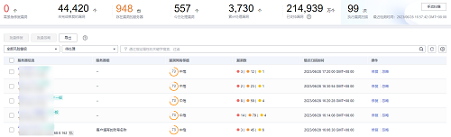

# 查看漏洞详情

漏洞扫描完成后，您可以在漏洞管理页面查看资产中存在的漏洞。

## 约束限制

-   未开启防护的服务器不支持该功能。
-   目标服务器“服务器状态“为“运行中“，“Agent状态“为“在线“，“防护状态“为“防护中“。
-   HCE 2.0当前暂不支持漏洞检测和配置检测功能，将会根据后续版本迭代上线。

## 查看漏洞详情（漏洞视图）

1.  [登录管理控制台](https://console.huaweicloud.com/?locale=zh-cn)。
2.  在页面左上角选择“区域“，单击，选择“安全与合规 \> 主机安全服务”，进入主机安全平台界面。

    **图 1**  进入主机安全  
    

3.  在左侧导航树中，选择“风险预防  \>  漏洞管理“。
4.  在漏洞管理界面查看漏洞相关信息。

    **图 2**  查看漏洞详情  
    

    -   查看漏洞扫描结果概览

        在漏洞管理界面上方的漏洞数据统计区域，查看漏洞扫描结果汇总，相关参数说明请参见[表 漏洞扫描概览参数说明](#table5527201313142)。

        **表 1**  漏洞扫描概览参数说明

        
        <table><thead align="left"><tr id="row5529121321417"><th class="cellrowborder" valign="top" width="27.26%" id="mcps1.2.3.1.1">
参数

        </th>
        <th class="cellrowborder" valign="top" width="72.74000000000001%" id="mcps1.2.3.1.2">
说明

        </th>
        </tr>
        </thead>
        <tbody><tr id="row1852941319140"><td class="cellrowborder" valign="top" width="27.26%" headers="mcps1.2.3.1.1 ">
需紧急修复漏洞

        </td>
        <td class="cellrowborder" valign="top" width="72.74000000000001%" headers="mcps1.2.3.1.2 ">
单击“需紧急修复漏洞”区域的数字，您可以在需紧急修复漏洞页面查看各类需紧急修复的漏洞。

        </td>
        </tr>
        <tr id="row8529713161418"><td class="cellrowborder" valign="top" width="27.26%" headers="mcps1.2.3.1.1 ">
未完成修复的漏洞

        </td>
        <td class="cellrowborder" valign="top" width="72.74000000000001%" headers="mcps1.2.3.1.2 ">
单击“未完成修复的漏洞”区域的数字，您可以在未完成修复的漏洞页面查看各类需尚未修复的漏洞。

        </td>
        </tr>
        <tr id="row14530181361414"><td class="cellrowborder" valign="top" width="27.26%" headers="mcps1.2.3.1.1 ">
存在漏洞的服务器

        </td>
        <td class="cellrowborder" valign="top" width="72.74000000000001%" headers="mcps1.2.3.1.2 ">
单击“存在漏洞的服务器”区域的数字，您可以在漏洞管理界面下方查看存在漏洞的服务器。

        </td>
        </tr>
        <tr id="row45301113121419"><td class="cellrowborder" valign="top" width="27.26%" headers="mcps1.2.3.1.1 ">
今日处理漏洞

        </td>
        <td class="cellrowborder" valign="top" width="72.74000000000001%" headers="mcps1.2.3.1.2 ">
单击“今日处理漏洞”区域的数字，您可以在今日处理漏洞页面中查看今日已处理的各类型漏洞。

        </td>
        </tr>
        <tr id="row5530181301410"><td class="cellrowborder" valign="top" width="27.26%" headers="mcps1.2.3.1.1 ">
累计处理漏洞

        </td>
        <td class="cellrowborder" valign="top" width="72.74000000000001%" headers="mcps1.2.3.1.2 ">
单击“累计处理漏洞”区域的数字，您可以在累计处理漏洞页面中查看各类型累计已处理的漏洞。此项数据只统计一年内的累计处理数量，超过一年将重新开始统计。

        </td>
        </tr>
        <tr id="row1653016138143"><td class="cellrowborder" valign="top" width="27.26%" headers="mcps1.2.3.1.1 ">
已支持漏洞

        </td>
        <td class="cellrowborder" valign="top" width="72.74000000000001%" headers="mcps1.2.3.1.2 ">
展示HSS已支持检测漏洞个数。

        </td>
        </tr>
        <tr id="row10329124191616"><td class="cellrowborder" valign="top" width="27.26%" headers="mcps1.2.3.1.1 ">
累计执行漏洞扫描

        </td>
        <td class="cellrowborder" valign="top" width="72.74000000000001%" headers="mcps1.2.3.1.2 ">
展示漏洞扫描次数。

        
单击“手动扫描”，可以手动扫描服务器存在的漏洞。

        </td>
        </tr>
        </tbody>
        </table>

    -   查看漏洞影响的资产重要性

        在“影响主机（台）“列查看漏洞影响到的服务器的重要性。

        -   ：表示重要资产
        -   ：表示一般资产
        -   ：表示测试资产

    -   查看漏洞详情

        单击目标漏洞名称，进入漏洞详情页面，您可以查看该漏洞的修复建议、漏洞CVE详情、受影响服务器、历史处置记录等信息。

    -   查看待处理或已处理漏洞

        在漏洞列表上方，漏洞处理状态选框中选择“待处理“或“已处理“，筛选待处理或已处理的漏洞。

    -   导出漏洞列表

        单击漏洞列表上方的“导出“，一键导出漏洞数据，您可以在本地查看漏洞信息。

        > **说明：** 
        >单次最多支持导出30000条漏洞数据。

## 查看漏洞详情（主机视图）

> **说明：** 
>基础版不支持该操作。

1.  [登录管理控制台](https://console.huaweicloud.com/?locale=zh-cn)。
2.  在页面左上角选择“区域“，单击，选择“安全与合规 \> 主机安全服务”，进入主机安全平台界面。

    **图 3**  进入主机安全  
    

3.  在左侧导航树中，选择“风险预防  \>  漏洞管理“。
4.  在漏洞管理界面右上方，选择“主机视图“，查看漏洞相关信息。

    **图 4**  查看漏洞详情  
    

    -   查看漏洞扫描结果概览

        在漏洞管理界面上方的漏洞数据统计区域，查看漏洞扫描结果汇总，相关参数说明请参见[表 漏洞扫描概览参数说明](#table13104182512554)。

        **表 2**  漏洞扫描概览参数说明

        
        <table><thead align="left"><tr id="row1910582515553"><th class="cellrowborder" valign="top" width="27.26%" id="mcps1.2.3.1.1">
参数

        </th>
        <th class="cellrowborder" valign="top" width="72.74000000000001%" id="mcps1.2.3.1.2">
说明

        </th>
        </tr>
        </thead>
        <tbody><tr id="row1510517251554"><td class="cellrowborder" valign="top" width="27.26%" headers="mcps1.2.3.1.1 ">
需紧急修复漏洞

        </td>
        <td class="cellrowborder" valign="top" width="72.74000000000001%" headers="mcps1.2.3.1.2 ">
单击“需紧急修复漏洞”区域的数字，您可以在需紧急修复漏洞页面查看各类需紧急修复的漏洞。

        </td>
        </tr>
        <tr id="row1310510255556"><td class="cellrowborder" valign="top" width="27.26%" headers="mcps1.2.3.1.1 ">
未完成修复的漏洞

        </td>
        <td class="cellrowborder" valign="top" width="72.74000000000001%" headers="mcps1.2.3.1.2 ">
单击“未完成修复的漏洞”区域的数字，您可以在未完成修复的漏洞页面查看各类需尚未修复的漏洞。

        </td>
        </tr>
        <tr id="row17105142565520"><td class="cellrowborder" valign="top" width="27.26%" headers="mcps1.2.3.1.1 ">
存在漏洞的服务器

        </td>
        <td class="cellrowborder" valign="top" width="72.74000000000001%" headers="mcps1.2.3.1.2 ">
展示当前存在漏洞的服务器数量。

        </td>
        </tr>
        <tr id="row101057255556"><td class="cellrowborder" valign="top" width="27.26%" headers="mcps1.2.3.1.1 ">
今日处理漏洞

        </td>
        <td class="cellrowborder" valign="top" width="72.74000000000001%" headers="mcps1.2.3.1.2 ">
单击“今日处理漏洞”区域的数字，您可以在今日处理漏洞页面中查看今日已处理的各类型漏洞。

        </td>
        </tr>
        <tr id="row13106132512554"><td class="cellrowborder" valign="top" width="27.26%" headers="mcps1.2.3.1.1 ">
累计处理漏洞

        </td>
        <td class="cellrowborder" valign="top" width="72.74000000000001%" headers="mcps1.2.3.1.2 ">
单击“累计处理漏洞”区域的数字，您可以在累计处理漏洞页面中查看各类型累计已处理的漏洞。

        </td>
        </tr>
        <tr id="row610692514551"><td class="cellrowborder" valign="top" width="27.26%" headers="mcps1.2.3.1.1 ">
已支持漏洞

        </td>
        <td class="cellrowborder" valign="top" width="72.74000000000001%" headers="mcps1.2.3.1.2 ">
展示HSS已支持检测漏洞个数。

        </td>
        </tr>
        <tr id="row1610672514554"><td class="cellrowborder" valign="top" width="27.26%" headers="mcps1.2.3.1.1 ">
执行漏洞扫描

        </td>
        <td class="cellrowborder" valign="top" width="72.74000000000001%" headers="mcps1.2.3.1.2 ">
展示漏洞扫描次数。

        
单击“手动扫描”，可以手动扫描服务器存在的漏洞。

        </td>
        </tr>
        </tbody>
        </table>

    -   查看主机详情和主机存在的漏洞
        1.  单击目标服务器名称，进入主机详情页面，您可以查看该主机的详细信息和存在的各类漏洞。
        2.  单击目标漏洞名称，进入漏洞详情页面，您可以查看该漏洞的漏洞CVE详情、受影响服务器、历史处置记录等信息。

    -   查看待处理或已处理漏洞

        在漏洞列表上方，漏洞处理状态选框中选择“待处理“或“已处理“，筛选查看待处理或已处理的漏洞。

    -   导出存在漏洞的主机列表

        单击漏洞列表上方的“导出“，一键导出漏洞数据，您可以在本地查看漏洞信息。

        > **说明：** 
        >单次最多支持导出30000条漏洞数据。

