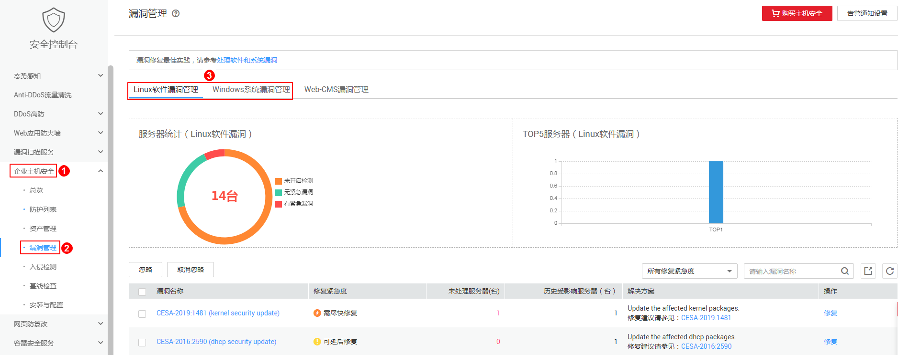
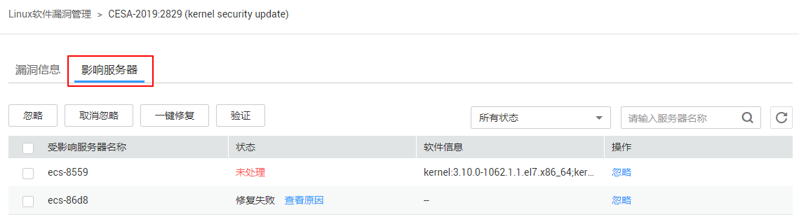
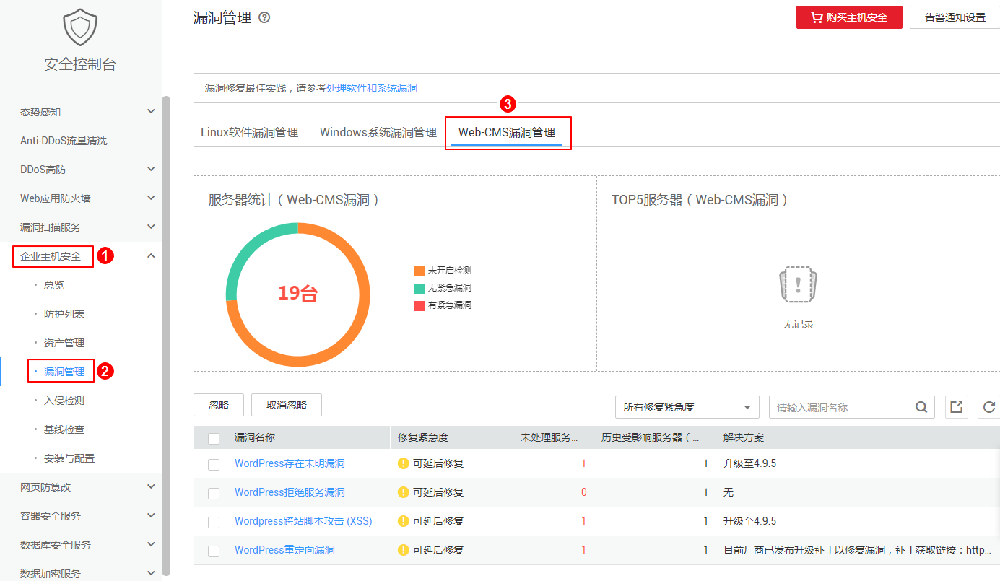
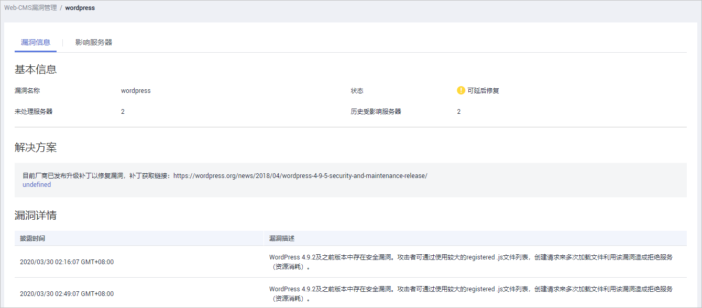
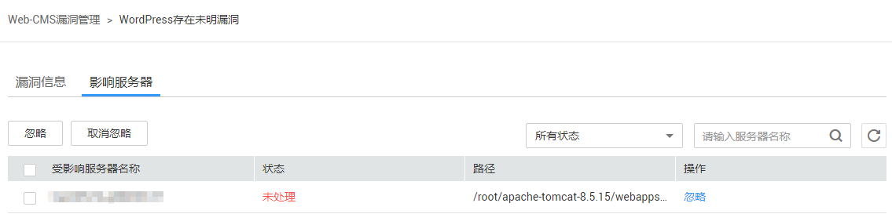

# 查看漏洞详情

HSS提供漏洞管理功能，检测Linux软件漏洞、Windows系统漏洞和Web-CMS漏洞。

在“漏洞管理“界面，您可以查看漏洞的信息和状态，根据“修复紧急度“排查主机中的漏洞。

“TOP5服务器“柱状图中，仅展示“修复紧急度“为“需尽快修复“的漏洞。

## 检测原理

**表 1**  漏洞检测原理

<table><thead align="left"><tr id="row954762122016"><th class="cellrowborder" valign="top" width="21.18%" id="mcps1.2.3.1.1">
漏洞分类

</th>
<th class="cellrowborder" valign="top" width="78.82000000000001%" id="mcps1.2.3.1.2">
原理说明

</th>
</tr>
</thead>
<tbody><tr id="row1954752202018"><td class="cellrowborder" valign="top" width="21.18%" headers="mcps1.2.3.1.1 ">
Linux软件漏洞

</td>
<td class="cellrowborder" valign="top" width="78.82000000000001%" headers="mcps1.2.3.1.2 ">
通过与漏洞库进行比对，检测出系统和软件（例如：SSH、OpenSSL、Apache、Mysql等）是否存在的漏洞，将结果上报至管理控制台，并为您提供漏洞告警。

</td>
</tr>
<tr id="row1654817222015"><td class="cellrowborder" valign="top" width="21.18%" headers="mcps1.2.3.1.1 ">
Windows系统漏洞

</td>
<td class="cellrowborder" valign="top" width="78.82000000000001%" headers="mcps1.2.3.1.2 ">
通过订阅微软官方更新，判断服务器上的补丁是否已经更新，并推送微软官方补丁，将结果上报至管理控制台，并为您提供漏洞告警。

</td>
</tr>
<tr id="row954816213201"><td class="cellrowborder" valign="top" width="21.18%" headers="mcps1.2.3.1.1 ">
Web-CMS漏洞

</td>
<td class="cellrowborder" valign="top" width="78.82000000000001%" headers="mcps1.2.3.1.2 ">
通过对Web目录和文件进行检测，识别出Web-CMS漏洞，将结果上报至管理控制台，并为您提供漏洞告警。

</td>
</tr>
</tbody>
</table>

> **说明：** 
>漏洞管理显示24小时内检测到的结果。若检测到主机存在漏洞后，您修改了主机的名称，检测结果会显示原主机名称。

## 漏洞库更新周期

HSS实时获取官方发布的漏洞信息，并更新到漏洞库中。

## 检测周期

企业主机安全服务**每日凌晨**将自动进行一次全面的检测。

## 前提条件

已开启“企业版“、“旗舰版“或“网页防篡改版“主机防护。

## Linux软件漏洞/Windows系统漏洞

1.  [登录管理控制台](https://console.huaweicloud.com)。
2.  在页面左上角选择“区域“，单击，选择“安全与合规  \>  企业主机安全“，进入企业主机安全页面。

    **图 1**  企业主机安全  
    

3.  选择“Linux软件漏洞管理“或“Windows系统漏洞管理“页签，进入相应漏洞管理页面，如[图2](#fig117274112817)所示。

    **图 2**  查看Linux软件/Windows系统漏洞检测结果  
    

1.  单击“漏洞名称“，查看漏洞信息，包括漏洞基本信息、解决方案、CVE漏洞描述。

    **图 3**  漏洞信息  
    

2.  查看漏洞影响的服务器，在该页面，您可以对漏洞进行处理。

    **图 4**  影响服务器  
    

    -   单击“修复“，您可一键修复该漏洞。
    -   单击“忽略“，您可忽略该漏洞，HSS将不再上报并告警此服务器上的这个漏洞。
    -   修复漏洞后，您可以单击“验证“，一键验证该漏洞是否已修复成功。

        若您未进行手动验证，主机防护每日凌晨进行全量检测，您修复后需要等到次日凌晨检测后才能查看修复结果。

        若您确认已完成漏洞修复，但验证后仍提示未修复，请参考[漏洞修复未生效](https://support.huaweicloud.com/hss_faq/hss_01_0176.html)进行排查。

        若提示修复失败，可以单击“查看原因“了解具体原因并处理。

## Web-CMS漏洞

1.  [登录管理控制台](https://console.huaweicloud.com)。
2.  在页面左上角选择“区域“，单击，选择“安全与合规  \>  企业主机安全“，进入企业主机安全页面。

    **图 5**  企业主机安全  
    

3.  进入“Web-CMS漏洞管理“页面，如[图6](#fig93411853105416)所示。

    **图 6**  查看Web-CMS漏洞检测结果  
    

1.  单击“漏洞名称“查看漏洞详情和受影响的服务器。

    -   Web-CMS漏洞不支持一键修复功能，请根据界面提供的修复建议进行手动修复。
    -   漏洞修复后，请手动执行漏洞检测查看漏洞修复结果。若您未进行手动验证，主机防护每日凌晨进行全量检测，您修复后需要等到次日凌晨检测后才能查看修复结果。
    -   单击“忽略“，您可忽略该漏洞，HSS将不再上报并告警此服务器上的这个漏洞。

    **图 7**  漏洞详细信息  
    

    **图 8**  受影响的服务器  
    

## 导出漏洞报告

在漏洞列表的右上角，单击，导出漏洞报告。

> **须知：** 
>HSS支持导出5000条漏洞数据，超出的部分数据将无法导出。
>例如：HSS检测到两个漏洞P1和P2，P1漏洞存在于N台主机中，P2漏洞存在于M台主机中，在导出漏洞报告时，则为N+M条漏洞数据。

