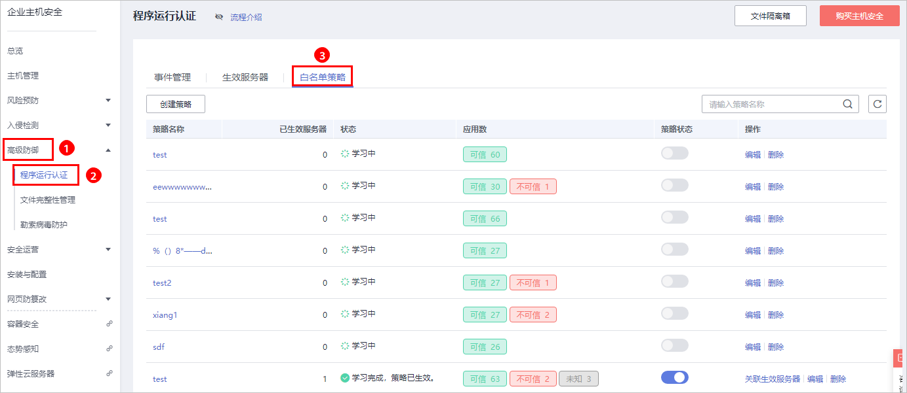
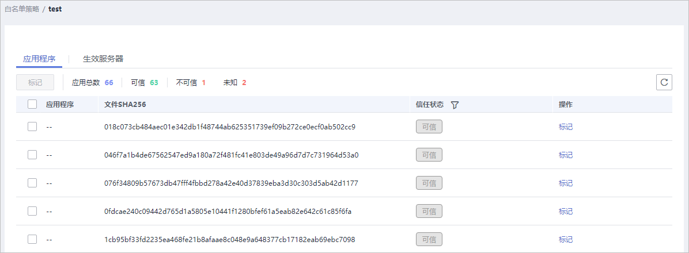
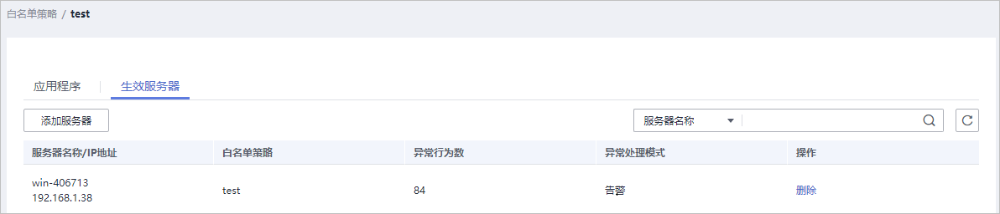

# 查看白名单策略列表

企业主机安全支持程序运行认证功能，可有效防止您云主机上有未经过认证或授权的程序运行，为您提供可信的资产运行环境。

## 背景信息

程序运行认证功能支持将重点防御的主机加入到白名单策略中，通过检测白名单中指定的应用程序区分“可信“、“不可信“和“未知“，防止未经白名单授权的程序运行。可避免您的主机受到不可信或恶意程序的侵害，还能防止不必要的资源浪费、保证您的资源被合理利用。

在创建白名单策略之后，您可以通过在需要重点防御的主机中应用该白名单策略，企业主机安全将检测服务器中是否存在可疑或恶意进程，并对不在白名单中的进程进行告警提示或者隔离。

> **说明：** 
>-   非白名单中的应用程序启动时，会触发告警。
>-   非白名单内的应用程序启动，可能是新启动的正常程序，或是被入侵后植入的恶意程序。
>    -   若提示告警的应用程序为正常程序、常用程序或者您安装的第三方程序，建议您将该应用程序加入白名单。已加入白名单的应用程序再次启动时，将不再触发告警。
>    -   若该进程为恶意程序，建议您及时清理该进程，并查看计划任务等配置文件是否被篡改。

## 查看白名单策略列表

1.  [登录管理控制台](https://console.huaweicloud.com)。
2.  在页面左上角选择“区域“，单击，选择“安全  \>  企业主机安全“，进入企业主机安全页面。

    **图 1**  企业主机安全  
    

3.  进入“程序运行认证“页面，选择“白名单策略“页签，查看白名单策略列表，如[图2](#fig4423194934715)所示。

    **图 2**  查看白名单策略列表  
    

    **表 1**  策略列表说明

    
    <table><thead align="left"><tr id="row3954194517241"><th class="cellrowborder" valign="top" width="23.79%" id="mcps1.2.3.1.1">
参数

    </th>
    <th class="cellrowborder" valign="top" width="76.21%" id="mcps1.2.3.1.2">
参数说明

    </th>
    </tr>
    </thead>
    <tbody><tr id="row4954124512418"><td class="cellrowborder" valign="top" width="23.79%" headers="mcps1.2.3.1.1 ">
策略名称

    </td>
    <td class="cellrowborder" valign="top" width="76.21%" headers="mcps1.2.3.1.2 ">
创建的白名单策略的策略名称。

    </td>
    </tr>
    <tr id="row1660091382519"><td class="cellrowborder" valign="top" width="23.79%" headers="mcps1.2.3.1.1 ">
已生效服务器

    </td>
    <td class="cellrowborder" valign="top" width="76.21%" headers="mcps1.2.3.1.2 ">
应用白名单策略生效的服务器数量。

    </td>
    </tr>
    <tr id="row31721824132520"><td class="cellrowborder" valign="top" width="23.79%" headers="mcps1.2.3.1.1 ">
状态

    </td>
    <td class="cellrowborder" valign="top" width="76.21%" headers="mcps1.2.3.1.2 ">
策略的生效状态。包含以下状态：

    <ul id="ul1561939102516"><li>学习中
智能学习进行中。

    
策略创建完成后，自动对学习的服务器执行智能学习。新创建的策略状态都为“学习中”。

    </li><li>学习完成，策略未生效
该策略已完成智能学习，需确认并启用策略。

    
智能学习完成后，您还需单击该策略状态下的，启用该策略。启用策略后，策略才能生效，HSS会自动识别您服务器中进程的风险类型（可信、不可信和未知）。

    </li><li>学习完成，策略已生效
该策略已完成智能学习，并且已应用到关联生效服务器中。

    </li></ul>
    </td>
    </tr>
    <tr id="row7219122102511"><td class="cellrowborder" valign="top" width="23.79%" headers="mcps1.2.3.1.1 ">
应用数

    </td>
    <td class="cellrowborder" valign="top" width="76.21%" headers="mcps1.2.3.1.2 ">
HSS自动识别学习服务器中应用进程的风险数量，包含“可信”、“不可信”和“未知”应用进程的数量。

    </td>
    </tr>
    <tr id="row17844118112518"><td class="cellrowborder" valign="top" width="23.79%" headers="mcps1.2.3.1.1 ">
策略状态

    </td>
    <td class="cellrowborder" valign="top" width="76.21%" headers="mcps1.2.3.1.2 ">
策略的状态，白名单策略处于“学习完成，策略未生效”，可单击，开启白名单策略。开启白名单策略后，策略才生效。

    </td>
    </tr>
    <tr id="row14427316172512"><td class="cellrowborder" valign="top" width="23.79%" headers="mcps1.2.3.1.1 ">
操作

    </td>
    <td class="cellrowborder" valign="top" width="76.21%" headers="mcps1.2.3.1.2 ">
可对该策略执行的操作。支持以下操作：

    <ul id="ul188183911256"><li>关联生效服务器：单击“关联生效服务器”，打开“关联生效服务器”页面，可增加或删除应用该白名单策略的服务器。</li><li>编辑：单击“编辑”打开编辑策略白名单页面，对该策略进行修改。可修改该策略的“智能学习天数”和执行智能学习的服务器。</li><li>删除：删除白名单策略。
策略删除后，对应的生效服务器的进程将不再受到该白名单策略的保护。

    </li></ul>
    </td>
    </tr>
    </tbody>
    </table>

4.  单击策略名称，进入白名单策略详情页面，查看关联服务器的“应用程序“，如[图3](#fig4216145951415)所示。

    您可以查看应用总数、可信应用数、不可信应用数和未知应用数。您可以自行识别并判断应用程序是否可信，并为应用程序标记“可信“、“不可信“或者“未知“，为应用程序创建应用白名单。

    **图 3**  应用程序列表  
    

5.  单击“生效服务器“页签，查看应用该白名单策略的生效服务器，如[图4](#fig209351916548)所示。

    您可以查看生效服务器的“服务器名称/IP地址“、“白名单策略“、“异常行为数“和“异常处理模式“。

    -   异常行为数：异常行为包括非白名单策略中的进程启动行为和白名单内的“不可信“或者“未知“进程的启动行为。
    -   异常处理模式：当HSS检测发现异常行为时，触发告警。

        **图 4**  查看生效服务器  
        

        > **说明：** 
        >你可以根据需要删除生效服务器，删除生效服务器后，生效服务器的进程将不再受到该白名单策略的保护。

