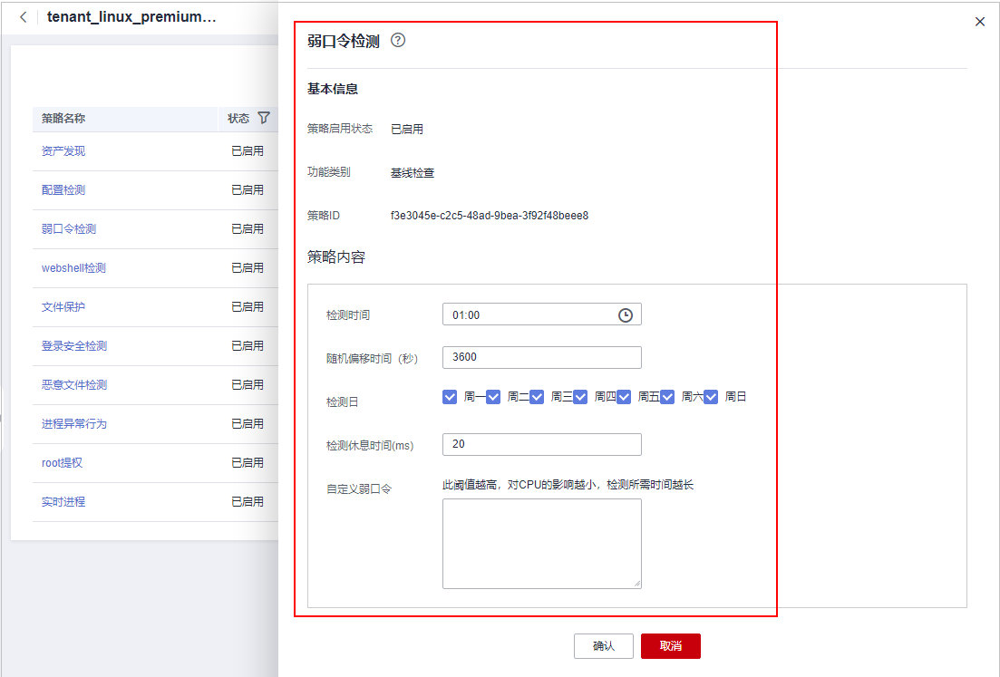

# 查看策略组

主机安全服务提供灵活的策略管理能力，用户可以根据需要自定义安全检测规则，并可以为不同的主机组、主机、容器节点应用不同的策略，以满足不同应用场景的主机安全需求。

## 约束限制

需开启专业版、企业版、旗舰版、网页防篡改版、容器版中任一版本。

## 操作须知

-   开启企业版主机防护时，默认绑定“租户侧企业版策略组“（包含“弱口令检测“和“网站后门检测“策略），应用于全部的云服务器，不需要单独部署策略。
-   开启“旗舰版“或者“网页防篡改赠送旗舰版“后，开启旗舰版/网页防篡改版防护时，默认绑定了“租户侧旗舰版策略组“。

    用户也可以通过复制“租户侧旗舰版策略组“的方式，创建自定义策略组，将“租户侧旗舰版策略组“替换为用户的自定义策略组，更加灵活的应用于不同的云服务器或者云服务器组。

## 策略列表

<table><thead align="left"><tr id="row102391950202010"><th class="cellrowborder" valign="top" width="10.04100410041004%" id="mcps1.1.9.1.1">
策略名称

</th>
<th class="cellrowborder" valign="top" width="33.4033403340334%" id="mcps1.1.9.1.2">
策略说明

</th>
<th class="cellrowborder" valign="top" width="14.211421142114212%" id="mcps1.1.9.1.3">
支持的操作系统

</th>
<th class="cellrowborder" valign="top" width="7.520752075207521%" id="mcps1.1.9.1.4">
专业版

</th>
<th class="cellrowborder" valign="top" width="9.36093609360936%" id="mcps1.1.9.1.5">
企业版

</th>
<th class="cellrowborder" valign="top" width="8.8008800880088%" id="mcps1.1.9.1.6">
旗舰版

</th>
<th class="cellrowborder" valign="top" width="9.710971097109713%" id="mcps1.1.9.1.7">
网页防篡改版

</th>
<th class="cellrowborder" valign="top" width="6.950695069506951%" id="mcps1.1.9.1.8">
容器版

</th>
</tr>
</thead>
<tbody><tr id="row10240115042015"><td class="cellrowborder" valign="top" width="10.04100410041004%" headers="mcps1.1.9.1.1 ">
资产发现

</td>
<td class="cellrowborder" valign="top" width="33.4033403340334%" headers="mcps1.1.9.1.2 ">
检测系统中的软件信息，包含软件名称、软件路径、主要应用等，帮助用户识别异常资产。

</td>
<td class="cellrowborder" valign="top" width="14.211421142114212%" headers="mcps1.1.9.1.3 ">
Linux，Windows

</td>
<td class="cellrowborder" valign="top" width="7.520752075207521%" headers="mcps1.1.9.1.4 ">
×

</td>
<td class="cellrowborder" valign="top" width="9.36093609360936%" headers="mcps1.1.9.1.5 ">
×

</td>
<td class="cellrowborder" valign="top" width="8.8008800880088%" headers="mcps1.1.9.1.6 ">
√

</td>
<td class="cellrowborder" valign="top" width="9.710971097109713%" headers="mcps1.1.9.1.7 ">
√

</td>
<td class="cellrowborder" valign="top" width="6.950695069506951%" headers="mcps1.1.9.1.8 ">
√

</td>
</tr>
<tr id="row14511428122912"><td class="cellrowborder" valign="top" width="10.04100410041004%" headers="mcps1.1.9.1.1 ">
AV检测

</td>
<td class="cellrowborder" valign="top" width="33.4033403340334%" headers="mcps1.1.9.1.2 ">
检测服务器资产，对发现的病毒进行上报、隔离查杀。

检测的告警结果将按照病毒类别在“入侵检测 &gt; 安全告警事件 &gt; 主机安全告警 &gt; 事件类型 &gt; 恶意软件”下的子类别中分别呈现。

开启AV检测后资源占用情况如下：

CPU资源占用不超过单vCPUs的40%，实际占用情况需根据主机情况而定，参照详情请参见<a href="https://support.huaweicloud.com/hss2.0_faq/hss_01_0116.html" target="_blank" rel="noopener noreferrer">检测资源占用一览表</a>。

</td>
<td class="cellrowborder" valign="top" width="14.211421142114212%" headers="mcps1.1.9.1.3 ">
Windows

</td>
<td class="cellrowborder" valign="top" width="7.520752075207521%" headers="mcps1.1.9.1.4 ">
√

</td>
<td class="cellrowborder" valign="top" width="9.36093609360936%" headers="mcps1.1.9.1.5 ">
√

</td>
<td class="cellrowborder" valign="top" width="8.8008800880088%" headers="mcps1.1.9.1.6 ">
√

</td>
<td class="cellrowborder" valign="top" width="9.710971097109713%" headers="mcps1.1.9.1.7 ">
√

</td>
<td class="cellrowborder" valign="top" width="6.950695069506951%" headers="mcps1.1.9.1.8 ">
×

</td>
</tr>
<tr id="row924085022018"><td class="cellrowborder" valign="top" width="10.04100410041004%" headers="mcps1.1.9.1.1 ">
配置检测

</td>
<td class="cellrowborder" valign="top" width="33.4033403340334%" headers="mcps1.1.9.1.2 ">
对常见的Tomcat配置、Nginx配置、SSH登录配置进行检查，帮助用户识别不安全的配置项。

</td>
<td class="cellrowborder" valign="top" width="14.211421142114212%" headers="mcps1.1.9.1.3 ">
Linux，Windows

</td>
<td class="cellrowborder" valign="top" width="7.520752075207521%" headers="mcps1.1.9.1.4 ">
×

</td>
<td class="cellrowborder" valign="top" width="9.36093609360936%" headers="mcps1.1.9.1.5 ">
×

</td>
<td class="cellrowborder" valign="top" width="8.8008800880088%" headers="mcps1.1.9.1.6 ">
√

</td>
<td class="cellrowborder" valign="top" width="9.710971097109713%" headers="mcps1.1.9.1.7 ">
√

</td>
<td class="cellrowborder" valign="top" width="6.950695069506951%" headers="mcps1.1.9.1.8 ">
√

</td>
</tr>
<tr id="row766072723511"><td class="cellrowborder" valign="top" width="10.04100410041004%" headers="mcps1.1.9.1.1 ">
容器信息收集

</td>
<td class="cellrowborder" valign="top" width="33.4033403340334%" headers="mcps1.1.9.1.2 ">
收集主机中的所有容器相关信息，包括端口、目录等，对存在风险的信息进行告警上报。

</td>
<td class="cellrowborder" valign="top" width="14.211421142114212%" headers="mcps1.1.9.1.3 ">
Linux

</td>
<td class="cellrowborder" valign="top" width="7.520752075207521%" headers="mcps1.1.9.1.4 ">
×

</td>
<td class="cellrowborder" valign="top" width="9.36093609360936%" headers="mcps1.1.9.1.5 ">
×

</td>
<td class="cellrowborder" valign="top" width="8.8008800880088%" headers="mcps1.1.9.1.6 ">
×

</td>
<td class="cellrowborder" valign="top" width="9.710971097109713%" headers="mcps1.1.9.1.7 ">
×

</td>
<td class="cellrowborder" valign="top" width="6.950695069506951%" headers="mcps1.1.9.1.8 ">
√

</td>
</tr>
<tr id="row1351132615306"><td class="cellrowborder" valign="top" width="10.04100410041004%" headers="mcps1.1.9.1.1 ">
弱口令检测

</td>
<td class="cellrowborder" valign="top" width="33.4033403340334%" headers="mcps1.1.9.1.2 ">
检测系统帐户口令是否属于常用的弱口令，针对弱口令提示用户修改。

</td>
<td class="cellrowborder" valign="top" width="14.211421142114212%" headers="mcps1.1.9.1.3 ">
Linux

</td>
<td class="cellrowborder" valign="top" width="7.520752075207521%" headers="mcps1.1.9.1.4 ">
√

</td>
<td class="cellrowborder" valign="top" width="9.36093609360936%" headers="mcps1.1.9.1.5 ">
√

</td>
<td class="cellrowborder" valign="top" width="8.8008800880088%" headers="mcps1.1.9.1.6 ">
√

</td>
<td class="cellrowborder" valign="top" width="9.710971097109713%" headers="mcps1.1.9.1.7 ">
√

</td>
<td class="cellrowborder" valign="top" width="6.950695069506951%" headers="mcps1.1.9.1.8 ">
√

</td>
</tr>
<tr id="row7241150142015"><td class="cellrowborder" valign="top" width="10.04100410041004%" headers="mcps1.1.9.1.1 ">
集群入侵检测

</td>
<td class="cellrowborder" valign="top" width="33.4033403340334%" headers="mcps1.1.9.1.2 ">
检测容器高权限的变动，在关键信息中的创建及病毒入侵等异常行为。

</td>
<td class="cellrowborder" valign="top" width="14.211421142114212%" headers="mcps1.1.9.1.3 ">
Linux

</td>
<td class="cellrowborder" valign="top" width="7.520752075207521%" headers="mcps1.1.9.1.4 ">
×

</td>
<td class="cellrowborder" valign="top" width="9.36093609360936%" headers="mcps1.1.9.1.5 ">
×

</td>
<td class="cellrowborder" valign="top" width="8.8008800880088%" headers="mcps1.1.9.1.6 ">
×

</td>
<td class="cellrowborder" valign="top" width="9.710971097109713%" headers="mcps1.1.9.1.7 ">
×

</td>
<td class="cellrowborder" valign="top" width="6.950695069506951%" headers="mcps1.1.9.1.8 ">
√

</td>
</tr>
<tr id="row1245919143218"><td class="cellrowborder" valign="top" width="10.04100410041004%" headers="mcps1.1.9.1.1 ">
容器逃逸

</td>
<td class="cellrowborder" valign="top" width="33.4033403340334%" headers="mcps1.1.9.1.2 ">
检测容器是否容器逃逸行为，存在容器逃逸行为即进行告警上报。

</td>
<td class="cellrowborder" valign="top" width="14.211421142114212%" headers="mcps1.1.9.1.3 ">
Linux

</td>
<td class="cellrowborder" valign="top" width="7.520752075207521%" headers="mcps1.1.9.1.4 ">
×

</td>
<td class="cellrowborder" valign="top" width="9.36093609360936%" headers="mcps1.1.9.1.5 ">
×

</td>
<td class="cellrowborder" valign="top" width="8.8008800880088%" headers="mcps1.1.9.1.6 ">
×

</td>
<td class="cellrowborder" valign="top" width="9.710971097109713%" headers="mcps1.1.9.1.7 ">
×

</td>
<td class="cellrowborder" valign="top" width="6.950695069506951%" headers="mcps1.1.9.1.8 ">
√

</td>
</tr>
<tr id="row1824145082017"><td class="cellrowborder" valign="top" width="10.04100410041004%" headers="mcps1.1.9.1.1 ">
Webshell检测

</td>
<td class="cellrowborder" valign="top" width="33.4033403340334%" headers="mcps1.1.9.1.2 ">
检测云服务器上Web目录中的文件，判断是否为Webshell木马文件。

</td>
<td class="cellrowborder" valign="top" width="14.211421142114212%" headers="mcps1.1.9.1.3 ">
Linux，Windows

</td>
<td class="cellrowborder" valign="top" width="7.520752075207521%" headers="mcps1.1.9.1.4 ">
√

</td>
<td class="cellrowborder" valign="top" width="9.36093609360936%" headers="mcps1.1.9.1.5 ">
√

</td>
<td class="cellrowborder" valign="top" width="8.8008800880088%" headers="mcps1.1.9.1.6 ">
√

</td>
<td class="cellrowborder" valign="top" width="9.710971097109713%" headers="mcps1.1.9.1.7 ">
√

</td>
<td class="cellrowborder" valign="top" width="6.950695069506951%" headers="mcps1.1.9.1.8 ">
√

</td>
</tr>
<tr id="row117416226362"><td class="cellrowborder" valign="top" width="10.04100410041004%" headers="mcps1.1.9.1.1 ">
容器文件监控

</td>
<td class="cellrowborder" valign="top" width="33.4033403340334%" headers="mcps1.1.9.1.2 ">
检测违反安全策略的文件异常访问，安全运维人员可用于判断是否有黑客入侵并篡改敏感文件。

</td>
<td class="cellrowborder" valign="top" width="14.211421142114212%" headers="mcps1.1.9.1.3 ">
Linux

</td>
<td class="cellrowborder" valign="top" width="7.520752075207521%" headers="mcps1.1.9.1.4 ">
×

</td>
<td class="cellrowborder" valign="top" width="9.36093609360936%" headers="mcps1.1.9.1.5 ">
×

</td>
<td class="cellrowborder" valign="top" width="8.8008800880088%" headers="mcps1.1.9.1.6 ">
×

</td>
<td class="cellrowborder" valign="top" width="9.710971097109713%" headers="mcps1.1.9.1.7 ">
×

</td>
<td class="cellrowborder" valign="top" width="6.950695069506951%" headers="mcps1.1.9.1.8 ">
√

</td>
</tr>
<tr id="row12182173913368"><td class="cellrowborder" valign="top" width="10.04100410041004%" headers="mcps1.1.9.1.1 ">
容器进程白名单

</td>
<td class="cellrowborder" valign="top" width="33.4033403340334%" headers="mcps1.1.9.1.2 ">
检测违反安全策略的进程启动。

</td>
<td class="cellrowborder" valign="top" width="14.211421142114212%" headers="mcps1.1.9.1.3 ">
Linux

</td>
<td class="cellrowborder" valign="top" width="7.520752075207521%" headers="mcps1.1.9.1.4 ">
×

</td>
<td class="cellrowborder" valign="top" width="9.36093609360936%" headers="mcps1.1.9.1.5 ">
×

</td>
<td class="cellrowborder" valign="top" width="8.8008800880088%" headers="mcps1.1.9.1.6 ">
×

</td>
<td class="cellrowborder" valign="top" width="9.710971097109713%" headers="mcps1.1.9.1.7 ">
×

</td>
<td class="cellrowborder" valign="top" width="6.950695069506951%" headers="mcps1.1.9.1.8 ">
√

</td>
</tr>
<tr id="row25155539361"><td class="cellrowborder" valign="top" width="10.04100410041004%" headers="mcps1.1.9.1.1 ">
镜像异常行为

</td>
<td class="cellrowborder" valign="top" width="33.4033403340334%" headers="mcps1.1.9.1.2 ">
配置目标黑白名单，自定义权限对异常行为进行忽略或告警上报。

</td>
<td class="cellrowborder" valign="top" width="14.211421142114212%" headers="mcps1.1.9.1.3 ">
Linux

</td>
<td class="cellrowborder" valign="top" width="7.520752075207521%" headers="mcps1.1.9.1.4 ">
×

</td>
<td class="cellrowborder" valign="top" width="9.36093609360936%" headers="mcps1.1.9.1.5 ">
×

</td>
<td class="cellrowborder" valign="top" width="8.8008800880088%" headers="mcps1.1.9.1.6 ">
×

</td>
<td class="cellrowborder" valign="top" width="9.710971097109713%" headers="mcps1.1.9.1.7 ">
×

</td>
<td class="cellrowborder" valign="top" width="6.950695069506951%" headers="mcps1.1.9.1.8 ">
√

</td>
</tr>
<tr id="row11517115211291"><td class="cellrowborder" valign="top" width="10.04100410041004%" headers="mcps1.1.9.1.1 ">
HIPS检测

</td>
<td class="cellrowborder" valign="top" width="33.4033403340334%" headers="mcps1.1.9.1.2 ">
主要针对注册表、文件及进程进行检测，对异常变更等操作行为进行告警上报。

</td>
<td class="cellrowborder" valign="top" width="14.211421142114212%" headers="mcps1.1.9.1.3 ">
Linux、Windows

</td>
<td class="cellrowborder" valign="top" width="7.520752075207521%" headers="mcps1.1.9.1.4 ">
×

</td>
<td class="cellrowborder" valign="top" width="9.36093609360936%" headers="mcps1.1.9.1.5 ">
√

</td>
<td class="cellrowborder" valign="top" width="8.8008800880088%" headers="mcps1.1.9.1.6 ">
√

</td>
<td class="cellrowborder" valign="top" width="9.710971097109713%" headers="mcps1.1.9.1.7 ">
√

</td>
<td class="cellrowborder" valign="top" width="6.950695069506951%" headers="mcps1.1.9.1.8 ">
√

</td>
</tr>
<tr id="row024375010203"><td class="cellrowborder" valign="top" width="10.04100410041004%" headers="mcps1.1.9.1.1 ">
文件保护

</td>
<td class="cellrowborder" valign="top" width="33.4033403340334%" headers="mcps1.1.9.1.2 ">
检测操作系统、应用程序软件和其他组件的文件，确定文件是否发生了可能遭受攻击的更改。

</td>
<td class="cellrowborder" valign="top" width="14.211421142114212%" headers="mcps1.1.9.1.3 ">
Linux

</td>
<td class="cellrowborder" valign="top" width="7.520752075207521%" headers="mcps1.1.9.1.4 ">
√

</td>
<td class="cellrowborder" valign="top" width="9.36093609360936%" headers="mcps1.1.9.1.5 ">
√

</td>
<td class="cellrowborder" valign="top" width="8.8008800880088%" headers="mcps1.1.9.1.6 ">
√

</td>
<td class="cellrowborder" valign="top" width="9.710971097109713%" headers="mcps1.1.9.1.7 ">
√

</td>
<td class="cellrowborder" valign="top" width="6.950695069506951%" headers="mcps1.1.9.1.8 ">
√

</td>
</tr>
<tr id="row112441650182014"><td class="cellrowborder" valign="top" width="10.04100410041004%" headers="mcps1.1.9.1.1 ">
登录安全检测

</td>
<td class="cellrowborder" valign="top" width="33.4033403340334%" headers="mcps1.1.9.1.2 ">
检测SSH、FTP、MySQL等帐户遭受的口令破解攻击。

如果30秒内，帐户暴力破解次数（连续输入错误密码）达到5次及以上，HSS就会拦截该源IP，禁止其再次登录，防止主机因帐户破解被入侵。

SSH类型攻击默认拦截12小时，其他类型攻击默认拦截24小时。根据帐户暴力破解告警详情，如“攻击源IP”、“攻击类型”和“拦截次数”，您能够快速识别出该源IP是否为可信IP，如果为可信IP，您可以通过手动解除拦截的方式，解除拦截的可信IP。

</td>
<td class="cellrowborder" valign="top" width="14.211421142114212%" headers="mcps1.1.9.1.3 ">
Linux，Windows

</td>
<td class="cellrowborder" valign="top" width="7.520752075207521%" headers="mcps1.1.9.1.4 ">
√

</td>
<td class="cellrowborder" valign="top" width="9.36093609360936%" headers="mcps1.1.9.1.5 ">
√

</td>
<td class="cellrowborder" valign="top" width="8.8008800880088%" headers="mcps1.1.9.1.6 ">
√

</td>
<td class="cellrowborder" valign="top" width="9.710971097109713%" headers="mcps1.1.9.1.7 ">
√

</td>
<td class="cellrowborder" valign="top" width="6.950695069506951%" headers="mcps1.1.9.1.8 ">
√

</td>
</tr>
<tr id="row1224485020204"><td class="cellrowborder" valign="top" width="10.04100410041004%" headers="mcps1.1.9.1.1 ">
恶意文件检测

</td>
<td class="cellrowborder" valign="top" width="33.4033403340334%" headers="mcps1.1.9.1.2 "><ul id="ul15244145082013"><li>反弹shell：实时监控用户的进程行为，可及时发现并阻断进程的非法Shell连接操作产生的反弹Shell行为。</li><li>异常shell：检测系统中异常Shell的获取行为，包括对Shell文件的修改、删除、移动、复制、硬链接、访问权限变化。</li></ul>
</td>
<td class="cellrowborder" valign="top" width="14.211421142114212%" headers="mcps1.1.9.1.3 ">
Linux

</td>
<td class="cellrowborder" valign="top" width="7.520752075207521%" headers="mcps1.1.9.1.4 ">
√

</td>
<td class="cellrowborder" valign="top" width="9.36093609360936%" headers="mcps1.1.9.1.5 ">
√

</td>
<td class="cellrowborder" valign="top" width="8.8008800880088%" headers="mcps1.1.9.1.6 ">
√

</td>
<td class="cellrowborder" valign="top" width="9.710971097109713%" headers="mcps1.1.9.1.7 ">
√

</td>
<td class="cellrowborder" valign="top" width="6.950695069506951%" headers="mcps1.1.9.1.8 ">
√

</td>
</tr>
<tr id="row17773740143119"><td class="cellrowborder" valign="top" width="10.04100410041004%" headers="mcps1.1.9.1.1 ">
端口扫描检测

</td>
<td class="cellrowborder" valign="top" width="33.4033403340334%" headers="mcps1.1.9.1.2 ">
检测用户指定的端口存在被扫描或者嗅探的行为，一旦发现进行告警上报。

</td>
<td class="cellrowborder" valign="top" width="14.211421142114212%" headers="mcps1.1.9.1.3 ">
Linux

</td>
<td class="cellrowborder" valign="top" width="7.520752075207521%" headers="mcps1.1.9.1.4 ">
×

</td>
<td class="cellrowborder" valign="top" width="9.36093609360936%" headers="mcps1.1.9.1.5 ">
×

</td>
<td class="cellrowborder" valign="top" width="8.8008800880088%" headers="mcps1.1.9.1.6 ">
√

</td>
<td class="cellrowborder" valign="top" width="9.710971097109713%" headers="mcps1.1.9.1.7 ">
√

</td>
<td class="cellrowborder" valign="top" width="6.950695069506951%" headers="mcps1.1.9.1.8 ">
√

</td>
</tr>
<tr id="row1824515032019"><td class="cellrowborder" valign="top" width="10.04100410041004%" headers="mcps1.1.9.1.1 ">
进程异常行为

</td>
<td class="cellrowborder" valign="top" width="33.4033403340334%" headers="mcps1.1.9.1.2 ">
通过对运行进程的管控，全局检测各个主机的运行信息，保障云主机的安全性。您可以建立自己的进程白名单，对于进程的非法行为、黑客入侵过程进行告警。

</td>
<td class="cellrowborder" valign="top" width="14.211421142114212%" headers="mcps1.1.9.1.3 ">
Linux

</td>
<td class="cellrowborder" valign="top" width="7.520752075207521%" headers="mcps1.1.9.1.4 ">
√

</td>
<td class="cellrowborder" valign="top" width="9.36093609360936%" headers="mcps1.1.9.1.5 ">
×

</td>
<td class="cellrowborder" valign="top" width="8.8008800880088%" headers="mcps1.1.9.1.6 ">
√

</td>
<td class="cellrowborder" valign="top" width="9.710971097109713%" headers="mcps1.1.9.1.7 ">
√

</td>
<td class="cellrowborder" valign="top" width="6.950695069506951%" headers="mcps1.1.9.1.8 ">
√

</td>
</tr>
<tr id="row7246175052012"><td class="cellrowborder" valign="top" width="10.04100410041004%" headers="mcps1.1.9.1.1 ">
root提权

</td>
<td class="cellrowborder" valign="top" width="33.4033403340334%" headers="mcps1.1.9.1.2 ">
检测当前系统文件路径的root提权行为。

</td>
<td class="cellrowborder" valign="top" width="14.211421142114212%" headers="mcps1.1.9.1.3 ">
Linux

</td>
<td class="cellrowborder" valign="top" width="7.520752075207521%" headers="mcps1.1.9.1.4 ">
√

</td>
<td class="cellrowborder" valign="top" width="9.36093609360936%" headers="mcps1.1.9.1.5 ">
√

</td>
<td class="cellrowborder" valign="top" width="8.8008800880088%" headers="mcps1.1.9.1.6 ">
√

</td>
<td class="cellrowborder" valign="top" width="9.710971097109713%" headers="mcps1.1.9.1.7 ">
√

</td>
<td class="cellrowborder" valign="top" width="6.950695069506951%" headers="mcps1.1.9.1.8 ">
√

</td>
</tr>
<tr id="row1424655072019"><td class="cellrowborder" valign="top" width="10.04100410041004%" headers="mcps1.1.9.1.1 ">
实时进程

</td>
<td class="cellrowborder" valign="top" width="33.4033403340334%" headers="mcps1.1.9.1.2 ">
检测进程中高危命令的执行行为，发生高危命令执行时，触发告警。

</td>
<td class="cellrowborder" valign="top" width="14.211421142114212%" headers="mcps1.1.9.1.3 ">
Linux，Windows

</td>
<td class="cellrowborder" valign="top" width="7.520752075207521%" headers="mcps1.1.9.1.4 ">
√

</td>
<td class="cellrowborder" valign="top" width="9.36093609360936%" headers="mcps1.1.9.1.5 ">
√

</td>
<td class="cellrowborder" valign="top" width="8.8008800880088%" headers="mcps1.1.9.1.6 ">
√

</td>
<td class="cellrowborder" valign="top" width="9.710971097109713%" headers="mcps1.1.9.1.7 ">
√

</td>
<td class="cellrowborder" valign="top" width="6.950695069506951%" headers="mcps1.1.9.1.8 ">
√

</td>
</tr>
<tr id="row12471050152015"><td class="cellrowborder" valign="top" width="10.04100410041004%" headers="mcps1.1.9.1.1 ">
rootkit检测

</td>
<td class="cellrowborder" valign="top" width="33.4033403340334%" headers="mcps1.1.9.1.2 ">
检测服务器资产，对可疑的内核模块和可疑的文件或文件夹进行告警上报。

</td>
<td class="cellrowborder" valign="top" width="14.211421142114212%" headers="mcps1.1.9.1.3 ">
Linux

</td>
<td class="cellrowborder" valign="top" width="7.520752075207521%" headers="mcps1.1.9.1.4 ">
√

</td>
<td class="cellrowborder" valign="top" width="9.36093609360936%" headers="mcps1.1.9.1.5 ">
√

</td>
<td class="cellrowborder" valign="top" width="8.8008800880088%" headers="mcps1.1.9.1.6 ">
√

</td>
<td class="cellrowborder" valign="top" width="9.710971097109713%" headers="mcps1.1.9.1.7 ">
√

</td>
<td class="cellrowborder" valign="top" width="6.950695069506951%" headers="mcps1.1.9.1.8 ">
√

</td>
</tr>
<tr id="row1892113184615"><td class="cellrowborder" valign="top" width="10.04100410041004%" headers="mcps1.1.9.1.1 ">
自保护

</td>
<td class="cellrowborder" valign="top" width="33.4033403340334%" headers="mcps1.1.9.1.2 ">
保护主机安全服务的文件、进程、软件，防止恶意程序卸载主机安全服务Agent、篡改主机安全服务文件或停止主机安全服务进程。

<ul id="ul4827211141318"><li>自保护功能依赖AV检测、HIPS检测或者勒索病毒防护功能使能驱动才能生效，只有这三个功能开启一个以上时，开启自保护才会生效。</li><li>开启自保护策略后的影响如下：<ul id="ul1782710111131"><li>主机安全服务的Agent不支持通过主机的控制面板卸载，支持通过主机安全服务控制台卸载。</li><li>主机安全服务的进程无法被终止。</li><li>Agent安装路径C:\Program Files\HostGuard下除了log目录、data目录（如果Agent升级过，再加上upgrade目录）外的其他目录无法访问。</li></ul>
</li></ul>
</td>
<td class="cellrowborder" valign="top" width="14.211421142114212%" headers="mcps1.1.9.1.3 ">
Windows

</td>
<td class="cellrowborder" valign="top" width="7.520752075207521%" headers="mcps1.1.9.1.4 ">
×

</td>
<td class="cellrowborder" valign="top" width="9.36093609360936%" headers="mcps1.1.9.1.5 ">
×

</td>
<td class="cellrowborder" valign="top" width="8.8008800880088%" headers="mcps1.1.9.1.6 ">
√

</td>
<td class="cellrowborder" valign="top" width="9.710971097109713%" headers="mcps1.1.9.1.7 ">
√

</td>
<td class="cellrowborder" valign="top" width="6.950695069506951%" headers="mcps1.1.9.1.8 ">
×

</td>
</tr>
</tbody>
</table>

## 查看策略组列表

1.  [登录管理控制台](https://console.huaweicloud.com/?locale=zh-cn)。
2.  在页面左上角选择“区域“，单击，选择“安全与合规 \> 主机安全服务”，进入主机安全平台界面。

    **图 1**  进入主机安全  
    

3.  在左侧导航栏，选择“安全运营  \>  策略管理“，进入“策略管理“界面，查看显示的策略组，字段说明如[表1](#t801bc5e996a743dd8e2bfeb480ff1ca8)所示。

    > **说明：** 
    >-   tenant\_linux\_advanced\_default\_policy\_group：专业版linux系统预置策略，仅可被查看，不可复制和删除。
    >-   tenant\_windows\_advanced\_default\_policy\_group：专业版windows系统预置策略，仅可被查看，不可被复制和删除。
    >-   tenant\_linux\_container\_default\_policy\_group：容器版linux系统预置策略，仅可被查看，不可复制和删除。
    >-   tenant\_linux\_enterprise\_default\_policy\_group：企业版linux系统预置策略，仅可被查看，不可被复制和删除。
    >-   tenant\_windows\_enterprise\_default\_policy\_group：企业版windows系统预置策略，仅可被查看，不可被复制和删除。
    >-   tenant\_linux\_premium\_default\_policy\_group：旗舰版linux系统预置策略，可通过复制该策略组来创建新的策略组。
    >-   tenant\_windows\_premium\_default\_policy\_group：旗舰版windows系统预置策略，可通过复制该策略组来创建新的策略组。
    >-   wtp\_主机名称：网页防篡改版策略，每台主机开启网页防篡改防护时都会默认生成对应的网页防篡改策略组。
    >-   可在列表右上角单击，手动刷新当前列表。
    >-   可单击关联服务器数的数量，查看策略组关联的服务器。

    **表 1**  策略组列表字段说明

    
    <table><thead align="left"><tr id="r31c93826ed3e4bd59b563dbc8df14166"><th class="cellrowborder" valign="top" width="25.55%" id="mcps1.2.3.1.1">
字段

    </th>
    <th class="cellrowborder" valign="top" width="74.45%" id="mcps1.2.3.1.2">
说明

    </th>
    </tr>
    </thead>
    <tbody><tr id="r488e363dd1d646998c450b4980a148a8"><td class="cellrowborder" valign="top" width="25.55%" headers="mcps1.2.3.1.1 ">
策略组名称

    </td>
    <td class="cellrowborder" valign="top" width="74.45%" headers="mcps1.2.3.1.2 ">
策略组的名称。

    </td>
    </tr>
    <tr id="row190113370416"><td class="cellrowborder" valign="top" width="25.55%" headers="mcps1.2.3.1.1 ">
ID

    </td>
    <td class="cellrowborder" valign="top" width="74.45%" headers="mcps1.2.3.1.2 ">
策略组的ID号，对策略组的唯一标识。

    </td>
    </tr>
    <tr id="r43f1c22e0b5a4a22b201b6ab5806378b"><td class="cellrowborder" valign="top" width="25.55%" headers="mcps1.2.3.1.1 ">
描述

    </td>
    <td class="cellrowborder" valign="top" width="74.45%" headers="mcps1.2.3.1.2 ">
对策略组的描述。

    </td>
    </tr>
    <tr id="row55761411057"><td class="cellrowborder" valign="top" width="25.55%" headers="mcps1.2.3.1.1 ">
支持的版本

    </td>
    <td class="cellrowborder" valign="top" width="74.45%" headers="mcps1.2.3.1.2 ">
策略组支持的主机安全服务的版本。

    </td>
    </tr>
    <tr id="row1149714341192"><td class="cellrowborder" valign="top" width="25.55%" headers="mcps1.2.3.1.1 ">
支持的操作系统

    </td>
    <td class="cellrowborder" valign="top" width="74.45%" headers="mcps1.2.3.1.2 ">
策略支持的操作系统类型。

    </td>
    </tr>
    <tr id="row1880233816911"><td class="cellrowborder" valign="top" width="25.55%" headers="mcps1.2.3.1.1 ">
关联服务器数

    </td>
    <td class="cellrowborder" valign="top" width="74.45%" headers="mcps1.2.3.1.2 ">
策略关联的服务器数。

    </td>
    </tr>
    </tbody>
    </table>

4.  单击策略组名称，进入查看策略组详情界面，可以查看该策略组的策略列表，包括策略名称、状态、功能类别和支持的操作系统。

    > **说明：** 
    >-   “租户侧企业版策略组“中的所有策略默均为“已启用“状态。
    >-   若您不需要执行其中一项策略的检测，您可以在策略所在行的“操作”列单击“关闭“，关闭该策略项的检测。请根据您的需要“开启“或者“关闭“策略的检测。

5.  单击策略名称，可以查看策略的详情。

    > **说明：** 
    >若需要修改或配置策略，请参见[编辑策略内容](编辑策略内容.md)。

    **图 2**  示例弱口令策略详情  
    

