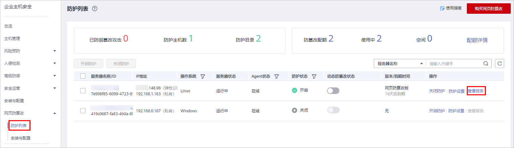
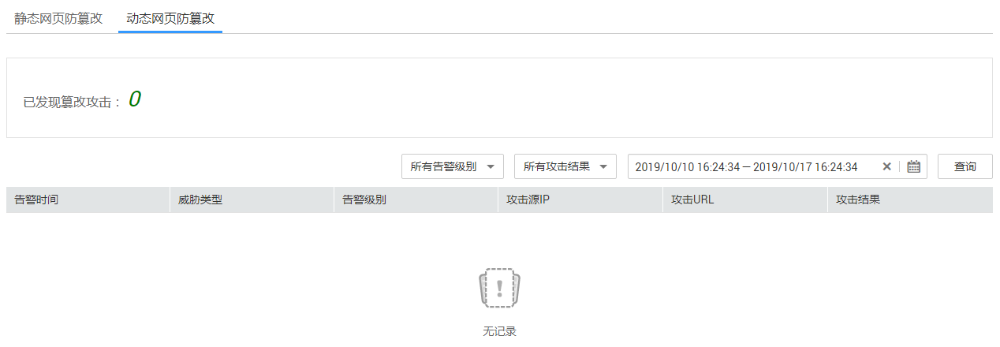

# 查看网页防篡改报告

开启网页防篡改防护后，企业主机安全服务将立即对您添加的防护目录执行全面的安全检测。您可以查看主机被非法篡改的详细记录。

## 前提条件

-   已获取管理控制台的登录账号与密码。
-   弹性云服务器的“Agent状态“为“在线“且“防护状态“为“开启“。

## 操作步骤

1.  [登录管理控制台](https://console.huaweicloud.com)。
2.  在页面上方选择“区域“后，单击“服务列表“，选择“安全  \>  企业主机安全“。
3.  在“网页防篡改  \>  防护列表“页面，单击“查看报告“。

    **图 1**  查看防护记录  
    

4.  在防护记录界面，查看防护记录详情。

    **图 2**  静态网页防篡改防护记录  
    

    **图 3**  动态网页防篡改防护记录  
    

